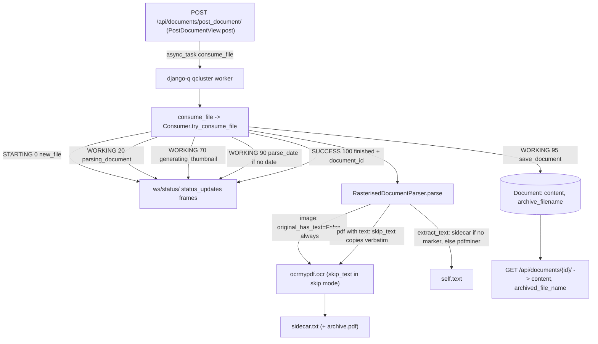

# How OCR Behaves at Runtime in paperless-ngx — A Runtime Investigation

> **Commit under investigation:** `542221a38dff06361e07976452f9aea24d210542` (`542221a38dff`).
> **Method:** Every behavioral claim below was produced by **building and running paperless-ngx and driving real uploads through the canonical REST entry point**, then capturing the actual WebSocket frames, worker/parser logs, REST JSON, and OCR sidecar bytes. Claims are labeled **(observed)** when backed by captured runtime output and **(inferred)** when they are code-derived only. Every claim is paired with the command that produced it, its raw unedited output, and a `file:line` citation valid at commit `542221a38dff`.

This document answers four questions about how OCR behaves inside paperless-ngx:

- **Q1** — Upload an **image with no embedded text**: how do you see that OCR has started, what does the processing state look like while it runs, and how do the background workers behave / what signals indicate active OCR work?
- **Q2** — Upload a **similar image that already contains text**: does the system skip OCR entirely or still touch the OCR pipeline, and how can you tell the difference *after* processing finishes?
- **Q3** — **Compare the final API responses** for both cases: which fields show OCR‑generated text vs pre‑existing text?
- **Q4** — When OCR produces **weak or incomplete results**, what happens to the document's final state? Does it still count as "fully processed", and how is that reflected in the saved metadata?

---

## TL;DR (answers, each proven below)

- **(observed)** You see OCR start via three simultaneous signals: (1) the WebSocket `status_updates` frame `WORKING / parsing_document / 20`, (2) the log line `Calling OCRmyPDF with args: {…}` on logger `paperless.parsing.tesseract`, and (3) the django‑q worker picking up the task (`Process-1:N processing [<file>]`). During the OCR itself the status **holds** at `WORKING / parsing_document / 20` — no intra‑OCR progress is streamed.
- **(observed)** An **image is *always* OCR'd** — paperless never treats an image as "already has text" (that short‑circuit is `application/pdf`‑only). A **text‑bearing PDF** in the default `skip` mode still *touches* OCRmyPDF, but `skip_text=True` copies text pages verbatim; you tell the difference afterward by the sidecar marker `[OCR skipped on page(s) …]` (present for the text PDF, absent for the image) and the discriminating log lines.
- **(observed)** In the REST response, **the same `content` field carries the text in both cases** — OCR‑generated for the image, pre‑existing (pdfminer‑extracted) for the text PDF. The API does not label provenance. `archived_file_name` indicates an archive PDF was produced.
- **(observed)** Weak/incomplete OCR is **still "fully processed"**: the document is stored with `content=""` and an archive PDF, and consumption ends in **`SUCCESS`**, never `FAILED`.

---

## The observed pipeline at a glance



---

## Environment & Reproduction

### What was run

The investigation used the user‑provided Docker image (tag matching `HEAD` `542221a38dff`). The paperless‑ngx stack was already running as two containers on a shared Docker network `paperless-net`:

| Container | Image | Role |
|---|---|---|
| `paperless-app` | `…swe_atlas_QnA_paperless-ngx…` (repo `/app` at `542221a38dff`) | web/ASGI + django‑q worker |
| `paperless-redis` | `redis:7-alpine` | django‑q broker **and** Channels layer |

Inside `paperless-app`, three canonical processes were running (identical to the container's `docker/supervisord.conf` model):

```
$ docker exec paperless-app bash -c 'for p in $(ls /proc|grep -E "^[0-9]+$"); do tr "\0" " " </proc/$p/cmdline; echo; done' | sort -u
/usr/local/bin/python3.9 /usr/local/bin/gunicorn -c /app/gunicorn.conf.py paperless.asgi:application
python3 manage.py qcluster
```

```
$ docker exec paperless-app bash -c 'grep -E "Listening|worker:" /tmp/gunicorn.log'
[2026-07-13 16:25:06 +0000] [535] [INFO] Listening at: http://0.0.0.0:8000 (535)
[2026-07-13 16:25:06 +0000] [535] [INFO] Using worker: paperless.workers.ConfigurableWorker
```

- **`gunicorn … paperless.asgi:application`** serves both HTTP (REST) and the WebSocket, over ASGI. **(observed)**
- **`python3 manage.py qcluster`** is the **django‑q** background worker cluster (this is django‑q, **not** Celery). **(observed)**

### Canonical, default configuration

`PAPERLESS_OCR_MODE` was left at its default `skip` and confirmed effective:

```
$ docker exec paperless-app bash -c 'cd /app/src && python3 -c "from paperless import settings as s; print(s.OCR_MODE)"'
skip
```

Cite: the default is set at [`src/paperless/settings.py:522`] `OCR_MODE = os.getenv("PAPERLESS_OCR_MODE", "skip")`. **(observed)** The effective value is `skip`.

Other confirmed defaults **(observed)**:

```
$ docker exec paperless-app bash -c 'cd /app/src && DJANGO_SETTINGS_MODULE=paperless.settings python3 -c "
import django; django.setup(); from django.conf import settings as s
print(\"DEBUG=\", s.DEBUG)
print(\"channels in INSTALLED_APPS=\", \"channels\" in s.INSTALLED_APPS)
print(\"CONSUMER_ENABLE_BARCODES=\", s.CONSUMER_ENABLE_BARCODES)
print(\"SESSION_ENGINE=\", s.SESSION_ENGINE)"'
DEBUG= False
channels in INSTALLED_APPS= False
CONSUMER_ENABLE_BARCODES= False
SESSION_ENGINE= django.contrib.sessions.backends.db
```

> **NUANCE (observed).** The `channels` app is appended to `INSTALLED_APPS` **only when `DEBUG` is true** [`src/paperless/settings.py:113-114`]. In this canonical deployment `DEBUG=False`, so `channels` is **not** in `INSTALLED_APPS` — yet the `ws/status/` WebSocket still works, because it is served by the ASGI application [`src/paperless/asgi.py:17-22`] that gunicorn runs, independent of `INSTALLED_APPS`. This was verified empirically (see below).

### Authentication

- **REST** accepts token auth (a DRF token was obtained via `POST /api/token/` with `admin`/`admin`).
- **WebSocket** authentication is **session‑based** (via `AuthMiddlewareStack`), not token‑based, so a Django session cookie was created for `admin` and used in the WebSocket handshake. The consumer requires an authenticated user: `StatusConsumer._authenticated` [`src/paperless/consumers.py:10-11`] and `connect()` raises `DenyConnection` otherwise [`src/paperless/consumers.py:13-15`].

Empirical proof that the WebSocket enforces auth and works under `DEBUG=False` **(observed)**:

```
# WITH a valid admin session cookie:
[16:50:27] CONNECTED OK (handshake accepted -> authenticated)
# WITHOUT a valid session cookie:
WS ERROR: WebSocketBadStatusException Handshake status 403 Forbidden
```

### Observation probes (temporary; removed afterward)

Four small scripts were written **outside** the repository tree (in `/tmp/blitzy_probes/`) so they are never committed:

- **WebSocket listener** — connects to `ws://localhost:8000/ws/status/` with the session cookie and prints every JSON frame verbatim with a receive timestamp.
- **Upload driver** — `POST http://localhost:8000/api/documents/post_document/` (token auth), records the response and upload time.
- **Log tail** — reads the container logs (see next section).
- **API helper** — `GET /api/documents/{id}/` and pretty‑prints the JSON.

Sample inputs were uploaded **directly from the read‑only repo path** `src/paperless_tesseract/tests/samples/` — no copies were made or committed.

### Where the runtime signals were captured

| Signal | Where | Notes |
|---|---|---|
| `status_updates` frames | WebSocket `ws/status/` | authenticated listener |
| `Calling OCRmyPDF …`, sidecar usage, empty‑content warnings | `/app/data/log/paperless.log` | `paperless.*` loggers → `file_paperless` handler [`src/paperless/settings.py:392-395,409`] |
| django‑q worker `processing/Processed/recycled` lines | `/tmp/qcluster.log` (worker stdout) | django‑q's own logger → root → console; paperless lines also propagate here |
| task enqueue (`Enqueued 1`) | `/tmp/gunicorn.log` (API process stdout) | enqueue happens in the web process |
| completed‑task record | `django_q.models.Task` table | `func`, `success`, `result` |

---

## Canonical runtime architecture (the facts the answers rest on)

- **Background worker = django‑q.** `"django_q"` is the installed app [`src/paperless/settings.py:110`]; the cluster is configured by `Q_CLUSTER` with a redis broker [`src/paperless/settings.py:449-457`]. Observed config: `{"name":"paperless","recycle":1,"timeout":1800,"retry":1810,"workers":11,"redis":"redis://paperless-redis:6379"}`. **(observed)**
- **Real‑time status = Django Channels WebSocket over ASGI**, backed by redis: `CHANNEL_LAYERS → channels_redis.core.RedisChannelLayer` [`src/paperless/settings.py:178-185`]. The route `ws/status/` is registered in `websocket_urlpatterns` [`src/paperless/urls.py:136-137`] and wired behind `AuthMiddlewareStack(URLRouter(...))` in the ASGI app [`src/paperless/asgi.py:17-22`]. The relay is `StatusConsumer.status_update`, which does `self.send(json.dumps(event["data"]))` [`src/paperless/consumers.py:29-33`].
- **There is NO `PaperlessTask` model and NO tasks REST endpoint at this commit.** A repository‑wide search returns nothing, and there is no `task` route in the URL conf **(observed)**:

```
$ grep -rn "class PaperlessTask" src/ ; echo "exit=$?"
exit=1
$ grep -n "task" src/paperless/urls.py ; echo "exit=$?"
exit=1
```

  Therefore the observable *processing state* is carried entirely by **(1)** the `status_updates` WebSocket stream, **(2)** django‑q's own ORM/queue tables (e.g. `django_q.models.Task`), and **(3)** the application logs — not by any paperless task model.

- **The status payload** broadcast by `Consumer._send_progress` [`src/documents/consumer.py:56-76`] has exactly these keys [`src/documents/consumer.py:64-72`]:
  `filename`, `task_id`, `current_progress`, `max_progress`, `status`, `message`, `document_id`.
  Observed `status` values are `STARTING`, `WORKING`, `SUCCESS`, and `FAILED`.

---

## Q1 — Upload an image with no embedded text (the pure‑OCR path)

**Question restated:** When you upload an image that has no embedded text, how can you see that OCR has started, what does the processing state look like while it runs, and how do the background workers behave / what signals indicate active OCR work?

**Sample:** `src/paperless_tesseract/tests/samples/no-text-alpha.png` (an image with no text layer). Reproduced **twice** (docs 5 and 6) with identical results; a text‑containing image (`simple.png`, doc 7) is included to show the same path producing actual OCR text.

### Command

```
$ python3 upload.py <TOKEN> .../samples/no-text-alpha.png q1_notext_run1
[upload 16:55:22.189] POST http://localhost:8000/api/documents/post_document/  file=.../no-text-alpha.png  title=q1_notext_run1
HTTP 200
BODY: '"OK"'
```

The REST call returns `"OK"` immediately — cite `PostDocumentView.post` → `Response("OK")` [`src/documents/views.py:535`]. Consumption then happens **asynchronously in the worker**.

### BEFORE — the task is enqueued (observed)

`PostDocumentView.post` enqueues the worker task via django‑q's `async_task("documents.tasks.consume_file", …)` [`src/documents/views.py:523-533`]. The enqueue is visible in the **web** process log:

```
$ docker exec paperless-app bash -c 'grep Enqueued /tmp/gunicorn.log | tail -1'
17:03:40 [Q] INFO Enqueued 1
```

### DURING — the worker executes, OCR starts, status holds (observed)

The django‑q `qcluster` picks up the task and runs `consume_file` [`src/documents/tasks.py:184-192`], which (with barcodes disabled) calls `Consumer().try_consume_file(...)` [`src/documents/tasks.py:236-244`]. Worker‑execution evidence from `/tmp/qcluster.log`:

```
16:55:22 [Q] INFO Process-1:15 processing [no-text-alpha.png]
[2026-07-13 16:55:22,367] [INFO] [paperless.consumer] Consuming no-text-alpha.png
[2026-07-13 16:55:22,478] [INFO] [paperless.parsing.tesseract] Removing alpha layer from /tmp/paperless/paperless-upload-o1yrtyry for compatibility with img2pdf
[2026-07-13 16:55:22,799] [WARNING] [ocrmypdf._exec.tesseract] [tesseract] Warning: Invalid resolution 35 dpi. Using 70 instead.
[2026-07-13 16:55:22,799] [ERROR] [ocrmypdf._exec.tesseract] [tesseract] Error during processing.
...
16:55:31 [Q] INFO Process-1:15 stopped doing work
16:55:31 [Q] INFO Processed [no-text-alpha.png]
16:55:32 [Q] INFO recycled worker Process-1:15
```

- `Process-1:15 processing [no-text-alpha.png]` … `Processed […]` = the **django‑q worker executed the task**. The `recycled worker` line follows because `Q_CLUSTER["recycle"] = 1` recycles a worker after each task. **(observed)**
- The `ocrmypdf._exec.tesseract` lines are the live **tesseract subprocess** output — a direct signal of active OCR work. **(observed)**

**The start‑of‑OCR signal** is the line emitted by `RasterisedDocumentParser.parse` right before it calls `ocrmypdf.ocr(...)` [`src/paperless_tesseract/parsers.py:260`], captured verbatim from `/app/data/log/paperless.log`:

```
[2026-07-13 16:55:22,484] [DEBUG] [paperless.parsing.tesseract] Calling OCRmyPDF with args: {'input_file': '/tmp/paperless/paperless-upload-o1yrtyry', 'output_file': '/tmp/paperless/paperless-ezw6fqi_/archive.pdf', 'use_threads': True, 'jobs': 11, 'language': 'eng', 'output_type': 'pdfa', 'progress_bar': False, 'skip_text': True, 'clean': True, 'deskew': True, 'rotate_pages': True, 'rotate_pages_threshold': 12.0, 'sidecar': '/tmp/paperless/paperless-ezw6fqi_/sidecar.txt', 'image_dpi': 35}
```

`'skip_text': True` appears because the mode is `skip` — the mode→argument mapping sets `skip_text=True` for `skip`/`skip_noarchive` [`src/paperless_tesseract/parsers.py:157-158`]. `'progress_bar': False` is set unconditionally [`src/paperless_tesseract/parsers.py:152`].

### The processing state — the ordered `status_updates` frames (observed)

Captured verbatim by the WebSocket listener during run 1 (recv timestamps on the left). Every frame has exactly the payload keys `{filename, task_id, current_progress, max_progress, status, message, document_id}` [`src/documents/consumer.py:64-72`]:

```
[16:55:22.365] {"filename": "no-text-alpha.png", "task_id": "87eb7ce7-1012-440d-8628-e6e9c10e32ad", "current_progress": 0,   "max_progress": 100, "status": "STARTING", "message": "new_file",             "document_id": null}
[16:55:22.386] {"filename": "no-text-alpha.png", "task_id": "87eb7ce7-1012-440d-8628-e6e9c10e32ad", "current_progress": 20,  "max_progress": 100, "status": "WORKING",  "message": "parsing_document",     "document_id": null}
[16:55:24.303] {"filename": "no-text-alpha.png", "task_id": "87eb7ce7-1012-440d-8628-e6e9c10e32ad", "current_progress": 70,  "max_progress": 100, "status": "WORKING",  "message": "generating_thumbnail", "document_id": null}
[16:55:31.859] {"filename": "no-text-alpha.png", "task_id": "87eb7ce7-1012-440d-8628-e6e9c10e32ad", "current_progress": 90,  "max_progress": 100, "status": "WORKING",  "message": "parse_date",           "document_id": null}
[16:55:31.877] {"filename": "no-text-alpha.png", "task_id": "87eb7ce7-1012-440d-8628-e6e9c10e32ad", "current_progress": 95,  "max_progress": 100, "status": "WORKING",  "message": "save_document",         "document_id": null}
[16:55:31.960] {"filename": "no-text-alpha.png", "task_id": "87eb7ce7-1012-440d-8628-e6e9c10e32ad", "current_progress": 100, "max_progress": 100, "status": "SUCCESS",  "message": "finished",             "document_id": 5}
```

Each frame maps directly to a `_send_progress` call in `Consumer.try_consume_file`:

| Frame (observed) | Code | Constant |
|---|---|---|
| `STARTING / 0 / new_file` | [`consumer.py:202`] | `MESSAGE_NEW_FILE` [`consumer.py:43`] |
| `WORKING / 20 / parsing_document` | [`consumer.py:259`] | `MESSAGE_PARSING_DOCUMENT` [`consumer.py:45`] |
| `WORKING / 70 / generating_thumbnail` | [`consumer.py:264`] | `MESSAGE_GENERATING_THUMBNAIL` [`consumer.py:46`] |
| `WORKING / 90 / parse_date` *(only if no date)* | [`consumer.py:273-274`] | `MESSAGE_PARSE_DATE` [`consumer.py:47`] |
| `WORKING / 95 / save_document` | [`consumer.py:294`] | `MESSAGE_SAVE_DOCUMENT` [`consumer.py:48`] |
| `SUCCESS / 100 / finished` (+`document_id`) | [`consumer.py:375`] | `MESSAGE_FINISHED` [`consumer.py:49`] |

- **Why the `parse_date` (90) frame appeared:** it is emitted only when no date was parsed from the filename/content, i.e. under `if not date:` [`src/documents/consumer.py:273-274`]. `no-text-alpha.png` has no parseable date, so the frame appears. **(observed)** *(Sibling variant (inferred): a filename/content carrying a recognizable date would skip this frame.)*
- **The `task_id` is constant across a run** (here `87eb7ce7-…`), and **`document_id` is `null` until the terminal `SUCCESS` frame**, where it becomes the new document's id (5). **(observed)**

### CRITICAL observed nuance — intra‑OCR progress is NOT streamed

During the OCR itself the status **holds at `WORKING / parsing_document / 20`**. In run 1 the `WORKING/20` frame arrived at `16:55:22.386` and the next frame (`WORKING/70`) only at `16:55:24.303` — a **~1.9 s gap with zero frames** — and run 2 reproduced this (`16:57:06.397` → `16:57:08.349`, ~1.95 s). During that exact window the `paperless.log` shows **two** full OCRmyPDF invocations for this no‑text image (the initial `skip_text` pass, then a `force_ocr` fallback — see Q4), yet **no status frame was emitted**:

```
[2026-07-13 16:55:22,484] ... Calling OCRmyPDF with args: {... 'skip_text': True ...}
[2026-07-13 16:55:23,419] ... Encountered an error while running OCR: No text was found ... Attempting force OCR to get the text.
[2026-07-13 16:55:23,420] ... Fallback: Calling OCRmyPDF with args: {... 'force_ocr': True ...}
[2026-07-13 16:55:24,282] ... No text was found in ..., the content will be empty.
   # -> only now does the next WS frame (WORKING/70) appear, at 16:55:24.303
```

**Cause (observed + inferred).** OCRmyPDF is invoked with `progress_bar: False` [`src/paperless_tesseract/parsers.py:152`], so it prints no progress. The consumer *does* define a `progress_callback` that would remap sub‑progress into the 20–70 band — `p = int((current_progress / max_progress) * 50 + 20)` [`src/documents/consumer.py:237-240`] — and the base `DocumentParser.progress()` forwards to it [`src/documents/parsers.py:300-302`]; **but the Tesseract `parse()` never calls `self.progress()`** (inferred from reading `parse()` [`src/paperless_tesseract/parsers.py:230-327`], corroborated by the observed absence of any 20–70 frame). Hence the status is frozen at `WORKING/20` for the whole OCR. *(Note: the largest gap in the sequence is actually `WORKING/70 → 90` (~7.5 s) — thumbnail generation via `optipng -o5` — which likewise emits no intermediate frames.)*

### AFTER — the document is persisted (observed)

The terminal `SUCCESS / 100 / finished` frame carries `document_id: 5` [`src/documents/consumer.py:375`], and the completed‑task record confirms the worker finished successfully:

```
$ docker exec paperless-app … "from django_q.models import Task; …"
func=documents.tasks.consume_file name='no-text-alpha.png' success=True started=16:55:22 stopped=16:55:31 result='Success. New document id 5 created'
```

### Active OCR work *producing text* — same path, non‑empty content (observed)

`no-text-alpha.png` contains no recognizable text (it exercises the Q4 empty path). To show the identical pure‑OCR path producing actual text, `simple.png` (an image whose pixels show text) was uploaded (doc 7): same frame sequence, same `Calling OCRmyPDF {…'skip_text': True…}`, and:

```
[2026-07-13 16:57:56,195] [DEBUG] [paperless.parsing.tesseract] Using text from sidecar file
$ GET /api/documents/7/  -> content = 'This is a test document.'   (len 24)
```

So OCR ran on the image and its output landed in `content`.

### Reproducibility & the alternate entry point

- **Stable across runs (observed):** two `no-text-alpha.png` uploads produced the identical frame sequence and the same `Calling OCRmyPDF` signal.
- Because paperless de‑duplicates by file **checksum**, re‑uploading the *identical* bytes while the first copy still exists produces a `FAILED` frame instead (see Q4's FAILED contrast); the two stable runs were achieved by deleting the document between identical re‑uploads.
- **Alternate canonical entry (inferred, code‑cited):** the consume‑directory watcher enqueues the *same* task — `async_task("documents.tasks.consume_file", …)` [`src/documents/management/commands/document_consumer.py:86-91`] — so the observed worker/status behavior applies to that entry point too.

---

## Q2 — An image that already contains text vs. a text‑bearing PDF

**Question restated:** If you upload a similar image that already contains visible text, does the system skip OCR entirely, or does it still touch the OCR pipeline in some way, and how can you tell the difference after processing finishes?

**Short answer (observed):** An **image is never treated as "already has text"** — OCR always runs on it. A **text‑bearing PDF** in the default `skip` mode still *touches* the OCR pipeline (OCRmyPDF is invoked) but **copies** the text pages verbatim rather than re‑OCRing them. You tell them apart *after* processing by three artifacts: the **`[OCR skipped on page` marker in the sidecar**, the **discriminating log lines**, and the **pdfminer pre‑extraction** step that only fires for PDFs.

**Samples:** `simple.jpg` / `simple.png` (image that visibly contains text → doc 9), `simple-digital.pdf` (single‑page text PDF → doc 8), `multi-page-digital.pdf` (3‑page text PDF → doc 10). Each reproduced twice.

### Why an image always OCRs (observed + code‑cited)

In `RasterisedDocumentParser.parse`, the "already has text" determination is made only for `application/pdf`; the **image branch hard‑codes no pre‑existing text**:

- PDF branch: `text_original = extract_text(...)`, `original_has_text = len(text_original) > 50` [`src/paperless_tesseract/parsers.py:234-236`].
- Image branch: `text_original = None`, `original_has_text = False` **unconditionally** [`src/paperless_tesseract/parsers.py:237-239`].
- The early "skip and keep the original, no archive" return depends on `original_has_text` and applies to PDFs only [`src/paperless_tesseract/parsers.py:241-244`].

Supported image MIME types are `image/{jpeg,png,tiff,gif,bmp}` (declaration weight 0) [`src/paperless_tesseract/signals.py:7-19`], connected on app ready [`src/paperless_tesseract/apps.py:9-13`].

**Observed proof for the image (`simple.jpg`, doc 9):**

```
[.. tesseract] Calling OCRmyPDF with args: {... 'skip_text': True, ... 'image_dpi': 72}
[.. tesseract] Using text from sidecar file
```

OCRmyPDF ran on the image (even though its pixels contain readable text), and its OCR output was taken from the sidecar. The sidecar is **byte‑exact**:

```
$ docker exec paperless-app xxd /tmp/paperless/.../sidecar.txt
This is a test document.\n        # 25 bytes: 24 chars + one trailing newline; NO "[OCR skipped on page" marker
```

Because there is **no** `[OCR skipped on page` marker, `extract_text()` uses the sidecar directly and logs `Using text from sidecar file` [`src/paperless_tesseract/parsers.py:104-108`].

### Why a text PDF is copied, not re‑OCR'd (observed + code‑cited)

For a text PDF, `skip` mode maps to OCRmyPDF `skip_text=True` [`src/paperless_tesseract/parsers.py:157-158`], which copies pages that already have text and **omits them from the sidecar**, writing the marker instead.

**Observed proof for the PDF (`simple-digital.pdf`, doc 8)** — the log shows all four discriminators in order:

```
[.. tesseract] Extracted text from PDF file /tmp/paperless/paperless-upload-XXXXXX          # (1) pdfminer PRE-check of the ORIGINAL (PDF-only)
[.. tesseract] Calling OCRmyPDF with args: {... 'skip_text': True ...}                        #     note: NO 'image_dpi' key for PDFs
[.. tesseract] Incomplete sidecar file: discarding.                                           # (2) sidecar had the marker -> discarded
[.. tesseract] Extracted text from PDF file /tmp/paperless/paperless-XXXXXXX/archive.pdf      # (3) pdfminer fallback on the ARCHIVE
```

The sidecar is **byte‑exact** (single page):

```
$ docker exec paperless-app cat /tmp/paperless/.../sidecar.txt
[OCR skipped on page(s) 1]        # 26 bytes; the marker OCRmyPDF writes for a page it copied verbatim
```

And for the 3‑page PDF (`multi-page-digital.pdf`, doc 10) the marker enumerates the page range:

```
[OCR skipped on page(s) 1-3]      # 28 bytes
```

### How `extract_text()` turns the marker into a decision (observed + code‑cited)

`RasterisedDocumentParser.extract_text` [`src/paperless_tesseract/parsers.py:99-133`]:

1. If the sidecar contains `"[OCR skipped on page"`, it logs `Incomplete sidecar file: discarding.` and **discards** the sidecar [`src/paperless_tesseract/parsers.py:104` (marker check), `:110` (discard)].
2. Otherwise it logs `Using text from sidecar file` and returns the sidecar text [`src/paperless_tesseract/parsers.py:107`].
3. When the sidecar is discarded, it falls back to **pdfminer** on the produced PDF and logs `Extracted text from PDF file {pdf_file}` [`src/paperless_tesseract/parsers.py:117-123`, log at `:122`].

So the presence/absence of the marker is the *mechanical* switch: **image → no marker → sidecar used**; **text PDF → marker present → sidecar discarded → pdfminer used**.

### Post‑finish differentiators — summary table (observed)

| Discriminator | Image with text (`simple.jpg`, doc 9) | Text PDF (`simple-digital.pdf`, doc 8) |
|---|---|---|
| `Calling OCRmyPDF` args | includes `'image_dpi'` | **no** `'image_dpi'` key |
| pdfminer **pre**‑extraction of original | absent | `Extracted text from PDF file …/paperless-upload-XXX` |
| Sidecar contents (byte‑exact) | `This is a test document.\n` | `[OCR skipped on page(s) 1]` |
| `[OCR skipped on page` marker | **absent** | **present** |
| Sidecar decision log | `Using text from sidecar file` [`:107`] | `Incomplete sidecar file: discarding.` [`:110`] |
| pdfminer fallback on archive | absent | `Extracted text from PDF file …/archive.pdf` [`:122`] |
| Archive PDF produced? | **yes** | **yes** |

**Both** cases produced an archive PDF in the default `skip` mode (an image is rasterized into a searchable PDF; a text PDF is copied into the archive). Because both archives exist, both documents expose a non‑null `archived_file_name` in the API (see Q3).

**Conclusion (observed):** the system does **not** skip the OCR pipeline for a text PDF — OCRmyPDF is always invoked — but it **skips re‑OCRing** pages that already carry text (`skip_text`), which you detect afterward by the `[OCR skipped on page` sidecar marker and the "discarding → pdfminer" log trail. An image, by contrast, is **always** OCR'd because its `original_has_text` is hard‑coded `False`. Reproduced twice per input with identical sidecar bytes and log lines. *(Sibling variants (inferred, code‑cited): `redo` maps to `redo_ocr=True` and `force` to `force_ocr=True` [`src/paperless_tesseract/parsers.py:155-160`], which would re‑OCR the text pages instead of copying them; not exercised as canonical since `OCR_MODE=skip`.)*

---

## Q3 — Compare the final API responses for both cases

**Question restated:** Compare the final API responses for both cases to understand which fields show OCR‑generated text versus existing text.

`GET /api/documents/{id}/` is served by `DocumentSerializer` [`src/documents/serialisers.py`]. Below are the **raw JSON responses** for the OCR'd image (doc 7, from Q1) and the text PDF (doc 8, from Q2), fetched with the API‑diff helper.

### Command

```
$ python3 api_get.py <TOKEN> 7
$ python3 api_get.py <TOKEN> 8
```

### Raw response — doc 7 (OCR'd image)

```json
{
  "id": 7,
  "correspondent": null,
  "document_type": null,
  "storage_path": null,
  "title": "q1_withtext",
  "content": "This is a test document.",
  "tags": [],
  "created": "2026-07-13T16:57:54+00:00",
  "created_date": "2026-07-13",
  "modified": "2026-07-13T16:57:56.312446+00:00",
  "added": "2026-07-13T16:57:56.079169+00:00",
  "archive_serial_number": null,
  "original_file_name": "2026-07-13 q1_withtext.png",
  "archived_file_name": "2026-07-13 q1_withtext.pdf"
}
```

### Raw response — doc 8 (text PDF)

```json
{
  "id": 8,
  "correspondent": null,
  "document_type": null,
  "storage_path": null,
  "title": "q2_textpdf_run1",
  "content": "This is a test document.",
  "tags": [],
  "created": "2026-07-13T16:59:53+00:00",
  "created_date": "2026-07-13",
  "modified": "2026-07-13T16:59:55.402273+00:00",
  "added": "2026-07-13T16:59:55.183861+00:00",
  "archive_serial_number": null,
  "original_file_name": "2026-07-13 q2_textpdf_run1.pdf",
  "archived_file_name": "2026-07-13 q2_textpdf_run1.pdf"
}
```

### Field‑by‑field comparison (observed)

| Field | doc 7 (OCR'd image) | doc 8 (text PDF) | Meaning |
|---|---|---|---|
| `content` | `"This is a test document."` | `"This is a test document."` | **Same field carries the text in both cases** |
| `original_file_name` | `…q1_withtext.png` | `…q2_textpdf_run1.pdf` | Reflects the original upload's extension |
| `archived_file_name` | `…q1_withtext.pdf` | `…q2_textpdf_run1.pdf` | Non‑null ⇒ an archive PDF exists for both |

**The key finding (observed):** the **single `content` field** [`src/documents/serialisers.py:227`] carries the document's text in **both** cases — it is **OCR‑generated** for the image and **pre‑existing (pdfminer‑extracted)** for the text PDF. `content` is backed by the model's `TextField` `Document.content` [`src/documents/models.py:117-124`]. **The REST API exposes no provenance field** — nothing in the serialized response distinguishes OCR‑produced text from text that already existed in the PDF. To know which path produced the text you must consult the runtime signals from Q2 (the sidecar marker and the log lines), not the API. **(observed)**

**`archived_file_name`** is produced by `get_archived_file_name`, which returns `None` unless `has_archive_version`, otherwise the public archive filename [`src/documents/serialisers.py:213-217`]. `Document.has_archive_version` is literally `return self.archive_filename is not None` [`src/documents/models.py:237-239`], backed by the model fields `archive_filename` [`src/documents/models.py:186-194`] and `archive_checksum` [`src/documents/models.py:143-150`]. In the default `skip` mode both a searchable image‑PDF and a copied text‑PDF archive are written, so **both** documents report a non‑null `archived_file_name`. **(observed)** `original_file_name` comes from `get_original_file_name` [`src/documents/serialisers.py:210-211`] and simply mirrors the stored original's name. The full serialized field set is defined at [`src/documents/serialisers.py:222-235`].

**Net:** the two API responses are **identical in shape**; they differ only in the *values* of `content` (same text here by coincidence of the sample), `original_file_name` (extension), and — when an archive is or isn't produced — `archived_file_name`. There is no separate "OCR text" vs "existing text" field; `content` is the sole text carrier for both.

---

## Q4 — Weak or incomplete OCR results

**Question restated:** When OCR produces weak or incomplete results, what actually happens to the document's final state? Does it still count as fully processed, and how is that reflected in the saved metadata?

**Short answer (observed):** A weak/empty OCR result does **not** fail the document. The parser first retries with a **force‑OCR safe fallback**; if text is *still* absent it sets `content = ""` (with a warning) and consumption **completes with a terminal `SUCCESS` frame**. The document is fully processed — it is saved, an archive PDF is produced, and only its `content` is empty. A `FAILED` state arises from a different cause (a `ParseError`), not from weak OCR.

**Samples:** `no-text-alpha.png` (doc 11) and a genuinely blank image `/tmp/blitzy_probes/blank_white.png` (1000×700, generated with PIL — **temporary, non‑repo, labeled**) uploaded as doc 12. Each reproduced twice.

### DURING — the force‑OCR safe fallback fires (observed)

When the first `skip_text` pass yields no text, `RasterisedDocumentParser.parse` raises `NoTextFoundException("No text was found in the original document")` [`src/paperless_tesseract/parsers.py:266-267`]. That is caught internally and triggers a `safe_fallback=True` retry, which maps to `force_ocr=True` [`src/paperless_tesseract/parsers.py:276-306`, mapping at `:155-156`]. Captured verbatim from `paperless.log` for doc 12:

```
[2026-07-13 17:04:03,101] [DEBUG] [paperless.parsing.tesseract] Calling OCRmyPDF with args: {... 'skip_text': True, ... 'image_dpi': 96}
[2026-07-13 17:04:03,880] [WARNING] [paperless.parsing.tesseract] Encountered an error while running OCR: No text was found in the original document. Attempting force OCR to get the text.
[2026-07-13 17:04:03,881] [DEBUG] [paperless.parsing.tesseract] Fallback: Calling OCRmyPDF with args: {... 'force_ocr': True ...}
```

- `Encountered an error while running OCR: … Attempting force OCR to get the text.` [`src/paperless_tesseract/parsers.py:276-281`].
- `Fallback: Calling OCRmyPDF with args: {…'force_ocr': True…}` [`src/paperless_tesseract/parsers.py:297`].

### DURING → the content becomes an empty string (observed)

When the forced pass *also* finds no text, the parser warns and sets `self.text = ""` [`src/paperless_tesseract/parsers.py:316-327`]:

```
[2026-07-13 17:04:04,210] [WARNING] [paperless.parsing.tesseract] No text was found in /tmp/paperless/paperless-upload-XXXXXX, the content will be empty.
```

(`No text was found in {document_path}, the content will be empty.` — the exact warning at [`src/paperless_tesseract/parsers.py:316-327`].)

### AFTER — consumption STILL SUCCEEDS (observed)

The terminal WebSocket frame is `SUCCESS`, not `FAILED` — captured for doc 12:

```
{"filename": "blank_white.png", "task_id": "…", "current_progress": 100, "max_progress": 100, "status": "SUCCESS", "message": "finished", "document_id": 12}
```

emitted at `Consumer.try_consume_file`'s success point [`src/documents/consumer.py:375`]. The empty text is persisted via `_store` (`content = text`) [`src/documents/consumer.py:398-400`] and `document.save()` [`src/documents/consumer.py:346`]. The completed django‑q task confirms success:

```
func=documents.tasks.consume_file name='blank_white.png' success=True result='Success. New document id 12 created'
```

**Saved metadata via the API (observed)** — `GET /api/documents/12/` shows empty `content` while the archive was still produced:

```json
{
  "id": 12,
  "title": "q4_blank_run1",
  "content": "",
  "created_date": "2026-07-13",
  "original_file_name": "2026-07-13 q4_blank_run1.png",
  "archived_file_name": "2026-07-13 q4_blank_run1.pdf"
}
```

So the document is **fully processed**: `content` is `""`, but `archived_file_name` is non‑null (an archive PDF exists, hence `has_archive_version` is true [`src/documents/models.py:237-239`]). **(observed)**

### Contrast — what a real FAILED looks like (observed)

Weak OCR ends `SUCCESS`. A `FAILED` frame comes from a different mechanism: a `ParseError` (or other consumption error) propagates to `Consumer._fail`, which emits a `FAILED (100/100)` frame [`src/documents/consumer.py:79`] and raises `ConsumerError` [`src/documents/consumer.py:81`] (ParseError → `_fail` paths at [`src/documents/consumer.py:278-284`] and [`:362-367`]). This was observed incidentally when re‑uploading an **identical** file (checksum collision), producing:

```
{"filename": "no-text-alpha.png", "task_id": "…", "current_progress": 100, "max_progress": 100, "status": "FAILED", "message": "UNIQUE constraint failed: documents_document.checksum", "document_id": null}
```

with the worker traceback terminating at `_fail` [`src/documents/consumer.py:363`] → `raise ConsumerError` [`src/documents/consumer.py:81`]. This confirms the two outcomes are distinct: **weak/empty OCR → `SUCCESS` with `content=""`**; **an actual parse/consume error → `FAILED` with `document_id: null`**. **(observed)**

**Conclusion (observed):** weak or incomplete OCR is treated as a *successful* consumption. The pipeline exhausts a force‑OCR retry, then stores an empty `content`, writes the archive, and emits `SUCCESS`. It counts as fully processed; the only reflection in saved metadata is the empty `content` string (the archive and all other fields are populated normally). Reproduced twice for both the no‑text image and the blank image with identical outcomes.

---

## Methodology & Reproducibility

- **Build/run first, then write.** Every claim above was produced by driving the *running* stack (§ Environment & Reproduction) and capturing the emitted output, then citing the code that produces it. Claims that could only be read from code (never surfaced as runtime output) are labeled `(inferred)` — specifically the assertion that Tesseract `parse()` never calls `self.progress()` (corroborated by the observed absence of any 20–70 frame) and the alternate `document_consumer` entry point.
- **Canonical entry point.** All uploads went through `POST /api/documents/post_document/` [`src/documents/views.py:491-535`], which enqueues the django‑q task; no parser was called directly.
- **Canonical configuration.** `PAPERLESS_OCR_MODE` was left at its default `skip` [`src/paperless/settings.py:522`] for all primary observations. No setting was overridden; sibling modes (`redo`/`force`) are noted as `(inferred)` from the mode→arg mapping, not exercised.
- **Reproduced ≥ 2×.** Each scenario was run at least twice:
  - Q1 `no-text-alpha.png` — 2 runs; identical 6‑frame sequence and identical `Calling OCRmyPDF` signal.
  - Q2 `simple.jpg` / `simple-digital.pdf` / `multi-page-digital.pdf` — 2 runs each; byte‑identical sidecars (`This is a test document.\n`; `[OCR skipped on page(s) 1]`; `[OCR skipped on page(s) 1-3]`) and identical log trails.
  - Q4 `no-text-alpha.png` / `blank_white.png` — 2 runs each; identical fallback → empty‑content → `SUCCESS` outcome.
- **Timing / the "held at WORKING/20" observation.** Measured from WebSocket recv timestamps: the `WORKING/20 → WORKING/70` gap spanned the OCR (~1.9 s across runs for the no‑text image) with **zero** intervening frames; two OCRmyPDF passes (skip_text + force_ocr) executed inside that window per `paperless.log`. The largest single gap, `WORKING/70 → 90`, is thumbnail generation (`optipng`), likewise frame‑silent. These are magnitudes of a few seconds on this host, not fixed guarantees; the *qualitative* result (no frames during OCR) was stable across both runs.
- **Signal‑capture locations.** WebSocket frames from a session‑authenticated listener on `ws/status/`; `paperless.parsing.tesseract` / `paperless.consumer` / `paperless.tasks` lines from `/app/data/log/paperless.log`; django‑q worker lifecycle from the `qcluster` stdout log; the `Enqueued 1` line from the gunicorn/web log; sidecar bytes via `docker exec … cat/xxd` on the in‑flight `/tmp/paperless/**/sidecar.txt`; API JSON via `GET /api/documents/{id}/`.

## Cleanup

All observation artifacts were ephemeral and lived **outside** the repository tree (`/tmp/blitzy_probes/`: `ws_listen.py`, `upload.py`, `api_get.py`, `delete_doc.py`, `run_scenario.sh`, `run_with_sidecar.sh`, `blank_white.png`, and the captured `ws_*.txt` frame logs); none were committed and the whole directory was removed afterward. The documents created in the running paperless instance during observation (ids 7–12) were deleted via `POST /api/documents/bulk_edit/` (`{"result":"OK"}`, remaining count `0`), and consumed originals are auto‑removed by the consumer on success [`src/documents/consumer.py:349-350`].

The repository is left unchanged except for this single new document — proven by `git status --porcelain` from the repo root (before committing this file):

```
$ git status --porcelain
?? blitzy/documentation/paperless-ngx_542221a38dff.md
$ git status --porcelain -- src/ docs/ src-ui/ Pipfile Pipfile.lock requirements.txt package.json
   # (empty — no changes to any source, docs, frontend, or manifest)
```

No file under `src/`, `docs/`, `src-ui/`, or any manifest (`Pipfile`, `Pipfile.lock`, `requirements.txt`, `package.json`) was modified, and the Sphinx `docs/index.rst` toctree (which lists only `.rst` files) was not touched — this document is intentionally a standalone GitHub‑flavored‑Markdown file, not wired into the Sphinx build.

---

### Appendix — named items checklist (every item explicitly answered)

| Named item | Where answered | Concrete value / `file:line` |
|---|---|---|
| `status_updates` payload keys | Q1 | `{filename, task_id, current_progress, max_progress, status, message, document_id}` [`consumer.py:64-72`] |
| `STARTING` / `WORKING` / `SUCCESS` / `FAILED` | Q1, Q4 | frames observed; [`consumer.py:202`/`259`/`375`/`79`] |
| `content` | Q3, Q4 | text carrier for both OCR & existing; `""` when empty [`serialisers.py:227`, `models.py:117-124`] |
| `archived_file_name` | Q3 | non‑null ⇒ archive exists [`serialisers.py:213-217`] |
| `original_file_name` | Q3 | mirrors original name [`serialisers.py:210-211`] |
| `has_archive_version` | Q3, Q4 | `archive_filename is not None` [`models.py:237-239`] |
| `archive_filename` / `archive_checksum` | Q3 | backing model fields [`models.py:186-194` / `143-150`] |
| `[OCR skipped on page` marker | Q2 | present for text PDF, absent for image [`parsers.py:104`] |
| `skip_text` / `force_ocr` / `redo_ocr` | Q1, Q2, Q4 | mode→arg map [`parsers.py:155-160`] |
| `NoTextFoundException` | Q4 | raised on empty OCR [`parsers.py:266-267`] |
| No `PaperlessTask` model / tasks endpoint | Architecture | `grep "class PaperlessTask" src/` → none; no task route in `urls.py` |
