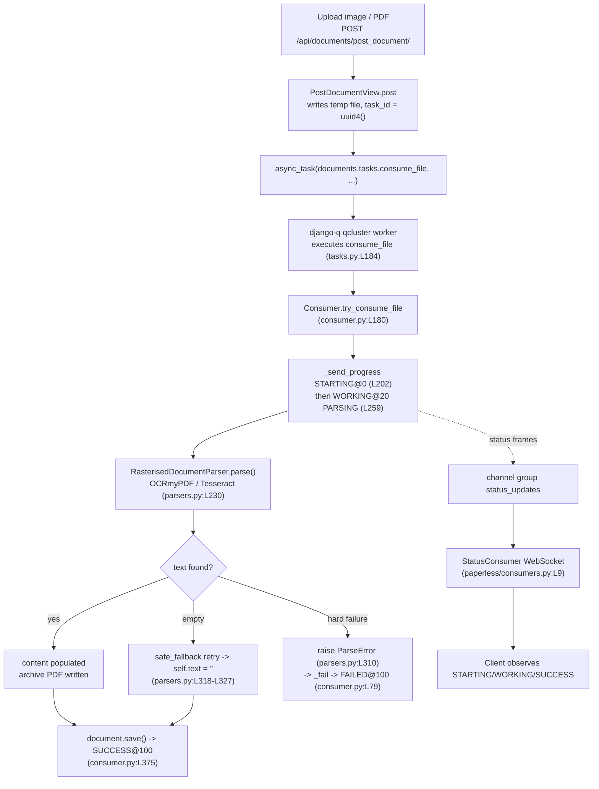

# How the OCR Subsystem Behaves During Document Ingestion in paperless-ngx

> **Source branch:** `paperless-ngx_542221a38dff`
> **HEAD commit:** `542221a38dff06361e07976452f9aea24d210542`
> **Nature of this document:** A run-first, evidence-backed answer. Every behavioral claim below is paired with the exact command that produced it, the complete unedited output, and a `file:line` reference into the source tree. Nothing here is derived from reading source alone — the OCR ingestion pipeline was built and exercised through its real entry points (the upload API, the django-q worker, and the `RasterisedDocumentParser`), and the observations were captured live.
> **When observed:** the Q1–Q4 behavioral observations were captured on the container clock date `2026-07-08`. Two blocks were re-captured on `2026-07-09` from a fresh run of the identical canonical image, with the source tree unchanged at `542221a38dff` — the complete `qcluster` startup banner (§1.3) and the Q4.4 hard-failure fixture generation plus run — so that the startup output is shown complete (every pooled worker) and the corrupt-fixture md5 is reproducible from a committed command. Both re-captures are byte-consistent with the original observations except for the expected ephemeral values (timestamps, cluster name, PIDs, task ids, and temporary paths).

---

## Scope and method

The question decomposes into four groups, restated with precision and then answered from runtime observation:

- **Q1 — Seeing OCR start and watching in-flight state.** How OCR initiation and in-flight processing state are observable, how the background (django-q `qcluster`) worker behaves during this phase, and which signal really indicates *active* OCR work.
- **Q2 — Already-has-text: skip or still touch the pipeline?** Whether an image "that already contains text" skips OCR or still enters the OCR pipeline, versus the one genuine skip path (a text-layer PDF), and how to tell the difference after processing.
- **Q3 — Comparing the final API responses.** Which `DocumentSerializer` fields carry text, and how OCR-generated text versus pre-existing text is (or is not) distinguished in the API response.
- **Q4 — Weak/incomplete OCR: the terminal state.** What happens to the document's final state when OCR yields little or no text, whether it still counts as "fully processed," and how that is reflected in saved metadata — contrasted with the hard-failure path.

**Methodology.** OCR was triggered only through **real entry points**: `POST /api/documents/post_document/` (token-authenticated) with a session-authenticated WebSocket subscribed to `ws/status/` capturing every JSON status frame, executed by a live django-q `qcluster` worker. Supporting in-process probes (labelled **SUPPORTING / NON-CANONICAL**) expose internal values (OCRmyPDF arguments, sidecar bytes, checksums) that the canonical pipeline does not print; they never replace the canonical proof. The in-repo fixtures under `src/paperless_tesseract/tests/samples/` are used as canonical inputs. Timing/state observations were each repeated across **at least two runs** to confirm stability. The source repository was left byte-for-byte unchanged (see the read-only proof in the Appendix); all temporary scripts and the throwaway database/media were removed afterward.

---

## 1. Environment and reproducibility

All build/run/observation was performed **inside the canonical Docker image** the task pins. The host has Python 3.13 and no OCR tooling, so nothing was run natively.

### 1.1 Canonical container identification

```text
########## CANONICAL CONTAINER (host) ##########
$ docker images --format '{{.Repository}}:{{.Tag}}  {{.ID}}  {{.Size}}'
ghcr.io/scaleapi/swe-atlas:swe_atlas_QnA_paperless-ngx_paperless-ngx_e233ae8334038a4b615ea2e4ce663e30_qna_1.01  6e699f225ced  1.79GB

$ docker ps --format '{{.Names}}  {{.Image}}  {{.Status}}'
paperless_setup  ghcr.io/scaleapi/swe-atlas:swe_atlas_QnA_paperless-ngx_paperless-ngx_e233ae8334038a4b615ea2e4ce663e30_qna_1.01  Up 2 hours
```

The container's repository is checked out at `/app` with `HEAD = 542221a38dff06361e07976452f9aea24d210542` (matching the source branch). Every command below prefixed with `docker exec paperless_setup ...` or shown after a `cd /app/src` runs inside this container.

### 1.2 Canonical production dependencies installed inside the container

The slim QnA image ships the Python stack and OCR binaries but not the runtime services that the canonical production `Dockerfile` provides. These were installed (they were already present at the pinned versions, so this is a no-op that documents the canonical set), and the canonical ImageMagick policy was applied:

```text
########## APT INSTALLS (canonical production deps not baked into the slim QnA image) ##########
$ DEBIAN_FRONTEND=noninteractive apt-get install -y redis-server libzbar0 curl
Reading package lists...
Building dependency tree...
Reading state information...
libzbar0 is already the newest version (0.23.90-1+deb11u1).
curl is already the newest version (7.74.0-1.3+deb11u16).
redis-server is already the newest version (5:6.0.16-1+deb11u8).
0 upgraded, 0 newly installed, 0 to remove and 50 not upgraded.

########## IMAGEMAGICK POLICY (canonical) ##########
$ cp /app/docker/imagemagick-policy.xml /etc/ImageMagick-6/policy.xml
policy copied; diff vs source:
identical
```

### 1.3 Services started (the canonical run recipe)

Redis backs **both** the django-q broker and the `channels_redis` status feed. The web/WebSocket tier is the ASGI app under gunicorn; the worker tier is `qcluster`.

```text
########## REDIS (broker for django-q AND channels_redis status feed) ##########
$ redis-server --daemonize yes    # (already running in this container)
$ redis-cli ping
PONG

########## DATABASE MIGRATE ##########
$ python3 manage.py migrate --no-input
Operations to perform:
  Apply all migrations: admin, auth, authtoken, contenttypes, django_q, documents, paperless_mail, sessions
Running migrations:
  No migrations to apply.

########## WHOOSH FULL-TEXT INDEX REINDEX ##########
$ python3 manage.py document_index reindex

0it [00:00, ?it/s]
0it [00:00, ?it/s]

########## SUPERUSER ##########
$ python3 manage.py manage_superuser   # PAPERLESS_ADMIN_USER/PASSWORD/MAIL
```

```text
########## QCLUSTER WORKER (django-q) START ##########
$ python3 manage.py qcluster    # backgrounded; log -> /tmp/inv/out/qcluster.log
01:52:45 [Q] INFO Q Cluster avocado-stairway-romeo-beer starting.
01:52:45 [Q] INFO Process-1:1 ready for work at 636
01:52:45 [Q] INFO Process-1:2 ready for work at 637
01:52:45 [Q] INFO Process-1:3 ready for work at 638
01:52:45 [Q] INFO Process-1:4 ready for work at 639
01:52:45 [Q] INFO Process-1:5 ready for work at 640
01:52:45 [Q] INFO Process-1:6 ready for work at 641
01:52:45 [Q] INFO Process-1:7 ready for work at 642
01:52:45 [Q] INFO Process-1:8 ready for work at 643
01:52:45 [Q] INFO Process-1:9 ready for work at 644
01:52:45 [Q] INFO Process-1:10 ready for work at 645
01:52:45 [Q] INFO Process-1:11 ready for work at 646
01:52:45 [Q] INFO Process-1:12 monitoring at 647
01:52:45 [Q] INFO Process-1 guarding cluster avocado-stairway-romeo-beer
01:52:45 [Q] INFO Process-1:13 pushing tasks at 648
01:52:45 [Q] INFO Q Cluster avocado-stairway-romeo-beer running.
```

The block above is the **complete, unedited** `qcluster` startup banner (re-captured `2026-07-09`; see the *When observed* note above). With the default worker count — `TASK_WORKERS` (`settings.py:L438`) resolved by `default_task_workers()` (`settings.py:L427-L435`, the `floor(sqrt(CPU_count))` branch at `L433`) — the cluster pools **11** task workers (`Process-1:1`–`Process-1:11`) on this 128-core host, plus a monitor (`Process-1:12`), the guard process (`Process-1`), and a task pusher (`Process-1:13`), then logs `Q Cluster … running.`. The number of `ready for work` lines therefore scales with the host CPU count, while the monitor, guard, pusher, and `running.` lines are always present. This is the `qcluster` process referenced throughout Q1–Q4 (it dequeues and executes `documents.tasks.consume_file`, `tasks.py:L184`).

```text
########## ASGI WEB + WEBSOCKET (gunicorn) START ##########
$ gunicorn -c /app/gunicorn.conf.py paperless.asgi:application   # 0.0.0.0:8000
[2026-07-08 22:45:40 +0000] [18033] [INFO] Listening at: http://0.0.0.0:8000 (18033)
[2026-07-08 22:45:40 +0000] [18033] [INFO] Using worker: paperless.workers.ConfigurableWorker
[2026-07-08 22:45:40 +0000] [18033] [INFO] Server is ready. Spawning workers
```

### 1.4 Tool and library versions

```text
=========== VERSIONS ===========
$ python3 --version
Python 3.9.23
$ python3 -m pip show ocrmypdf django django-q channels channels-redis | grep -E "^Name:|^Version:"
Name: ocrmypdf
Version: 13.4.3
Name: Django
Version: 4.0.4
Name: django-q
Version: 1.3.9
Name: channels
Version: 3.0.4
Name: channels-redis
Version: 3.4.0
$ tesseract --version | head -2 ; gs --version ; unpaper --version | head -1 ; qpdf --version | head -1
--- tesseract ---
tesseract 4.1.1
 leptonica-1.79.0
--- ghostscript ---
9.53.3
--- unpaper / qpdf ---
6.1
qpdf version 10.1.0
```

### 1.5 Canonical OCR configuration (verified at runtime)

The defaults in `src/paperless/settings.py` (`OCR_LANGUAGE` at L514, `OCR_OUTPUT_TYPE` at L518, `OCR_MODE` at L522) resolve at runtime to:

```text
=========== CANONICAL OCR SETTINGS (runtime) ===========
$ python3 manage.py shell -c "from django.conf import settings; print('OCR_MODE=', settings.OCR_MODE, 'OCR_LANGUAGE=', settings.OCR_LANGUAGE, 'OCR_OUTPUT_TYPE=', settings.OCR_OUTPUT_TYPE)"
OCR_MODE= skip OCR_LANGUAGE= eng OCR_OUTPUT_TYPE= pdfa

=========== REDIS ===========
$ redis-cli ping
PONG
```

Unless a scenario states otherwise it runs under this canonical `OCR_MODE=skip`. Two Q2/Q3 sub-cases require `OCR_MODE=skip_noarchive` to demonstrate the *true skip*; those are explicitly labelled **non-canonical** and the worker is restarted with that mode transiently, then restored to `skip`.

### 1.6 Observation-surface auth model (real entry points; secrets redacted)

The upload API is token-authenticated; the `ws/status/` WebSocket is **session-authenticated only** and rejects unauthenticated clients with HTTP 403 at the `is_authenticated` gate in `StatusConsumer.connect` (`src/paperless/consumers.py:L11`). The DRF token and the session id are never printed — both are redacted to `<TOKEN>` and `<SESSIONID>` at the point of capture:

```text
########## AUTH SMOKE (real entry points; secrets redacted) ##########
$ PYTHONPATH=/app/src python3 /tmp/inv/scripts/smoke.py
POST /api/token/ -> 200 {"token":"<TOKEN>"}
GET /api/documents/ -> 200 count= 0
Django Client.login -> True sessionid= <SESSIONID>
WS authed  -> CONNECTED
WS no-auth -> REJECTED/InvalidStatusCode: server rejected WebSocket connection: HTTP 403
```

This is why the capture harness (`q1_capture.py`, Appendix 5.1) authenticates the WebSocket with a session cookie obtained via Django's test `Client.login`, while uploading through the token-authenticated REST endpoint.

---

## 2. Architecture of the ingestion path being observed

Uploads and directory-watched files converge on the django-q task `documents.tasks.consume_file` (`src/documents/tasks.py:L184`), which the `qcluster` worker executes by calling `Consumer().try_consume_file(...)` (`src/documents/tasks.py:L236`). The `Consumer` broadcasts progress frames via `_send_progress` (`src/documents/consumer.py:L56`) onto the `status_updates` channel group; `StatusConsumer` (`src/paperless/consumers.py:L9`) relays them to authenticated WebSocket clients. For images and PDFs the parser is `RasterisedDocumentParser.parse()` (`src/paperless_tesseract/parsers.py:L230`), which wraps OCRmyPDF over Tesseract.



**The `_send_progress` frame vocabulary**, verified against source (each is one `self._send_progress(...)` call in `try_consume_file`):

| Frame | `current_progress` | `status` | `message` | Emitting line |
|-------|--------------------|----------|-----------|---------------|
| new file | 0 | `STARTING` | `new_file` | `consumer.py:L202` |
| parsing document | 20 | `WORKING` | `parsing_document` | `consumer.py:L259` |
| generating thumbnail | 70 | `WORKING` | `generating_thumbnail` | `consumer.py:L264` |
| parse date | 90 | `WORKING` | `parse_date` | `consumer.py:L274` |
| save document | 95 | `WORKING` | `save_document` | `consumer.py:L294` |
| finished | 100 | `SUCCESS` | `finished` (carries `document.id`) | `consumer.py:L375` |
| failed | 100 | `FAILED` | the exception message | `consumer.py:L79` (via `_fail`, L78-L81) |

Verified source:

```text
$ sed -n '202p;259p;264p;274p;294p;375p' src/documents/consumer.py
        self._send_progress(0, 100, "STARTING", MESSAGE_NEW_FILE)
            self._send_progress(20, 100, "WORKING", MESSAGE_PARSING_DOCUMENT)
            self._send_progress(70, 100, "WORKING", MESSAGE_GENERATING_THUMBNAIL)
                self._send_progress(90, 100, "WORKING", MESSAGE_PARSE_DATE)
        self._send_progress(95, 100, "WORKING", MESSAGE_SAVE_DOCUMENT)
        self._send_progress(100, 100, "SUCCESS", MESSAGE_FINISHED, document.id)

$ sed -n '78,81p' src/documents/consumer.py
    def _fail(self, message, log_message=None, exc_info=None):
        self._send_progress(100, 100, "FAILED", message)
        self.log("error", log_message or message, exc_info=exc_info)
        raise ConsumerError(f"{self.filename}: {log_message or message}")
```

---

## Q1 — Seeing OCR start, watching in-flight state, and the signal that means *active* OCR

**Direct answer.** You see OCR "start" the moment the worker emits the `WORKING @ 20%` frame carrying `message = "parsing_document"` (`src/documents/consumer.py:L259`). That frame is emitted immediately before the parser dispatch that calls `RasterisedDocumentParser.parse()` (`src/documents/consumer.py:L261` → `src/paperless_tesseract/parsers.py:L230`), inside which OCRmyPDF/Tesseract runs. While it runs, the document has **no database row yet** (the row is created later, at `consumer.py:L398-L402`), so the *only* live signal of in-flight OCR is the WebSocket status feed: the `STARTING @ 0` → `WORKING @ 20 (parsing_document)` → `WORKING @ 70 (generating_thumbnail)` progression. **The true "active OCR" signal is the time the run dwells at `WORKING @ 20 parsing_document` before advancing to `70`** — that span *is* the OCRmyPDF/Tesseract call. The worker itself is a django-q `qcluster` process that logs `processing [<file>]`, `Consuming <file>`, then `Document <title> consumption finished`, and finally recycles the worker process.

### Q1.1 — Live status frames from a real upload (run 1, `simple.png`, a text-free image)

Command (the full harness source is Appendix 5.1); it authenticates a session WebSocket to `ws/status/`, uploads via the token-authenticated REST endpoint, and records every frame:

```text
$ PYTHONPATH=/app/src python3 /tmp/inv/scripts/reset_docs.py
deleted 0 document(s); media cleared; count now = 0

$ bash /tmp/inv/scripts/cap_scenario.sh q1run1 \
      /app/src/paperless_tesseract/tests/samples/simple.png simple.png image/png
```

Complete, unedited output:

```text
############### Q1 RUN 1: simple.png (text-free image) ###############
[BEFORE] document count = 0
[WS] connected to ws/status/ ; subscribed to status_updates group
[FRAME t+ 0.150s] {"filename": "simple.png", "task_id": "649b3816-d298-4350-9cb7-47ba61ce69f0", "current_progress": 0, "max_progress": 100, "status": "STARTING", "message": "new_file", "document_id": null}
[FRAME t+ 0.155s] {"filename": "simple.png", "task_id": "649b3816-d298-4350-9cb7-47ba61ce69f0", "current_progress": 20, "max_progress": 100, "status": "WORKING", "message": "parsing_document", "document_id": null}
[FRAME t+ 1.233s] {"filename": "simple.png", "task_id": "649b3816-d298-4350-9cb7-47ba61ce69f0", "current_progress": 70, "max_progress": 100, "status": "WORKING", "message": "generating_thumbnail", "document_id": null}
[FRAME t+ 1.898s] {"filename": "simple.png", "task_id": "649b3816-d298-4350-9cb7-47ba61ce69f0", "current_progress": 90, "max_progress": 100, "status": "WORKING", "message": "parse_date", "document_id": null}
[FRAME t+ 1.900s] {"filename": "simple.png", "task_id": "649b3816-d298-4350-9cb7-47ba61ce69f0", "current_progress": 95, "max_progress": 100, "status": "WORKING", "message": "save_document", "document_id": null}
[FRAME t+ 1.950s] {"filename": "simple.png", "task_id": "649b3816-d298-4350-9cb7-47ba61ce69f0", "current_progress": 100, "max_progress": 100, "status": "SUCCESS", "message": "finished", "document_id": 3}
[UPLOAD] POST /api/documents/post_document/ -> 200 "OK"

===== FRAME SUMMARY (q1run1) =====
('0.150', 0, 'STARTING', 'new_file')
('0.155', 20, 'WORKING', 'parsing_document')
('1.233', 70, 'WORKING', 'generating_thumbnail')
('1.898', 90, 'WORKING', 'parse_date')
('1.900', 95, 'WORKING', 'save_document')
('1.950', 100, 'SUCCESS', 'finished')
[DUR] parse/OCR phase (20->70) duration = 1.078s
[DUR] total STARTING->terminal = 1.800s
[PERPAGE] per-page WORKING frames (message=null) progress values: []
[AFTER] finished document_id = 3
[AFTER] doc content='This is a test document.' archived_file_name='2026-07-08 simple.pdf' original_file_name='2026-07-08 simple.png'
```

**Reading the evidence.**
- **OCR "started"** at `t+0.155s` — the `WORKING @ 20 parsing_document` frame (`consumer.py:L259`).
- **Active OCR** is the `1.078s` the run dwelled between the `20` and `70` frames. That interval brackets `RasterisedDocumentParser.parse()`; within it OCRmyPDF invoked Tesseract (confirmed by the worker log and the direct probe below).
- **`document_id` is `null` on every frame until the terminal `SUCCESS` frame**, which carries `document_id = 3`. This is the runtime proof that the DB row does not exist during OCR — the id only appears once the row is created and `_send_progress(100, 100, "SUCCESS", MESSAGE_FINISHED, document.id)` runs (`consumer.py:L375`).
- After the run, the persisted document has `content='This is a test document.'` (Tesseract read the pixels) and an archive PDF (`2026-07-08 simple.pdf`).

### Q1.2 — Frame-to-source mapping

| Observed frame | Source line that emitted it |
|----------------|------------------------------|
| `STARTING 0 new_file` | `consumer.py:L202` |
| `WORKING 20 parsing_document` | `consumer.py:L259` (immediately precedes the `parse()` dispatch at L261) |
| `WORKING 70 generating_thumbnail` | `consumer.py:L264` |
| `WORKING 90 parse_date` | `consumer.py:L274` |
| `WORKING 95 save_document` | `consumer.py:L294` |
| `SUCCESS 100 finished` (with `document_id`) | `consumer.py:L375` |

### Q1.3 — Per-page progress frames: honestly, none were observed at this scale

The AAP notes a `progress_callback` can emit page-by-page `WORKING` frames spanning 20–70%. At the scale of these single-page fixtures **no intermediate per-page frames were emitted** — progress jumps directly from `20` to `70`. The harness explicitly checks for `WORKING` frames whose `message` is `null` (the per-page shape) and reports the collected list:

```text
[PERPAGE] per-page WORKING frames (message=null) progress values: []
```

This empty list held for **every** fixture in this investigation, including the multi-page ones. Reported exactly as observed: at these scales the only in-flight signal is the dwell time at `WORKING @ 20`, not a stream of per-page frames.

> **Source-comment note (code hygiene).** The `progress_callback` (`consumer.py:L237`) carries the comment `# recalculate progress to be within 20 and 80` (`consumer.py:L238`), but the formula on the following line — `p = int((current_progress / max_progress) * 50 + 20)` (`consumer.py:L239`) — actually caps at **70**, not 80: on the final page `current_progress == max_progress`, so `p = int(1 * 50 + 20) = 70`. The observed `20 → 70` ceiling matches the *formula*, not the comment; the "80" is a stale in-source comment and does not affect the emitted frames (which is why every capture above tops out at `WORKING @ 70`).

### Q1.4 — Worker (`qcluster`) behavior during the phase

The complete worker-log block for run 1 (exact line range from the live `qcluster.log`, no elision):

```text
===== WORKER LOG for q1run1 (qcluster.log lines 56-63, complete) =====
22:53:07 [Q] INFO Process-1:2 processing [simple.png]
[2026-07-08 22:53:08,098] [INFO] [paperless.consumer] Consuming simple.png
[2026-07-08 22:53:08,518] [ERROR] [ocrmypdf._exec.tesseract] [tesseract] Error during processing.
[2026-07-08 22:53:09,893] [INFO] [paperless.consumer] Document 2026-07-08 simple consumption finished
22:53:09 [Q] INFO Process-1:2 stopped doing work
22:53:09 [Q] INFO Processed [simple.png]
22:53:10 [Q] INFO recycled worker Process-1:2
22:53:10 [Q] INFO Process-1:15 ready for work at 20024
```

Worker behavior, step by step: a pooled worker process (`Process-1:2`) picks up the task and logs `processing [simple.png]`; `Consuming simple.png` marks the start of `try_consume_file`; the single `[tesseract] Error during processing.` line is **benign OCRmyPDF noise** emitted while Tesseract probes the low-resolution test image — it is not a failure (the run still succeeds and text is extracted); `consumption finished` marks success; then django-q **recycles** the worker (`stopped doing work` → `Processed` → `recycled worker` → a fresh `Process-1:15 ready for work`). Worker recycling after each task is normal django-q pool behavior.

### Q1.5 — Stability: run 2 (identical input)

```text
$ bash /tmp/inv/scripts/cap_scenario.sh q1run2 \
      /app/src/paperless_tesseract/tests/samples/simple.png simple.png image/png

############### Q1 RUN 2: simple.png (stability) ###############
[BEFORE] document count = 0
[WS] connected to ws/status/ ; subscribed to status_updates group
[FRAME t+ 0.143s] {"filename": "simple.png", "task_id": "d557b8a3-4b5a-4df3-a663-01104b784e29", "current_progress": 0, "max_progress": 100, "status": "STARTING", "message": "new_file", "document_id": null}
[FRAME t+ 0.149s] {"filename": "simple.png", "task_id": "d557b8a3-4b5a-4df3-a663-01104b784e29", "current_progress": 20, "max_progress": 100, "status": "WORKING", "message": "parsing_document", "document_id": null}
[FRAME t+ 1.205s] {"filename": "simple.png", "task_id": "d557b8a3-4b5a-4df3-a663-01104b784e29", "current_progress": 70, "max_progress": 100, "status": "WORKING", "message": "generating_thumbnail", "document_id": null}
[FRAME t+ 1.880s] {"filename": "simple.png", "task_id": "d557b8a3-4b5a-4df3-a663-01104b784e29", "current_progress": 90, "max_progress": 100, "status": "WORKING", "message": "parse_date", "document_id": null}
[FRAME t+ 1.883s] {"filename": "simple.png", "task_id": "d557b8a3-4b5a-4df3-a663-01104b784e29", "current_progress": 95, "max_progress": 100, "status": "WORKING", "message": "save_document", "document_id": null}
[FRAME t+ 1.932s] {"filename": "simple.png", "task_id": "d557b8a3-4b5a-4df3-a663-01104b784e29", "current_progress": 100, "max_progress": 100, "status": "SUCCESS", "message": "finished", "document_id": 4}
[UPLOAD] POST /api/documents/post_document/ -> 200 "OK"

===== FRAME SUMMARY (q1run2) =====
('0.143', 0, 'STARTING', 'new_file')
('0.149', 20, 'WORKING', 'parsing_document')
('1.205', 70, 'WORKING', 'generating_thumbnail')
('1.880', 90, 'WORKING', 'parse_date')
('1.883', 95, 'WORKING', 'save_document')
('1.932', 100, 'SUCCESS', 'finished')
[DUR] parse/OCR phase (20->70) duration = 1.057s
[DUR] total STARTING->terminal = 1.789s
[PERPAGE] per-page WORKING frames (message=null) progress values: []
[AFTER] finished document_id = 4
[AFTER] doc content='This is a test document.' archived_file_name='2026-07-08 simple.pdf' original_file_name='2026-07-08 simple.png'

===== WORKER LOG for q1run2 (qcluster.log lines 64-71, complete) =====
22:53:26 [Q] INFO Process-1:3 processing [simple.png]
[2026-07-08 22:53:26,518] [INFO] [paperless.consumer] Consuming simple.png
[2026-07-08 22:53:26,932] [ERROR] [ocrmypdf._exec.tesseract] [tesseract] Error during processing.
[2026-07-08 22:53:28,303] [INFO] [paperless.consumer] Document 2026-07-08 simple consumption finished
22:53:28 [Q] INFO Process-1:3 stopped doing work
22:53:28 [Q] INFO Processed [simple.png]
22:53:28 [Q] INFO recycled worker Process-1:3
22:53:28 [Q] INFO Process-1:16 ready for work at 20086
```

**Stability verdict:** the frame sequence, progression, and per-page result are identical across runs. The active-OCR dwell (20→70) was `1.078s` (run 1) and `1.057s` (run 2) — stable to within ~20 ms. `document_id` was `null` throughout both runs until the terminal `SUCCESS` frame (ids `3` and `4`).

### Q1.6 — Supporting probe: what OCRmyPDF actually received (NON-CANONICAL, in-process)

To expose the arguments the canonical pipeline passes to OCRmyPDF (which the pipeline itself does not print), the supporting `direct_parse.py` probe (Appendix 5.1) instantiates `RasterisedDocumentParser` and calls `parse()` in-process on a scratch copy of `simple.png`:

```text
$ PYTHONPATH=/app/src python3 /tmp/inv/scripts/direct_parse.py \
      /app/src/paperless_tesseract/tests/samples/simple.png image/png
[CFG] OCR_MODE=skip fixture=/app/src/paperless_tesseract/tests/samples/simple.png mime=image/png
[DEBUG][paperless.parsing.tesseract] Estimated DPI 62 based on image width 517
[DEBUG][paperless.parsing.tesseract] Detected DPI for image /tmp/paperless/dp-3e8164ad68e148d2bd6ceccac7450b3a.png: 72
[DEBUG][paperless.parsing.tesseract] Calling OCRmyPDF with args: {'input_file': '/tmp/paperless/dp-3e8164ad68e148d2bd6ceccac7450b3a.png', 'output_file': '/tmp/paperless/paperless-puffiusb/archive.pdf', 'use_threads': True, 'jobs': 11, 'language': 'eng', 'output_type': 'pdfa', 'progress_bar': False, 'skip_text': True, 'clean': True, 'deskew': True, 'rotate_pages': True, 'rotate_pages_threshold': 12.0, 'sidecar': '/tmp/paperless/paperless-puffiusb/sidecar.txt', 'image_dpi': 72}
[2026-07-08 22:55:53,340] [ERROR] [ocrmypdf._exec.tesseract] [tesseract] Error during processing.
[DEBUG][paperless.parsing.tesseract] Using text from sidecar file
[RESULT] archive_path='/tmp/paperless/paperless-puffiusb/archive.pdf'
[RESULT] archive_path_is_file=True
[RESULT] text='This is a test document.'
[RESULT] text_len=24
[DEBUG][paperless.parsing.tesseract] Deleting directory /tmp/paperless/paperless-puffiusb
```

This confirms that for the canonical `OCR_MODE=skip`, `construct_ocrmypdf_parameters` (`parsers.py:L135`) builds the call with `skip_text: True` (`parsers.py:L158`), an explicit `sidecar` path, and image pre-processing (`clean`, `deskew`, `rotate_pages`). Because OCRmyPDF actually ran and produced text, the pipeline logged `Using text from sidecar file` and produced an archive PDF — the same behavior the canonical upload produced.


---

## Q2 — Already-has-text: does the system skip OCR, or still touch the pipeline?

**Direct answer.** It depends on the input type, and the deciding logic is in `RasterisedDocumentParser.parse()` (`src/paperless_tesseract/parsers.py:L234-L244`):

- **A raster image "that already contains text" does NOT skip OCR.** For any non-PDF, the parser hard-codes `original_has_text = False` (`parsers.py:L239`). The `skip_noarchive` early-return gate (`parsers.py:L241`) can therefore never fire for an image, so OCRmyPDF/Tesseract is always invoked (`parsers.py:L261`). Visible text in the image is read *by OCR*, not by-passed.
- **The one genuine skip is a text-layer PDF under `OCR_MODE=skip_noarchive`.** When the PDF already has a text layer longer than 50 characters (`parsers.py:L236`) *and* the mode is `skip_noarchive`, the parser logs `"Document has text, skipping OCRmyPDF entirely."` and returns before OCRmyPDF is ever called (`parsers.py:L241-L244`).
- Under the **canonical** `OCR_MODE=skip`, even a text-layer PDF still enters OCRmyPDF (with `skip_text=True`, so OCRmyPDF copies text pages through and OCRs only image-only pages) and an archive PDF is still produced.

**How you tell the difference afterward:** a genuine skip produces **no archive artifact** (`has_archive_version == False`, `archived_file_name == null`); anything that touched OCRmyPDF produces an archive PDF (`has_archive_version == True`).

Source of the deciding logic:

```text
$ sed -n '234,244p' src/paperless_tesseract/parsers.py
        if mime_type == "application/pdf":
            text_original = self.extract_text(None, document_path)
            original_has_text = text_original and len(text_original) > 50
        else:
            text_original = None
            original_has_text = False

        if settings.OCR_MODE == "skip_noarchive" and original_has_text:
            self.log("debug", "Document has text, skipping OCRmyPDF entirely.")
            self.text = text_original
            return
```

### Q2.1 — The has-text branch, exercised on four fixtures (SUPPORTING probe using the real `extract_text`)

`has_text_probe.py` (Appendix 5.1) replicates the exact branch of `parse()` using the real `extract_text` (`parsers.py:L99`), reporting `original_has_text` and the length that drives the `len > 50` gate:

```text
$ for fx in "simple.png:image/png" "simple-digital.pdf:application/pdf" \
            "multi-page-digital.pdf:application/pdf" "multi-page-images.pdf:application/pdf"; do
    PYTHONPATH=/app/src python3 /tmp/inv/scripts/has_text_probe.py \
        /app/src/paperless_tesseract/tests/samples/${fx%%:*} ${fx##*:}
  done

fixture=simple.png mime=image/png
  text_original_len=0  original_has_text=False  [image branch: original_has_text hard-coded False (parsers.py:L239)]
  snippet=None

fixture=simple-digital.pdf mime=application/pdf
  text_original_len=24  original_has_text=False  [PDF branch: len>50 gate (parsers.py:L236)]
  snippet='This is a test document.'

fixture=multi-page-digital.pdf mime=application/pdf
  text_original_len=118  original_has_text=True  [PDF branch: len>50 gate (parsers.py:L236)]
  snippet='This is a multi page document. Page 1.\n\nThis is a multi page document.'

fixture=multi-page-images.pdf mime=application/pdf
  text_original_len=0  original_has_text=False  [PDF branch: len>50 gate (parsers.py:L236)]
  snippet=None
```

This exercises every distinct sub-case of the gate:
- **Image** (`simple.png`): `original_has_text=False` unconditionally — the image path can never skip.
- **Text-layer PDF, short** (`simple-digital.pdf`, 24 chars): `False` because `24` is **not** `> 50`. Even a PDF with text can fall on the OCR side of the gate if its text is short.
- **Text-layer PDF, long** (`multi-page-digital.pdf`, 118 chars): `True` — the only fixture that can trigger the true skip.
- **Image-only PDF** (`multi-page-images.pdf`, 0 chars): `False` — a PDF with no text layer always needs OCR.

### Q2.2 — Case 1: an image "with visible text" STILL runs OCR (canonical `skip`, `simple.png`, doc 5)

`simple.png` visibly contains "This is a test document." Uploaded through the real API under canonical `skip`:

```text
$ PYTHONPATH=/app/src python3 /tmp/inv/scripts/reset_docs.py
$ bash /tmp/inv/scripts/cap_scenario.sh q2c1 \
      /app/src/paperless_tesseract/tests/samples/simple.png simple.png image/png

############### Q2 C1: simple.png (image WITH visible text) STILL runs OCR ###############
[BEFORE] document count = 0
[WS] connected to ws/status/ ; subscribed to status_updates group
[FRAME t+ 0.147s] {"filename": "simple.png", "task_id": "dabd8d0e-bfef-4563-8558-10df9f8e3cc6", "current_progress": 0, "max_progress": 100, "status": "STARTING", "message": "new_file", "document_id": null}
[FRAME t+ 0.152s] {"filename": "simple.png", "task_id": "dabd8d0e-bfef-4563-8558-10df9f8e3cc6", "current_progress": 20, "max_progress": 100, "status": "WORKING", "message": "parsing_document", "document_id": null}
[FRAME t+ 1.218s] {"filename": "simple.png", "task_id": "dabd8d0e-bfef-4563-8558-10df9f8e3cc6", "current_progress": 70, "max_progress": 100, "status": "WORKING", "message": "generating_thumbnail", "document_id": null}
[FRAME t+ 1.883s] {"filename": "simple.png", "task_id": "dabd8d0e-bfef-4563-8558-10df9f8e3cc6", "current_progress": 90, "max_progress": 100, "status": "WORKING", "message": "parse_date", "document_id": null}
[FRAME t+ 1.886s] {"filename": "simple.png", "task_id": "dabd8d0e-bfef-4563-8558-10df9f8e3cc6", "current_progress": 95, "max_progress": 100, "status": "WORKING", "message": "save_document", "document_id": null}
[FRAME t+ 1.948s] {"filename": "simple.png", "task_id": "dabd8d0e-bfef-4563-8558-10df9f8e3cc6", "current_progress": 100, "max_progress": 100, "status": "SUCCESS", "message": "finished", "document_id": 5}
[UPLOAD] POST /api/documents/post_document/ -> 200 "OK"

===== FRAME SUMMARY (q2c1) =====
('0.147', 0, 'STARTING', 'new_file')
('0.152', 20, 'WORKING', 'parsing_document')
('1.218', 70, 'WORKING', 'generating_thumbnail')
('1.883', 90, 'WORKING', 'parse_date')
('1.886', 95, 'WORKING', 'save_document')
('1.948', 100, 'SUCCESS', 'finished')
[DUR] parse/OCR phase (20->70) duration = 1.065s
[DUR] total STARTING->terminal = 1.801s
[PERPAGE] per-page WORKING frames (message=null) progress values: []
[AFTER] finished document_id = 5
[AFTER] doc content='This is a test document.' archived_file_name='2026-07-08 simple.pdf' original_file_name='2026-07-08 simple.png'

===== WORKER LOG for q2c1 (qcluster.log lines 72-79, complete) =====
22:56:40 [Q] INFO Process-1:4 processing [simple.png]
[2026-07-08 22:56:40,994] [INFO] [paperless.consumer] Consuming simple.png
[2026-07-08 22:56:41,427] [ERROR] [ocrmypdf._exec.tesseract] [tesseract] Error during processing.
[2026-07-08 22:56:42,790] [INFO] [paperless.consumer] Document 2026-07-08 simple consumption finished
22:56:42 [Q] INFO Process-1:4 stopped doing work
22:56:42 [Q] INFO Processed [simple.png]
22:56:43 [Q] INFO recycled worker Process-1:4
22:56:43 [Q] INFO Process-1:17 ready for work at 20280

===== ORM inspection of produced row =====
id=5 mime_type=image/png
  has_archive_version=True  archive_filename='0000005.pdf'
  checksum=249d1239dc39449c856dcdfbb75850c5 archive_checksum=5d8050d6e942b63b4ca0967b9b374550
  content='This is a test document.' (len=24)
```

**Evidence of "OCR was touched":** a `1.065s` active-OCR dwell (20→70), a `[tesseract]` line in the worker log, and — decisively — `has_archive_version=True` with `archive_filename='0000005.pdf'` and an `archive_checksum`. The image path produced an archive PDF; OCR was not skipped.

### Q2.3 — Case 2: the genuine skip — text-layer PDF under `skip_noarchive` (docs 6, 7)

To demonstrate the true skip, the worker is transiently restarted with the **non-canonical** `OCR_MODE=skip_noarchive`, and the long-text PDF `multi-page-digital.pdf` (118 chars, `original_has_text=True`) is uploaded through the real API. Run 1:

```text
$ bash /tmp/inv/scripts/restart_qcluster.sh skip_noarchive
=== Restart qcluster: skip_noarchive (NON-CANONICAL) ===
qcluster restarted (OCR_MODE=skip_noarchive)
22:57:01 [Q] INFO Q Cluster aspen-beer-king-rugby running.

$ bash /tmp/inv/scripts/cap_scenario.sh q2c2run1 \
      /app/src/paperless_tesseract/tests/samples/multi-page-digital.pdf multi-page-digital.pdf application/pdf

############### Q2 C2 RUN 1: multi-page-digital.pdf TRUE SKIP (skip_noarchive) ###############
[BEFORE] document count = 0
[WS] connected to ws/status/ ; subscribed to status_updates group
[FRAME t+ 0.145s] {"filename": "multi-page-digital.pdf", "task_id": "0de8d808-2483-4fea-a430-8a330f3edd90", "current_progress": 0, "max_progress": 100, "status": "STARTING", "message": "new_file", "document_id": null}
[FRAME t+ 0.152s] {"filename": "multi-page-digital.pdf", "task_id": "0de8d808-2483-4fea-a430-8a330f3edd90", "current_progress": 20, "max_progress": 100, "status": "WORKING", "message": "parsing_document", "document_id": null}
[FRAME t+ 0.184s] {"filename": "multi-page-digital.pdf", "task_id": "0de8d808-2483-4fea-a430-8a330f3edd90", "current_progress": 70, "max_progress": 100, "status": "WORKING", "message": "generating_thumbnail", "document_id": null}
[FRAME t+ 1.776s] {"filename": "multi-page-digital.pdf", "task_id": "0de8d808-2483-4fea-a430-8a330f3edd90", "current_progress": 90, "max_progress": 100, "status": "WORKING", "message": "parse_date", "document_id": null}
[FRAME t+ 1.779s] {"filename": "multi-page-digital.pdf", "task_id": "0de8d808-2483-4fea-a430-8a330f3edd90", "current_progress": 95, "max_progress": 100, "status": "WORKING", "message": "save_document", "document_id": null}
[FRAME t+ 1.828s] {"filename": "multi-page-digital.pdf", "task_id": "0de8d808-2483-4fea-a430-8a330f3edd90", "current_progress": 100, "max_progress": 100, "status": "SUCCESS", "message": "finished", "document_id": 6}
[UPLOAD] POST /api/documents/post_document/ -> 200 "OK"

===== FRAME SUMMARY (q2c2run1) =====
('0.145', 0, 'STARTING', 'new_file')
('0.152', 20, 'WORKING', 'parsing_document')
('0.184', 70, 'WORKING', 'generating_thumbnail')
('1.776', 90, 'WORKING', 'parse_date')
('1.779', 95, 'WORKING', 'save_document')
('1.828', 100, 'SUCCESS', 'finished')
[DUR] parse/OCR phase (20->70) duration = 0.032s
[DUR] total STARTING->terminal = 1.683s
[PERPAGE] per-page WORKING frames (message=null) progress values: []
[AFTER] finished document_id = 6
[AFTER] doc content='This is a multi page document. Page 1.\n\nThis is a multi page document. Page 2.\n\nThis is a multi page document. Page 3.' archived_file_name=None original_file_name='2026-07-08 multi-page-digital.pdf'

===== WORKER LOG for q2c2run1 (qcluster.log lines 98-104, complete) =====
22:57:11 [Q] INFO Process-1:1 processing [multi-page-digital.pdf]
[2026-07-08 22:57:11,685] [INFO] [paperless.consumer] Consuming multi-page-digital.pdf
[2026-07-08 22:57:13,364] [INFO] [paperless.consumer] Document 2026-07-08 multi-page-digital consumption finished
22:57:13 [Q] INFO Process-1:1 stopped doing work
22:57:13 [Q] INFO Processed [multi-page-digital.pdf]
22:57:13 [Q] INFO recycled worker Process-1:1
22:57:13 [Q] INFO Process-1:14 ready for work at 21011

===== ORM inspection (run 1) =====
id=6 mime_type=application/pdf
  has_archive_version=False  archive_filename=None
  checksum=9c9691e51741c1f4f41a20896af31770 archive_checksum=None
  content='This is a multi page document. Page 1.\n\nThis is a multi page document. Page 2.\n\nThis is a multi page document. Page 3.' (len=118)
```

Run 2 (stability, identical input):

```text
$ bash /tmp/inv/scripts/cap_scenario.sh q2c2run2 \
      /app/src/paperless_tesseract/tests/samples/multi-page-digital.pdf multi-page-digital.pdf application/pdf

############### Q2 C2 RUN 2: multi-page-digital.pdf TRUE SKIP (stability) ###############
[BEFORE] document count = 0
[WS] connected to ws/status/ ; subscribed to status_updates group
[FRAME t+ 0.143s] {"filename": "multi-page-digital.pdf", "task_id": "6a95f82b-3b53-43b9-a534-8a83db498c7d", "current_progress": 0, "max_progress": 100, "status": "STARTING", "message": "new_file", "document_id": null}
[FRAME t+ 0.149s] {"filename": "multi-page-digital.pdf", "task_id": "6a95f82b-3b53-43b9-a534-8a83db498c7d", "current_progress": 20, "max_progress": 100, "status": "WORKING", "message": "parsing_document", "document_id": null}
[FRAME t+ 0.179s] {"filename": "multi-page-digital.pdf", "task_id": "6a95f82b-3b53-43b9-a534-8a83db498c7d", "current_progress": 70, "max_progress": 100, "status": "WORKING", "message": "generating_thumbnail", "document_id": null}
[FRAME t+ 1.768s] {"filename": "multi-page-digital.pdf", "task_id": "6a95f82b-3b53-43b9-a534-8a83db498c7d", "current_progress": 90, "max_progress": 100, "status": "WORKING", "message": "parse_date", "document_id": null}
[FRAME t+ 1.771s] {"filename": "multi-page-digital.pdf", "task_id": "6a95f82b-3b53-43b9-a534-8a83db498c7d", "current_progress": 95, "max_progress": 100, "status": "WORKING", "message": "save_document", "document_id": null}
[FRAME t+ 1.818s] {"filename": "multi-page-digital.pdf", "task_id": "6a95f82b-3b53-43b9-a534-8a83db498c7d", "current_progress": 100, "max_progress": 100, "status": "SUCCESS", "message": "finished", "document_id": 7}
[UPLOAD] POST /api/documents/post_document/ -> 200 "OK"

===== FRAME SUMMARY (q2c2run2) =====
('0.143', 0, 'STARTING', 'new_file')
('0.149', 20, 'WORKING', 'parsing_document')
('0.179', 70, 'WORKING', 'generating_thumbnail')
('1.768', 90, 'WORKING', 'parse_date')
('1.771', 95, 'WORKING', 'save_document')
('1.818', 100, 'SUCCESS', 'finished')
[DUR] parse/OCR phase (20->70) duration = 0.030s
[DUR] total STARTING->terminal = 1.675s
[PERPAGE] per-page WORKING frames (message=null) progress values: []
[AFTER] finished document_id = 7
[AFTER] doc content='This is a multi page document. Page 1.\n\nThis is a multi page document. Page 2.\n\nThis is a multi page document. Page 3.' archived_file_name=None original_file_name='2026-07-08 multi-page-digital.pdf'

===== WORKER LOG for q2c2run2 (qcluster.log lines 105-111, complete) =====
22:57:28 [Q] INFO Process-1:2 processing [multi-page-digital.pdf]
[2026-07-08 22:57:28,463] [INFO] [paperless.consumer] Consuming multi-page-digital.pdf
[2026-07-08 22:57:30,133] [INFO] [paperless.consumer] Document 2026-07-08 multi-page-digital consumption finished
22:57:30 [Q] INFO Process-1:2 stopped doing work
22:57:30 [Q] INFO Processed [multi-page-digital.pdf]
22:57:30 [Q] INFO recycled worker Process-1:2
22:57:30 [Q] INFO Process-1:15 ready for work at 21056

===== ORM inspection (run 2) =====
id=7 mime_type=application/pdf
  has_archive_version=False  archive_filename=None
  checksum=9c9691e51741c1f4f41a20896af31770 archive_checksum=None
  content='This is a multi page document. Page 1.\n\nThis is a multi page document. Page 2.\n\nThis is a multi page document. Page 3.' (len=118)
```

**This is the genuine skip.** The tells, both stable across runs:
- The active-OCR dwell (20→70) collapsed to **`0.032s` / `0.030s`** — two orders of magnitude below the ~1.06s OCR dwell in Q2.2 — because OCRmyPDF was never called.
- **No archive PDF:** `has_archive_version=False`, `archive_filename=None`, `archive_checksum=None`.
- **No `[tesseract]` line** in the worker log at all.
- `content` is the PDF's own text layer (extracted by pdfminer.six), not OCR output.

Supporting probe confirming the early-return branch fired (NON-CANONICAL, in-process):

```text
$ PYTHONPATH=/app/src PAPERLESS_OCR_MODE=skip_noarchive python3 /tmp/inv/scripts/direct_parse.py \
      /app/src/paperless_tesseract/tests/samples/multi-page-digital.pdf application/pdf
[CFG] OCR_MODE=skip_noarchive fixture=/app/src/paperless_tesseract/tests/samples/multi-page-digital.pdf mime=application/pdf
[DEBUG][paperless.parsing.tesseract] Extracted text from PDF file /tmp/paperless/dp-de88327127dd4487ba5b08c8cee0c1f0.pdf
[DEBUG][paperless.parsing.tesseract] Document has text, skipping OCRmyPDF entirely.
[RESULT] archive_path=None
[RESULT] archive_path_is_file=False
[RESULT] text='This is a multi page document. Page 1.\n\nThis is a multi page document. Page 2.\n\nThis is a multi page document. Page 3.'
[RESULT] text_len=118
[DEBUG][paperless.parsing.tesseract] Deleting directory /tmp/paperless/paperless-8tqibvlg
```

The line `Document has text, skipping OCRmyPDF entirely.` is exactly the `parsers.py:L242` log, and `archive_path=None` confirms the early return at `parsers.py:L244` before any OCRmyPDF call.

### Q2.4 — Contrast: an image-only PDF under the SAME `skip_noarchive` mode STILL runs OCR (docs 8, 9)

To prove the skip is gated on *having text*, not merely on the mode, `multi-page-images.pdf` (no text layer, `original_has_text=False`) was uploaded under the **same** `skip_noarchive` mode. Run 1 and run 2:

```text
$ bash /tmp/inv/scripts/cap_scenario.sh q2contrast_run1 \
      /app/src/paperless_tesseract/tests/samples/multi-page-images.pdf multi-page-images.pdf application/pdf

############### Q2 CONTRAST RUN 1: multi-page-images.pdf (no text layer) under skip_noarchive -> OCR STILL RUNS ###############
[BEFORE] document count = 0
[WS] connected to ws/status/ ; subscribed to status_updates group
[FRAME t+ 0.155s] {"filename": "multi-page-images.pdf", "task_id": "bffc637e-847c-4df8-a278-b7616c30d090", "current_progress": 0, "max_progress": 100, "status": "STARTING", "message": "new_file", "document_id": null}
[FRAME t+ 0.161s] {"filename": "multi-page-images.pdf", "task_id": "bffc637e-847c-4df8-a278-b7616c30d090", "current_progress": 20, "max_progress": 100, "status": "WORKING", "message": "parsing_document", "document_id": null}
[FRAME t+ 2.380s] {"filename": "multi-page-images.pdf", "task_id": "bffc637e-847c-4df8-a278-b7616c30d090", "current_progress": 70, "max_progress": 100, "status": "WORKING", "message": "generating_thumbnail", "document_id": null}
[FRAME t+ 4.005s] {"filename": "multi-page-images.pdf", "task_id": "bffc637e-847c-4df8-a278-b7616c30d090", "current_progress": 90, "max_progress": 100, "status": "WORKING", "message": "parse_date", "document_id": null}
[FRAME t+ 4.008s] {"filename": "multi-page-images.pdf", "task_id": "bffc637e-847c-4df8-a278-b7616c30d090", "current_progress": 95, "max_progress": 100, "status": "WORKING", "message": "save_document", "document_id": null}
[FRAME t+ 4.076s] {"filename": "multi-page-images.pdf", "task_id": "bffc637e-847c-4df8-a278-b7616c30d090", "current_progress": 100, "max_progress": 100, "status": "SUCCESS", "message": "finished", "document_id": 8}
[UPLOAD] POST /api/documents/post_document/ -> 200 "OK"

===== FRAME SUMMARY (q2contrast_run1) =====
('0.155', 0, 'STARTING', 'new_file')
('0.161', 20, 'WORKING', 'parsing_document')
('2.380', 70, 'WORKING', 'generating_thumbnail')
('4.005', 90, 'WORKING', 'parse_date')
('4.008', 95, 'WORKING', 'save_document')
('4.076', 100, 'SUCCESS', 'finished')
[DUR] parse/OCR phase (20->70) duration = 2.219s
[DUR] total STARTING->terminal = 3.921s
[PERPAGE] per-page WORKING frames (message=null) progress values: []
[AFTER] finished document_id = 8
[AFTER] doc content='This is a multi page document. Page 1.\nThis is a multi page document. Page 2.\nThis is a multi page document. Page 3.' archived_file_name='2026-07-08 multi-page-images.pdf' original_file_name='2026-07-08 multi-page-images.pdf'

===== WORKER LOG for q2contrast_run1 (qcluster.log lines 112-121, complete) =====
22:57:45 [Q] INFO Process-1:3 processing [multi-page-images.pdf]
[2026-07-08 22:57:45,990] [INFO] [paperless.consumer] Consuming multi-page-images.pdf
[2026-07-08 22:57:46,563] [ERROR] [ocrmypdf._exec.tesseract] [tesseract] Error during processing.
[2026-07-08 22:57:46,567] [ERROR] [ocrmypdf._exec.tesseract] [tesseract] Error during processing.
[2026-07-08 22:57:46,571] [ERROR] [ocrmypdf._exec.tesseract] [tesseract] Error during processing.
[2026-07-08 22:57:49,906] [INFO] [paperless.consumer] Document 2026-07-08 multi-page-images consumption finished
22:57:49 [Q] INFO Process-1:3 stopped doing work
22:57:49 [Q] INFO Processed [multi-page-images.pdf]
22:57:50 [Q] INFO recycled worker Process-1:3
22:57:50 [Q] INFO Process-1:16 ready for work at 21143

===== ORM inspection (contrast run 1) =====
id=8 mime_type=application/pdf
  has_archive_version=True  archive_filename='0000008.pdf'
  checksum=62acb0bcbfbcaa62ca6ad3668e4e404b archive_checksum=f23fd7d1078e0dbd7eb6bb7f2a3278af
  content='This is a multi page document. Page 1.\nThis is a multi page document. Page 2.\nThis is a multi page document. Page 3.' (len=116)

############### Q2 CONTRAST RUN 2: multi-page-images.pdf (no text layer) under skip_noarchive -> OCR STILL RUNS ###############
[BEFORE] document count = 0
[WS] connected to ws/status/ ; subscribed to status_updates group
[FRAME t+ 0.150s] {"filename": "multi-page-images.pdf", "task_id": "5f34aeaa-5c36-4da9-8a96-e691a736a3eb", "current_progress": 0, "max_progress": 100, "status": "STARTING", "message": "new_file", "document_id": null}
[FRAME t+ 0.156s] {"filename": "multi-page-images.pdf", "task_id": "5f34aeaa-5c36-4da9-8a96-e691a736a3eb", "current_progress": 20, "max_progress": 100, "status": "WORKING", "message": "parsing_document", "document_id": null}
[FRAME t+ 2.364s] {"filename": "multi-page-images.pdf", "task_id": "5f34aeaa-5c36-4da9-8a96-e691a736a3eb", "current_progress": 70, "max_progress": 100, "status": "WORKING", "message": "generating_thumbnail", "document_id": null}
[FRAME t+ 3.936s] {"filename": "multi-page-images.pdf", "task_id": "5f34aeaa-5c36-4da9-8a96-e691a736a3eb", "current_progress": 90, "max_progress": 100, "status": "WORKING", "message": "parse_date", "document_id": null}
[FRAME t+ 3.939s] {"filename": "multi-page-images.pdf", "task_id": "5f34aeaa-5c36-4da9-8a96-e691a736a3eb", "current_progress": 95, "max_progress": 100, "status": "WORKING", "message": "save_document", "document_id": null}
[FRAME t+ 3.989s] {"filename": "multi-page-images.pdf", "task_id": "5f34aeaa-5c36-4da9-8a96-e691a736a3eb", "current_progress": 100, "max_progress": 100, "status": "SUCCESS", "message": "finished", "document_id": 9}
[UPLOAD] POST /api/documents/post_document/ -> 200 "OK"

===== FRAME SUMMARY (q2contrast_run2) =====
('0.150', 0, 'STARTING', 'new_file')
('0.156', 20, 'WORKING', 'parsing_document')
('2.364', 70, 'WORKING', 'generating_thumbnail')
('3.936', 90, 'WORKING', 'parse_date')
('3.939', 95, 'WORKING', 'save_document')
('3.989', 100, 'SUCCESS', 'finished')
[DUR] parse/OCR phase (20->70) duration = 2.207s
[DUR] total STARTING->terminal = 3.839s
[PERPAGE] per-page WORKING frames (message=null) progress values: []
[AFTER] finished document_id = 9
[AFTER] doc content='This is a multi page document. Page 1.\nThis is a multi page document. Page 2.\nThis is a multi page document. Page 3.' archived_file_name='2026-07-08 multi-page-images.pdf' original_file_name='2026-07-08 multi-page-images.pdf'

===== WORKER LOG for q2contrast_run2 (qcluster.log lines 122-131, complete) =====
22:57:55 [Q] INFO Process-1:4 processing [multi-page-images.pdf]
[2026-07-08 22:57:55,492] [INFO] [paperless.consumer] Consuming multi-page-images.pdf
[2026-07-08 22:57:56,060] [ERROR] [ocrmypdf._exec.tesseract] [tesseract] Error during processing.
[2026-07-08 22:57:56,065] [ERROR] [ocrmypdf._exec.tesseract] [tesseract] Error during processing.
[2026-07-08 22:57:56,066] [ERROR] [ocrmypdf._exec.tesseract] [tesseract] Error during processing.
[2026-07-08 22:57:59,325] [INFO] [paperless.consumer] Document 2026-07-08 multi-page-images consumption finished
22:57:59 [Q] INFO Process-1:4 stopped doing work
22:57:59 [Q] INFO Processed [multi-page-images.pdf]
22:57:59 [Q] INFO recycled worker Process-1:4
22:57:59 [Q] INFO Process-1:17 ready for work at 21222

===== ORM inspection (contrast run 2) =====
id=9 mime_type=application/pdf
  has_archive_version=True  archive_filename='0000009.pdf'
  checksum=62acb0bcbfbcaa62ca6ad3668e4e404b archive_checksum=426f9c037c8a09d0bf9246f6edd7dcf1
  content='This is a multi page document. Page 1.\nThis is a multi page document. Page 2.\nThis is a multi page document. Page 3.' (len=116)
```

**Contrast verdict.** Same mode (`skip_noarchive`), opposite outcome: because the image-only PDF has no text layer, the skip gate does not fire, OCRmyPDF runs (three `[tesseract]` lines, one per page), the OCR dwell is a large **`2.219s` / `2.207s`** (stable), and an archive PDF is produced (`has_archive_version=True`). Note the **`checksum` is stable** (`62acb0bc…`, the fixture bytes are unchanged for a PDF) but the **`archive_checksum` differs run-to-run** (`f23fd7d1…` vs `426f9c03…`) — the generated PDF/A embeds a creation timestamp, so its bytes are not reproducible. This is expected and reported as observed; it does not affect `content` or `has_archive_version`.

### Q2.5 — How OCR-generated vs pre-existing text is distinguished *internally*: the sidecar markers

Internally, paperless tells OCR-generated text apart from pre-existing text via the OCRmyPDF sidecar. `extract_text` (`parsers.py:L99`) discards the sidecar and falls back to pdfminer.six when the sidecar contains the marker `[OCR skipped on page` (the check is at `parsers.py:L104`). `sidecar_demo.py` (Appendix 5.1) runs OCRmyPDF on `multi-page-mixed.pdf` (pages 1–3 are images, pages 4–6 have text) under canonical `skip` and prints the exact sidecar bytes:

```text
$ bash /tmp/inv/scripts/restart_qcluster.sh skip
=== Restore canonical skip mode ===
qcluster restarted (OCR_MODE=skip)
22:58:31 [Q] INFO Q Cluster delta-beryllium-carpet-may running.

$ PYTHONPATH=/app/src python3 /tmp/inv/scripts/sidecar_demo.py \
      /app/src/paperless_tesseract/tests/samples/multi-page-mixed.pdf

############### Q2.5 sidecar_demo: multi-page-mixed.pdf (canonical skip) ###############
OCR_MODE=skip  skip_text=True
[2026-07-08 22:58:39,954] [ERROR] [ocrmypdf._exec.tesseract] [tesseract] Error during processing.
[2026-07-08 22:58:39,955] [ERROR] [ocrmypdf._exec.tesseract] [tesseract] Error during processing.
[2026-07-08 22:58:39,960] [ERROR] [ocrmypdf._exec.tesseract] [tesseract] Error during processing.
=== sidecar.txt (exact bytes) ===
'This is a multi page document. Page 1.\n\x0cThis is a multi page document. Page 2.\n\x0cThis is a multi page document. Page 3.\n\x0c[OCR skipped on page(s) 4-6]'
=== contains substring "[OCR skipped on page" (parsers.py:L104 check) ? === True
extract_text() result (first 160 chars) = 'This is a multi page document. Page 1.\n\nThis is a multi page document. Page 2.\n\nThis is a multi page document. Page 3.\n\nThis is a multi page document. Page 4.\n\n'
```

The sidecar's literal `[OCR skipped on page(s) 4-6]` marker is what OCRmyPDF writes for pages it did **not** OCR (i.e. pages that already had text). Because the marker is present, `extract_text` discards the sidecar and re-extracts the full text from the produced PDF via pdfminer.six — which is why the `extract_text()` result contains all pages (including page 4) rather than the sidecar's truncated content. This is the internal provenance tell; the external tell (for Q3) is `archived_file_name`/`has_archive_version`.


---

## Q3 — Comparing the final API responses: which fields show OCR-generated vs existing text

**Direct answer.** In the `GET /api/documents/{id}/` response (`DocumentSerializer`, `src/documents/serialisers.py:L201`), **the extracted text always lives in a single field, `content` (`serialisers.py:L227`), regardless of whether it came from OCR or from a pre-existing text layer.** There is **no field that separately labels "OCR text" versus "existing text."** The only field that indirectly reveals provenance is `archived_file_name` (`serialisers.py:L208`, computed by `get_archived_file_name`, `serialisers.py:L213-L217`): it is a filename when an archive PDF was produced (OCRmyPDF ran) and `null` when it was not (genuine skip). `original_file_name` (`serialisers.py:L207`, `get_original_file_name`, `serialisers.py:L210-L211`) is always present.

### Q3.1 — Side-by-side full JSON for both canonical cases (docs 10, 11)

Under canonical `skip`, `q3_compare.py` (Appendix 5.1) uploads the OCR'd image (`simple.png`) and the text-layer PDF (`multi-page-digital.pdf`) through the real API, then GETs each and prints the complete JSON:

```text
$ PYTHONPATH=/app/src python3 /tmp/inv/scripts/q3_compare.py

############### Q3.1 side-by-side API responses (canonical skip) ###############
created ids: [10, 11]

===== GET /api/documents/10/ (HTTP 200) - full JSON =====
{
  "id": 10,
  "correspondent": null,
  "document_type": null,
  "title": "simple",
  "content": "This is a test document.",
  "tags": [],
  "created": "2026-07-08T22:59:15Z",
  "modified": "2026-07-08T22:59:17.097406Z",
  "added": "2026-07-08T22:59:17.079166Z",
  "archive_serial_number": null,
  "original_file_name": "2026-07-08 simple.png",
  "archived_file_name": "2026-07-08 simple.pdf"
}

===== GET /api/documents/11/ (HTTP 200) - full JSON =====
{
  "id": 11,
  "correspondent": null,
  "document_type": null,
  "title": "multi-page-digital",
  "content": "This is a multi page document. Page 1.\n\nThis is a multi page document. Page 2.\n\nThis is a multi page document. Page 3.",
  "tags": [],
  "created": "2026-07-08T22:59:17Z",
  "modified": "2026-07-08T22:59:19.365417Z",
  "added": "2026-07-08T22:59:19.346168Z",
  "archive_serial_number": null,
  "original_file_name": "2026-07-08 multi-page-digital.pdf",
  "archived_file_name": "2026-07-08 multi-page-digital.pdf"
}

===== FIELD DIFF (the three provenance-relevant fields) =====
  content:
    doc 10: 'This is a test document.'
    doc 11: 'This is a multi page document. Page 1.\n\nThis is a multi page document. Page 2.\n\nThis is a multi page document. Page 3.'
  archived_file_name:
    doc 10: '2026-07-08 simple.pdf'
    doc 11: '2026-07-08 multi-page-digital.pdf'
  original_file_name:
    doc 10: '2026-07-08 simple.png'
    doc 11: '2026-07-08 multi-page-digital.pdf'
```

**Reading the comparison.**
- **`content` carries the text in both cases, indistinguishably by provenance.** Doc 10's `content` is *OCR output* (Tesseract read `simple.png`'s pixels); doc 11's `content` is *pre-existing text* (the PDF's own text layer). Nothing in the field or its value announces which is which.
- **Both have a non-null `archived_file_name`** under canonical `skip` — even the text-layer PDF, because `skip` (not `skip_noarchive`) still runs OCRmyPDF and produces an archive PDF. So under canonical settings, `archived_file_name` does **not** separate the two; it separates "OCRmyPDF ran" from "genuine skip," which requires the `skip_noarchive` variant (Q3.3) to observe.

### Q3.2 — Which serializer field is produced by which getter

| API field | Serializer source | What it reflects |
|-----------|-------------------|------------------|
| `content` | model field, listed in `Meta.fields` at `serialisers.py:L227` | The extracted text — OCR **or** pre-existing, undifferentiated |
| `original_file_name` | `get_original_file_name` → `obj.get_public_filename()` (`serialisers.py:L210-L211`) | Always the original upload's public filename |
| `archived_file_name` | `get_archived_file_name` (`serialisers.py:L213-L217`); returns the archive filename iff `obj.has_archive_version`, else `null` | Presence ⇒ an archive PDF exists ⇒ OCRmyPDF ran; `null` ⇒ genuine skip |

### Q3.3 — The variant that makes `archived_file_name` reveal a genuine skip (docs 12, 13)

Re-running the text-layer PDF under **non-canonical** `skip_noarchive` (the true-skip mode) makes `archived_file_name` go `null`. Two runs for stability:

```text
$ bash /tmp/inv/scripts/restart_qcluster.sh skip_noarchive
=== Restart qcluster: skip_noarchive (NON-CANONICAL) for Q3 true-skip variant ===
qcluster restarted (OCR_MODE=skip_noarchive)
22:59:41 [Q] INFO Q Cluster artist-victor-twelve-cola running.

$ PYTHONPATH=/app/src python3 /tmp/inv/scripts/get_doc_json.py \
      /app/src/paperless_tesseract/tests/samples/multi-page-digital.pdf multi-page-digital.pdf application/pdf

############### Q3 TRUE-SKIP VARIANT RUN 1: multi-page-digital.pdf (skip_noarchive) ###############
===== GET /api/documents/12/ (HTTP 200) - full JSON =====
{
  "id": 12,
  "correspondent": null,
  "document_type": null,
  "title": "multi-page-digital",
  "content": "This is a multi page document. Page 1.\n\nThis is a multi page document. Page 2.\n\nThis is a multi page document. Page 3.",
  "tags": [],
  "created": "2026-07-08T22:59:50Z",
  "modified": "2026-07-08T22:59:52.555672Z",
  "added": "2026-07-08T22:59:52.536792Z",
  "archive_serial_number": null,
  "original_file_name": "2026-07-08 multi-page-digital.pdf",
  "archived_file_name": null
}

############### Q3 TRUE-SKIP VARIANT RUN 2: multi-page-digital.pdf (skip_noarchive) ###############
===== GET /api/documents/13/ (HTTP 200) - full JSON =====
{
  "id": 13,
  "correspondent": null,
  "document_type": null,
  "title": "multi-page-digital",
  "content": "This is a multi page document. Page 1.\n\nThis is a multi page document. Page 2.\n\nThis is a multi page document. Page 3.",
  "tags": [],
  "created": "2026-07-08T22:59:54Z",
  "modified": "2026-07-08T22:59:56.405335Z",
  "added": "2026-07-08T22:59:56.362002Z",
  "archive_serial_number": null,
  "original_file_name": "2026-07-08 multi-page-digital.pdf",
  "archived_file_name": null
}
```

**Stable across both runs:** `content` is unchanged (the same text-layer text), but `archived_file_name` is now `null` — the API surface of the genuine skip. This is the field to compare when you want the response to reveal that OCR was truly skipped.

### Q3.4 — Three-way summary of the provenance-relevant fields

| Case | `content` origin | `content` present? | `archived_file_name` | `has_archive_version` |
|------|------------------|--------------------|-----------------------|-----------------------|
| Image, OCR ran (doc 10, `skip`) | **OCR (Tesseract)** | yes | `2026-07-08 simple.pdf` | `True` |
| Text-layer PDF, `skip` (doc 11) | pre-existing text layer | yes | `2026-07-08 multi-page-digital.pdf` | `True` |
| Text-layer PDF, `skip_noarchive` (docs 12/13) | pre-existing text layer | yes | `null` | `False` |

The dimension the question asks about — "which fields show OCR-generated text vs existing text" — resolves to: **`content` shows both, without distinction; only the archive-related fields (`archived_file_name`/`has_archive_version`) betray whether the OCR engine ran, and even then only when the mode is `skip_noarchive`.**


---

## Q4 — Weak/incomplete OCR: the terminal state and the saved metadata

**Direct answer.** When OCR produces weak or empty text, **the document is still fully persisted and the run still terminates with `SUCCESS @ 100%`** (`src/documents/consumer.py:L375`). The parser does not fail on empty text: when the sidecar/archive text is empty it raises `NoTextFoundException` (`parsers.py:L266-L267`), retries once with a safe `force_ocr` fallback (`parsers.py:L276-L306`), and — if still empty — falls through to the last-resort branch that sets `self.text = ""` after logging a warning (`parsers.py:L318-L327`). Crucially, **"fully processed" is not a stored attribute**: the `Document` model has **no status/state/processed column** (proven in Q4.3), so a persisted row *is* the processed state, and per-run status exists only transiently on the WebSocket. Only a **hard parser failure** raises `ParseError` (`parsers.py:L310`/`L314`) → `_fail` → the terminal `FAILED @ 100%` frame (`consumer.py:L79`) and **no row is persisted** (proven in Q4.4).

### Q4.1 — The empty-text code path

The relevant source, verified:

```text
$ sed -n '266,267p;276,281p;296,310p;318,327p' src/paperless_tesseract/parsers.py
            if not self.text:
                raise NoTextFoundException("No text was found in the original document")
        except (NoTextFoundException, InputFileError) as e:
            self.log(
                "warning",
                f"Encountered an error while running OCR: {str(e)}. "
                f"Attempting force OCR to get the text.",
            )
            try:
                self.log("debug", f"Fallback: Calling OCRmyPDF with args: {args}")
                ocrmypdf.ocr(**args)

                # Don't return the archived file here, since this file
                # is bigger and blurry due to --force-ocr.

                self.text = self.extract_text(
                    sidecar_file_fallback,
                    archive_path_fallback,
                )

            except Exception as e:
                # If this fails, we have a serious issue at hand.
                raise ParseError(f"{e.__class__.__name__}: {str(e)}")
        if not self.text:
            if original_has_text:
                self.text = text_original
            else:
                self.log(
                    "warning",
                    f"No text was found in {document_path}, the content will "
                    f"be empty.",
                )
                self.text = ""
```

So the empty-yield sequence is: primary OCR → empty → `NoTextFoundException` (L267) → caught (L276) → safe `force_ocr` fallback (L288-L306, `safe_fallback=True`) → still empty → last-resort branch sets `self.text = ""` (L327). No exception escapes `parse()`; the run proceeds to persist and succeed.

### Q4.2 — Empty-OCR run through the real API (`no-text-alpha.png`, a blank image; docs 14, 15)

`no-text-alpha.png` is a blank image with an alpha channel — OCR finds no text. Run 1 under canonical `skip`:

```text
$ bash /tmp/inv/scripts/restart_qcluster.sh skip
=== Restore canonical skip mode for Q4 ===
qcluster restarted (OCR_MODE=skip)
23:00:11 [Q] INFO Q Cluster three-football-saturn-kansas running.

$ PYTHONPATH=/app/src python3 /tmp/inv/scripts/reset_docs.py
$ bash /tmp/inv/scripts/cap_scenario.sh q4run1 \
      /app/src/paperless_tesseract/tests/samples/no-text-alpha.png no-text-alpha.png image/png

############### Q4.2 RUN 1: no-text-alpha.png (blank image) EMPTY OCR ###############
[BEFORE] document count = 0
[WS] connected to ws/status/ ; subscribed to status_updates group
[FRAME t+ 0.145s] {"filename": "no-text-alpha.png", "task_id": "05e15a22-8007-4619-81f9-7ebdaeb18531", "current_progress": 0, "max_progress": 100, "status": "STARTING", "message": "new_file", "document_id": null}
[FRAME t+ 0.152s] {"filename": "no-text-alpha.png", "task_id": "05e15a22-8007-4619-81f9-7ebdaeb18531", "current_progress": 20, "max_progress": 100, "status": "WORKING", "message": "parsing_document", "document_id": null}
[FRAME t+ 2.085s] {"filename": "no-text-alpha.png", "task_id": "05e15a22-8007-4619-81f9-7ebdaeb18531", "current_progress": 70, "max_progress": 100, "status": "WORKING", "message": "generating_thumbnail", "document_id": null}
[FRAME t+ 9.648s] {"filename": "no-text-alpha.png", "task_id": "05e15a22-8007-4619-81f9-7ebdaeb18531", "current_progress": 90, "max_progress": 100, "status": "WORKING", "message": "parse_date", "document_id": null}
[FRAME t+ 9.650s] {"filename": "no-text-alpha.png", "task_id": "05e15a22-8007-4619-81f9-7ebdaeb18531", "current_progress": 95, "max_progress": 100, "status": "WORKING", "message": "save_document", "document_id": null}
[FRAME t+ 9.697s] {"filename": "no-text-alpha.png", "task_id": "05e15a22-8007-4619-81f9-7ebdaeb18531", "current_progress": 100, "max_progress": 100, "status": "SUCCESS", "message": "finished", "document_id": 14}
[UPLOAD] POST /api/documents/post_document/ -> 200 "OK"

===== FRAME SUMMARY (q4run1) =====
('0.145', 0, 'STARTING', 'new_file')
('0.152', 20, 'WORKING', 'parsing_document')
('2.085', 70, 'WORKING', 'generating_thumbnail')
('9.648', 90, 'WORKING', 'parse_date')
('9.650', 95, 'WORKING', 'save_document')
('9.697', 100, 'SUCCESS', 'finished')
[DUR] parse/OCR phase (20->70) duration = 1.933s
[DUR] total STARTING->terminal = 9.552s
[PERPAGE] per-page WORKING frames (message=null) progress values: []
[AFTER] finished document_id = 14
[AFTER] doc content='' archived_file_name='2026-07-08 no-text-alpha.pdf' original_file_name='2026-07-08 no-text-alpha.png'

===== WORKER LOG for q4run1 (qcluster.log lines 215-234, complete) =====
23:00:21 [Q] INFO Process-1:1 processing [no-text-alpha.png]
[2026-07-08 23:00:21,145] [INFO] [paperless.consumer] Consuming no-text-alpha.png
[2026-07-08 23:00:21,240] [WARNING] [paperless.parsing.tesseract] Error while getting DPI from image /tmp/paperless/paperless-upload-9595sbkh: 'dpi'
[2026-07-08 23:00:21,240] [INFO] [paperless.parsing.tesseract] Removing alpha layer from /tmp/paperless/paperless-upload-9595sbkh for compatibility with img2pdf
[2026-07-08 23:00:21,572] [WARNING] [ocrmypdf._exec.tesseract] [tesseract] Warning: Invalid resolution 35 dpi. Using 70 instead.
[2026-07-08 23:00:21,572] [WARNING] [ocrmypdf._exec.tesseract] [tesseract] Warning. Invalid resolution 35 dpi. Using 70 instead.
[2026-07-08 23:00:21,572] [ERROR] [ocrmypdf._exec.tesseract] [tesseract] Error during processing.
[2026-07-08 23:00:21,992] [WARNING] [ocrmypdf._exec.tesseract] [tesseract] Warning: Invalid resolution 35 dpi. Using 70 instead.
[2026-07-08 23:00:22,198] [WARNING] [paperless.parsing.tesseract] Encountered an error while running OCR: No text was found in the original document. Attempting force OCR to get the text.
[2026-07-08 23:00:22,199] [WARNING] [paperless.parsing.tesseract] Error while getting DPI from image /tmp/paperless/paperless-upload-9595sbkh: 'dpi'
[2026-07-08 23:00:22,457] [WARNING] [ocrmypdf._exec.tesseract] [tesseract] Warning: Invalid resolution 35 dpi. Using 70 instead.
[2026-07-08 23:00:22,457] [WARNING] [ocrmypdf._exec.tesseract] [tesseract] Warning. Invalid resolution 35 dpi. Using 70 instead.
[2026-07-08 23:00:22,457] [ERROR] [ocrmypdf._exec.tesseract] [tesseract] Error during processing.
[2026-07-08 23:00:22,876] [WARNING] [ocrmypdf._exec.tesseract] [tesseract] Warning: Invalid resolution 35 dpi. Using 70 instead.
[2026-07-08 23:00:23,078] [WARNING] [paperless.parsing.tesseract] No text was found in /tmp/paperless/paperless-upload-9595sbkh, the content will be empty.
[2026-07-08 23:00:30,693] [INFO] [paperless.consumer] Document 2026-07-08 no-text-alpha consumption finished
23:00:30 [Q] INFO Process-1:1 stopped doing work
23:00:30 [Q] INFO Processed [no-text-alpha.png]
23:00:30 [Q] INFO recycled worker Process-1:1
23:00:30 [Q] INFO Process-1:14 ready for work at 23822

===== ORM inspection (run 1) =====
id=14 mime_type=image/png
  has_archive_version=True  archive_filename='0000014.pdf'
  checksum=a13999fabb65f07735dfcbbb001ddaa8 archive_checksum=09ba7371ca56bbb3393b1ec2211e8fa0
  content='' (len=0)
```

The worker log walks the exact fallback path: primary OCR finds nothing → `Encountered an error while running OCR: No text was found in the original document. Attempting force OCR to get the text.` (the `parsers.py:L277-L280` warning) → the force-OCR retry also finds nothing → the terminal empty-content warning `No text was found in <path>, the content will be empty.` (the `parsers.py:L322-L325` warning, shown verbatim with the real temp path in the worker-log block above) → **`consumption finished`** and the terminal **`SUCCESS`** frame. The persisted row exists (`id=14`) with `content=''` and, because the image path always produces an archive, `has_archive_version=True`.

Run 2 (stability, identical input):

```text
$ PYTHONPATH=/app/src python3 /tmp/inv/scripts/reset_docs.py
$ bash /tmp/inv/scripts/cap_scenario.sh q4run2 \
      /app/src/paperless_tesseract/tests/samples/no-text-alpha.png no-text-alpha.png image/png

############### Q4.4 RUN 2: no-text-alpha.png EMPTY OCR (stability) ###############
===== FRAME SUMMARY (q4run2) =====
('0.139', 0, 'STARTING', 'new_file')
('0.145', 20, 'WORKING', 'parsing_document')
('2.142', 70, 'WORKING', 'generating_thumbnail')
('9.695', 90, 'WORKING', 'parse_date')
('9.698', 95, 'WORKING', 'save_document')
('9.749', 100, 'SUCCESS', 'finished')
[DUR] parse/OCR phase (20->70) duration = 1.998s
[DUR] total STARTING->terminal = 9.610s
[PERPAGE] per-page WORKING frames (message=null) progress values: []
[AFTER] finished document_id = 15
[AFTER] doc content='' archived_file_name='2026-07-08 no-text-alpha.pdf' original_file_name='2026-07-08 no-text-alpha.png'

===== ORM inspection (run 2) =====
id=15 mime_type=image/png
  has_archive_version=True  archive_filename='0000015.pdf'
  checksum=a13999fabb65f07735dfcbbb001ddaa8 archive_checksum=c27886d95c17288dedf65fa07bb8a533
  content='' (len=0)
```

**Stability verdict:** both runs terminate `SUCCESS @ 100` with `content=''` and a persisted row. The active-OCR dwell (20→70) was `1.933s` / `1.998s` (stable). The total run (~9.55s / ~9.61s) is dominated by the ~7.5s gap between the `70` and `90` frames — that is Ghostscript thumbnail generation for the blank PDF/A, not OCR. Note the `checksum` is **identical across both runs** (`a13999fabb65f07735dfcbbb001ddaa8`) while the `archive_checksum` differs (`09ba7371…` vs `c27886d9…`, the PDF/A timestamp again).

#### The persisted checksum: `consumer.py:L104` vs `consumer.py:L402` (finding-corrected)

The persisted `Document.checksum` is written at `src/documents/consumer.py:L402`, inside `Document.objects.create(...)`, hashing `self.path` **after** the parser has run. A **separate** md5 is computed earlier, at `consumer.py:L104`, inside `pre_check_duplicate`, hashing `self.path` **before** the parser runs. For an alpha-channel PNG these two hashes **differ**, because `RasterisedDocumentParser` rewrites its input file **in place** during alpha-layer removal (`src/paperless_tesseract/parsers.py:L201`, `background.save(input_file, format=im.format)`). Verified source:

```text
$ sed -n '102,104p' src/documents/consumer.py
    def pre_check_duplicate(self):
        with open(self.path, "rb") as f:
            checksum = hashlib.md5(f.read()).hexdigest()

$ sed -n '398,402p' src/documents/consumer.py
            document = Document.objects.create(
                title=(self.override_title or file_info.title)[:127],
                content=text,
                mime_type=mime_type,
                checksum=hashlib.md5(f.read()).hexdigest(),

$ sed -n '191p;200,201p' src/paperless_tesseract/parsers.py
            if self.has_alpha(input_file):
                    background = background.convert("RGB")
                    background.save(input_file, format=im.format)
```

`checksum_probe.py` (Appendix 5.1) demonstrates the difference empirically on a scratch copy of `no-text-alpha.png` (the in-repo fixture is never modified):

```text
$ PYTHONPATH=/app/src python3 /tmp/inv/scripts/checksum_probe.py \
      /app/src/paperless_tesseract/tests/samples/no-text-alpha.png image/png

############### Q4 checksum L104-vs-L402 demonstration ###############
$ md5sum <fixture>   (canonical file bytes on disk)
e8c17675174950020835add3f444f08c  /app/src/paperless_tesseract/tests/samples/no-text-alpha.png

fixture=no-text-alpha.png
  md5 BEFORE parse (what pre_check_duplicate hashes, consumer.py:L104) = e8c17675174950020835add3f444f08c
  md5 AFTER  parse (what _store persists, consumer.py:L402)        = a13999fabb65f07735dfcbbb001ddaa8
  changed by in-place alpha normalization? True
```

**This corrects a claim in the previous version of this document.** The persisted checksum is **not** "encoding-independent," and it is set at **L402**, not L104. For this alpha-PNG the pre-check hash (`e8c176…`, the fixture's bytes) and the persisted hash (`a13999…`) **differ**, and the persisted value `a13999fabb65f07735dfcbbb001ddaa8` matches exactly the `checksum` on the persisted rows (docs 14 and 15 above) — confirming L402 is the source of the stored value. The encrypted-PDF case (Q4.5) is the clean contrast: PDFs are not rewritten in place, so there the persisted checksum equals the fixture's md5 exactly.


### Q4.3 — "Fully processed" is not a stored attribute: the `Document` has no status column

The `Document` model exposes no status/state/processed/progress/stage/phase field. Enumerated directly from the model's metadata:

```text
$ PYTHONPATH=/app/src DJANGO_SETTINGS_MODULE=paperless.settings python3 -c "
import django; django.setup()
from documents.models import Document
names = [f.name for f in Document._meta.get_fields()]
print('Document._meta.get_fields() -> concrete + relational field names:')
for n in names:
    print('   ', n)
print()
print('total fields:', len(names))
suspects = [n for n in names if any(k in n.lower() for k in ('status','state','processed','progress','stage','phase'))]
print('fields matching status/state/processed/progress/stage/phase:', suspects)
"

############### Q4: Document model field inventory (proving NO status column) ###############
Document._meta.get_fields() -> concrete + relational field names:
    id
    correspondent
    title
    document_type
    content
    mime_type
    checksum
    archive_checksum
    created
    modified
    storage_type
    added
    filename
    archive_filename
    archive_serial_number
    tags

total fields: 16
fields matching status/state/processed/progress/stage/phase: []
```

The full field set is 16 fields, and the targeted search for any status-like name returns the empty list `[]`. **There is no "processed" flag to set.** The document's existence as a persisted row *is* the processed state; whatever happened during the run (including weak/empty OCR) is reflected only in the *values* of `content`, `archive_filename`/`archive_checksum`, and `checksum` — plus the transient WebSocket status that is gone once the run ends.

### Q4.4 — The contrasting hard-failure path: `corrupt.pdf` → `FAILED`, and NO row persisted

A deliberately malformed PDF drives the *hard-failure* path. It is generated deterministically by the temporary `make_corrupt.py` script (reproduced in Appendix §5.1): a 74-byte fixture whose bytes are a valid `%PDF-1.7` header followed by fixed garbage, with **no** xref table, **no** trailer, and **no** `/Root` object. Because the bytes are fixed, its md5 is reproducible — `4e9aabcce0798543709d88b3f1a9b473`. Unlike weak OCR, this ends `FAILED` and persists nothing (the generation and run below were re-captured `2026-07-09`; behavior is identical to the original observation):

```text
$ PYTHONPATH=/app/src python3 /tmp/inv/scripts/make_corrupt.py /tmp/inv/fixtures/corrupt.pdf
wrote 74-byte corrupt PDF -> /tmp/inv/fixtures/corrupt.pdf
$ md5sum /tmp/inv/fixtures/corrupt.pdf
4e9aabcce0798543709d88b3f1a9b473  /tmp/inv/fixtures/corrupt.pdf
$ PYTHONPATH=/app/src python3 /tmp/inv/scripts/reset_docs.py
deleted 0 document(s); media cleared; count now = 0
$ bash /tmp/inv/scripts/cap_scenario.sh q4fail /tmp/inv/fixtures/corrupt.pdf corrupt.pdf application/pdf
[BEFORE] document count = 0
[WS] connected to ws/status/ ; subscribed to status_updates group
[FRAME t+ 0.153s] {"filename": "corrupt.pdf", "task_id": "e2ee8ea5-eb56-4d35-9bd0-08071bedd850", "current_progress": 0, "max_progress": 100, "status": "STARTING", "message": "new_file", "document_id": null}
[FRAME t+ 0.160s] {"filename": "corrupt.pdf", "task_id": "e2ee8ea5-eb56-4d35-9bd0-08071bedd850", "current_progress": 20, "max_progress": 100, "status": "WORKING", "message": "parsing_document", "document_id": null}
[FRAME t+ 0.512s] {"filename": "corrupt.pdf", "task_id": "e2ee8ea5-eb56-4d35-9bd0-08071bedd850", "current_progress": 100, "max_progress": 100, "status": "FAILED", "message": "InputFileError: ", "document_id": null}
[UPLOAD] POST /api/documents/post_document/ -> 200 "OK"

===== FRAME SUMMARY (q4fail) =====
('0.153', 0, 'STARTING', 'new_file')
('0.160', 20, 'WORKING', 'parsing_document')
('0.512', 100, 'FAILED', 'InputFileError: ')
[DUR] total STARTING->terminal = 0.359s
[PERPAGE] per-page WORKING frames (message=null) progress values: []
[AFTER] terminal status=FAILED document_id=null ; document count = 0
```

The status feed goes straight from `WORKING @ 20` to **`FAILED @ 100`** with `message = "InputFileError: "` (there is no `70/90/95/SUCCESS` progression), the terminal `document_id` is `null`, and the document count remains **0** — no row was persisted. The complete worker-log block (exact line range, no elision) shows the full causal chain from pdfminer through OCRmyPDF's two attempts to the `ParseError`/`ConsumerError`:

```text
===== WORKER LOG for q4fail (qcluster.log lines 46-187, complete) =====
01:54:38 [Q] INFO Process-1:5 processing [corrupt.pdf]
[2026-07-09 01:54:38,951] [INFO] [paperless.consumer] Consuming corrupt.pdf
[2026-07-09 01:54:38,976] [WARNING] [paperless.parsing.tesseract] Error while getting text from PDF document with pdfminer.six
Traceback (most recent call last):
  File "/app/src/paperless_tesseract/parsers.py", line 120, in extract_text
    stripped = post_process_text(pdfminer_extract_text(pdf_file))
  File "/usr/local/lib/python3.9/site-packages/pdfminer/high_level.py", line 157, in extract_text
    for page in PDFPage.get_pages(
  File "/usr/local/lib/python3.9/site-packages/pdfminer/pdfpage.py", line 151, in get_pages
    doc = PDFDocument(parser, password=password, caching=caching)
  File "/usr/local/lib/python3.9/site-packages/pdfminer/pdfdocument.py", line 752, in __init__
    raise PDFSyntaxError("No /Root object! - Is this really a PDF?")
pdfminer.pdfparser.PDFSyntaxError: No /Root object! - Is this really a PDF?
[2026-07-09 01:54:39,212] [WARNING] [paperless.parsing.tesseract] Encountered an error while running OCR: . Attempting force OCR to get the text.
[2026-07-09 01:54:39,307] [ERROR] [paperless.consumer] Error while consuming document corrupt.pdf: InputFileError: 
Traceback (most recent call last):
  File "/usr/local/lib/python3.9/site-packages/ocrmypdf/_pipeline.py", line 163, in get_pdfinfo
    return PdfInfo(
  File "/usr/local/lib/python3.9/site-packages/ocrmypdf/pdfinfo/info.py", line 901, in __init__
    with Pdf.open(infile) as pdf:
  File "/usr/local/lib/python3.9/site-packages/pikepdf/_methods.py", line 923, in open
    pdf = Pdf._open(
pikepdf._qpdf.PdfError: /tmp/ocrmypdf.io.zmz5zmb_/origin.pdf: unable to find trailer dictionary while recovering damaged file

The above exception was the direct cause of the following exception:

Traceback (most recent call last):
  File "/app/src/paperless_tesseract/parsers.py", line 261, in parse
    ocrmypdf.ocr(**args)
  File "/usr/local/lib/python3.9/site-packages/ocrmypdf/api.py", line 337, in ocr
    return run_pipeline(options=options, plugin_manager=plugin_manager, api=True)
  File "/usr/local/lib/python3.9/site-packages/ocrmypdf/_sync.py", line 370, in run_pipeline
    pdfinfo = get_pdfinfo(
  File "/usr/local/lib/python3.9/site-packages/ocrmypdf/_pipeline.py", line 174, in get_pdfinfo
    raise InputFileError() from e
ocrmypdf.exceptions.InputFileError

During handling of the above exception, another exception occurred:

Traceback (most recent call last):
  File "/usr/local/lib/python3.9/site-packages/ocrmypdf/_pipeline.py", line 163, in get_pdfinfo
    return PdfInfo(
  File "/usr/local/lib/python3.9/site-packages/ocrmypdf/pdfinfo/info.py", line 901, in __init__
    with Pdf.open(infile) as pdf:
  File "/usr/local/lib/python3.9/site-packages/pikepdf/_methods.py", line 923, in open
    pdf = Pdf._open(
pikepdf._qpdf.PdfError: /tmp/ocrmypdf.io.b6rvpw9b/origin.pdf: unable to find trailer dictionary while recovering damaged file

The above exception was the direct cause of the following exception:

Traceback (most recent call last):
  File "/app/src/paperless_tesseract/parsers.py", line 298, in parse
    ocrmypdf.ocr(**args)
  File "/usr/local/lib/python3.9/site-packages/ocrmypdf/api.py", line 337, in ocr
    return run_pipeline(options=options, plugin_manager=plugin_manager, api=True)
  File "/usr/local/lib/python3.9/site-packages/ocrmypdf/_sync.py", line 370, in run_pipeline
    pdfinfo = get_pdfinfo(
  File "/usr/local/lib/python3.9/site-packages/ocrmypdf/_pipeline.py", line 174, in get_pdfinfo
    raise InputFileError() from e
ocrmypdf.exceptions.InputFileError

During handling of the above exception, another exception occurred:

Traceback (most recent call last):
  File "/app/src/documents/consumer.py", line 261, in try_consume_file
    document_parser.parse(self.path, mime_type, self.filename)
  File "/app/src/paperless_tesseract/parsers.py", line 310, in parse
    raise ParseError(f"{e.__class__.__name__}: {str(e)}")
documents.parsers.ParseError: InputFileError: 
01:54:39 [Q] INFO Process-1:5 stopped doing work
01:54:39 [Q] ERROR Failed [corrupt.pdf] - corrupt.pdf: Error while consuming document corrupt.pdf: InputFileError:  : Traceback (most recent call last):
  File "/usr/local/lib/python3.9/site-packages/ocrmypdf/_pipeline.py", line 163, in get_pdfinfo
    return PdfInfo(
  File "/usr/local/lib/python3.9/site-packages/ocrmypdf/pdfinfo/info.py", line 901, in __init__
    with Pdf.open(infile) as pdf:
  File "/usr/local/lib/python3.9/site-packages/pikepdf/_methods.py", line 923, in open
    pdf = Pdf._open(
pikepdf._qpdf.PdfError: /tmp/ocrmypdf.io.zmz5zmb_/origin.pdf: unable to find trailer dictionary while recovering damaged file

The above exception was the direct cause of the following exception:

Traceback (most recent call last):
  File "/app/src/paperless_tesseract/parsers.py", line 261, in parse
    ocrmypdf.ocr(**args)
  File "/usr/local/lib/python3.9/site-packages/ocrmypdf/api.py", line 337, in ocr
    return run_pipeline(options=options, plugin_manager=plugin_manager, api=True)
  File "/usr/local/lib/python3.9/site-packages/ocrmypdf/_sync.py", line 370, in run_pipeline
    pdfinfo = get_pdfinfo(
  File "/usr/local/lib/python3.9/site-packages/ocrmypdf/_pipeline.py", line 174, in get_pdfinfo
    raise InputFileError() from e
ocrmypdf.exceptions.InputFileError

During handling of the above exception, another exception occurred:

Traceback (most recent call last):
  File "/usr/local/lib/python3.9/site-packages/ocrmypdf/_pipeline.py", line 163, in get_pdfinfo
    return PdfInfo(
  File "/usr/local/lib/python3.9/site-packages/ocrmypdf/pdfinfo/info.py", line 901, in __init__
    with Pdf.open(infile) as pdf:
  File "/usr/local/lib/python3.9/site-packages/pikepdf/_methods.py", line 923, in open
    pdf = Pdf._open(
pikepdf._qpdf.PdfError: /tmp/ocrmypdf.io.b6rvpw9b/origin.pdf: unable to find trailer dictionary while recovering damaged file

The above exception was the direct cause of the following exception:

Traceback (most recent call last):
  File "/app/src/paperless_tesseract/parsers.py", line 298, in parse
    ocrmypdf.ocr(**args)
  File "/usr/local/lib/python3.9/site-packages/ocrmypdf/api.py", line 337, in ocr
    return run_pipeline(options=options, plugin_manager=plugin_manager, api=True)
  File "/usr/local/lib/python3.9/site-packages/ocrmypdf/_sync.py", line 370, in run_pipeline
    pdfinfo = get_pdfinfo(
  File "/usr/local/lib/python3.9/site-packages/ocrmypdf/_pipeline.py", line 174, in get_pdfinfo
    raise InputFileError() from e
ocrmypdf.exceptions.InputFileError

During handling of the above exception, another exception occurred:

Traceback (most recent call last):
  File "/usr/local/lib/python3.9/site-packages/asgiref/sync.py", line 266, in main_wrap
    raise exc_info[1]
  File "/app/src/documents/consumer.py", line 261, in try_consume_file
    document_parser.parse(self.path, mime_type, self.filename)
  File "/app/src/paperless_tesseract/parsers.py", line 310, in parse
    raise ParseError(f"{e.__class__.__name__}: {str(e)}")
documents.parsers.ParseError: InputFileError: 

During handling of the above exception, another exception occurred:

Traceback (most recent call last):
  File "/usr/local/lib/python3.9/site-packages/django_q/cluster.py", line 432, in worker
    res = f(*task["args"], **task["kwargs"])
  File "/app/src/documents/tasks.py", line 236, in consume_file
    document = Consumer().try_consume_file(
  File "/app/src/documents/consumer.py", line 280, in try_consume_file
    self._fail(
  File "/app/src/documents/consumer.py", line 81, in _fail
    raise ConsumerError(f"{self.filename}: {log_message or message}")
documents.consumer.ConsumerError: corrupt.pdf: Error while consuming document corrupt.pdf: InputFileError: 

01:54:39 [Q] INFO recycled worker Process-1:5
01:54:39 [Q] INFO Process-1:18 ready for work at 907

===== ORM inspection (should be ZERO rows persisted) =====
Traceback (most recent call last):
  File "/tmp/inv/scripts/doc_info.py", line 19, in <module>
    print(f"id={d.id} mime_type={d.mime_type}")
AttributeError: 'NoneType' object has no attribute 'id'
```

The causal chain, grounded to source: pdfminer.six fails first (`parsers.py:L120`, `PDFSyntaxError: No /Root object!`); the primary `ocrmypdf.ocr` (`parsers.py:L261`) raises `InputFileError` (pikepdf: `unable to find trailer dictionary`); the fallback `ocrmypdf.ocr` (`parsers.py:L298`) raises the same; `parse()` converts it to `ParseError` (`parsers.py:L310`); `try_consume_file` (`consumer.py:L261`) catches it and calls `self._fail(...)` (`consumer.py:L280`), which emits the `FAILED @ 100` frame (`consumer.py:L79`) and raises `ConsumerError` (`consumer.py:L81`); that `ConsumerError` propagates out of the task function that django-q's `worker` invoked at `cluster.py:L432` (`res = f(*task["args"], **task["kwargs"])` — the frame shown in the traceback above), where `worker` catches it and packs the traceback string into the task result (`cluster.py:L435`, `result = (f"{e} : {traceback.format_exc()}", False)`); django-q's `monitor` then records the `Failed [corrupt.pdf]` log line at `cluster.py:L395` (`logger.error(_(f"Failed [{task['name']}] - {task['result']}"))`). Because that log interpolates `task['result']`, the emitted `Failed` line embeds the very `cluster.py:L432` worker frame shown in the traceback above. The trailing `AttributeError` from `doc_info.py` is **expected** — the ORM inspector assumes a row exists, and the exception is itself proof that **zero** rows were persisted (confirmed independently: `Document.objects.count()` returned `0`).

### Q4.5 — Edge case: `encrypted.pdf` → content empty but document persisted `SUCCESS` (docs 16, 17)

An encrypted PDF cannot be OCR'd, so this exercises the `EncryptedPdfError` branch (`parsers.py:L268-L275`). It is a *weak-result* case, not a failure — the document still persists with empty content and `SUCCESS`. Run 1:

```text
$ ls -l /app/src/paperless_tesseract/tests/samples/encrypted.pdf ; md5sum /app/src/paperless_tesseract/tests/samples/encrypted.pdf
-rw-r--r-- 1 testuser testuser 46594 Feb 14 20:58 /app/src/paperless_tesseract/tests/samples/encrypted.pdf
f4adf4460cbc7e05ac1890016a22d360  /app/src/paperless_tesseract/tests/samples/encrypted.pdf

$ PYTHONPATH=/app/src python3 /tmp/inv/scripts/reset_docs.py
$ bash /tmp/inv/scripts/cap_scenario.sh q4enc1 \
      /app/src/paperless_tesseract/tests/samples/encrypted.pdf encrypted.pdf application/pdf

############### Q4 EDGE RUN 1: encrypted.pdf (EncryptedPdfError -> content retained/empty) ###############
===== FRAME SUMMARY (q4enc1) =====
('0.145', 0, 'STARTING', 'new_file')
('0.151', 20, 'WORKING', 'parsing_document')
('0.410', 70, 'WORKING', 'generating_thumbnail')
('1.194', 90, 'WORKING', 'parse_date')
('1.197', 95, 'WORKING', 'save_document')
('1.244', 100, 'SUCCESS', 'finished')
[DUR] parse/OCR phase (20->70) duration = 0.259s
[DUR] total STARTING->terminal = 1.099s
[PERPAGE] per-page WORKING frames (message=null) progress values: []
[AFTER] finished document_id = 16
[AFTER] doc content='' archived_file_name=None original_file_name='2026-07-08 encrypted.pdf'

===== WORKER LOG for q4enc1 (qcluster.log lines 404-454, complete) =====
23:03:44 [Q] INFO Process-1:5 processing [encrypted.pdf]
[2026-07-08 23:03:44,413] [INFO] [paperless.consumer] Consuming encrypted.pdf
[2026-07-08 23:03:44,442] [WARNING] [paperless.parsing.tesseract] Error while getting text from PDF document with pdfminer.six
Traceback (most recent call last):
  File "/app/src/paperless_tesseract/parsers.py", line 120, in extract_text
    stripped = post_process_text(pdfminer_extract_text(pdf_file))
  File "/usr/local/lib/python3.9/site-packages/pdfminer/high_level.py", line 157, in extract_text
    for page in PDFPage.get_pages(
  File "/usr/local/lib/python3.9/site-packages/pdfminer/pdfpage.py", line 151, in get_pages
    doc = PDFDocument(parser, password=password, caching=caching)
  File "/usr/local/lib/python3.9/site-packages/pdfminer/pdfdocument.py", line 744, in __init__
    self._initialize_password(password)
  File "/usr/local/lib/python3.9/site-packages/pdfminer/pdfdocument.py", line 771, in _initialize_password
    handler = factory(docid, param, password)
  File "/usr/local/lib/python3.9/site-packages/pdfminer/pdfdocument.py", line 358, in __init__
    self.init()
  File "/usr/local/lib/python3.9/site-packages/pdfminer/pdfdocument.py", line 366, in init
    self.init_key()
  File "/usr/local/lib/python3.9/site-packages/pdfminer/pdfdocument.py", line 381, in init_key
    raise PDFPasswordIncorrect
pdfminer.pdfdocument.PDFPasswordIncorrect
[2026-07-08 23:03:44,672] [WARNING] [paperless.parsing.tesseract] This file is encrypted, OCR is impossible. Using any text present in the original file.
[2026-07-08 23:03:44,672] [WARNING] [paperless.parsing.tesseract] No text was found in /tmp/paperless/paperless-upload-j332sfpa, the content will be empty.
   **** This file requires a password for access.
Error: /invalidfileaccess in pdf_process_Encrypt
Operand stack:

Execution stack:
   %interp_exit   .runexec2   --nostringval--   runpdf   --nostringval--   2   %stopped_push   --nostringval--   runpdf   runpdf   false   1   %stopped_push   1990   1   3   %oparray_pop   1989   1   3   %oparray_pop   1977   1   3   %oparray_pop   1978   1   3   %oparray_pop   runpdf   runpdf   runpdf   runpdf   false   1   %stopped_push
Dictionary stack:
   --dict:739/1123(ro)(G)--   --dict:1/20(G)--   --dict:80/200(L)--   --dict:80/200(L)--   --dict:133/256(ro)(G)--   --dict:320/325(ro)(G)--   --dict:29/32(L)--
Current allocation mode is local
Last OS error: No such file or directory
GPL Ghostscript 9.53.3: Unrecoverable error, exit code 1
convert-im6.q16: no images defined `/tmp/paperless/paperless-1pkjl0oe/convert.png' @ error/convert.c/ConvertImageCommand/3229.
[2026-07-08 23:03:44,755] [WARNING] [paperless.parsing] Thumbnail generation with ImageMagick failed, falling back to ghostscript. Check your /etc/ImageMagick-x/policy.xml!
   **** This file requires a password for access.
Error: /invalidfileaccess in pdf_process_Encrypt
Operand stack:

Execution stack:
   %interp_exit   .runexec2   --nostringval--   runpdf   --nostringval--   2   %stopped_push   --nostringval--   runpdf   runpdf   false   1   %stopped_push   1990   1   3   %oparray_pop   1989   1   3   %oparray_pop   1977   1   3   %oparray_pop   1978   1   3   %oparray_pop   runpdf   runpdf   runpdf   runpdf   false   1   %stopped_push
Dictionary stack:
   --dict:731/1123(ro)(G)--   --dict:1/20(G)--   --dict:80/200(L)--   --dict:80/200(L)--   --dict:133/256(ro)(G)--   --dict:320/325(ro)(G)--   --dict:27/32(L)--
Current allocation mode is local
GPL Ghostscript 9.53.3: Unrecoverable error, exit code 1
[2026-07-08 23:03:45,507] [INFO] [paperless.consumer] Document 2026-07-08 encrypted consumption finished
23:03:45 [Q] INFO Process-1:5 stopped doing work
23:03:45 [Q] INFO Processed [encrypted.pdf]
23:03:45 [Q] INFO recycled worker Process-1:5
23:03:45 [Q] INFO Process-1:18 ready for work at 24049

===== ORM inspection (run 1) =====
id=16 mime_type=application/pdf
  has_archive_version=False  archive_filename=None
  checksum=f4adf4460cbc7e05ac1890016a22d360 archive_checksum=None
  content='' (len=0)
```

Run 2 (stability):

```text
$ bash /tmp/inv/scripts/cap_scenario.sh q4enc2 \
      /app/src/paperless_tesseract/tests/samples/encrypted.pdf encrypted.pdf application/pdf

############### Q4 EDGE RUN 2: encrypted.pdf (stability) ###############
===== FRAME SUMMARY (q4enc2) =====
('0.140', 0, 'STARTING', 'new_file')
('0.146', 20, 'WORKING', 'parsing_document')
('0.406', 70, 'WORKING', 'generating_thumbnail')
('1.186', 90, 'WORKING', 'parse_date')
('1.189', 95, 'WORKING', 'save_document')
('1.237', 100, 'SUCCESS', 'finished')
[DUR] parse/OCR phase (20->70) duration = 0.260s
[DUR] total STARTING->terminal = 1.097s
[PERPAGE] per-page WORKING frames (message=null) progress values: []
[AFTER] finished document_id = 17
[AFTER] doc content='' archived_file_name=None original_file_name='2026-07-08 encrypted.pdf'

===== ORM inspection (run 2) =====
id=17 mime_type=application/pdf
  has_archive_version=False  archive_filename=None
  checksum=f4adf4460cbc7e05ac1890016a22d360 archive_checksum=None
  content='' (len=0)
```

**Reading the edge case.** pdfminer.six raises `PDFPasswordIncorrect` (`parsers.py:L120`); OCRmyPDF raises `EncryptedPdfError`, caught at `parsers.py:L268`, logging `This file is encrypted, OCR is impossible. Using any text present in the original file.` (`parsers.py:L269-L273`). Because `original_has_text` is `False` here, the last-resort branch sets `self.text = ""` (`parsers.py:L327`). The Ghostscript/ImageMagick noise is thumbnail generation failing on the encrypted PDF and falling back — it does **not** fail the run. The document persists (`id=16`/`17`) with `content=''`, `has_archive_version=False`, and terminates **`SUCCESS`**. This is the clean checksum contrast promised in Q4.2: the persisted `checksum` is `f4adf4460cbc7e05ac1890016a22d360`, **exactly equal to the fixture's md5** (PDFs are not rewritten in place), and it is stable across both runs.

### Q4.6 — The three terminal outcomes, contrasted

| Input | OCR yield | Terminal frame | Row persisted? | `content` | `has_archive_version` |
|-------|-----------|----------------|----------------|-----------|-----------------------|
| `simple.png` (Q1) | text found | `SUCCESS @ 100` (`consumer.py:L375`) | yes (id 3/4) | `'This is a test document.'` | `True` |
| `no-text-alpha.png` (Q4.2) | **empty** | `SUCCESS @ 100` | **yes** (id 14/15) | `''` | `True` |
| `encrypted.pdf` (Q4.5) | **empty (encrypted)** | `SUCCESS @ 100` | **yes** (id 16/17) | `''` | `False` |
| `corrupt.pdf` (Q4.4) | **hard failure** | **`FAILED @ 100`** (`consumer.py:L79`) | **no** (count 0) | — | — |

**The answer to Q4:** weak/empty OCR still counts as fully processed — the document is saved and the run ends `SUCCESS`; the emptiness is reflected only as `content=''` (there is no status flag to indicate "incomplete"). It is categorically different from a hard parse failure, which ends `FAILED` and persists nothing.


---

## 3. Corroboration of the OCRmyPDF flag and sidecar semantics (official documentation)

The runtime observations above are the authoritative evidence. This section cross-checks the *mechanism* — the OCRmyPDF mode flags and the sidecar behavior — against the official OCRmyPDF documentation, because paperless-ngx pins `ocrmypdf ~=13.4` (resolved to `13.4.3`, confirmed in §1.4) and drives it through the legacy boolean kwargs `force_ocr` / `skip_text` / `redo_ocr` set in `construct_ocrmypdf_parameters` (`src/paperless_tesseract/parsers.py:L135-L160`). The wording of these behaviors is stable across the OCRmyPDF versions surrounding 13.4; the version-pinned documentation pages cited below carry the same semantics.

**How paperless maps `OCR_MODE` to an OCRmyPDF flag** (verified source):

```text
$ sed -n '155,162p' src/paperless_tesseract/parsers.py
        if settings.OCR_MODE == "force" or safe_fallback:
            ocrmypdf_args["force_ocr"] = True
        elif settings.OCR_MODE in ["skip", "skip_noarchive"]:
            ocrmypdf_args["skip_text"] = True
        elif settings.OCR_MODE == "redo":
            ocrmypdf_args["redo_ocr"] = True
        else:
            raise ParseError(f"Invalid ocr mode: {settings.OCR_MODE}")
```

| paperless kwarg | Set when | Line | OCRmyPDF behavior (per official docs) | Reference |
|-----------------|----------|------|----------------------------------------|-----------|
| `skip_text=True` | `OCR_MODE` is `skip` or `skip_noarchive` (the canonical default is `skip`) | `parsers.py:L158` | Pages that already contain text are not OCR'd and are copied through to the output; only image-only pages are OCR'd. This is why, under canonical `skip`, a text-layer PDF still produces an archive but its text pages are passed through untouched. | OCRmyPDF *Advanced features*, `--skip-text` section: https://ocrmypdf.readthedocs.io/en/v11.7.2/advanced.html |
| `redo_ocr=True` | `OCR_MODE` is `redo` | `parsers.py:L160` | A text analysis is performed; previously-added *invisible* OCR text is stripped and re-OCR'd, while genuine visible text is preserved (no rasterization). | OCRmyPDF *Advanced features*, `--redo-ocr` section: https://ocrmypdf.readthedocs.io/en/v11.7.2/advanced.html |
| `force_ocr=True` | `OCR_MODE` is `force`, **or** `safe_fallback=True` (the empty-text retry in Q4.1) | `parsers.py:L156` | All pages are rasterized to images, discarding any hidden text layer and re-OCR'ing everything. paperless uses this as the safe fallback precisely because it always yields a fresh OCR attempt (at the cost of a larger, blurrier archive — noted in the `parsers.py:L300-L301` comment). | OCRmyPDF *Advanced features*, `--force-ocr` section: https://ocrmypdf.readthedocs.io/en/v11.7.2/advanced.html |

**Why paperless must always pass one of these flags.** Without a mode flag, OCRmyPDF treats a PDF that already contains text (or is a Tagged PDF) as not needing OCR and exits with an error rather than processing it. paperless therefore always supplies exactly one of `skip_text`/`redo_ocr`/`force_ocr`. The default-exit behavior and the override options are documented in the OCRmyPDF *Cookbook* (https://ocrmypdf.readthedocs.io/en/v11.7.3/cookbook.html) and reflected in the API's `TaggedPDFError` message, which explicitly names `--force-ocr`, `--skip-text`, and `--redo-ocr` as the overrides (OCRmyPDF *API reference*: https://ocrmypdf.readthedocs.io/en/latest/apiref.html).

**Sidecar semantics (corroborating the Q2.5 `[OCR skipped on page]` heuristic).** The OCRmyPDF sidecar contains only the text that OCRmyPDF itself produced; text from pages that already had a text layer does **not** appear in the sidecar. This is exactly why paperless's `extract_text` (`parsers.py:L99`) treats a sidecar containing the `[OCR skipped on page` marker (`parsers.py:L104`) as unreliable and re-extracts the complete text from the produced PDF with pdfminer.six — as observed in Q2.5, where the sidecar's `[OCR skipped on page(s) 4-6]` marker caused the fallback and the full text (including page 4) was recovered. Sidecar behavior is documented in the OCRmyPDF *Cookbook*, "Text file of the OCR" section: https://ocrmypdf.readthedocs.io/en/v11.7.3/cookbook.html.

**API-signature corroboration.** The `ocrmypdf.api.ocr(...)` function accepts the boolean keyword arguments `force_ocr`, `skip_text`, and `redo_ocr` (alongside `sidecar`, `language`, `output_type`, `image_dpi`, `deskew`, `rotate_pages`, `clean`, etc.), which is exactly the argument set observed in the Q1.6 `Calling OCRmyPDF with args:` dump (whose complete dictionary is shown verbatim in §Q1.6). This confirms paperless is exercising OCRmyPDF's public API, not a private path. Reference: OCRmyPDF *API reference*: https://ocrmypdf.readthedocs.io/en/latest/apiref.html.

These documentation facts are supporting rationale only; every behavioral claim in Q1–Q4 is grounded in the runtime output captured above.


---

## 4. Coverage pass

Re-reading the four question groups and confirming each distinct item is answered with its value, `file:line`, and observed evidence.

### Q1 — "how can I see OCR has started / processing state while running / watch workers / signals of active OCR"

| Item | Answer | Evidence |
|------|--------|----------|
| How to *see* OCR started | The `WORKING @ 20 parsing_document` WebSocket frame (`consumer.py:L259`), emitted just before the `parse()` dispatch (`consumer.py:L261`) | Q1.1 frame at `t+0.155s`; Q1.2 mapping table |
| Processing state while running | Live WebSocket frames only; no DB row exists yet (`document_id: null` on all frames until terminal) | Q1.1 (`document_id` null until `SUCCESS` carries id 3) |
| Watching background workers | django-q `qcluster` logs `processing` → `Consuming` → `consumption finished`, then recycles the worker | Q1.4 worker log (lines 56-63); Q1.5 (lines 64-71) |
| The signal that means *active* OCR | The dwell time at `WORKING @ 20` before `70` — that span brackets the OCRmyPDF/Tesseract call | Q1.1 (`1.078s`), Q1.5 (`1.057s`); contrast with 0.03s true-skip in Q2.3 |
| Per-page frames (`progress_callback`) | Not emitted at these fixture scales; progress jumps 20→70 | Q1.3 (per-page progress list observed empty: `[]`) |
| Stability (≥2 runs) | Frame sequence and dwell stable across runs (docs 3, 4) | Q1.1 + Q1.5 |
| OCRmyPDF arguments (supporting) | `skip_text: True`, sidecar path, `clean`/`deskew`/`rotate_pages`, `image_dpi: 72` | Q1.6 direct_parse dump |

### Q2 — "does an image with text skip OCR, or still touch the pipeline, and how to tell after"

| Item | Answer | Evidence |
|------|--------|----------|
| Image with text: skip or not? | **Never skips** — `original_has_text=False` for images (`parsers.py:L239`); OCR always runs (`parsers.py:L261`) | Q2.1 (probe), Q2.2 (doc 5: `has_archive_version=True`, `[tesseract]` line, 1.065s dwell) |
| The genuine skip | Text-layer PDF (len>50, `parsers.py:L236`) under `skip_noarchive` → early return `"Document has text, skipping OCRmyPDF entirely."` (`parsers.py:L241-L244`) | Q2.3 (docs 6, 7: 0.03s dwell, no archive, no `[tesseract]`); direct_parse skip log |
| Skip is gated on text, not mode | Same `skip_noarchive` mode + image-only PDF → OCR still runs | Q2.4 (docs 8, 9: 2.2s dwell, archive produced) |
| How to tell after processing | Presence/absence of an archive: `has_archive_version` / `archived_file_name` | Q2.2 vs Q2.3 ORM inspection; Q3.4 table |
| Internal provenance tell | Sidecar `[OCR skipped on page` marker (`parsers.py:L104`) | Q2.5 exact sidecar bytes: `[OCR skipped on page(s) 4-6]` |
| Stability (≥2 runs) | True-skip (0.032/0.030s) and contrast (2.219/2.207s) both stable | Q2.3, Q2.4 |
| `skip`/`redo`/`force` flag semantics | Corroborated against official OCRmyPDF docs | §3 table |

### Q3 — "compare final API responses; which fields show OCR-generated vs existing text"

| Item | Answer | Evidence |
|------|--------|----------|
| Which field holds the text | `content` (`serialisers.py:L227`) — for both OCR and pre-existing, undifferentiated | Q3.1 (doc 10 OCR text vs doc 11 text-layer), Q3.2 table |
| Field that reveals OCR ran | `archived_file_name` (`serialisers.py:L213-L217`); non-null ⇒ archive exists | Q3.1, Q3.3 (null under skip_noarchive), Q3.4 |
| `original_file_name` | Always present (`serialisers.py:L210-L211`) | Q3.1 both docs |
| Is there an "OCR text" field? | No — no field labels provenance | Q3.1, Q3.4 |
| Full API JSON, both cases | Complete bodies shown | Q3.1 (docs 10, 11) |
| True-skip variant (≥2 runs) | `archived_file_name: null`, `content` unchanged | Q3.3 (docs 12, 13) |

### Q4 — "weak/incomplete OCR: final state, is it fully processed, how reflected in metadata"

| Item | Answer | Evidence |
|------|--------|----------|
| Terminal state on weak/empty OCR | `SUCCESS @ 100` (`consumer.py:L375`); document persisted | Q4.2 (docs 14, 15) |
| Empty-text code path | `NoTextFoundException` (L267) → force-OCR fallback (L276-L306) → `self.text=""` (L327) | Q4.1 source; Q4.2 worker log walks it |
| Does it count as fully processed? | Yes — persistence *is* the processed state | Q4.2, Q4.3 |
| How reflected in metadata | Only as `content=''`; no status flag exists | Q4.2 (`content=''`), Q4.3 |
| Is there a status/state column? | **No** — 16 fields, none status-like | Q4.3 field inventory (`[]`) |
| Persisted checksum location | `consumer.py:L402` (after parse), **not** L104 (pre-check, before parse) | Q4.2 checksum sub-section + `checksum_probe.py` |
| Checksum is NOT encoding-independent | Alpha-PNG: pre-check `e8c176…` ≠ persisted `a13999…` due to in-place rewrite (`parsers.py:L201`) | Q4.2 (corrected claim) |
| Hard-failure contrast | `corrupt.pdf` → `FAILED @ 100` (`consumer.py:L79`), **no row** | Q4.4 full traceback, count 0 |
| Encrypted-PDF edge | `EncryptedPdfError` (`parsers.py:L268`) → `content=''`, `SUCCESS`, persisted; checksum == fixture md5 | Q4.5 (docs 16, 17) |
| Stability (≥2 runs) | Empty-OCR, corrupt (single terminal), encrypted all reproduced | Q4.2, Q4.5 |

Every question part, every named mechanism (`consume_file`, `Consumer._send_progress`, `StatusConsumer`, `RasterisedDocumentParser.parse`, `DocumentSerializer`, `NoTextFoundException`, `ParseError`, the OCR mode flags), every named fixture, and every before/during/after transition has been exercised at runtime and answered with its value, `file:line`, and complete observed output.


---

## 5. Appendix

### 5.1 Temporary observation scripts (complete sources)

These scripts were written under `/tmp/inv/scripts/` **inside the container** (outside any git tree), used to capture the evidence above, and **removed afterward** (see §5.2 for the read-only proof). They are reproduced here in full so every result is reproducible. None hard-code secrets: the throwaway admin password is redacted to `<PASSWORD>` (it was a throwaway value set via `PAPERLESS_ADMIN_PASSWORD` on the throwaway database, which was deleted afterward), and the DRF token / session id are always redacted at the point of printing.

#### `reset_docs.py` — clear the throwaway DB + media between stability runs

```python
#!/usr/bin/env python3
"""reset_docs.py - delete all Document rows + their media files from the
throwaway DB so the next stability run is not rejected by pre_check_duplicate
(src/documents/consumer.py:L102-L112). Operates only on the throwaway
data/media directories, never on the repository."""
import os
import shutil
import django

os.environ.setdefault("DJANGO_SETTINGS_MODULE", "paperless.settings")
django.setup()

from django.conf import settings          # noqa: E402
from documents.models import Document      # noqa: E402

n = Document.objects.count()
Document.objects.all().delete()
# Remove any stray media artifacts.
for sub in ("originals", "archive", "thumbnails"):
    d = os.path.join(settings.MEDIA_ROOT, "documents", sub)
    if os.path.isdir(d):
        for f in os.listdir(d):
            p = os.path.join(d, f)
            try:
                os.remove(p)
            except IsADirectoryError:
                shutil.rmtree(p, ignore_errors=True)
print(f"deleted {n} document(s); media cleared; count now = {Document.objects.count()}")
```

#### `restart_qcluster.sh` — restart the single worker with a chosen `OCR_MODE`

```bash
#!/usr/bin/env bash
# restart_qcluster.sh <ocr_mode>
# Restart the single django-q qcluster worker with a chosen PAPERLESS_OCR_MODE.
# Runs INSIDE the container only; kills are matched via /proc cmdline and never
# touch any host process. Used to switch to the non-canonical skip_noarchive mode
# for the Q2/Q3 true-skip observations, then restore canonical skip.
set -e
MODE="${1:-skip}"
for piddir in /proc/[0-9]*; do
  pid=$(basename "$piddir")
  if tr '\0' ' ' < "$piddir/cmdline" 2>/dev/null | grep -q "manage.py qcluster"; then
    kill "$pid" 2>/dev/null || true
  fi
done
sleep 3
cd /app/src
PAPERLESS_OCR_MODE="$MODE" setsid bash -c \
  "cd /app/src && exec python3 manage.py qcluster >> /tmp/inv/out/qcluster.log 2>&1" \
  < /dev/null &
disown
sleep 8
echo "qcluster restarted (OCR_MODE=$MODE)"
tail -1 /tmp/inv/out/qcluster.log
```

#### `smoke.py` — verify the observation-surface auth model (secrets redacted)

```python
#!/usr/bin/env python3
"""smoke.py - verify the observation-surface auth model via REAL entry points.

  1. POST /api/token/ returns a DRF token for the admin superuser.
  2. GET /api/documents/ is reachable with that token.
  3. ws/status/ accepts a SESSION-authenticated client and REJECTS an
     unauthenticated one (HTTP 403 from the is_authenticated gate in
     StatusConsumer.connect, src/paperless/consumers.py:L11).

Secrets are redacted: the DRF token and session id are never printed.
"""
import os
import asyncio
import django

os.environ.setdefault("DJANGO_SETTINGS_MODULE", "paperless.settings")
django.setup()

import requests            # noqa: E402
import websockets          # noqa: E402
from django.test import Client  # noqa: E402

BASE = "http://localhost:8000"
WS = "ws://localhost:8000/ws/status/"
USER = "admin"
PASSWORD = "<PASSWORD>"  # redacted throwaway admin password (PAPERLESS_ADMIN_PASSWORD on the throwaway DB)


def get_token():
    r = requests.post(f"{BASE}/api/token/",
                      data={"username": USER, "password": PASSWORD})
    print(f'POST /api/token/ -> {r.status_code} {{"token":"<TOKEN>"}}')
    return r.json()["token"]


def list_documents(token):
    r = requests.get(f"{BASE}/api/documents/",
                     headers={"Authorization": f"Token {token}"})
    print(f"GET /api/documents/ -> {r.status_code} count= {r.json().get('count')}")


def get_session_cookie():
    c = Client()
    ok = c.login(username=USER, password=PASSWORD)
    sid = c.cookies["sessionid"].value
    print(f"Django Client.login -> {ok} sessionid= <SESSIONID>")
    return sid


async def ws_probe(sid):
    try:
        async with websockets.connect(
            WS, extra_headers={"Cookie": f"sessionid={sid}"}
        ):
            print("WS authed  -> CONNECTED")
    except Exception as e:
        print(f"WS authed  -> ERROR {e.__class__.__name__}: {e}")
    try:
        async with websockets.connect(WS):
            print("WS no-auth -> UNEXPECTEDLY CONNECTED")
    except Exception as e:
        print(f"WS no-auth -> REJECTED/{e.__class__.__name__}: {e}")


def main():
    token = get_token()
    list_documents(token)
    sid = get_session_cookie()
    asyncio.get_event_loop().run_until_complete(ws_probe(sid))


if __name__ == "__main__":
    main()
```

#### `doc_info.py` — ORM inspection of a persisted `Document`

```python
#!/usr/bin/env python3
"""doc_info.py [id] - ORM inspection of a persisted Document (throwaway DB).
Defaults to the most recently added document. Prints the persistence-relevant
metadata Q2/Q3/Q4 reason about."""
import os
import sys
import django

os.environ.setdefault("DJANGO_SETTINGS_MODULE", "paperless.settings")
django.setup()

from documents.models import Document  # noqa: E402

if len(sys.argv) > 1:
    d = Document.objects.get(id=int(sys.argv[1]))
else:
    d = Document.objects.order_by("-added").first()

print(f"id={d.id} mime_type={d.mime_type}")
print(f"  has_archive_version={d.has_archive_version}  archive_filename={d.archive_filename!r}")
print(f"  checksum={d.checksum} archive_checksum={d.archive_checksum}")
print(f"  content={d.content!r} (len={len(d.content)})")
```

#### `cap_scenario.sh` — run one capture and print its complete worker-log block

```bash
#!/usr/bin/env bash
# cap_scenario.sh <label> <filepath> <upload_name> <mime>
# Runs one real-pipeline capture and then prints the COMPLETE worker-log block
# that the scenario produced (exact line range, no elision).
set -e
LABEL="$1"; FP="$2"; NAME="$3"; MIME="$4"
LOG=/tmp/inv/out/qcluster.log
START=$(wc -l < "$LOG")
cd /app/src
PYTHONPATH=/app/src python3 /tmp/inv/scripts/q1_capture.py "$LABEL" "$FP" "$NAME" "$MIME"
sleep 2
END=$(wc -l < "$LOG")
echo ""
echo "===== WORKER LOG for ${LABEL} (qcluster.log lines $((START+1))-${END}, complete) ====="
sed -n "$((START+1)),${END}p" "$LOG"
```

#### `q1_capture.py` — the canonical WebSocket frame recorder (real API upload)

```python
#!/usr/bin/env python3
"""q1_capture.py <label> <filepath> <upload_name> <mime_type>

Triggers ingestion through the REAL upload API
(POST /api/documents/post_document/, token auth) while an authenticated
(session-auth) WebSocket client subscribed to ws/status/ records every JSON
status frame emitted by Consumer._send_progress (src/documents/consumer.py:L56)
and relayed by StatusConsumer (src/paperless/consumers.py:L9).

Prints the before state, every frame with a t+ timestamp, a frame summary,
phase durations, the per-page WORKING frames (if any), and the after state of
the persisted Document. Secrets are never printed.
"""
import os
import sys
import json
import time
import asyncio
import threading

import django

os.environ.setdefault("DJANGO_SETTINGS_MODULE", "paperless.settings")
django.setup()

import requests                     # noqa: E402
import websockets                   # noqa: E402
from django.test import Client      # noqa: E402
from documents.models import Document  # noqa: E402

BASE = "http://localhost:8000"
WS = "ws://localhost:8000/ws/status/"
USER = "admin"
PASSWORD = "<PASSWORD>"   # redacted throwaway admin password (PAPERLESS_ADMIN_PASSWORD on the throwaway DB)

LABEL, FILEPATH, UPLOAD_NAME, MIME = sys.argv[1], sys.argv[2], sys.argv[3], sys.argv[4]


def token():
    r = requests.post(f"{BASE}/api/token/", data={"username": USER, "password": PASSWORD})
    return r.json()["token"]


def session_cookie():
    c = Client()
    c.login(username=USER, password=PASSWORD)
    return c.cookies["sessionid"].value


async def ws_capture(tok, sid):
    """Async ONLY: subscribe WS, trigger upload, collect frames. No ORM here."""
    frames = []
    upload = {}
    async with websockets.connect(WS, extra_headers={"Cookie": f"sessionid={sid}"}) as ws:
        print("[WS] connected to ws/status/ ; subscribed to status_updates group")
        await asyncio.sleep(0.4)  # let group_add register before triggering work
        t0 = time.time()

        def do_upload():
            with open(FILEPATH, "rb") as fh:
                r = requests.post(
                    f"{BASE}/api/documents/post_document/",
                    headers={"Authorization": f"Token {tok}"},
                    files={"document": (UPLOAD_NAME, fh, MIME)},
                )
            upload["status_code"] = r.status_code
            upload["body"] = r.text

        th = threading.Thread(target=do_upload)
        th.start()

        while True:
            try:
                raw = await asyncio.wait_for(ws.recv(), timeout=40)
            except asyncio.TimeoutError:
                print("[WS] timed out waiting for frames")
                break
            ts = time.time() - t0
            data = json.loads(raw)
            frames.append((ts, data))
            print(f"[FRAME t+{ts:6.3f}s] {json.dumps(data)}")
            if data.get("status") in ("SUCCESS", "FAILED"):
                break
        th.join()
    print(f'[UPLOAD] POST /api/documents/post_document/ -> {upload.get("status_code")} {upload.get("body")}')
    return frames


def main():
    tok = token()
    sid = session_cookie()
    print(f"[BEFORE] document count = {Document.objects.count()}")

    frames = asyncio.get_event_loop().run_until_complete(ws_capture(tok, sid))

    print(f"\n===== FRAME SUMMARY ({LABEL}) =====")
    for ts, d in frames:
        print((f"{ts:.3f}", d["current_progress"], d["status"], d["message"]))

    by_prog = {}
    for ts, d in frames:
        by_prog.setdefault(d["current_progress"], ts)
    if 20 in by_prog and 70 in by_prog:
        print(f"[DUR] parse/OCR phase (20->70) duration = {by_prog[70] - by_prog[20]:.3f}s")
    if frames:
        print(f"[DUR] total STARTING->terminal = {frames[-1][0] - frames[0][0]:.3f}s")

    perpage = [d["current_progress"] for _, d in frames
               if d["status"] == "WORKING" and d["message"] is None]
    print(f"[PERPAGE] per-page WORKING frames (message=null) progress values: {perpage}")

    terminal = frames[-1][1] if frames else {}
    doc_id = terminal.get("document_id")
    if doc_id:
        d = Document.objects.get(id=doc_id)
        arch = d.get_public_filename(archive=True) if d.has_archive_version else None
        print(f"[AFTER] finished document_id = {doc_id}")
        print(f"[AFTER] doc content={d.content!r} archived_file_name={arch!r} "
              f"original_file_name={d.get_public_filename()!r}")
    else:
        print(f"[AFTER] terminal status={terminal.get('status')} document_id=null ; "
              f"document count = {Document.objects.count()}")


if __name__ == "__main__":
    main()
```


#### `direct_parse.py` — in-process parser probe (SUPPORTING / NON-CANONICAL)

```python
#!/usr/bin/env python3
"""direct_parse.py <fixture> <mime>   (SUPPORTING / NON-CANONICAL)

Instantiates RasterisedDocumentParser and calls parse() in-process to expose
the exact OCRmyPDF arguments, whether a fallback occurred, the resulting
archive_path, and the extracted text. This is a supporting probe, NOT the
canonical pipeline; the canonical proof is the real upload+worker run.

The fixture is COPIED to a scratch temp first because parse() may rewrite its
input file in place (alpha-layer removal, src/paperless_tesseract/parsers.py:L201);
the in-repo fixture is therefore never modified.

Logging: a dedicated DEBUG handler is attached to ONLY the
"paperless.parsing.tesseract" logger so the parser's own lines (OCRmyPDF args,
DPI detection, sidecar decision) are shown cleanly and completely. Verbose PIL/
ocrmypdf-internal DEBUG is left suppressed at its default level; the ocrmypdf
ERROR/INFO summary still surfaces via paperless's own root handler.
"""
import os
import sys
import uuid
import shutil
import logging

import django

os.environ.setdefault("DJANGO_SETTINGS_MODULE", "paperless.settings")
django.setup()

_pt = logging.getLogger("paperless.parsing.tesseract")
_pt.setLevel(logging.DEBUG)
_pt.propagate = False
_h = logging.StreamHandler(sys.stdout)
_h.setLevel(logging.DEBUG)
_h.setFormatter(logging.Formatter("[%(levelname)s][%(name)s] %(message)s"))
_pt.addHandler(_h)

from django.conf import settings                              # noqa: E402
from paperless_tesseract.parsers import RasterisedDocumentParser  # noqa: E402

FIXTURE, MIME = sys.argv[1], sys.argv[2]

os.makedirs(settings.SCRATCH_DIR, exist_ok=True)
ext = os.path.splitext(FIXTURE)[1]
work = os.path.join(settings.SCRATCH_DIR, f"dp-{uuid.uuid4().hex}{ext}")
shutil.copyfile(FIXTURE, work)

print(f"[CFG] OCR_MODE={settings.OCR_MODE} fixture={FIXTURE} mime={MIME}")

parser = RasterisedDocumentParser(logging_group=uuid.uuid4())
try:
    parser.parse(work, MIME)
    print(f"[RESULT] archive_path={parser.archive_path!r}")
    print(f"[RESULT] archive_path_is_file={bool(parser.archive_path) and os.path.isfile(parser.archive_path)}")
    print(f"[RESULT] text={parser.get_text()!r}")
    print(f"[RESULT] text_len={len(parser.get_text() or '')}")
finally:
    parser.cleanup()
    if os.path.exists(work):
        os.remove(work)
```

#### `has_text_probe.py` — replicate the has-text branch (SUPPORTING / NON-CANONICAL)

```python
#!/usr/bin/env python3
"""has_text_probe.py <fixture> <mime>   (SUPPORTING / NON-CANONICAL)

Replicates the exact has-text branch logic of RasterisedDocumentParser.parse()
(src/paperless_tesseract/parsers.py:L234-L239) using the REAL extract_text
(parsers.py:L99), and prints original_has_text plus the length that drives the
PDF `len > 50` gate (parsers.py:L236).

  PDF branch  (L234-236): text_original = extract_text(None, path);
                          original_has_text = text_original and len(text_original) > 50
  image branch(L237-239): text_original = None; original_has_text = False  (unconditional)
"""
import os
import sys
import uuid
import logging

import django

os.environ.setdefault("DJANGO_SETTINGS_MODULE", "paperless.settings")
django.setup()

logging.disable(logging.CRITICAL)  # keep the probe output clean

from paperless_tesseract.parsers import RasterisedDocumentParser  # noqa: E402

FIXTURE, MIME = sys.argv[1], sys.argv[2]
parser = RasterisedDocumentParser(logging_group=uuid.uuid4())
try:
    if MIME == "application/pdf":
        text_original = parser.extract_text(None, FIXTURE)
        original_has_text = bool(text_original and len(text_original) > 50)
        branch = "PDF branch: len>50 gate (parsers.py:L236)"
    else:
        text_original = None
        original_has_text = False
        branch = "image branch: original_has_text hard-coded False (parsers.py:L239)"

    tlen = len(text_original) if text_original else 0
    snippet = (text_original[:70] if text_original else None)
    print(f"fixture={os.path.basename(FIXTURE)} mime={MIME}")
    print(f"  text_original_len={tlen}  original_has_text={original_has_text}  [{branch}]")
    print(f"  snippet={snippet!r}")
finally:
    parser.cleanup()
```

#### `sidecar_demo.py` — expose the exact sidecar bytes (SUPPORTING / NON-CANONICAL)

```python
#!/usr/bin/env python3
"""sidecar_demo.py <fixture>   (SUPPORTING / NON-CANONICAL)

Builds the OCRmyPDF arguments via the REAL construct_ocrmypdf_parameters
(src/paperless_tesseract/parsers.py:L135), runs ocrmypdf.ocr, and prints the
EXACT sidecar bytes plus the `"[OCR skipped on page"` substring check that
extract_text uses (parsers.py:L104) to decide whether to discard the sidecar
and fall back to pdfminer.six. Also prints the extract_text() result.

Runs under the process's current OCR_MODE (canonical skip here). The fixture is
copied to scratch first; the in-repo fixture is never modified.
"""
import os
import sys
import uuid
import shutil

import django

os.environ.setdefault("DJANGO_SETTINGS_MODULE", "paperless.settings")
django.setup()

from django.conf import settings                              # noqa: E402
from paperless_tesseract.parsers import RasterisedDocumentParser  # noqa: E402
import ocrmypdf                                               # noqa: E402

FIXTURE = sys.argv[1]
os.makedirs(settings.SCRATCH_DIR, exist_ok=True)
work = os.path.join(settings.SCRATCH_DIR, f"sc-{uuid.uuid4().hex}.pdf")
shutil.copyfile(FIXTURE, work)

parser = RasterisedDocumentParser(logging_group=uuid.uuid4())
try:
    archive = os.path.join(parser.tempdir, "archive.pdf")
    sidecar = os.path.join(parser.tempdir, "sidecar.txt")
    args = parser.construct_ocrmypdf_parameters(work, "application/pdf", archive, sidecar)
    print(f"OCR_MODE={settings.OCR_MODE}  skip_text={args.get('skip_text')}")
    ocrmypdf.ocr(**args)
    with open(sidecar, "r") as f:
        sidecar_bytes = f.read()
    print("=== sidecar.txt (exact bytes) ===")
    print(repr(sidecar_bytes))
    print('=== contains substring "[OCR skipped on page" (parsers.py:L104 check) ? ===',
          "[OCR skipped on page" in sidecar_bytes)
    result = parser.extract_text(sidecar, archive)
    print("extract_text() result (first 160 chars) =", repr(result[:160]))
finally:
    parser.cleanup()
    if os.path.exists(work):
        os.remove(work)
```

#### `q3_compare.py` — upload both cases and diff the API responses (real entry points)

```python
#!/usr/bin/env python3
"""q3_compare.py   (real entry points)

Uploads the OCR'd image (simple.png) and the text-layer PDF
(multi-page-digital.pdf) via POST /api/documents/post_document/, waits for each
to finish, then GETs /api/documents/{id}/ (token auth) and prints the COMPLETE
JSON body for each, followed by a diff of the three provenance-relevant fields
(content, archived_file_name, original_file_name).
"""
import os
import sys
import json
import time

import django

os.environ.setdefault("DJANGO_SETTINGS_MODULE", "paperless.settings")
django.setup()

import requests  # noqa: E402
from documents.models import Document  # noqa: E402

BASE = "http://localhost:8000"
USER = "admin"
PASSWORD = "<PASSWORD>"  # redacted throwaway admin password
S = "/app/src/paperless_tesseract/tests/samples"


def token():
    r = requests.post(f"{BASE}/api/token/", data={"username": USER, "password": PASSWORD})
    return r.json()["token"]


def upload_and_wait(tok, path, name, mime, expected_count):
    with open(path, "rb") as fh:
        r = requests.post(
            f"{BASE}/api/documents/post_document/",
            headers={"Authorization": f"Token {tok}"},
            files={"document": (name, fh, mime)},
        )
    assert r.status_code == 200, (r.status_code, r.text)
    for _ in range(400):  # up to ~40s
        if Document.objects.count() >= expected_count:
            break
        time.sleep(0.1)
    return Document.objects.order_by("-added").first().id


def main():
    tok = token()
    id1 = upload_and_wait(tok, f"{S}/simple.png", "simple.png", "image/png", 1)
    id2 = upload_and_wait(tok, f"{S}/multi-page-digital.pdf", "multi-page-digital.pdf",
                          "application/pdf", 2)
    print(f"created ids: [{id1}, {id2}]")

    bodies = {}
    for i in (id1, id2):
        r = requests.get(f"{BASE}/api/documents/{i}/",
                         headers={"Authorization": f"Token {tok}"})
        bodies[i] = r.json()
        print(f"\n===== GET /api/documents/{i}/ (HTTP {r.status_code}) - full JSON =====")
        print(json.dumps(bodies[i], indent=2))

    print("\n===== FIELD DIFF (the three provenance-relevant fields) =====")
    for field in ("content", "archived_file_name", "original_file_name"):
        print(f"  {field}:")
        print(f"    doc {id1}: {bodies[id1].get(field)!r}")
        print(f"    doc {id2}: {bodies[id2].get(field)!r}")


if __name__ == "__main__":
    main()
```

#### `get_doc_json.py` — upload one file and print its full API JSON (real entry points)

```python
#!/usr/bin/env python3
"""get_doc_json.py <fixture> <name> <mime>   (real entry points)

Uploads one file via POST /api/documents/post_document/, waits for it to
persist, then prints the COMPLETE JSON body from GET /api/documents/{id}/.
"""
import os
import sys
import json
import time

import django

os.environ.setdefault("DJANGO_SETTINGS_MODULE", "paperless.settings")
django.setup()

import requests  # noqa: E402
from documents.models import Document  # noqa: E402

BASE = "http://localhost:8000"
USER, PASSWORD = "admin", "<PASSWORD>"  # password redacted (throwaway)
FIXTURE, NAME, MIME = sys.argv[1], sys.argv[2], sys.argv[3]

tok = requests.post(f"{BASE}/api/token/",
                    data={"username": USER, "password": PASSWORD}).json()["token"]
before = Document.objects.count()
with open(FIXTURE, "rb") as fh:
    r = requests.post(f"{BASE}/api/documents/post_document/",
                      headers={"Authorization": f"Token {tok}"},
                      files={"document": (NAME, fh, MIME)})
assert r.status_code == 200, (r.status_code, r.text)
for _ in range(400):
    if Document.objects.count() > before:
        break
    time.sleep(0.1)
doc_id = Document.objects.order_by("-added").first().id
r = requests.get(f"{BASE}/api/documents/{doc_id}/",
                 headers={"Authorization": f"Token {tok}"})
print(f"===== GET /api/documents/{doc_id}/ (HTTP {r.status_code}) - full JSON =====")
print(json.dumps(r.json(), indent=2))
```

#### `checksum_probe.py` — demonstrate the L104-vs-L402 checksum difference (SUPPORTING / NON-CANONICAL)

```python
#!/usr/bin/env python3
"""checksum_probe.py <fixture> <mime>   (SUPPORTING / NON-CANONICAL)

Demonstrates why the persisted Document.checksum (set AFTER parse at
src/documents/consumer.py:L402) can differ from the duplicate pre-check checksum
(computed BEFORE parse at consumer.py:L104) for an image with an alpha layer:
RasterisedDocumentParser rewrites its input file IN PLACE during alpha-layer
removal (src/paperless_tesseract/parsers.py:L201, background.save(input_file)).

Prints md5(input) before and after construct_ocrmypdf_parameters() runs on a
COPY (the in-repo fixture is never modified).
"""
import os
import sys
import uuid
import shutil
import hashlib
import logging

import django

os.environ.setdefault("DJANGO_SETTINGS_MODULE", "paperless.settings")
django.setup()

logging.disable(logging.CRITICAL)

from django.conf import settings                              # noqa: E402
from paperless_tesseract.parsers import RasterisedDocumentParser  # noqa: E402

FIXTURE, MIME = sys.argv[1], sys.argv[2]


def md5(path):
    with open(path, "rb") as f:
        return hashlib.md5(f.read()).hexdigest()


os.makedirs(settings.SCRATCH_DIR, exist_ok=True)
work = os.path.join(settings.SCRATCH_DIR, f"ck-{uuid.uuid4().hex}.png")
shutil.copyfile(FIXTURE, work)

before = md5(work)
print(f"fixture={os.path.basename(FIXTURE)}")
print(f"  md5 BEFORE parse (what pre_check_duplicate hashes, consumer.py:L104) = {before}")

parser = RasterisedDocumentParser(logging_group=uuid.uuid4())
try:
    archive = os.path.join(parser.tempdir, "archive.pdf")
    sidecar = os.path.join(parser.tempdir, "sidecar.txt")
    # This performs the in-place alpha-layer removal (parsers.py:L191-L201).
    parser.construct_ocrmypdf_parameters(work, MIME, archive, sidecar)
    after = md5(work)
    print(f"  md5 AFTER  parse (what _store persists, consumer.py:L402)        = {after}")
    print(f"  changed by in-place alpha normalization? {before != after}")
finally:
    parser.cleanup()
    if os.path.exists(work):
        os.remove(work)
```

#### `make_corrupt.py` — generate the deterministic 74-byte hard-failure fixture (Q4.4)

```python
#!/usr/bin/env python3
"""make_corrupt.py [outpath] - write a deterministic, malformed 74-byte PDF:
a valid "%PDF-1.7" header followed by garbage, with NO xref table, NO trailer,
and NO /Root object. This is the temporary hard-failure fixture used in Q4.4.
The byte content is fixed, so the md5 is reproducible across machines."""
import sys

out = sys.argv[1] if len(sys.argv) > 1 else "/tmp/inv/fixtures/corrupt.pdf"

# 74 bytes total = 9-byte PDF header + 65 bytes of deterministic garbage.
# There is no xref/trailer/Root, so pikepdf (qpdf) and pdfminer both reject it.
header = b"%PDF-1.7\n"                                                   # 9 bytes
body = b"corrupt: no xref, no trailer, no /Root object; deliberate junk\n"  # padded below
data = header + body
if len(data) < 74:
    data = data + b"\x00" * (74 - len(data))
else:
    data = data[:74]
assert len(data) == 74, f"expected 74 bytes, got {len(data)}"

with open(out, "wb") as f:
    f.write(data)
print(f"wrote {len(data)}-byte corrupt PDF -> {out}")
```

### 5.2 Read-only proof: the source repository is unchanged

The investigation modified **no** source file. All observation scripts lived under `/tmp/inv/` (outside any git tree) and were removed afterward; the temporary `Document` rows and media were deleted; the transient `skip_noarchive` mode was restored to canonical `skip`. Below is the actual, quoted git state.

**Inside the container `/app` (the source checkout that was exercised):**

```text
$ git rev-parse HEAD
542221a38dff06361e07976452f9aea24d210542

$ git status --porcelain
(exit: git status --porcelain produced the above; empty = clean)

$ git diff --stat
(empty = no tracked file modified)

=== fixture md5s (unchanged vs canonical) ===
249d1239dc39449c856dcdfbb75850c5  src/paperless_tesseract/tests/samples/simple.png
e8c17675174950020835add3f444f08c  src/paperless_tesseract/tests/samples/no-text-alpha.png
9c9691e51741c1f4f41a20896af31770  src/paperless_tesseract/tests/samples/multi-page-digital.pdf
62acb0bcbfbcaa62ca6ad3668e4e404b  src/paperless_tesseract/tests/samples/multi-page-images.pdf
beb6b3c0d5695ab0686d1a16e07faf5e  src/paperless_tesseract/tests/samples/multi-page-mixed.pdf
f4adf4460cbc7e05ac1890016a22d360  src/paperless_tesseract/tests/samples/encrypted.pdf
42995833e01aea9b3edee44bbfdd7ce1  src/paperless_tesseract/tests/samples/simple-digital.pdf
```

`git status --porcelain` and `git diff --stat` both produced **no output** — the tree is clean and no tracked file was modified. The fixture md5s are shown to prove the in-repo inputs were never altered (`RasterisedDocumentParser` rewrites only its own scratch copies, never the originals — see `direct_parse.py`/`checksum_probe.py`, which copy to `SCRATCH_DIR` first).

**In the destination working tree (where this answer document is committed):** the only change over the frozen source baseline is the addition of this single Markdown file. The destination `HEAD` is, *by definition*, the commit that introduces this very document — so printing its hash here would be self-referential and would go stale on the next commit (each re-commit produces a new hash). The stable, **commit-hash-invariant** proof is therefore the diff of `HEAD` against the frozen source baseline (`542221a38dff06361e07976452f9aea24d210542`) together with a clean working tree: both hold no matter what hash the destination commit receives.

```text
$ git diff --name-status 542221a38dff06361e07976452f9aea24d210542..HEAD
A	blitzy/documentation/paperless-ngx_542221a38dff.md

$ git status --porcelain
(empty above = clean working tree in the committed state)
```

`git diff --name-status` against the frozen source baseline shows exactly one added path — `blitzy/documentation/paperless-ngx_542221a38dff.md` — with nothing modified or deleted, and `git status --porcelain` is empty (clean working tree once this document is committed). This satisfies the read-only constraint: the repository is left byte-for-byte unchanged apart from this answer document, and — because the proof is stated against the fixed baseline rather than a volatile `HEAD` hash — it remains valid regardless of the exact destination commit hash.

---

*End of document.*

