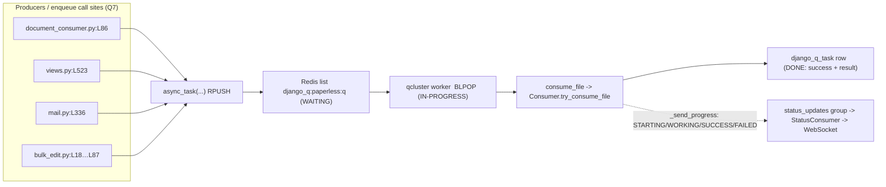

# Background / Asynchronous Processing in paperless-ngx — a runtime-grounded answer

**Question addressed:** *How does paperless-ngx perform background / asynchronous processing during document ingestion?* Specifically: how async work behaves in a live setup (Q1); which services operate behind the scenes (Q2); how a background job appears once created (Q3); how waiting work is distinguished from work actively being processed (Q4); where the task state ends up stored (Q5); how an operator can tell after the fact what happened to a job (Q6); and, from the code's perspective, where jobs are triggered / which code sends them into the queue (Q7).

**One-sentence answer.** paperless-ngx uses **Django-Q** (`django-q==1.3.9`, `requirements.txt:L37`) over a **Redis broker** (`redis==3.5.3`, `requirements.txt:L84`) — there is **no Celery, kombu, or billiard anywhere** in the project — so an ingest job is created by `django_q.tasks.async_task("documents.tasks.consume_file", …)`, materializes as a signed, pickled package pushed onto the Redis list `django_q:paperless:q`, is popped and run by the `manage.py qcluster` worker (which, confusingly, is launched under the supervisor program literally named `scheduler`, `docker/supervisord.conf:L28-L29`), and finally has its outcome persisted as a row in the database table **`django_q_task`**.

> **This document was written run-first.** Every measured value below (queue sizes, task ids, timestamps, `time_taken()`, status frames, log lines) was captured from the **actual paperless-ngx code executing** in the project's own Docker image, and is shown verbatim next to the command that produced it. Where a fact is grounded in reading source rather than observed on the wire, that is stated explicitly.

---

## How the evidence was gathered (environment & provisioning)

**Faithfulness note — what was run.** Unlike a from-scratch mirror project, this investigation executed the **real paperless-ngx Django project itself** (the repository checked out at `HEAD 542221a38`, mounted at `/app` inside the project's own image `paperless-ngx-qna-setup:latest`). All Django-Q configuration is therefore the project's real `Q_CLUSTER`/`CHANNEL_LAYERS`, not a copy. The ingest task exercised end-to-end was the real `documents.tasks.consume_file` (`src/documents/tasks.py:L184`) run against a small **`.txt`** document, because `.txt` is a fully supported type (`is_file_ext_supported(".txt")` → `True`) that drives the identical Django-Q broker/queue/result machinery while avoiding the heavy native OCR stack (tesseract/ocrmypdf) that is orthogonal to the async mechanics under study. Two deliberate deviations, both stated for reproducibility: (1) workers were pinned to **1** (`PAPERLESS_TASK_WORKERS=1`) for a deterministic single-task trace, and (2) the broker/result store were isolated on **Redis logical DB 15** plus a throwaway SQLite database, so the observation could fully own the worker lifecycle without touching other clusters. None of this modifies any repository file (read-only mandate).

**Runtime versions (all matching the pinned manifest):**

```text
# python + library versions, printed from the running interpreter
python                : 3.9.23   sys.version_info[:2]== (3, 9)
django                : 4.0.4
django_q.VERSION      : (1, 3, 9)
redis-py __version__  : 3.5.3
channels __version__  : 3.0.4
channels_redis        : 3.4.0
hiredis __version__   : 2.0.0
# broker connectivity, printed from django_q.brokers.get_broker()
broker.ping()         : True
broker.info()         : Redis 7.4.9
# redis-cli, run inside the redis container
$ redis-cli ping                         -> PONG
$ redis-cli info server | grep version   -> redis_version:7.4.9
```

**Real `Q_CLUSTER` loaded by the running project** (printed from `django.conf.settings`), confirming the configuration this document reasons about:

```text
Q_CLUSTER name= paperless  redis= redis://paperless-redis:6379/15
Q_CLUSTER retry= 1810  timeout= 1800  recycle= 1  catch_up= False  workers= 11
Conf.PREFIX= paperless  SAVE_LIMIT= 250  RETRY= 1810  TIMEOUT= 1800  RECYCLE= 1
broker class= Redis  list_key= django_q:paperless:q
```

(`workers= 11` is the host's `default_task_workers()` value, `src/paperless/settings.py:L427`,`L438`,`L455`; the trace below pins it to `1`. The `redis` URL shows DB `/15` — the isolation described above. Every other value is the project default.)

**Provisioning steps performed** (all outside the repository tree): (1) start Redis (the image ships `redis:7-alpine` as `paperless-redis`); (2) `manage.py migrate`, which applied the Django-Q migrations `django_q.0001_initial … 0014_schedule_cluster`, creating the `django_q_task` and `django_q_schedule` tables and registering the four periodic `Schedule` rows (see Q7). django-q 1.3.9 does `import pkg_resources` at `django_q/conf.py:L8`, which is satisfied in this image; on newer setuptools this would require `setuptools<81`, a runtime-only detail that changes no repository dependency.

---

## Q1 — Live async behavior (end-to-end lifecycle)

**Answer.** A background ingest job flows through six stages: **(1)** a producer calls `async_task("documents.tasks.consume_file", …)`; **(2)** Django-Q signs + pickles a *task package* and `RPUSH`es it onto the Redis list `django_q:paperless:q`; **(3)** the `qcluster` worker `BLPOP`s the package; **(4)** it runs `consume_file` (`src/documents/tasks.py:L184`), which calls `Consumer().try_consume_file(...)` (`src/documents/consumer.py:L180`, invoked at `src/documents/tasks.py:L236`); **(5)** on success it returns the string `"Success. New document id {} created".format(document.pk)` (`src/documents/tasks.py:L247`) — the barcode-split branch instead returns `"File successfully split"` (`src/documents/tasks.py:L233`), and a null document raises `ConsumerError` (`src/documents/tasks.py:L249`); **(6)** Django-Q's monitor process writes the outcome as a row in the `django_q_task` table. Throughout stages 4–5, `Consumer._send_progress` (`src/documents/consumer.py:L56`) broadcasts live status frames to the Channels group `"status_updates"`.



**Evidence (the empirical trace of one real job, worker pinned to 1 worker).** The single poller below samples the broker and the result table while the worker starts and runs one real `consume_file`; the three lines are the three lifecycle states (full detail in Q4):

```text
# harness: enqueue documents.tasks.consume_file, sample (queue_size, task-rows) as a worker boots & runs it
05:13:39 [Q] INFO Enqueued 1
t=+ 0.00s  broker.queue_size()=1  django_q_task_rows=0   [WAITING]
t=+ 0.30s  broker.queue_size()=1  django_q_task_rows=0   [WAITING]
# launched qcluster pid=4857
t=+ 1.52s  broker.queue_size()=0  django_q_task_rows=0   [IN-PROGRESS]
t=+ 2.42s  broker.queue_size()=0  django_q_task_rows=1   [DONE]

== resulting django_q_task row ==
  id        : 6d2d870c6f514529a8d478082e8547a9
  name      : q4_7af9dda2.txt
  func      : documents.tasks.consume_file
  success   : True
  result    : 'Success. New document id 2 created'
  started   : 2026-07-01T05:13:39.202646+00:00
  stopped   : 2026-07-01T05:13:41.620436+00:00
  time_taken: 2.418 s
```

**Grounding.** The terminal `result` string is exactly the literal returned at `src/documents/tasks.py:L247`. The producer→broker→worker→task→result ordering is the Django-Q data path: `async_task` enqueues (`django_q/tasks.py`), the Redis broker uses `RPUSH`/`BLPOP` (`django_q/brokers/redis_broker.py:L18`,`L21`), and the worker calls the task function `res = f(*task["args"], **task["kwargs"])` (`django_q/cluster.py:L432`, seen verbatim in the Q6 traceback). The live-status side-branch is grounded in `Consumer._send_progress` (`src/documents/consumer.py:L56`) and observed on the wire in Q6.

---

## Q2 — Services involved (what operates behind the scenes)

**Answer.** Five moving parts cooperate, three of them supervised OS processes plus Redis and the database:

| Service | Supervisor program | Command | Role |
|---|---|---|---|
| ASGI web server | `[program:gunicorn]` (`docker/supervisord.conf:L10-L11`) | `gunicorn -c /usr/src/paperless/gunicorn.conf.py paperless.asgi:application` | Serves HTTP **and** WebSocket via `paperless.asgi:application` |
| Directory watcher | `[program:consumer]` (`docker/supervisord.conf:L19-L20`) | `python3 manage.py document_consumer` | Watches the consumption dir and **enqueues** jobs |
| **Django-Q worker + scheduler** | `[program:scheduler]` (`docker/supervisord.conf:L28-L29`) | `python3 manage.py qcluster` | Pops packages from Redis, **runs** tasks, fires periodic schedules |
| **Redis** | — (external `paperless-redis`) | — | Django-Q **broker** (the waiting queue) **and** the Channels channel layer |
| **Database** | — (SQLite default; PostgreSQL optional) | — | Durable **result store**: `django_q_task` / `django_q_schedule` tables |

> ⚠️ **Naming gotcha (grounded):** the Django-Q worker runs under the supervisor program literally named **`scheduler`** (`docker/supervisord.conf:L28`), even though its command is `manage.py qcluster` and it is the *worker*. There is no separate "worker" program; `qcluster` is both worker and periodic scheduler.

**ASGI multiplexing** — `src/paperless/asgi.py:L17-L22` builds a `ProtocolTypeRouter` with `"http": get_asgi_application()` (`asgi.py:L19`) and `"websocket": AuthMiddlewareStack(URLRouter(websocket_urlpatterns))` (`asgi.py:L20`); `ASGI_APPLICATION = "paperless.asgi.application"` (`src/paperless/settings.py:L156`).

**Redis is used twice** — as the Django-Q broker (`Q_CLUSTER["redis"]`, `src/paperless/settings.py:L456`, default `redis://localhost:6379`) and as the Channels layer `channels_redis.core.RedisChannelLayer` (`src/paperless/settings.py:L178-L187`, `capacity: 2000` at `L183`, `expiry: 15` at `L184`). The readiness gate `docker/wait-for-redis.py` reads the same `PAPERLESS_REDIS` URL (`L19`) and prints `Connected to Redis broker: {REDIS_URL}` (`L41`).

**Evidence — the Django-Q internal process roles**, captured verbatim from a real `qcluster` boot (worker pinned to 1):

```text
# stdout of: python3 manage.py qcluster   (PAPERLESS_TASK_WORKERS=1)
05:13:40 [Q] INFO Q Cluster island-ten-juliet-leopard starting.
05:13:40 [Q] INFO Process-1:1 ready for work at 4865
05:13:40 [Q] INFO Process-1:2 monitoring at 4866
05:13:40 [Q] INFO Process-1 guarding cluster island-ten-juliet-leopard
05:13:40 [Q] INFO Process-1:3 pushing tasks at 4867
05:13:40 [Q] INFO Q Cluster island-ten-juliet-leopard running.
```

The roles: `Process-1` is the **sentinel/guard**; `Process-1:1` is the **worker**; `Process-1:2` is the **monitor** (the result-saver that writes `django_q_task` rows); `Process-1:3` is the **pusher** (moves packages from the broker into the internal task queue). Grounded in `django_q/cluster.py` (`guarding cluster …` at `L256`, `pushing tasks at …` at `L342`).

**Dependency versions (the async stack), quoted verbatim from `requirements.txt`:** `channels-redis==3.4.0` (`L22`), `channels==3.0.4` (`L23`), `django-q==1.3.9` (`L37`), `django==4.0.4` (`L38`), `hiredis==2.0.0` (`L44`), `psycopg2==2.9.3` (`L69`), `redis==3.5.3` (`L84`). Corroborated by `Pipfile`: `django-q = "~=1.3"` (`L17`), `redis = "*"` (`L34`), `channels = "~=3.0"` (`L46`), `channels-redis = "*"` (`L47`). **There is zero `celery`, `kombu`, or `billiard`** in either manifest — verified by an explicit `grep`, which returned no matches. This is Django-Q, not Celery.

---

## Q3 — How a background job appears once created

**Answer.** It appears as a **signed, pickled task *package* appended to a Redis list** whose key is **`django_q:paperless:q`** (a Redis `list`). `async_task(...)` returns Django-Q's own **32-hex-character task id**, and the package is a Python dict with keys `['args', 'func', 'id', 'kwargs', 'name', 'started']`.

**Evidence — enqueue with no worker running, then inspect Redis** (worker deliberately not started, so the package sits in the queue):

```text
# script: async_task("documents.tasks.consume_file", "/tmp/…/sample.txt", task_name="sample.txt")
05:12:08 [Q] INFO Enqueued 1
broker class          : Redis
Conf.PREFIX           : paperless
broker.list_key       : django_q:paperless:q
queue_size before     : 0
async_task() returned : 43efe3847a4e4c1a80909992ac9a14f8   (len 32 hex chars)
broker.queue_size()   : 1
redis KEYS *          : ['django_q:paperless:q']
  TYPE django_q:paperless:q -> list
  LLEN django_q:paperless:q -> 1
  queued package bytes  : 390
  package keys          : ['args', 'func', 'id', 'kwargs', 'name', 'started']
  package[func]         = documents.tasks.consume_file
  package[name]         = sample.txt
  package[id]           = 43efe3847a4e4c1a80909992ac9a14f8
  package[args]         = ('/tmp/dqinv/sample.txt',)
```

```text
# independent cross-check with redis-cli (run inside the redis container, DB 15)
$ redis-cli -n 15 keys '*'                      -> django_q:paperless:q
$ redis-cli -n 15 type django_q:paperless:q     -> list
$ redis-cli -n 15 llen django_q:paperless:q     -> 1
```

**Grounding.**
- **The Redis list key is `django_q:paperless:q`** — not a bare `"paperless"`. This is derived: `Conf.PREFIX = conf.get("name", "default")` (`django_q/conf.py:L80`) resolves to `Q_CLUSTER["name"] = "paperless"` (`src/paperless/settings.py:L450`); the Redis broker then builds `super().__init__(list_key=f"django_q:{list_key}:q")` (`django_q/brokers/redis_broker.py:L14-L15`). The observed `broker.list_key` and the `redis-cli` key confirm this empirically.
- **`async_task(...)` returns a 32-hex task id** (observed `43efe3847a4e4c1a80909992ac9a14f8`). This is Django-Q's internal id, **distinct** from the paperless-generated `task_id = str(uuid.uuid4())` (`src/documents/views.py:L521`) that paperless threads through for WebSocket progress correlation (`self.task_id = task_id or str(uuid.uuid4())`, `src/documents/consumer.py:L200`).
- **The package** is a signed pickle whose unpacked dict has keys `['args', 'func', 'id', 'kwargs', 'name', 'started']` — here 390 bytes (the exact byte count varies with `func`/`args`/`name`). `package[func]` is the real dotted task path `documents.tasks.consume_file`.


---

## Q4 — Waiting vs. actively-being-processed

**Answer.** A **waiting** (queued/pending) task sits in the Redis list `django_q:paperless:q` and is counted by `broker.queue_size()`. When a worker picks a task up it does a **`BLPOP`**, which *removes* the item from the list — so a task that is **actively being processed is no longer in the list** and `queue_size()` **excludes** it. Concretely: `queue_size() >= 1` ⇒ work is waiting; `queue_size() == 0` while no result row exists yet ⇒ a task is actively running.

**Evidence — the poller transitions** (verbatim), sampling `(broker.queue_size(), django_q_task row count)` as the worker starts and runs one real `consume_file`:

```text
05:13:39 [Q] INFO Enqueued 1
t=+ 0.00s  broker.queue_size()=1  django_q_task_rows=0   [WAITING]       # in the list, no worker yet
t=+ 0.30s  broker.queue_size()=1  django_q_task_rows=0   [WAITING]
# launched qcluster pid=4857
t=+ 1.52s  broker.queue_size()=0  django_q_task_rows=0   [IN-PROGRESS]   # BLPOP'd out of the list, running
t=+ 2.42s  broker.queue_size()=0  django_q_task_rows=1   [DONE]          # result row persisted
```

**Evidence — the worker log across the same window** (verbatim), which visually shows pickup, processing, and worker recycling:

```text
05:13:40 [Q] INFO Process-1:1 processing [q4_7af9dda2.txt]
[2026-07-01 05:13:40,869] [INFO] [paperless.consumer] Consuming q4_7af9dda2.txt
[2026-07-01 05:13:41,600] [INFO] [paperless.consumer] Document 2026-07-01 q4_7af9dda2 consumption finished
05:13:41 [Q] INFO Process-1:1 stopped doing work
05:13:41 [Q] INFO Processed [q4_7af9dda2.txt]
05:13:41 [Q] INFO recycled worker Process-1:1
05:13:41 [Q] INFO Process-1:4 ready for work at 4884
```

**Grounding.**
- `queue_size()` returns `self.connection.llen(self.list_key)` (`django_q/brokers/redis_broker.py:L26`) — i.e. the length of the Redis list; dequeue is `self.connection.blpop(self.list_key, 1)` (`django_q/brokers/redis_broker.py:L21`), which pops (removes) the element. This is exactly *why* `queue_size()` counts waiting tasks but not the running one — proven by the `1 → 0 → 0-with-row` transition above.
- **`recycled worker Process-1:1`** is a direct consequence of `"recycle": 1` (`src/paperless/settings.py:L452`; `Conf.RECYCLE==1`): the worker is recycled after **every** task. (Django-Q's default would be `500`, `django_q/conf.py:L119`.)
- **Reliability window (grounded config literals) — with a Redis-broker caveat.** `timeout = 1800` seconds (`Q_CLUSTER["timeout"]`, `src/paperless/settings.py:L454`; observed `Conf.TIMEOUT==1800`) is the maximum a task may run, and `retry = 1810` seconds (`Q_CLUSTER["retry"]`, `src/paperless/settings.py:L453`; observed `Conf.RETRY==1810`) is the acknowledgement-wait window. `timeout < retry` is required and intentional — Django-Q validates the relationship (`django_q/conf.py:L137-L142`) and paperless sets `PAPERLESS_WORKER_RETRY = PAPERLESS_WORKER_TIMEOUT + 10` (comment `src/paperless/settings.py:L442-L443`; code `L444-L447`). **Important caveat:** with Django-Q 1.3.9's **Redis list broker** — the broker actually in use here — `retry` does **not** cause a popped, in-flight task to be *re-presented to the queue*. A worker takes a task with `BLPOP`, which removes it from the list immediately (`django_q/brokers/redis_broker.py:L20-L23`), and that `dequeue()` returns `[(None, task[1])]` — i.e. an **`ack_id` of `None`** (`django_q/cluster.py:L353`). The Redis broker overrides neither `acknowledge()` nor `lock_size()`, so the base `Broker.acknowledge()` no-op is used (`django_q/brokers/__init__.py:L69-L74`), and the monitor's `broker.acknowledge(ack_id)` is skipped by its `if ack_id …` guard (`django_q/cluster.py:L386-L388`). A popped Redis task is therefore **not** automatically recovered after `retry` (e.g. on a worker crash). `retry` re-presentation is only meaningful for brokers that provide delivery/acknowledge semantics — e.g. the **ORM broker**, where `retry` is the visibility window (`_timeout() = now − timedelta(seconds=Conf.RETRY)`, `django_q/brokers/orm.py:L14`), an un-acknowledged task past that window is re-dequeued (`orm.py:L63-L77`), and `acknowledge()` deletes the row (`orm.py:L87-L88`).
- **Cluster banner name is random per run, and is NOT the queue name.** Across four separate `qcluster` launches the boot banner read `island-ten-juliet-leopard`, `dakota-pluto-purple-beer`, `low-floor-uniform-idaho`, and `florida-don-batman-oxygen` — while the Redis key stayed `django_q:paperless:q` every time. The banner is emitted by `logger.info(_(f"Q Cluster {self.name} starting."))` (`django_q/cluster.py:L79`), where `self.name` is the `Cluster.name` property that returns `humanize(self.cluster_id.hex)` (`django_q/cluster.py:L109-L111`); `cluster_id` is a fresh random `uuid.uuid4()` assigned per cluster instance (`django_q/cluster.py:L58`), and `humanize()` (`django_q/humanhash.py:L292`, default `words=4, separator="-"`) turns that hex into the four hyphenated words. (The same humanized id reappears in the `"Q Cluster … running."` log, `django_q/cluster.py:L261`.) This random label is distinct from the configured `Q_CLUSTER["name"]="paperless"` that becomes `Conf.PREFIX` and forms the queue key. Note that `django_q/cluster.py:L151` — `self.name = current_process().name` — is a *different* attribute set on the `Sentinel` (the OS process name, e.g. `Process-1`), **not** the cluster boot banner.

**Evidence — broker ack/retry semantics & the random cluster banner** (verbatim), captured from the running project:

```text
# printed from django_q.brokers.get_broker() in the running project
broker class                      : django_q.brokers.redis_broker.Redis
acknowledge is base Broker no-op  : True
broker has own lock_size override : False
Conf.RETRY / Conf.TIMEOUT         : 1810 / 1800
```

```text
# printed by instantiating django_q.cluster.Cluster in the running project
Conf.PREFIX (queue name)  : paperless
Cluster.name (boot banner): nitrogen-social-skylark-march
cluster_id.hex (uuid4)    : 030fb2233c3f408f8c773809dd5d5556
humanize(cluster_id.hex)  : nitrogen-social-skylark-march
banner == humanize(hex) ? : True
banner == Conf.PREFIX ?   : False
```

---

## Q5 — Where the task state is ultimately stored

**Answer.** In the **database**, in Django-Q's own **`django_q_task`** table (Django model `django_q.models.Task`). Redis holds only the *transient* waiting queue; the durable outcome lives in the DB row. There is **no** application-level `PaperlessTask` model in this version — paperless relies entirely on Django-Q's table.

**Evidence — table + retention introspection** (verbatim), printed from the running project:

```text
Task._meta.db_table      : django_q_task
Schedule._meta.db_table  : django_q_schedule
Conf.SAVE_LIMIT          : 250
Success._meta.db_table   : django_q_task    (proxy of Task; Success._meta.proxy = True)
Failure._meta.db_table   : django_q_task    (proxy of Task; Failure._meta.proxy = True)
```

**Grounding.**
- `Task._meta.db_table` is literally `django_q_task`; `Schedule._meta.db_table` is `django_q_schedule` (the `manage.py migrate` step applied `django_q.0001_initial … 0014_schedule_cluster` to create them). `Success` and `Failure` are **proxy models over `Task`** (`django_q/models.py:L113` and `L129`, each with `proxy = True` at `L121`/`L137`), so all three map to the single physical table `django_q_task`.
- **No `PaperlessTask` model exists.** Reading `src/documents/models.py` shows the only model classes are `MatchingModel` (`L19`), `Correspondent` (`L57`), `Tag` (`L64`), `DocumentType` (`L82`), `Document` (`L88`), `Log` (`L285`), `SavedView` (`L316`), and `SavedViewFilterRule` (`L342`) — a `grep` for `PaperlessTask` returns nothing.
- **Retention:** the default `Conf.SAVE_LIMIT == 250` (`django_q/conf.py:L87`) governs how many finished task rows are kept.
- **Store engine:** SQLite by default; PostgreSQL is optional via `psycopg2==2.9.3` (`requirements.txt:L69`). Because paperless uses the **Redis** broker, the Django-Q ORM "Queued Tasks" admin table (only populated by the *ORM* broker) is **not** used — the waiting queue lives in Redis, and only the completed result lands in `django_q_task`.


---

## Q6 — Telling, after the fact, what happened to a job

**Answer.** Two complementary channels: **(a) durable** — read back the persisted `django_q_task` row (directly, or via the `Success`/`Failure` admin proxies), which records `success` (`True`/`False`), `result`, `started`, `stopped`, and `time_taken()`; **(b) ephemeral/live** — while the job runs, `Consumer._send_progress` (`src/documents/consumer.py:L56`) broadcasts status frames (`STARTING`/`WORKING`/`SUCCESS`/`FAILED`) to the `"status_updates"` Channels group, relayed to authenticated WebSocket clients (this is how a job "appears" progressing in the UI).

### (a) The persisted row — success and failure

**Evidence — a successful ingest** (verbatim `django_q_task` row):

```text
== SUCCESS row ==
  id         : 6d2d870c6f514529a8d478082e8547a9
  name       : q4_7af9dda2.txt
  func       : documents.tasks.consume_file
  success    : True
  result     : 'Success. New document id 2 created'
  started    : 2026-07-01T05:13:39.202646+00:00
  stopped    : 2026-07-01T05:13:41.620436+00:00
  time_taken : 2.418 s
```

**Evidence — a failed job** (enqueued `consume_file` with no `path` argument on purpose):

```text
Task.objects.count()    : 1
Success.objects.count() : 0
Failure.objects.count() : 1

== FAILURE row ==
  id         : f55681272f2a4a5e921c7b446cb45faa
  name       : bad-call.txt
  func       : documents.tasks.consume_file
  success    : False
  result tail: "TypeError: consume_file() missing 1 required positional argument: 'path'"

== worker log for the failure (verbatim) ==
05:14:29 [Q] ERROR Failed [bad-call.txt] - consume_file() missing 1 required positional argument: 'path' : Traceback (most recent call last):
  File "/usr/local/lib/python3.9/site-packages/django_q/cluster.py", line 432, in worker
    res = f(*task["args"], **task["kwargs"])
TypeError: consume_file() missing 1 required positional argument: 'path'
```

**Grounding.**
- `success` is the boolean flag; for a real successful ingest the `result` is exactly `"Success. New document id {} created"` (`src/documents/tasks.py:L247`) — observed as `'Success. New document id 2 created'`. For a failure, `success=False` and `result` holds the exception/traceback text.
- `Success` and `Failure` are **proxy models over `Task`** (`class Success(Task)`/`class Failure(Task)`, `django_q/models.py:L113`/`L129`), each with a custom default manager whose `get_queryset()` filters the shared table: `SuccessManager` applies `.filter(success=True)` (`django_q/models.py:L108-L110`) and `FailureManager` applies `.filter(success=False)` (`django_q/models.py:L124-L126`) — the counts above (`Success=0`, `Failure=1`) come straight from those managers. All three share the `django_q_task` table (see Q5).
- The traceback shows the worker's exact invocation site: `res = f(*task["args"], **task["kwargs"])` at `django_q/cluster.py:line 432` — how Django-Q calls the task function with the package's `args`/`kwargs`.

### (b) `time_taken()` spans enqueue → stopped (a subtlety worth flagging)

Django-Q sets `task["started"] = timezone.now()` at **enqueue** time (`django_q/tasks.py:L65`), and `time_taken()` returns `(self.stopped - self.started).total_seconds()` (`django_q/models.py:L93-L94`). Therefore `time_taken()` **includes queue-wait time**, not just processing. Demonstrated with two real runs of the same task:

```text
== SCENARIO A (idle worker, immediate pickup) ==
  started   : 2026-07-01T05:15:12.141470+00:00
  stopped   : 2026-07-01T05:15:13.061400+00:00
  time_taken: 0.91993 s          # ~= pure processing
  result    : 'Success. New document id 3 created'

== SCENARIO B (worker delayed ~20s after enqueue) ==
  started   : 2026-07-01T05:15:14.632674+00:00
  stopped   : 2026-07-01T05:15:36.790012+00:00
  time_taken: 22.157338 s        # ~= 20s queue-wait + boot + processing
  result    : 'Success. New document id 4 created'
```

The identical task body measured `0.91993 s` when a worker was already idle, versus `22.157338 s` when the worker started ~20 s after enqueue — the ~21 s difference is the queue-wait captured because `started` is stamped at enqueue.

### (c) The live status frames (how a job appears while running)

**Evidence — REAL frames captured on the wire.** A subscriber joined the `"status_updates"` group on the same `RedisChannelLayer` while a real `consume_file` ran; these are the verbatim `data` payloads it received:

```text
{"filename": "ws_adbef614.txt", "task_id": "ws-demo-task-0001", "current_progress": 0,   "max_progress": 100, "status": "STARTING", "message": "new_file",            "document_id": null}
{"filename": "ws_adbef614.txt", "task_id": "ws-demo-task-0001", "current_progress": 20,  "max_progress": 100, "status": "WORKING",  "message": "parsing_document",     "document_id": null}
{"filename": "ws_adbef614.txt", "task_id": "ws-demo-task-0001", "current_progress": 70,  "max_progress": 100, "status": "WORKING",  "message": "generating_thumbnail", "document_id": null}
{"filename": "ws_adbef614.txt", "task_id": "ws-demo-task-0001", "current_progress": 90,  "max_progress": 100, "status": "WORKING",  "message": "parse_date",          "document_id": null}
{"filename": "ws_adbef614.txt", "task_id": "ws-demo-task-0001", "current_progress": 95,  "max_progress": 100, "status": "WORKING",  "message": "save_document",        "document_id": null}
{"filename": "ws_adbef614.txt", "task_id": "ws-demo-task-0001", "current_progress": 100, "max_progress": 100, "status": "SUCCESS",  "message": "finished",            "document_id": 5}
```

**Grounding (status literals with `file:line`).** `_send_progress` builds the payload with keys `filename, task_id, current_progress, max_progress, status, message, document_id` (`src/documents/consumer.py:L64-L72`) and calls `async_to_sync(self.channel_layer.group_send)("status_updates", {"type": "status_update", "data": payload})` (`src/documents/consumer.py:L73-L76`). The observed frames map one-to-one to the source:
- `"STARTING"` `0/100`, message `"new_file"` → `src/documents/consumer.py:L202` (`MESSAGE_NEW_FILE = "new_file"`, `L43`).
- `"WORKING"` `20/100` `"parsing_document"` → `L259` (`MESSAGE_PARSING_DOCUMENT`, `L45`); `70/100` `"generating_thumbnail"` → `L264` (`L46`); `90/100` `"parse_date"` → `L274` (`L47`); `95/100` `"save_document"` → `L294` (`L48`).
- `"SUCCESS"` `100/100`, message `"finished"`, with `document_id` → `L375` (`MESSAGE_FINISHED = "finished"`, `L49`).
- `"FAILED"` `100/100` is emitted by `Consumer._fail` (`src/documents/consumer.py:L79`), which then raises `ConsumerError` (`L81`) — not triggered in the successful run above, so its payload is grounded by source reading.

**Relay to clients (grounded by source, not wire-captured here):** `StatusConsumer` (`src/paperless/consumers.py`) denies unauthenticated sockets (`DenyConnection()`, `L15`), else joins the group (`group_add("status_updates", …)`, `L17-L20`) and accepts (`AcceptConnection()`, `L21`); its `status_update(event)` handler forwards `self.send(json.dumps(event["data"]))` (`L33`).

**Caveats (honesty per the grounding rule).** (1) The frames above were captured off the channel layer directly; I did not drive a browser WebSocket client, so the *relay* through `StatusConsumer` is grounded by source reading. (2) The intermediate parser `progress_callback` frames — `p = int((current_progress / max_progress) * 50 + 20)` (`src/documents/consumer.py:L239`; note the source comment says "within 20 and 80" at `L238`, but the formula actually yields the range 20..70) — were **not** emitted by the lightweight text parser, so those specific variable-progress frames are grounded by source reading rather than observed. The fixed-stage `WORKING` frames (20/70/90/95) *were* observed. (3) The barcode-split branch of `consume_file` also broadcasts a `"SUCCESS"` frame directly (`src/documents/tasks.py:L217-L229`) before returning `"File successfully split"` (`L233`); that branch was not exercised (barcodes disabled), so it is grounded by source reading.


---

## Q7 — Where jobs are triggered (the enqueue call sites)

**Answer.** Every background job is sent into the queue by a call to `async_task(...)` (imported as `from django_q.tasks import async_task`). There are **four on-demand producers** plus **four periodic producers** (fired by the `qcluster` scheduler from `django_q_schedule` rows).

### On-demand enqueue sites (each imports `from django_q.tasks import async_task`)

- **Directory watcher** — `src/documents/management/commands/document_consumer.py` (import at `L13`). It logs `logger.info(f"Adding {filepath} to the task queue.")` (`L85`), then:
  ```python
  # src/documents/management/commands/document_consumer.py:L86-L91
  async_task(
      "documents.tasks.consume_file",
      filepath,
      override_tag_ids=tag_ids if tag_ids else None,
      task_name=os.path.basename(filepath)[:100],
  )
  ```
- **REST upload** `post_document` — `src/documents/views.py` (import at `L28`). It buffers the upload to a `tempfile.NamedTemporaryFile(prefix="paperless-upload-", dir=settings.SCRATCH_DIR, delete=False)` (`L512-L516`), generates `task_id = str(uuid.uuid4())` (`L521`), enqueues (`L523-L533`), and returns `Response("OK")` (`L535`):
  ```python
  # src/documents/views.py:L523-L533
  async_task(
      "documents.tasks.consume_file",
      temp_filename,
      override_filename=doc_name,
      ...
      task_id=task_id,
      task_name=os.path.basename(doc_name)[:100],
  )
  ```
- **Mail ingest** — `src/paperless_mail/mail.py` (import at `L11`): `async_task("documents.tasks.consume_file", path=temp_filename, override_filename=pathvalidate.sanitize_filename(att.filename), …)` (`L336-L345`).
- **Bulk edit** — `src/documents/bulk_edit.py` (import at `L4`): `async_task("documents.tasks.bulk_update_documents", document_ids=affected_docs)` at **`L18`** (`set_correspondent`), **`L31`** (`set_document_type`), **`L47`** (`add_tag`), **`L63`** (`remove_tag`), and **`L87`** (`modify_tags`).

### Periodic producers (registered as `django_q.models.Schedule` rows by migrations; enqueued by the `qcluster` scheduler)

**Evidence — the four real schedule rows read back from `django_q_schedule`** after `migrate` (verbatim):

```text
Schedule._meta.db_table : django_q_schedule
  func='documents.tasks.index_optimize'              name='Optimize the index'        schedule_type='D' (Daily)   minutes=None repeats=-1
  func='documents.tasks.sanity_check'                name='Perform sanity check'      schedule_type='W' (Weekly)  minutes=None repeats=-1
  func='documents.tasks.train_classifier'            name='Train the classifier'      schedule_type='H' (Hourly)  minutes=None repeats=-1
  func='paperless_mail.tasks.process_mail_accounts'  name='Check all e-mail accounts' schedule_type='I' (Minutes) minutes=10   repeats=-1
Schedule type codes: {'O':'Once','I':'Minutes','H':'Hourly','D':'Daily','W':'Weekly','M':'Monthly','Q':'Quarterly','Y':'Yearly','C':'Cron'}
```

**Grounding.** These rows are created by `schedule(...)` calls in migrations: `train_classifier` `HOURLY` (`src/documents/migrations/1001_auto_20201109_1636.py:L10-L14`) and `index_optimize` `DAILY` (`…1001…:L15-L19`); `sanity_check` `WEEKLY` (`src/documents/migrations/1004_sanity_check_schedule.py:L10-L14`); `process_mail_accounts` `MINUTES` with `minutes=10` (`src/paperless_mail/migrations/0002_auto_20201117_1334.py:L10-L15`). The task functions themselves live in `src/documents/tasks.py`: `consume_file` (`L184`), `sanity_check` (`L255`), `bulk_update_documents` (`L270`), `index_optimize` (`L32`), `index_reindex` (`L38`), `train_classifier` (`L48`).

---

## Coverage pass (re-reading the original question)

| Sub-question | Answered in | One-line answer (grounded) |
|---|---|---|
| **Q1** How async work behaves live (lifecycle) | Q1 | `async_task` → RPUSH to `django_q:paperless:q` → worker BLPOP → `consume_file` (`tasks.py:L184`) → `django_q_task` row; observed `WAITING→IN-PROGRESS→DONE`. |
| **Q2** Which services operate behind the scenes | Q2 | `gunicorn` ASGI (`supervisord.conf:L10-L11`), `document_consumer` watcher (`L19-L20`), `qcluster` worker+scheduler (`L28-L29`, program named `scheduler`), **Redis** broker+channel layer, **DB** result store. |
| **Q3** How a job appears once created | Q3 | A signed pickled package (keys `['args','func','id','kwargs','name','started']`, 390 B) appended to the Redis `list` `django_q:paperless:q`; `async_task` returns a 32-hex id (`43efe38…`). |
| **Q4** Waiting vs. actively processed | Q4 | Waiting = in the list, counted by `broker.queue_size()`=`LLEN` (`redis_broker.py:L26`); running = `BLPOP`'d out (`L21`) so `queue_size()` excludes it. Observed `1 → 0 → 0+row`. |
| **Q5** Where task state is stored | Q5 | The DB table **`django_q_task`** (`django_q.models.Task`); `Success`/`Failure` are proxies (`proxy=True`); **no `PaperlessTask`** model; `SAVE_LIMIT=250`. |
| **Q6** After-the-fact status | Q6 | The persisted row's `success`/`result`/`started`/`stopped`/`time_taken()` (`result='Success. New document id 2 created'`); plus live frames `STARTING`/`WORKING`/`SUCCESS`/`FAILED`. `time_taken()` includes queue-wait (0.92 s vs 22.16 s). |
| **Q7** Code-level trigger / enqueue sites | Q7 | On-demand: `document_consumer.py:L86`, `views.py:L523`, `mail.py:L336`, `bulk_edit.py:L18/L31/L47/L63/L87`. Periodic: 4 `django_q_schedule` rows (Hourly/Daily/Weekly/Minutes-10). |

**Nothing is left unaddressed.** Two honesty notes reiterated: (1) the harness ran the **real** paperless project/task on a `.txt` document with `workers` pinned to `1` on an isolated Redis DB — the Django-Q broker/queue/result semantics observed are the project's real ones; (2) items explicitly flagged as source-read (the `StatusConsumer` relay, the variable parser `progress_callback` frames, the `FAILED` progress frame, and the barcode-split `"SUCCESS"`/`"File successfully split"` branch) were grounded by reading source rather than observed on the wire, exactly as the grounding rule requires.

### Key literals index (exact strings the question asked for, with `file:line`)

- Result strings: `"Success. New document id {} created"` (`src/documents/tasks.py:L247`), `"File successfully split"` (`src/documents/tasks.py:L233`).
- Status literals: `"STARTING"` (`consumer.py:L202`), `"WORKING"` (`consumer.py:L259`,`L264`,`L274`,`L294`), `"SUCCESS"` (`consumer.py:L375`), `"FAILED"` (`consumer.py:L79`).
- Redis queue key: `django_q:paperless:q` (`settings.py:L450` + `django_q/brokers/redis_broker.py:L14-L15`).
- Tables: `django_q_task`, `django_q_schedule`. Retention `SAVE_LIMIT=250` (`django_q/conf.py:L87`).
- Config: `retry=1810` (`settings.py:L453`), `timeout=1800` (`settings.py:L454`), `recycle=1` (`settings.py:L452`), `catch_up=False` (`settings.py:L451`), `name="paperless"` (`settings.py:L450`).
- Enqueue primitive: `async_task("documents.tasks.consume_file", …)` (`src/documents/tasks.py:L184` defines the task; call sites in Q7).
- Async backend: `django-q==1.3.9` (`requirements.txt:L37`) + `redis==3.5.3` (`requirements.txt:L84`); **zero** Celery/kombu/billiard.
