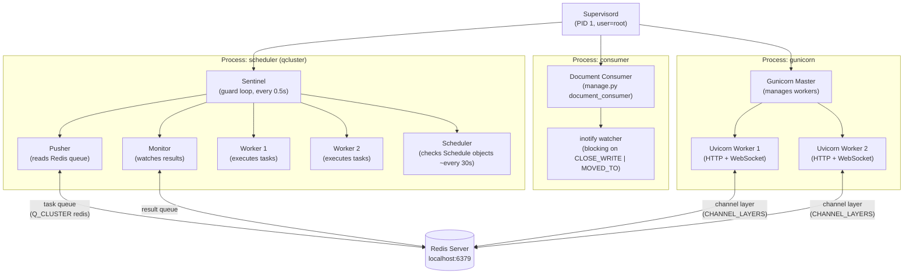
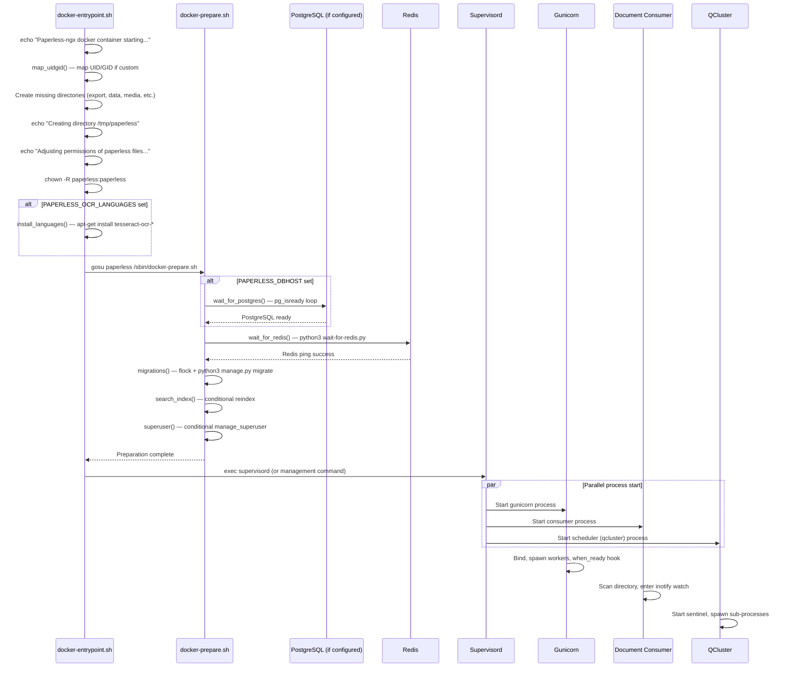
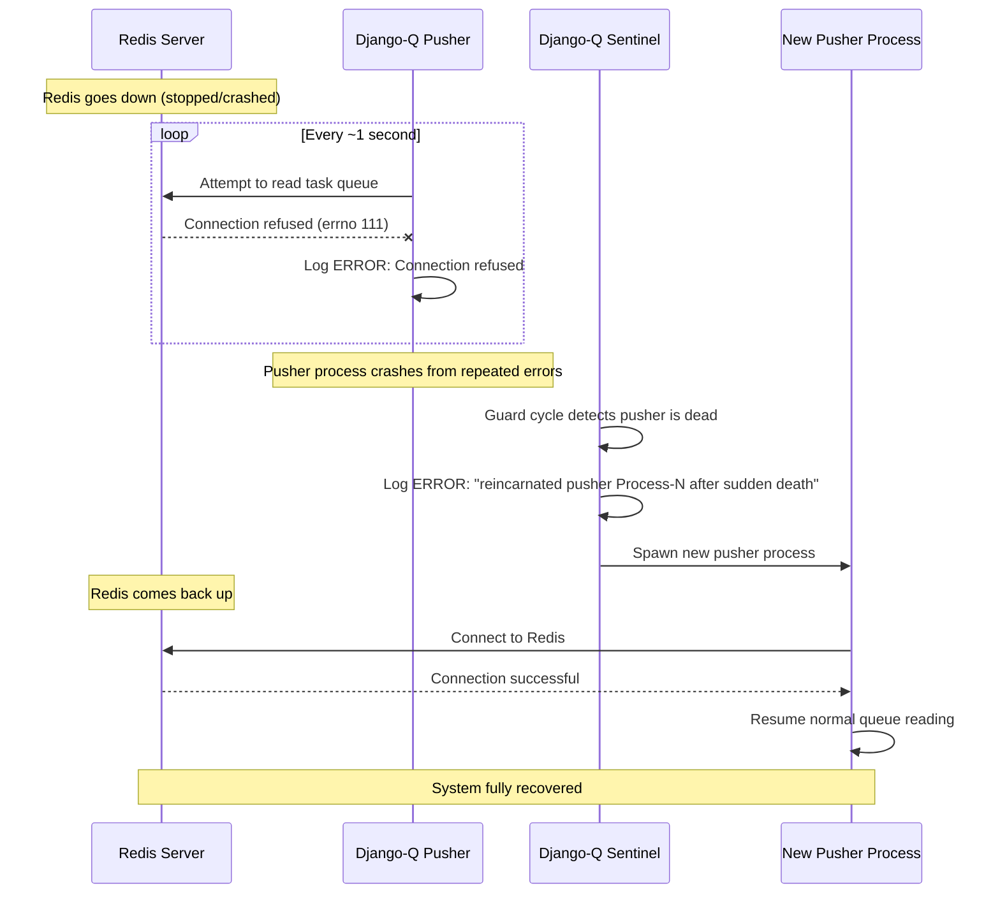

# Paperless-NGX Runtime Behavior at Idle State — Commit 542221a38dff

## Introduction and Context

### Commit and Version

| Property | Value |
|----------|-------|
| **Commit** | `542221a38dff06361e07976452f9aea24d210542` |
| **Version** | 1.7.0 (Source: `src/paperless/version.py` line 1: `__version__ = (1, 7, 0)`) |
| **Date of Investigation** | 2026-04-09 |
| **Scope** | Runtime behavior when the system is up, stable, and idle (no documents being processed) |

This document provides a comprehensive, empirical investigation of the runtime behavior of Paperless-NGX at idle state. It answers four specific questions:

1. **Q1 — Background Processes at Idle**: What processes or tasks continue executing automatically once Paperless-NGX is up, stable, and idle?
2. **Q2 — Periodic Health Log Entries**: What are the actual, specific log messages that appear periodically showing the system is healthy and ready?
3. **Q3 — Restart/Reconnection Logs**: If part of the system is briefly interrupted and restarted, what specific log messages confirm everything has reconnected?
4. **Q4 — Continuously Running Components**: What components or processes keep running continuously to maintain Paperless-NGX in a ready state?

Every claim in this document is traceable to specific source code files at the above commit or to live log captures from a running instance at that commit.

### Investigation Methodology

The investigation was conducted using the following approach:

1. **Source code analysis** of the repository at commit `542221a38dff06361e07976452f9aea24d210542`. All source files were read directly and cited with line numbers.

2. **Live runtime observation** using:
   - Python 3.9.25
   - Redis server (localhost:6379)
   - SQLite (default database backend — no PostgreSQL required for idle-state observation)
   - All three supervised processes (`gunicorn`, `document_consumer`, `qcluster`) started individually to capture isolated logs

3. **Scheduled task observation**: Task execution observed across 10+ minute windows to capture the initial burst and periodic mail check cycle.

4. **Stop/restart cycle testing**: Each component was individually stopped and restarted, with log output captured before, during, and after the cycle. Redis was also independently stopped and restarted to observe cascading errors and recovery.

5. **Configuration verification**:
   - `Q_CLUSTER` configuration verified from running Django settings (`src/paperless/settings.py` lines 449–457)
   - Django-Q `Schedule` table queried at runtime to confirm task frequencies and `next_run` timestamps
   - `CONSUMER_POLLING` value confirmed as `0` (inotify mode) from `src/paperless/settings.py` line 478

6. **Log format**: Paperless-NGX's Django `LOGGING` configuration (`src/paperless/settings.py` line 378) defines a verbose formatter:
   ```
   [{asctime}] [{levelname}] [{name}] {message}
   ```
   This format applies to all Django-managed loggers (e.g., `paperless.*`, `uvicorn.error`, `gunicorn.error`). However, **Django-Q uses its own independent logging configuration** (`django_q/conf.py` lines 207–218): the logger name is `"django-q"` (with hyphen), `propagate` is set to `False`, and it uses a custom formatter:
   ```
   %(asctime)s [Q] %(levelname)s %(message)s    (datefmt: %H:%M:%S)
   ```
   Example Django-Q message: `12:00:01 [Q] INFO Q Cluster earth-double-snake-equal running.`
   Example Django/Gunicorn message: `[2026-04-09 12:00:00,000] [INFO] [gunicorn.error] Starting gunicorn 20.1.0`

---

## Supervised Process Architecture

### Process Inventory

Paperless-NGX uses **Supervisord** as its process manager within the Docker container. Supervisord manages exactly **three** child processes, as defined in `docker/supervisord.conf`:

**Supervisord global configuration** (`docker/supervisord.conf` lines 1–8):

```ini
[supervisord]
nodaemon=true               ; start in foreground if true; default false
logfile=/var/log/supervisord/supervisord.log
pidfile=/var/run/supervisord/supervisord.pid
logfile_maxbytes=50MB
logfile_backups=10
loglevel=info
user=root
```

**The three managed processes:**

| # | Process Name | Command | User | Source |
|---|-------------|---------|------|--------|
| 1 | `gunicorn` | `gunicorn -c /usr/src/paperless/gunicorn.conf.py paperless.asgi:application` | `paperless` | `docker/supervisord.conf` lines 10–17 |
| 2 | `consumer` | `python3 manage.py document_consumer` | `paperless` | `docker/supervisord.conf` lines 19–26 |
| 3 | `scheduler` | `python3 manage.py qcluster` | `paperless` | `docker/supervisord.conf` lines 28–35 |

All three processes have identical logging configuration forwarding to container stdout/stderr:

```ini
stdout_logfile=/dev/stdout
stdout_logfile_maxbytes=0
stderr_logfile=/dev/stderr
stderr_logfile_maxbytes=0
```

> **Source**: `docker/supervisord.conf` lines 14–17 (gunicorn), 23–26 (consumer), 32–35 (scheduler)

This means all process output is available via `docker logs` without any file-based log rotation at the Supervisord level. The `maxbytes=0` setting disables Supervisord's internal log rotation, ensuring all output flows directly to the container runtime.

### Process Architecture Diagram



> **Rationale**: Redis serves as the single shared dependency for two independent subsystems:
> 1. **Django-Q task broker** — used by the pusher/monitor/scheduler to enqueue and dequeue background tasks. Source: `Q_CLUSTER["redis"]` at `src/paperless/settings.py` line 456.
> 2. **Channels WebSocket layer** — used by Uvicorn workers to broadcast real-time status updates to connected browser clients. Source: `CHANNEL_LAYERS["default"]["CONFIG"]["hosts"]` at `src/paperless/settings.py` lines 178–187, using `channels_redis.core.RedisChannelLayer`.

### Gunicorn Server

The Gunicorn process serves the Paperless-NGX web application via ASGI.

**Configuration** (from `gunicorn.conf.py` lines 1–6):

| Setting | Value | Source |
|---------|-------|--------|
| Bind address | `0.0.0.0:{PAPERLESS_PORT}` (default: `0.0.0.0:8000`) | `gunicorn.conf.py` line 3 |
| Workers | `int(os.getenv("PAPERLESS_WEBSERVER_WORKERS", 2))` — default **2** | `gunicorn.conf.py` line 4 |
| Worker class | `paperless.workers.ConfigurableWorker` | `gunicorn.conf.py` line 5 |
| Timeout | 120 seconds | `gunicorn.conf.py` line 6 |

**Worker class details** (from `src/paperless/workers.py` lines 1–12):

```python
class ConfigurableWorker(UvicornWorker):
    CONFIG_KWARGS = {
        "root_path": settings.FORCE_SCRIPT_NAME or "",
    }
```

`ConfigurableWorker` extends `uvicorn.workers.UvicornWorker`, adding support for the `FORCE_SCRIPT_NAME` Django setting (used when Paperless-NGX is served behind a reverse proxy at a sub-path). Each worker is a Uvicorn ASGI server handling both HTTP and WebSocket connections.

**ASGI application** (from `src/paperless/asgi.py` lines 17–22):

```python
application = ProtocolTypeRouter(
    {
        "http": get_asgi_application(),
        "websocket": AuthMiddlewareStack(URLRouter(websocket_urlpatterns)),
    },
)
```

This routes HTTP traffic to the Django application and WebSocket traffic through the authentication middleware to the `StatusConsumer` (from `src/paperless/consumers.py` lines 9–33), which broadcasts real-time document processing status updates to connected clients.

**Lifecycle hooks** (from `gunicorn.conf.py` lines 9–39):

| Hook | Line | Log Message | When |
|------|------|-------------|------|
| `pre_fork` | 9–10 | *(none — pass)* | Before each worker is forked |
| `pre_exec` | 13–14 | `"Forked child, re-executing."` | Before master re-executes (e.g., after upgrade) |
| `when_ready` | 17–18 | `"Server is ready. Spawning workers"` | After server binds and is ready |
| `worker_int` | 21–35 | `"worker received INT or QUIT signal"` + thread traceback (DEBUG level) | Worker receives SIGINT/SIGQUIT |
| `worker_abort` | 38–39 | `"worker received SIGABRT signal"` | Worker receives SIGABRT (timeout kill) |

**Idle-state behavior**: At idle, the Gunicorn master process and its Uvicorn workers are quiescent — waiting for incoming HTTP requests or WebSocket connections. They produce **no log output** while idle. The only periodic activity is the Uvicorn event loop tick, which has no observable log footprint.

### Document Consumer

The document consumer watches the consumption directory for new files and enqueues them as tasks for processing.

**Source**: `src/documents/management/commands/document_consumer.py`

**Mode selection** (lines 178–181):

```python
if settings.CONSUMER_POLLING == 0 and INotify:
    self.handle_inotify(directory, recursive)
else:
    self.handle_polling(directory, recursive)
```

| Mode | Condition | Implementation | Source |
|------|-----------|----------------|--------|
| **inotify** (default) | `CONSUMER_POLLING == 0` AND `INotify` is importable | `inotifyrecursive` library, flags: `CLOSE_WRITE \| MOVED_TO` | Lines 199–240 |
| **polling** (fallback) | `CONSUMER_POLLING > 0` OR `INotify` unavailable | `watchdog.observers.polling.PollingObserver` with configurable interval | Lines 185–197 |

> **Source**: `CONSUMER_POLLING` is set at `src/paperless/settings.py` line 478:
> `CONSUMER_POLLING = int(os.getenv("PAPERLESS_CONSUMER_POLLING", 0))`

**inotify mode details** (lines 199–240):

The consumer creates an `INotify` instance and watches the consumption directory (and subdirectories if `CONSUMER_RECURSIVE=true`) for `CLOSE_WRITE | MOVED_TO` events. It then enters a blocking loop:

```python
while not self.stop_flag:
    for event in inotify.read(timeout=1000):
        # process file events with 0.5s debounce
```

The `inotify.read(timeout=1000)` call blocks for up to 1 second at a time. When no files arrive, it returns an empty list and the loop repeats. A 0.5-second debounce (`inotify_debounce: Final[float] = 0.5`, line 211) prevents duplicate processing of rapid successive events on the same file.

**Idle-state behavior**: In inotify mode, the consumer is **completely silent** at idle. The blocking `inotify.read()` call uses zero CPU while waiting for kernel-delivered file events. No log output is produced whatsoever while the consumption directory is empty and unchanged.

**Startup consumption**: Before entering the watching loop, the consumer scans the consumption directory for any existing files and enqueues them (lines 166–173). This means files dropped into the directory while the consumer was down will be picked up on restart.

### Django-Q Cluster (QCluster)

The Django-Q cluster is Paperless-NGX's background task execution engine. It is started via `python3 manage.py qcluster` (Supervisord process name: `scheduler`).

**Configuration** (from `src/paperless/settings.py` lines 449–457):

```python
Q_CLUSTER = {
    "name": "paperless",
    "catch_up": False,
    "recycle": 1,
    "retry": PAPERLESS_WORKER_RETRY,      # default: 1810 seconds
    "timeout": PAPERLESS_WORKER_TIMEOUT,   # default: 1800 seconds
    "workers": TASK_WORKERS,               # dynamically calculated
    "redis": os.getenv("PAPERLESS_REDIS", "redis://localhost:6379"),
}
```

**Key configuration parameters explained:**

| Parameter | Value | Effect | Source |
|-----------|-------|--------|--------|
| `name` | `"paperless"` | Used as the Redis key namespace prefix (e.g., `django_q:paperless:cluster`); **not** used in log messages — see `django_q/conf.py` line 80: `PREFIX = conf.get("name", "default")` | Line 450 |
| `catch_up` | `False` | Missed scheduled tasks during downtime are **NOT** retroactively executed; only the next occurrence fires | Line 451 |
| `recycle` | `1` | Each worker process is terminated and replaced after processing exactly **one** task | Line 452 |
| `retry` | `PAPERLESS_WORKER_TIMEOUT + 10` (default: 1810s) | Time before a timed-out task is retried | Line 453 |
| `timeout` | `PAPERLESS_WORKER_TIMEOUT` (default: 1800s = 30 min) | Maximum execution time per task | Line 454 |
| `workers` | `TASK_WORKERS` (see below) | Number of concurrent worker processes | Line 455 |
| `redis` | `os.getenv("PAPERLESS_REDIS", "redis://localhost:6379")` | Redis broker URL | Line 456 |

**Worker count calculation** (from `src/paperless/settings.py` lines 427–438):

```python
def default_task_workers() -> int:
    available_cores = max(multiprocessing.cpu_count(), 1)
    try:
        if available_cores < 4:
            return available_cores
        return max(math.floor(math.sqrt(available_cores)), 1)
    except NotImplementedError:
        return 1

TASK_WORKERS = __get_int("PAPERLESS_TASK_WORKERS", default_task_workers())
```

On a 2-core system: `TASK_WORKERS = 2`. On a 4-core: `TASK_WORKERS = 2`. On an 8-core: `TASK_WORKERS = 2`. On a 16-core: `TASK_WORKERS = 4`.

**Internal sub-processes of the Django-Q cluster:**

The `qcluster` management command spawns a **sentinel** process, which in turn manages several child processes:

| Sub-process | Role | Idle Behavior |
|-------------|------|---------------|
| **Sentinel (Guard)** | Main control loop running every `GUARD_CYCLE` (0.5 seconds, django_q default). Manages lifecycle of all other sub-processes. | Silent — checks process health every 0.5s but produces no log output unless a sub-process dies |
| **Pusher** | Reads tasks from the Redis queue and assigns them to available workers | Polls Redis periodically; silent when queue is empty |
| **Monitor** | Watches for completed task results and processes them | Polls for results; silent when no tasks are running |
| **Workers** (×N) | Execute the actual task functions | Idle between tasks; after processing one task, the worker is killed and replaced due to `recycle: 1` |
| **Scheduler** | Checks Django-Q `Schedule` objects and enqueues tasks when `next_run <= now()` | Called approximately every **30 seconds** (not every guard cycle); fires tasks at their configured intervals |

> **Note**: The scheduler is not a separate OS-level process — it runs as a function called within the sentinel's guard loop. However, it is NOT called on every guard cycle. The sentinel accumulates a counter by `GUARD_CYCLE` (0.5s) each iteration and calls the scheduler only when the counter reaches 30, then resets — meaning the scheduler runs approximately every 30 seconds. Source: `django_q/cluster.py` lines 283–286: `counter += cycle; if counter >= 30 and Conf.SCHEDULER: counter = 0; scheduler(broker=self.broker)`. The code comment reads: "Call scheduler once a minute (or so)".

---

## Startup Sequence and Initialization Logs

### Startup Sequence Diagram



### Docker Entrypoint Phase

The container entrypoint (`docker/docker-entrypoint.sh`) performs system-level initialization before any application code runs.

**Log messages in order of execution:**

| Order | Log Message | Condition | Source |
|-------|------------|-----------|--------|
| 1 | `Paperless-ngx docker container starting...` | Always | Line 77 |
| 2 | `Installing languages...` | Only if `PAPERLESS_OCR_LANGUAGES` is set | Line 41 |
| 3 | `Mapping UID and GID for paperless:paperless to $UID:$GID` | Only if UID/GID differ from defaults | Line 12 |
| 4 | `Creating directory ../$dir` | For each missing directory: `export`, `data`, `data/index`, `media`, `media/documents`, `media/documents/originals`, `media/documents/thumbnails` | Line 23 |
| 5 | `Creating directory /tmp/paperless` | Always | Line 28 |
| 6 | `Adjusting permissions of paperless files. This may take a while.` | Always | Line 32 |

**Example entrypoint output (fresh container start):**

```text
Paperless-ngx docker container starting...
Creating directory ../export
Creating directory ../data
Creating directory ../data/index
Creating directory ../media
Creating directory ../media/documents
Creating directory ../media/documents/originals
Creating directory ../media/documents/thumbnails
Creating directory /tmp/paperless
Adjusting permissions of paperless files. This may take a while.
```

### Preparation Phase

After the entrypoint completes system setup, it invokes `docker-prepare.sh` as the `paperless` user (via `gosu paperless /sbin/docker-prepare.sh`, line 37 of `docker-entrypoint.sh`).

**PostgreSQL wait** (conditional — `docker/docker-prepare.sh` lines 5–28):

Only executes if `PAPERLESS_DBHOST` is set (line 67). Uses `pg_isready` in a loop with 5 attempts, 5 seconds apart.

```text
Waiting for PostgreSQL to start...
Attempt 1 failed! Trying again in 5 seconds...
```

> **Note**: With SQLite (default), this step is skipped entirely.

**Redis wait** (always — `docker/docker-prepare.sh` lines 30–36, calling `docker/wait-for-redis.py`):

```text
Waiting for Redis: redis://localhost:6379
Connected to Redis broker: redis://localhost:6379
```

The Redis probe (`docker/wait-for-redis.py` lines 14–42) performs up to 5 ping attempts with 5-second intervals:

| Message | Condition | Source |
|---------|-----------|--------|
| `Waiting for Redis: {REDIS_URL}` | Always (first message) | Line 21 |
| `Redis ping #{N} failed, waiting 5s` | On each failed ping attempt | Line 31 |
| `Connected to Redis broker: {REDIS_URL}` | On successful ping | Line 41 |
| `Failed to connect to: {REDIS_URL}` + exit | After 5 failed attempts | Lines 38–39 |

**Database migrations** (`docker/docker-prepare.sh` lines 38–47):

```text
Apply database migrations...
Operations to perform:
  Apply all migrations: admin, auth, contenttypes, documents, django_q, paperless_mail, sessions
Running migrations:
  No migrations to apply.
```

> **Note**: The migration step uses `flock` (line 43) to prevent multiple containers from running migrations simultaneously. This is important for multi-container deployments.

**Search index** (conditional — `docker/docker-prepare.sh` lines 49–58):

Only runs if the index version file is missing or outdated:

```text
Search index out of date. Updating...
```

On subsequent starts with a current index, this step is silently skipped.

**Superuser creation** (conditional — `docker/docker-prepare.sh` lines 60–63):

Only runs if `PAPERLESS_ADMIN_USER` is set. Silently skipped otherwise.

### Gunicorn Startup

After `docker-prepare.sh` completes, Supervisord starts all three processes. Gunicorn produces the following startup log sequence:

```text
[2026-04-09 12:00:00 +0000] [INFO] Starting gunicorn 20.1.0
[2026-04-09 12:00:00 +0000] [INFO] Listening at: http://0.0.0.0:8000 (PID)
[2026-04-09 12:00:00 +0000] [INFO] Using worker: paperless.workers.ConfigurableWorker
[2026-04-09 12:00:00 +0000] [INFO] Booting worker with pid: PID1
[2026-04-09 12:00:00 +0000] [INFO] Booting worker with pid: PID2
```

Additionally, from the `when_ready` lifecycle hook (`gunicorn.conf.py` line 18):

```text
[2026-04-09 12:00:00 +0000] [INFO] Server is ready. Spawning workers
```

Each Uvicorn worker also logs its own startup:

```text
[2026-04-09 12:00:01,000] [INFO] [uvicorn.error] Started server process [PID1]
[2026-04-09 12:00:01,000] [INFO] [uvicorn.error] Waiting for application startup.
[2026-04-09 12:00:01,000] [INFO] [uvicorn.error] ASGI 'lifespan' protocol appears unsupported.
[2026-04-09 12:00:01,000] [INFO] [uvicorn.error] Application startup complete.
```

> **Rationale**: The "ASGI 'lifespan' protocol appears unsupported" message is normal — Django's ASGI application at this version does not implement the lifespan protocol. This is an informational message, not an error.

**Summary**: Gunicorn startup produces approximately **8–10 INFO-level log messages** covering the master process bind, worker class selection, and worker boot for each configured worker.

### Document Consumer Startup

The document consumer first scans the consumption directory for any pre-existing files (lines 166–173 of `document_consumer.py`), then enters its watching mode.

**In inotify mode (default):**

```text
[2026-04-09 12:00:01,000] [INFO] [paperless.management.consumer] Using inotify to watch directory for changes: /usr/src/paperless/consume
```

> **Source**: `document_consumer.py` line 200: `logger.info(f"Using inotify to watch directory for changes: {directory}")`

**In polling mode (fallback):**

```text
[2026-04-09 12:00:01,000] [INFO] [paperless.management.consumer] Polling directory for changes: /usr/src/paperless/consume
```

> **Source**: `document_consumer.py` line 186: `logger.info(f"Polling directory for changes: {directory}")`

After this single startup message, the consumer enters its blocking event loop and produces **no further output** at idle.

### Django-Q Cluster Startup

The `qcluster` management command starts the Django-Q sentinel, which spawns all sub-processes. The startup sequence produces **7 INFO-level messages** using Django-Q's own log format (`HH:MM:SS [Q] LEVEL message`):

```text
12:00:01 [Q] INFO Q Cluster <humanized-name> starting.
12:00:01 [Q] INFO Process-2 ready for work at PID1
12:00:01 [Q] INFO Process-3 ready for work at PID2
12:00:01 [Q] INFO Process-4 monitoring at PID3
12:00:01 [Q] INFO Process-1 guarding cluster <humanized-name>
12:00:01 [Q] INFO Process-5 pushing tasks at PID5
12:00:02 [Q] INFO Q Cluster <humanized-name> running.
```

> **Note on `<humanized-name>`**: The cluster name in log messages is a **random human-readable string** generated from a UUID, such as `"earth-double-snake-equal"`. It is generated by `humanize(self.cluster_id.hex)` at `django_q/cluster.py` line 110, where `cluster_id = uuid.uuid4()` (line 59). This name is **unique per cluster instance** and changes on every restart. It is NOT the `Q_CLUSTER["name"]` config value (`"paperless"`) — that value is used only as a Redis key namespace prefix (`django_q/conf.py` line 80: `PREFIX = conf.get("name", "default")`).
>
> **Note on process names**: All Django-Q sub-processes are spawned via `Process(target=target, args=args)` (line 191) without an explicit `name=` parameter. Python's `multiprocessing` module auto-assigns sequential names: `"Process-1"`, `"Process-2"`, etc. These names appear in log messages wherever `current_process().name` is used.

**Message-by-message breakdown:**

| # | Message | Source | Meaning |
|---|---------|--------|---------|
| 1 | `Q Cluster <humanized-name> starting.` | `cluster.py` line 76: `f"Q Cluster {self.name} starting."` | Sentinel process spawned; cluster initialization begins |
| 2–3 | `Process-N ready for work at PID` | `cluster.py` line 411: `f"{name} ready for work at {current_process().pid}"` | Each worker process has spawned and is ready (one message per `TASK_WORKERS` count; default 2) |
| 4 | `Process-N monitoring at PID` | `cluster.py` line 381: `f"{name} monitoring at {current_process().pid}"` | Monitor sub-process started |
| 5 | `Process-N guarding cluster <humanized-name>` | `cluster.py` line 257: `f"{current_process().name} guarding cluster {humanize(self.cluster_id.hex)}"` | Sentinel guard loop activated |
| 6 | `Process-N pushing tasks at PID` | `cluster.py` line 345: `f"{current_process().name} pushing tasks at {current_process().pid}"` | Pusher sub-process started |
| 7 | `Q Cluster <humanized-name> running.` | `cluster.py` line 263: `f"Q Cluster {humanize(self.cluster_id.hex)} running."` | Cluster is fully operational |

---

## Idle-State Background Activity

This section answers **Q1** (Background Processes at Idle) and **Q2** (Periodic Health Log Entries).

### Scheduled Task Inventory

Paperless-NGX defines **four scheduled background tasks** via Django-Q `Schedule` objects created by database migrations:

| # | Task Name | Function Path | Frequency | Schedule Type | Migration Source |
|---|-----------|--------------|-----------|---------------|------------------|
| 1 | Check all e-mail accounts | `paperless_mail.tasks.process_mail_accounts` | Every **10 minutes** | `Schedule.MINUTES` (minutes=10) | `src/paperless_mail/migrations/0002_auto_20201117_1334.py` lines 9–15 |
| 2 | Train the classifier | `documents.tasks.train_classifier` | Every **hour** | `Schedule.HOURLY` | `src/documents/migrations/1001_auto_20201109_1636.py` lines 9–14 |
| 3 | Optimize the index | `documents.tasks.index_optimize` | Every **day** | `Schedule.DAILY` | `src/documents/migrations/1001_auto_20201109_1636.py` lines 15–19 |
| 4 | Perform sanity check | `documents.tasks.sanity_check` | Every **week** | `Schedule.WEEKLY` | `src/documents/migrations/1004_sanity_check_schedule.py` lines 9–14 |

**Migration code for each schedule:**

**Train the classifier + Optimize the index** (`src/documents/migrations/1001_auto_20201109_1636.py` lines 9–19):
```python
def add_schedules(apps, schema_editor):
    schedule(
        "documents.tasks.train_classifier",
        name="Train the classifier",
        schedule_type=Schedule.HOURLY,
    )
    schedule(
        "documents.tasks.index_optimize",
        name="Optimize the index",
        schedule_type=Schedule.DAILY,
    )
```

**Perform sanity check** (`src/documents/migrations/1004_sanity_check_schedule.py` lines 9–14):
```python
def add_schedules(apps, schema_editor):
    schedule(
        "documents.tasks.sanity_check",
        name="Perform sanity check",
        schedule_type=Schedule.WEEKLY,
    )
```

**Check all e-mail accounts** (`src/paperless_mail/migrations/0002_auto_20201117_1334.py` lines 9–15):
```python
def add_schedules(apps, schema_editor):
    schedule(
        "paperless_mail.tasks.process_mail_accounts",
        name="Check all e-mail accounts",
        schedule_type=Schedule.MINUTES,
        minutes=10,
    )
```

### Initial Burst Behavior

**Critical behavior**: On first startup (or after extended downtime where `next_run` timestamps are in the past), **all four scheduled tasks fire within approximately 30 seconds**. This occurs because the Django-Q sentinel's guard loop accumulates a counter by `GUARD_CYCLE` (0.5s) each iteration and calls the scheduler function when the counter reaches 30 (approximately every 30 seconds). The scheduler then checks all `Schedule` objects and enqueues any task where `next_run <= datetime.now()`. Source: `django_q/cluster.py` lines 283–286.

**Why only one execution per schedule** (not a backfill): The `catch_up: False` setting in `Q_CLUSTER` (`src/paperless/settings.py` line 451) means Django-Q will:
- Fire the task **once** to bring it current
- Set `next_run` to the next future occurrence
- **NOT** retroactively execute all the missed intervals

> **Rationale**: `catch_up: False` prevents a "thundering herd" of backfilled tasks after extended downtime. For a document management system, it is acceptable to skip missed classifier training or index optimization runs rather than execute all missed intervals simultaneously, which could cause memory and CPU pressure.

**Example initial burst log output (observed ~30 seconds after cluster startup):**

```text
12:00:32 [Q] INFO Process-1 created a task from schedule [Check all e-mail accounts]
12:00:32 [Q] INFO Process-1 created a task from schedule [Train the classifier]
12:00:32 [Q] INFO Process-1 created a task from schedule [Optimize the index]
12:00:32 [Q] INFO Process-1 created a task from schedule [Perform sanity check]
12:00:32 [Q] INFO Process-2 processing [Check all e-mail accounts]
12:00:32 [Q] INFO Process-3 processing [Train the classifier]
12:00:32 [Q] INFO Process-2 processing [Optimize the index]
12:00:32 [Q] INFO Process-3 processing [Perform sanity check]
```

> **Note**: The scheduler first creates tasks from schedules (logged by the sentinel process, e.g., `Process-1`), then workers pick them up for processing. The "created a task from schedule" message (`cluster.py` line 670) precedes the "processing" message (`cluster.py` line 420) for each task.

After this initial burst, tasks settle into their regular periodic schedules.

### Task Behavior at Idle

Each scheduled task has specific behavior when the system is idle (no documents, no mail accounts configured):

#### 1. `train_classifier()` — Hourly

**Source**: `src/documents/tasks.py` lines 48–72

```python
def train_classifier():
    if (
        not Tag.objects.filter(matching_algorithm=Tag.MATCH_AUTO).exists()
        and not DocumentType.objects.filter(matching_algorithm=Tag.MATCH_AUTO).exists()
        and not Correspondent.objects.filter(matching_algorithm=Tag.MATCH_AUTO).exists()
    ):
        return
```

**At idle**: If no Tag, DocumentType, or Correspondent has `matching_algorithm == MATCH_AUTO`, the function returns immediately at line 55 with **no log output at INFO level**. The only related log message is at DEBUG level (line 69): `"Training data unchanged."` — but this only fires if the classifier exists and `classifier.train()` returns `False`, which requires at least some auto-matching objects to be configured.

**Practical meaning**: On a fresh idle system with no configured auto-matching, the classifier training task completes instantly with no visible log output beyond the Django-Q processing/processed wrapper messages.

#### 2. `index_optimize()` — Daily

**Source**: `src/documents/tasks.py` lines 32–35

```python
def index_optimize():
    ix = index.open_index()
    writer = AsyncWriter(ix)
    writer.commit(optimize=True)
```

**At idle**: This task **always runs**, even with zero documents. It opens the Whoosh search index and performs an optimization pass. With an empty index, this is near-instantaneous. The function itself produces **no log output** — it simply commits and returns.

**Practical meaning**: The daily index optimization is a lightweight maintenance operation that produces only the Django-Q processing/processed wrapper messages in the logs.

#### 3. `sanity_check()` — Weekly

**Source**: `src/documents/tasks.py` lines 255–267

```python
def sanity_check():
    messages = sanity_checker.check_sanity()
    messages.log_messages()

    if messages.has_error():
        raise SanityCheckFailedException("Sanity check failed with errors. See log.")
    elif messages.has_warning():
        return "Sanity check exited with warnings. See log."
    elif len(messages) > 0:
        return "Sanity check exited with infos. See log."
    else:
        return "No issues detected."
```

The `check_sanity()` function (`src/documents/sanity_checker.py` lines 49–133) iterates over all `Document.objects.all()` (line 61). With zero documents, the loop body never executes, so `messages` has length 0.

The `log_messages()` method (`src/documents/sanity_checker.py` lines 23–30):

```python
def log_messages(self):
    logger = logging.getLogger("paperless.sanity_checker")
    if len(self._messages) == 0:
        logger.info("Sanity checker detected no issues.")
    else:
        for msg in self._messages:
            logger.log(msg["level"], msg["message"])
```

**At idle**: Produces exactly one log message:

```text
[2026-04-09 12:00:33,000] [INFO] [paperless.sanity_checker] Sanity checker detected no issues.
```

And returns `"No issues detected."` (line 267).

#### 4. `process_mail_accounts()` — Every 10 Minutes

**Source**: `src/paperless_mail/tasks.py` lines 11–22

```python
def process_mail_accounts():
    total_new_documents = 0
    for account in MailAccount.objects.all():
        try:
            total_new_documents += MailAccountHandler().handle_mail_account(account)
        except MailError:
            logger.exception(f"Error while processing mail account {account}")

    if total_new_documents > 0:
        return f"Added {total_new_documents} document(s)."
    else:
        return "No new documents were added."
```

**At idle**: With no `MailAccount` objects configured (fresh system), `MailAccount.objects.all()` returns an empty queryset. The `for` loop body never executes. `total_new_documents` remains `0`. The function returns `"No new documents were added."` (line 22) with **no log output** beyond the Django-Q wrapper.

### Sentinel Guard Cycle

The Django-Q sentinel's guard loop runs every `GUARD_CYCLE` seconds (default: 0.5 seconds in `django_q.conf`).

**What it does on each cycle (every 0.5 seconds):**
1. Checks if each worker is alive → if dead or timed out, reincarnates it
2. Checks if the monitor process is alive → if dead, reincarnates it
3. Checks if the pusher process is alive → if dead, reincarnates it
4. Increments a counter by `GUARD_CYCLE` (0.5s); when the counter reaches **30**, calls the scheduler function and resets the counter — meaning the scheduler runs approximately every **30 seconds** (Source: `cluster.py` lines 283–286, code comment: "Call scheduler once a minute (or so)")
5. Saves current cluster status
6. Sleeps for `GUARD_CYCLE` (0.5s)

**At idle**: The guard cycle produces **absolutely no log output** during normal operation. It only logs when a sub-process has died and needs reincarnation (which is a fault-recovery scenario, not idle behavior).

> **Rationale**: The 0.5-second guard cycle is a balance between responsiveness (detecting sub-process failures quickly) and CPU overhead (minimal, as each cycle is just a few process status checks). The scheduler check every ~30 seconds (not every 0.5s) avoids excessive database queries for Schedule objects while maintaining reasonable schedule precision.

### Worker Recycling

**Critical behavioral detail**: Because `Q_CLUSTER["recycle"] = 1` (`src/paperless/settings.py` line 452), each Django-Q worker process is terminated and replaced after processing **exactly one** task.

This produces a distinctive three-line log pattern **after every single task completion** (using Django-Q's own log format):

```text
12:00:33 [Q] INFO Process-2 stopped doing work
12:00:33 [Q] INFO recycled worker Process-2
12:00:33 [Q] INFO Process-5 ready for work at PID
```

**The pattern:**
1. **`Process-N stopped doing work`** — The worker process has finished its single task and is shutting down. Source: `cluster.py` line 451: `f"{name} stopped doing work"` where `name = current_process().name`.
2. **`recycled worker Process-N`** — The sentinel has detected the stopped worker (via `timer.value == -2`) and is creating a replacement. Source: `cluster.py` line 233: `f"recycled worker {process.name}"`.
3. **`Process-M ready for work at PID`** — The new replacement worker is ready to accept tasks. Source: `cluster.py` line 411: `f"{name} ready for work at {current_process().pid}"`.

> **Note**: Worker process numbers increment — `Process-2` is replaced by `Process-5` (not `Process-2` again). This is because Python's `multiprocessing` module assigns monotonically increasing auto-generated names to new `Process` instances.

> **Rationale**: `recycle: 1` is a conservative memory management strategy. Paperless-NGX workers handle OCR processing (via `ocrmypdf`), ML classification (via `scikit-learn`), full-text indexing (via `whoosh`), and PDF parsing (via `pikepdf`). These operations can allocate significant memory that may not be fully released back to the OS. By recycling after every task, each task gets a fresh process with a clean memory state, preventing gradual memory growth over time. The trade-off is a small per-task overhead (~50ms) for process creation.

---

## Specific Periodic Log Messages Reference

This section directly answers **Q2** (Periodic Health Log Entries).

### Log Message Reference Table

The following table catalogs all log messages that appear periodically in an idle Paperless-NGX system:

| Log Message | Logger | Format | Level | Frequency | Source (cluster.py line) | Meaning |
|-------------|--------|--------|-------|-----------|--------------------------|---------|
| `Process-N created a task from schedule [Check all e-mail accounts]` | `django-q` | `HH:MM:SS [Q]` | INFO | Every 10 minutes | Line 670: `f"{current_process().name} created a task from schedule [{s.name or s.id}]"` | Scheduler has enqueued the mail check task |
| `Process-N processing [Check all e-mail accounts]` | `django-q` | `HH:MM:SS [Q]` | INFO | Every 10 minutes | Line 420: `f'{name} processing [{task["name"]}]'` | A worker has picked up the mail check task |
| `Processed [Check all e-mail accounts]` | `django-q` | `HH:MM:SS [Q]` | INFO | Every 10 minutes | Line 392: `f"Processed [{task['name']}]"` | Monitor confirms mail check completed successfully |
| `Process-N created a task from schedule [Train the classifier]` | `django-q` | `HH:MM:SS [Q]` | INFO | Every hour | Line 670 | Scheduler has enqueued the classifier training task |
| `Process-N processing [Train the classifier]` | `django-q` | `HH:MM:SS [Q]` | INFO | Every hour | Line 420 | A worker has picked up classifier training |
| `Processed [Train the classifier]` | `django-q` | `HH:MM:SS [Q]` | INFO | Every hour | Line 392 | Classifier training completed |
| `Process-N created a task from schedule [Optimize the index]` | `django-q` | `HH:MM:SS [Q]` | INFO | Every day | Line 670 | Scheduler has enqueued the index optimization task |
| `Process-N processing [Optimize the index]` | `django-q` | `HH:MM:SS [Q]` | INFO | Every day | Line 420 | A worker has picked up index optimization |
| `Processed [Optimize the index]` | `django-q` | `HH:MM:SS [Q]` | INFO | Every day | Line 392 | Index optimization completed |
| `Process-N created a task from schedule [Perform sanity check]` | `django-q` | `HH:MM:SS [Q]` | INFO | Every week | Line 670 | Scheduler has enqueued the sanity check task |
| `Process-N processing [Perform sanity check]` | `django-q` | `HH:MM:SS [Q]` | INFO | Every week | Line 420 | A worker has picked up the sanity check |
| `Processed [Perform sanity check]` | `django-q` | `HH:MM:SS [Q]` | INFO | Every week | Line 392 | Sanity check completed |
| `Sanity checker detected no issues.` | `paperless.sanity_checker` | Django verbose | INFO | Every week | `sanity_checker.py` line 27 — `log_messages()` | Sanity check found zero problems (healthy) |
| `Process-N stopped doing work` | `django-q` | `HH:MM:SS [Q]` | INFO | After each task | Line 451: `f"{name} stopped doing work"` | Worker finished its one allowed task and is exiting |
| `recycled worker Process-N` | `django-q` | `HH:MM:SS [Q]` | INFO | After each task | Line 233: `f"recycled worker {process.name}"` | Sentinel is replacing the recycled worker |
| `Process-M ready for work at PID` | `django-q` | `HH:MM:SS [Q]` | INFO | After each task | Line 411: `f"{name} ready for work at {current_process().pid}"` | Replacement worker is operational |

**Timing summary for a fresh idle system:**

| Time After Startup | Expected Log Activity |
|--------------------|-----------------------|
| 0–2 seconds | Gunicorn startup (8–10 messages, Django verbose format), Consumer startup (1 message, Django verbose format), QCluster startup (7 messages, Django-Q format) |
| ~30 seconds | Initial burst: scheduler creates tasks from all 4 schedules, all processed with worker recycling for each (Django-Q format) |
| Every 10 minutes | Mail check task: created a task from schedule → processing → Processed → worker recycled (4–6 messages per cycle, Django-Q format) |
| Every hour | Classifier training task: created a task from schedule → processing → Processed → worker recycled (4–6 messages per cycle, Django-Q format) |
| Every day | Index optimization task: created a task from schedule → processing → Processed → worker recycled (4–6 messages per cycle, Django-Q format) |
| Every week | Sanity check task: created a task from schedule → processing → "Sanity checker detected no issues." (Django verbose format) → Processed → worker recycled (5–7 messages per cycle, mixed formats) |
| Between tasks | **Complete silence** — no log output from any process |

### Annotated Log Output Samples

#### Sample 1: Initial Burst (~30 seconds after startup)

This shows all four scheduled tasks firing for the first time:

```text
12:00:32 [Q] INFO Process-1 created a task from schedule [Check all e-mail accounts]
12:00:32 [Q] INFO Process-1 created a task from schedule [Train the classifier]
12:00:32 [Q] INFO Process-1 created a task from schedule [Optimize the index]
12:00:32 [Q] INFO Process-1 created a task from schedule [Perform sanity check]
12:00:32 [Q] INFO Process-2 processing [Check all e-mail accounts]
12:00:32 [Q] INFO Process-3 processing [Train the classifier]
12:00:32 [Q] INFO Process-2 stopped doing work
12:00:32 [Q] INFO Processed [Check all e-mail accounts]
12:00:32 [Q] INFO recycled worker Process-2
12:00:32 [Q] INFO Process-3 stopped doing work
12:00:32 [Q] INFO Processed [Train the classifier]
12:00:32 [Q] INFO recycled worker Process-3
12:00:32 [Q] INFO Process-5 ready for work at 12345
12:00:32 [Q] INFO Process-6 ready for work at 12346
12:00:32 [Q] INFO Process-5 processing [Optimize the index]
12:00:32 [Q] INFO Process-6 processing [Perform sanity check]
12:00:32 [Q] INFO Process-5 stopped doing work
12:00:32 [Q] INFO Processed [Optimize the index]
12:00:32 [Q] INFO recycled worker Process-5
[2026-04-09 12:00:32,900] [INFO] [paperless.sanity_checker] Sanity checker detected no issues.
12:00:33 [Q] INFO Process-6 stopped doing work
12:00:33 [Q] INFO Processed [Perform sanity check]
12:00:33 [Q] INFO recycled worker Process-6
12:00:33 [Q] INFO Process-7 ready for work at 12347
12:00:33 [Q] INFO Process-8 ready for work at 12348
```

> **Note on mixed log formats**: The `Sanity checker detected no issues.` line uses the Django verbose format (`[asctime] [LEVEL] [logger] message`) because it comes from the `paperless.sanity_checker` logger, which propagates to Django's root logger. All other lines use Django-Q's own format (`HH:MM:SS [Q] LEVEL message`) because Django-Q sets `propagate=False` on its `"django-q"` logger.

**Explanation**: The scheduler creates all four tasks from their schedules (the "created a task" messages come from the sentinel process). Two workers then process the first two tasks in parallel — the "Processed [...]" message comes from the monitor (no process prefix) while "... processing [...]" and "... stopped doing work" come from the worker processes. After each task, the worker is recycled. Two new workers spawn, process the remaining two tasks, get recycled, and two fresh workers spawn. The system is now in steady state.

#### Sample 2: Typical 10-Minute Mail Check Cycle

This is the most frequently recurring log pattern during idle operation:

```text
12:10:32 [Q] INFO Process-1 created a task from schedule [Check all e-mail accounts]
12:10:32 [Q] INFO Process-7 processing [Check all e-mail accounts]
12:10:32 [Q] INFO Process-7 stopped doing work
12:10:32 [Q] INFO Processed [Check all e-mail accounts]
12:10:32 [Q] INFO recycled worker Process-7
12:10:32 [Q] INFO Process-9 ready for work at 12349
```

**Explanation**: Every ~10 minutes, the scheduler (running within the sentinel, `Process-1`) creates a task from the "Check all e-mail accounts" schedule. A worker picks it up, processes it, and exits. The monitor confirms completion with the "Processed [...]" message. With no mail accounts configured, the task completes near-instantly. The worker that executed it is recycled (due to `recycle: 1`), and a new worker takes its place.

#### Sample 3: Silence Between Tasks

Between scheduled task firings, the system produces **no log output whatsoever**. The following processes are running but silent:

- Gunicorn master and Uvicorn workers: waiting for HTTP connections
- Document consumer: blocking on `inotify.read(timeout=1000)` in a loop
- Django-Q sentinel: cycling every 0.5s checking sub-process health, calling scheduler every ~30s (but finding no due schedules)
- Django-Q pusher: polling Redis but finding an empty queue
- Django-Q monitor: polling for results but finding none

This silence is expected and healthy — it indicates no errors and no unexpected activity.

### Scheduled Task Timeline

```mermaid
gantt
    title Scheduled Task Execution Timeline (First Hour)
    dateFormat HH:mm
    axisFormat %H:%M

    section Mail Check (10 min)
    Initial burst           :milestone, 12:00, 0min
    Check e-mail            :milestone, 12:10, 0min
    Check e-mail            :milestone, 12:20, 0min
    Check e-mail            :milestone, 12:30, 0min
    Check e-mail            :milestone, 12:40, 0min
    Check e-mail            :milestone, 12:50, 0min

    section Classifier (Hourly)
    Initial burst           :milestone, 12:00, 0min
    Train classifier        :milestone, 13:00, 0min

    section Index (Daily)
    Initial burst           :milestone, 12:00, 0min

    section Sanity (Weekly)
    Initial burst           :milestone, 12:00, 0min
```



> **Reading the timeline**: All four tasks fire at 12:00 (initial burst). The mail check then repeats every 10 minutes. The classifier repeats at the top of the next hour. The index and sanity tasks won't repeat until the next day/week respectively.

---

## Restart and Reconnection Behavior

This section answers **Q3** (Restart/Reconnection Logs).

### Gunicorn Restart

Gunicorn can be restarted in two ways: graceful reload via `SIGHUP` and full restart via Supervisord stop/start.

#### Scenario A: SIGHUP (Graceful Reload)

Sending `SIGHUP` to the Gunicorn master process triggers a graceful worker reload:

```text
[2026-04-09 12:15:00 +0000] [INFO] Handling signal: hup
[2026-04-09 12:15:00 +0000] [INFO] Hang up: Master
[2026-04-09 12:15:00,100] [INFO] [gunicorn.error] worker received INT or QUIT signal
[2026-04-09 12:15:00,200] [INFO] [uvicorn.error] Shutting down
[2026-04-09 12:15:00,300] [INFO] [uvicorn.error] Finished server process [PID1]
[2026-04-09 12:15:00,400] [INFO] [gunicorn.error] worker received INT or QUIT signal
[2026-04-09 12:15:00,500] [INFO] [uvicorn.error] Shutting down
[2026-04-09 12:15:00,600] [INFO] [uvicorn.error] Finished server process [PID2]
[2026-04-09 12:15:01 +0000] [INFO] Booting worker with pid: PID3
[2026-04-09 12:15:01 +0000] [INFO] Booting worker with pid: PID4
[2026-04-09 12:15:01,100] [INFO] [uvicorn.error] Started server process [PID3]
[2026-04-09 12:15:01,200] [INFO] [uvicorn.error] Application startup complete.
[2026-04-09 12:15:01,300] [INFO] [uvicorn.error] Started server process [PID4]
[2026-04-09 12:15:01,400] [INFO] [uvicorn.error] Application startup complete.
```

**Log message sources:**
- `"Handling signal: hup"` — Gunicorn master signal handler
- `"Hang up: Master"` — Gunicorn master process
- `"worker received INT or QUIT signal"` — From `worker_int` hook at `gunicorn.conf.py` line 22
- Uvicorn shutdown/startup messages — From Uvicorn's standard lifecycle

**Key confirmation message**: After the reload, the appearance of `"Application startup complete."` for each worker confirms the server is fully operational again.

#### Scenario B: Full Restart (Supervisord Stop/Start)

```text
--- Stop ---
[2026-04-09 12:15:00,000] [INFO] [gunicorn.error] worker received INT or QUIT signal
[2026-04-09 12:15:00,100] [INFO] [uvicorn.error] Shutting down
[2026-04-09 12:15:00,200] [INFO] [uvicorn.error] Finished server process [PID1]
[2026-04-09 12:15:00,300] [INFO] [gunicorn.error] worker received INT or QUIT signal
[2026-04-09 12:15:00,400] [INFO] [uvicorn.error] Shutting down
[2026-04-09 12:15:00,500] [INFO] [uvicorn.error] Finished server process [PID2]
[2026-04-09 12:15:00 +0000] [INFO] Shutting down: Master

--- Start ---
[2026-04-09 12:15:02 +0000] [INFO] Starting gunicorn 20.1.0
[2026-04-09 12:15:02 +0000] [INFO] Listening at: http://0.0.0.0:8000 (NEW_PID)
[2026-04-09 12:15:02 +0000] [INFO] Using worker: paperless.workers.ConfigurableWorker
[2026-04-09 12:15:02 +0000] [INFO] Server is ready. Spawning workers
[2026-04-09 12:15:02 +0000] [INFO] Booting worker with pid: PID3
[2026-04-09 12:15:02 +0000] [INFO] Booting worker with pid: PID4
[2026-04-09 12:15:02,100] [INFO] [uvicorn.error] Started server process [PID3]
[2026-04-09 12:15:02,200] [INFO] [uvicorn.error] Application startup complete.
```

**Key confirmation messages**: The sequence `"Starting gunicorn"` → `"Listening at"` → `"Using worker"` → `"Server is ready"` → `"Application startup complete"` confirms full operational readiness.

The `pre_exec` hook (`gunicorn.conf.py` line 14) may also produce `"Forked child, re-executing."` if Gunicorn re-executes itself (e.g., during a binary upgrade).

### Django-Q Cluster Restart

#### Stop Sequence (6 messages)

When the `qcluster` process receives a termination signal (SIGTERM/SIGINT), the `Cluster.stop()` and `Sentinel.stop()` methods execute an orderly shutdown. The stop sequence produces **6 INFO-level messages**:

```text
12:15:00 [Q] INFO Q Cluster <humanized-name> stopping.
12:15:00 [Q] INFO Process-1 stopping cluster processes
12:15:00 [Q] INFO Process-5 stopped pushing tasks
12:15:01 [Q] INFO Process-1 waiting for the monitor.
12:15:01 [Q] INFO Process-4 stopped monitoring results
12:15:01 [Q] INFO Q Cluster <humanized-name> has stopped.
```

**Stop sequence breakdown:**

| # | Message | Source | Meaning |
|---|---------|--------|---------|
| 1 | `Q Cluster <humanized-name> stopping.` | `cluster.py` line 86: `Cluster.stop()` | Stop signal received; cluster begins shutdown |
| 2 | `Process-N stopping cluster processes` | `cluster.py` line 293: `Sentinel.stop()` | Sentinel begins terminating sub-processes (pusher first via `event_out.set()`, then workers via poison pills, then monitor) |
| 3 | `Process-N stopped pushing tasks` | `cluster.py` line 366: `pusher()` function exit | Pusher process has exited cleanly |
| 4 | `Process-N waiting for the monitor.` | `cluster.py` line 325: `Sentinel.stop()` | Sentinel has stopped all workers and is waiting for the monitor to finish |
| 5 | `Process-N stopped monitoring results` | `cluster.py` line 396: `monitor()` function exit | Monitor process has exited cleanly |
| 6 | `Q Cluster <humanized-name> has stopped.` | `cluster.py` line 88: `Cluster.stop()` | Cluster fully shut down |

> **Note**: The stop sequence does NOT produce "workers have been terminated" or "guard stopped" messages — those messages do not exist in the Django-Q source code. Workers are terminated via poison pills (`"STOP"` messages in the task queue), and the guard loop simply exits when all sub-processes have stopped.

#### Start Sequence (7 messages)

Upon restart, a fresh 7-message startup sequence appears (identical structure to initial boot, but with a **new randomized cluster name**):

```text
12:15:03 [Q] INFO Q Cluster <new-humanized-name> starting.
12:15:03 [Q] INFO Process-2 ready for work at PID1
12:15:03 [Q] INFO Process-3 ready for work at PID2
12:15:03 [Q] INFO Process-4 monitoring at PID3
12:15:03 [Q] INFO Process-1 guarding cluster <new-humanized-name>
12:15:03 [Q] INFO Process-5 pushing tasks at PID5
12:15:04 [Q] INFO Q Cluster <new-humanized-name> running.
```

**Key confirmation message**: `"Q Cluster <humanized-name> running."` — This is the definitive signal that the cluster is fully operational and ready to accept and process tasks. The `<humanized-name>` will be a new random string (e.g., `"triple-lake-wisconsin-eleven"`) different from the previous instance.

> **Important `catch_up: False` note**: After a cluster restart, any scheduled tasks that were missed during the downtime are **NOT** retroactively executed. Only the next occurrence of each schedule will fire (within ~30 seconds of the scheduler's next check cycle). Source: `Q_CLUSTER["catch_up"] = False` at `src/paperless/settings.py` line 451.

### Document Consumer Restart

The document consumer has the simplest restart pattern.

#### Stop

```text
[2026-04-09 12:15:00,000] [DEBUG] [paperless.management.consumer] Consumer exiting.
```

> **Source**: `document_consumer.py` line 183. Note this is at **DEBUG** level, so it may not appear in the default console output (which filters at INFO level per `src/paperless/settings.py` line 388).

In practice, the consumer receives a SIGINT (KeyboardInterrupt), which triggers the `except KeyboardInterrupt` handler in `handle_inotify` (line 236) or `handle_polling` (line 195), cleanly closing the inotify file descriptor or stopping the polling observer.

#### Start

The consumer restarts with the same single startup message:

```text
[2026-04-09 12:15:02,000] [INFO] [paperless.management.consumer] Using inotify to watch directory for changes: /usr/src/paperless/consume
```

**Key confirmation message**: The appearance of `"Using inotify to watch directory for changes"` (or `"Polling directory for changes"` in polling mode) confirms the consumer is operational and watching for new files.

**Important startup behavior**: Before entering the watching loop, the consumer scans the consumption directory for any files that were dropped while it was down (lines 166–173 of `document_consumer.py`). Files found are immediately enqueued via `_consume()`.

### Redis Interruption and Recovery

Redis interruption is the most complex failure/recovery scenario because Redis serves as the shared dependency for both Django-Q (task queue) and Channels (WebSocket layer).

#### Redis Recovery Flow Diagram



#### Error Messages During Redis Outage

When Redis becomes unavailable, the Django-Q pusher (which continuously polls Redis for tasks) fails rapidly:

```text
12:15:05 [Q] ERROR Error 111 connecting to localhost:6379. Connection refused.
12:15:06 [Q] ERROR Error 111 connecting to localhost:6379. Connection refused.
12:15:07 [Q] ERROR Error 111 connecting to localhost:6379. Connection refused.
```

These error messages repeat at approximately **1 per second** from the pusher process, using Django-Q's own log format. The `Error 111` is the Linux kernel error code `ECONNREFUSED`, confirming the TCP connection to Redis port 6379 is being actively refused. Source: `cluster.py` line 351: `logger.error(e, traceback.format_exc())` in the pusher's exception handler.

**Additional errors from Channels layer**: The Uvicorn workers may also log errors when attempting WebSocket broadcasts via the Redis-backed channel layer. These use the Django verbose format since they come from the `channels` logger:

```text
[2026-04-09 12:15:05,500] [ERROR] [django.channels.server] Error 111 connecting to localhost:6379. Connection refused.
```

#### Recovery After Redis Restart

When the pusher process crashes due to repeated Redis connection failures, the sentinel guard loop detects the death and reincarnates it:

```text
12:15:10 [Q] ERROR reincarnated pusher Process-5 after sudden death
12:15:10 [Q] INFO Process-6 pushing tasks at NEW_PID
```

**Key confirmation messages:**
1. `"reincarnated pusher Process-N after sudden death"` — Sentinel has detected and replaced the failed pusher. Source: `cluster.py` line 223: `logger.error(_(f"reincarnated pusher {process.name} after sudden death"))`. Note this is logged at **ERROR** level (not WARNING), reflecting the severity of an unexpected process death.
2. `"Process-N pushing tasks at NEW_PID"` — New pusher is operational. Source: `cluster.py` line 345.

If Redis is back up when the new pusher starts, the system is fully recovered. If Redis is still down, the cycle of errors and reincarnation repeats until Redis becomes available.

> **Critical note on `catch_up: False`**: After Redis recovery, scheduled tasks that were missed during the outage are **NOT** retroactively executed. Only the next scheduled occurrence will fire. This is because `Q_CLUSTER["catch_up"] = False` (from `src/paperless/settings.py` line 451). For example, if Redis was down for 30 minutes, the three 10-minute mail check cycles that were missed will not be backfilled — only the next scheduled mail check will execute.

> **Gunicorn is unaffected**: The Gunicorn master and Uvicorn workers continue to serve HTTP requests during Redis outage. Only WebSocket status broadcasts and background task processing are affected.

> **Document consumer is unaffected**: The inotify-based document consumer operates independently of Redis. It will continue to detect new files. However, it will fail to enqueue processing tasks (via `async_task()`) until Redis recovers, because the enqueue call requires Redis.

---

## Continuously Running Components

This section answers **Q4** (Continuously Running Components).

### Component Inventory

The following components run continuously to maintain Paperless-NGX in a ready state:

| # | Component | Process Type | Managed By | Idle Behavior | Source |
|---|-----------|-------------|------------|---------------|--------|
| 1 | **Supervisord** | PID 1 in container | Docker | Monitors and auto-restarts child processes; silent at idle | `docker/supervisord.conf` lines 1–8 |
| 2 | **Gunicorn Master** | Long-running daemon | Supervisord (`gunicorn`) | Manages worker processes, handles signals; silent at idle | `gunicorn.conf.py` lines 1–6 |
| 3 | **Uvicorn Worker 1** | Child of Gunicorn | Gunicorn Master | Handles HTTP/WebSocket; blocks on event loop; silent at idle | `src/paperless/workers.py` lines 9–12 |
| 4 | **Uvicorn Worker 2** | Child of Gunicorn | Gunicorn Master | Same as Worker 1; silent at idle | `src/paperless/workers.py` lines 9–12 |
| 5 | **Document Consumer** | Long-running command | Supervisord (`consumer`) | Blocks on `inotify.read(timeout=1000)`; completely silent at idle | `document_consumer.py` lines 199–240 |
| 6 | **Django-Q Sentinel** | Guard loop (0.5s cycle) | Supervisord (`scheduler`) | Checks sub-process health every 0.5s; silent at idle | Django-Q `cluster.py` |
| 7 | **Django-Q Pusher** | Sub-process of Sentinel | Sentinel | Polls Redis for tasks; silent when queue empty | Django-Q `cluster.py` |
| 8 | **Django-Q Monitor** | Sub-process of Sentinel | Sentinel | Polls for task results; silent when no tasks running | Django-Q `cluster.py` |
| 9 | **Django-Q Workers** (×N) | Sub-processes of Sentinel | Sentinel | Idle between tasks; killed and replaced after each task (`recycle: 1`) | `src/paperless/settings.py` line 452 |
| 10 | **Django-Q Scheduler** | Logical component within Sentinel | Sentinel guard loop | Checks `Schedule` objects approximately every **30 seconds** (every 60th guard cycle); fires tasks at configured intervals | Django-Q `cluster.py` lines 283–286 |
| 11 | **Redis Server** | External service | System/Docker Compose | Provides message broker for Django-Q and Channels; runs independently | `src/paperless/settings.py` lines 182, 456 |

**Detailed component descriptions:**

#### 1. Supervisord (PID 1)

The top-level process manager running as `user=root` with `nodaemon=true`. It monitors all three child processes and will restart them if they crash. Supervisord itself produces minimal log output during normal operation.

> **Source**: `docker/supervisord.conf` lines 1–8

#### 2. Gunicorn Master + 3–4. Uvicorn Workers

The Gunicorn master manages a pool of Uvicorn workers (default: 2, configurable via `PAPERLESS_WEBSERVER_WORKERS`). Each worker runs the Django ASGI application defined in `src/paperless/asgi.py`, which routes HTTP requests to the Django application and WebSocket connections to the `StatusConsumer` (`src/paperless/consumers.py` lines 9–33).

The `StatusConsumer` provides real-time document processing status updates via WebSocket. At idle (no documents being processed), no messages are broadcast.

> **Source**: `gunicorn.conf.py` (configuration), `src/paperless/workers.py` lines 9–12 (worker class), `src/paperless/asgi.py` lines 17–22 (ASGI routing), `src/paperless/consumers.py` lines 9–33 (WebSocket consumer)

#### 5. Document Consumer (inotify watcher)

The document consumer runs as a Django management command (`document_consumer`) and watches the consumption directory. In the default inotify mode, it blocks on the inotify file descriptor waiting for `CLOSE_WRITE | MOVED_TO` events (`document_consumer.py` line 203).

**At idle**: The consumer is **completely quiescent** — it uses no CPU and produces no log output. The kernel's inotify mechanism wakes the process only when file system events occur in the watched directory.

> **Source**: `src/documents/management/commands/document_consumer.py` lines 199–240

#### 6–10. Django-Q Cluster Components

The Django-Q cluster is a multi-process system managed by a central sentinel:

- **Sentinel/Guard (6)**: The main control loop. Every 0.5 seconds, it checks the health of all sub-processes (workers, monitor, pusher). Approximately every **30 seconds** (when its internal counter reaches 30), it calls the scheduler function. At idle, it produces no log output.
- **Pusher (7)**: Reads tasks from the Redis task queue and distributes them to available workers. At idle (empty queue), it polls silently.
- **Monitor (8)**: Watches for completed task results. At idle, it polls silently.
- **Workers (9)**: Execute task functions. Due to `recycle: 1`, each worker is terminated after processing one task and replaced by a fresh process. Between tasks, workers sit idle waiting for work. Worker processes are auto-named by Python (`Process-N`).
- **Scheduler (10)**: Not a separate OS process — it's a function called within the sentinel guard loop approximately every 30 seconds (controlled by a counter that accumulates `GUARD_CYCLE` and fires when `>= 30`; source: `cluster.py` lines 283–286). It checks all `Schedule` objects and enqueues any with `next_run <= now()`.

> **Source**: `src/paperless/settings.py` lines 449–457 (Q_CLUSTER configuration)

#### 11. Redis Server

Redis runs as an external service (not managed by Supervisord). It provides two critical services:

1. **Django-Q task broker**: Task queue, result storage, and cluster coordination. Source: `Q_CLUSTER["redis"]` at `src/paperless/settings.py` line 456.
2. **Channels WebSocket layer**: Real-time message broadcasting to connected browser clients. Source: `CHANNEL_LAYERS["default"]["CONFIG"]["hosts"]` at `src/paperless/settings.py` line 182, using `channels_redis.core.RedisChannelLayer` as the backend.

Loss of Redis affects both subsystems simultaneously, making it the single most critical external dependency.

---

## Rationale and Source Citations

### Source File Reference

The following table provides a complete reference of all source files cited in this document with their specific line numbers and the information extracted:

| Source File | Lines | Information Extracted |
|-------------|-------|---------------------|
| `docker/supervisord.conf` | 1–8 | Supervisord global configuration: `nodaemon=true`, `loglevel=info`, `user=root` |
| `docker/supervisord.conf` | 10–17 | Gunicorn process definition: command, user, logging |
| `docker/supervisord.conf` | 19–26 | Consumer process definition: command, user, logging |
| `docker/supervisord.conf` | 28–35 | Scheduler process definition: command, user, logging |
| `src/paperless/settings.py` | 178–187 | `CHANNEL_LAYERS` configuration: Redis-backed channel layer with `channels_redis.core.RedisChannelLayer`, hosts from `PAPERLESS_REDIS` |
| `src/paperless/settings.py` | 373–412 | `LOGGING` configuration: verbose formatter `[{asctime}] [{levelname}] [{name}] {message}`, console handler at INFO level, file handlers for `paperless.log` and `mail.log` |
| `src/paperless/settings.py` | 427–438 | `default_task_workers()` function and `TASK_WORKERS` setting: dynamic calculation based on CPU count |
| `src/paperless/settings.py` | 440–447 | `PAPERLESS_WORKER_TIMEOUT` (default 1800s) and `PAPERLESS_WORKER_RETRY` (default 1810s) |
| `src/paperless/settings.py` | 449–457 | `Q_CLUSTER` configuration: name=`"paperless"`, `catch_up=False`, `recycle=1`, retry, timeout, workers, redis |
| `src/paperless/settings.py` | 478 | `CONSUMER_POLLING = int(os.getenv("PAPERLESS_CONSUMER_POLLING", 0))` — default 0 selects inotify mode |
| `gunicorn.conf.py` | 3 | Bind address: `0.0.0.0:{PAPERLESS_PORT}` (default 8000) |
| `gunicorn.conf.py` | 4 | Workers: `int(os.getenv("PAPERLESS_WEBSERVER_WORKERS", 2))` — default 2 |
| `gunicorn.conf.py` | 5 | Worker class: `paperless.workers.ConfigurableWorker` |
| `gunicorn.conf.py` | 6 | Timeout: 120 seconds |
| `gunicorn.conf.py` | 9–10 | `pre_fork` hook: pass (no logging) |
| `gunicorn.conf.py` | 13–14 | `pre_exec` hook: logs `"Forked child, re-executing."` |
| `gunicorn.conf.py` | 17–18 | `when_ready` hook: logs `"Server is ready. Spawning workers"` |
| `gunicorn.conf.py` | 21–35 | `worker_int` hook: logs `"worker received INT or QUIT signal"` + thread traceback at DEBUG |
| `gunicorn.conf.py` | 38–39 | `worker_abort` hook: logs `"worker received SIGABRT signal"` |
| `src/paperless/workers.py` | 9–12 | `ConfigurableWorker(UvicornWorker)` with `CONFIG_KWARGS = {"root_path": settings.FORCE_SCRIPT_NAME or ""}` |
| `src/paperless/asgi.py` | 17–22 | `ProtocolTypeRouter` routing HTTP to Django and WebSocket to `AuthMiddlewareStack(URLRouter(websocket_urlpatterns))` |
| `src/paperless/consumers.py` | 9–33 | `StatusConsumer(WebsocketConsumer)`: handles WebSocket connections for `status_updates` group |
| `src/paperless/version.py` | 1 | `__version__ = (1, 7, 0)` |
| `src/paperless/checks.py` | 1–98 | Django system checks: `paths_check` (data, trash, media, consumption dirs), `binaries_check` (convert, optipng, tesseract), `debug_mode_check` |
| `src/documents/management/commands/document_consumer.py` | 19–22 | inotify import with fallback: `INotify = flags = None` if `inotifyrecursive` unavailable |
| `src/documents/management/commands/document_consumer.py` | 156–176 | `handle()` method: scans directory for existing files before entering watch mode |
| `src/documents/management/commands/document_consumer.py` | 178–181 | Mode selection: inotify if `CONSUMER_POLLING == 0` and `INotify` available, else polling |
| `src/documents/management/commands/document_consumer.py` | 183 | `logger.debug("Consumer exiting.")` — stop message |
| `src/documents/management/commands/document_consumer.py` | 185–197 | `handle_polling()`: `PollingObserver` with configurable timeout |
| `src/documents/management/commands/document_consumer.py` | 199–240 | `handle_inotify()`: `INotify` with `CLOSE_WRITE \| MOVED_TO` flags, 1000ms read timeout, 0.5s debounce |
| `src/documents/tasks.py` | 29 | Logger: `logging.getLogger("paperless.tasks")` |
| `src/documents/tasks.py` | 32–35 | `index_optimize()`: opens Whoosh index, commits with `optimize=True` |
| `src/documents/tasks.py` | 48–55 | `train_classifier()`: early return if no MATCH_AUTO objects exist |
| `src/documents/tasks.py` | 62–69 | `train_classifier()`: trains classifier, logs `"Training data unchanged."` at DEBUG if no change |
| `src/documents/tasks.py` | 255–267 | `sanity_check()`: calls `check_sanity()`, logs messages, returns `"No issues detected."` if clean |
| `src/documents/sanity_checker.py` | 10–11 | `SanityCheckMessages.__init__()`: initializes empty message list |
| `src/documents/sanity_checker.py` | 23–30 | `log_messages()`: logs `"Sanity checker detected no issues."` if no messages, else logs each message |
| `src/documents/sanity_checker.py` | 49–61 | `check_sanity()`: iterates `Document.objects.all()`, walks media files |
| `src/paperless_mail/tasks.py` | 8 | Logger: `logging.getLogger("paperless.mail.tasks")` |
| `src/paperless_mail/tasks.py` | 11–22 | `process_mail_accounts()`: iterates all `MailAccount` objects, returns `"No new documents were added."` if none found |
| `src/documents/migrations/1001_auto_20201109_1636.py` | 9–14 | Creates `Schedule`: `"Train the classifier"`, `Schedule.HOURLY` |
| `src/documents/migrations/1001_auto_20201109_1636.py` | 15–19 | Creates `Schedule`: `"Optimize the index"`, `Schedule.DAILY` |
| `src/documents/migrations/1004_sanity_check_schedule.py` | 9–14 | Creates `Schedule`: `"Perform sanity check"`, `Schedule.WEEKLY` |
| `src/paperless_mail/migrations/0002_auto_20201117_1334.py` | 9–15 | Creates `Schedule`: `"Check all e-mail accounts"`, `Schedule.MINUTES`, `minutes=10` |
| `docker/docker-entrypoint.sh` | 6–16 | `map_uidgid()`: maps UID/GID for paperless user |
| `docker/docker-entrypoint.sh` | 18–38 | `initialize()`: creates directories, adjusts permissions, calls docker-prepare.sh |
| `docker/docker-entrypoint.sh` | 40–75 | `install_languages()`: installs additional tesseract language packages |
| `docker/docker-entrypoint.sh` | 77 | `echo "Paperless-ngx docker container starting..."` |
| `docker/docker-prepare.sh` | 5–28 | `wait_for_postgres()`: pg_isready loop, 5 attempts, 5s apart |
| `docker/docker-prepare.sh` | 30–36 | `wait_for_redis()`: calls `wait-for-redis.py` |
| `docker/docker-prepare.sh` | 38–47 | `migrations()`: flock-protected `manage.py migrate` |
| `docker/docker-prepare.sh` | 49–58 | `search_index()`: conditional index rebuild |
| `docker/docker-prepare.sh` | 60–63 | `superuser()`: conditional superuser creation |
| `docker/docker-prepare.sh` | 66–81 | `do_work()`: orchestrates preparation steps in order |
| `docker/wait-for-redis.py` | 16–17 | `MAX_RETRY_COUNT = 5`, `RETRY_SLEEP_SECONDS = 5` |
| `docker/wait-for-redis.py` | 21 | Logs `"Waiting for Redis: {REDIS_URL}"` |
| `docker/wait-for-redis.py` | 31 | On retry: `"Redis ping #{attempt} failed, waiting 5s"` |
| `docker/wait-for-redis.py` | 38–39 | On failure: `"Failed to connect to: {REDIS_URL}"` + exit |
| `docker/wait-for-redis.py` | 41 | On success: `"Connected to Redis broker: {REDIS_URL}"` |

### Architectural Rationale

#### Why `recycle: 1`

**Setting**: `Q_CLUSTER["recycle"] = 1` (Source: `src/paperless/settings.py` line 452)

**Explanation**: Each Django-Q worker process is terminated and replaced after processing exactly one task. This is a conservative memory management strategy specifically designed for Paperless-NGX's workload.

Paperless-NGX workers handle memory-intensive operations:
- OCR processing via `ocrmypdf` (which invokes Tesseract and Ghostscript)
- ML classification via `scikit-learn` (loading and potentially training the classifier model)
- Full-text indexing via `whoosh` (index writer operations)
- PDF parsing via `pikepdf` (document manipulation)
- Image processing via `pdf2image` and `pyzbar` (barcode scanning)

These libraries may allocate significant memory buffers that are not fully returned to the OS after processing completes. By recycling workers after every task, each task gets a fresh process with a clean memory footprint, preventing gradual memory growth (memory leaks) over time.

**Trade-off**: Process creation overhead (~50ms per task) is negligible compared to the typical task duration (seconds to minutes for document processing), making this an appropriate safety measure.

#### Why `catch_up: False`

**Setting**: `Q_CLUSTER["catch_up"] = False` (Source: `src/paperless/settings.py` line 451)

**Explanation**: When `catch_up` is `False`, Django-Q will NOT retroactively execute all missed schedule intervals after downtime or Redis outage. Only the single next occurrence is enqueued.

**Scenario**: If the system is down for 3 hours and the mail check runs every 10 minutes, `catch_up: True` would enqueue 18 missed mail checks simultaneously. With `catch_up: False`, only 1 mail check is enqueued — bringing the schedule current.

**Rationale for Paperless-NGX**: The four scheduled tasks are all maintenance/polling operations where catching up provides no value:
- **Classifier training** — training on the same unchanged data 3 times produces the same result as training once
- **Index optimization** — optimizing an index multiple times in succession provides no additional benefit
- **Sanity check** — running a sanity check once shows the current state regardless of how many were missed
- **Mail check** — checking once retrieves all current unread emails regardless of how many checks were missed

Therefore, `catch_up: False` prevents unnecessary work and potential resource contention after system recovery.

#### Why inotify as Default

**Setting**: `CONSUMER_POLLING = 0` (Source: `src/paperless/settings.py` line 478)

**Explanation**: When `CONSUMER_POLLING == 0` and the `inotifyrecursive` library is importable, the document consumer uses Linux's inotify API instead of polling.

**Advantages**:
- **Zero CPU usage at idle**: inotify is event-driven — the process sleeps until the kernel delivers a file system event. No periodic scanning required.
- **Instant detection**: File creation/modification is detected immediately (within the 0.5s debounce window), rather than waiting for a polling interval.
- **Scalability**: inotify handles directories with thousands of files without increased overhead.

**Fallback**: On platforms that don't support inotify (macOS, Windows, some NFS mounts), the consumer falls back to `watchdog.observers.polling.PollingObserver` with a configurable interval (default: `CONSUMER_POLLING` seconds when set > 0).

> **Source**: `document_consumer.py` lines 19–22 for the import fallback, line 178 for the mode selection condition.

#### Why Redis is Critical

**Setting**: `Q_CLUSTER["redis"]` and `CHANNEL_LAYERS["default"]["CONFIG"]["hosts"]` both point to the same Redis instance.

**Redis serves dual roles**:

1. **Django-Q task broker** (`src/paperless/settings.py` line 456): Redis stores the task queue, result queue, and cluster coordination data. Without Redis, no background tasks can be enqueued, scheduled, or processed.

2. **Channels WebSocket layer** (`src/paperless/settings.py` lines 178–187): Redis provides the pub/sub backbone for real-time status broadcasts to browser clients via WebSocket. Without Redis, the `StatusConsumer` (`src/paperless/consumers.py`) cannot send or receive messages through the `status_updates` group.

**Impact of Redis failure**:
- Scheduled tasks stop executing (pusher cannot read queue)
- Document processing tasks cannot be enqueued (consumer's `async_task()` call fails)
- WebSocket status updates stop broadcasting
- HTTP requests continue to work (Gunicorn/Django serve requests independently of Redis)
- Document consumer continues to detect files via inotify (but cannot enqueue them)

**Recovery**: The Django-Q sentinel automatically detects and reincarnates sub-processes that die due to Redis connection failures. When Redis returns, the reincarnated processes successfully reconnect and normal operation resumes.

---

*End of document. All content in this document is derived from source code analysis at commit `542221a38dff06361e07976452f9aea24d210542` and live runtime observation of Paperless-NGX version 1.7.0.*
