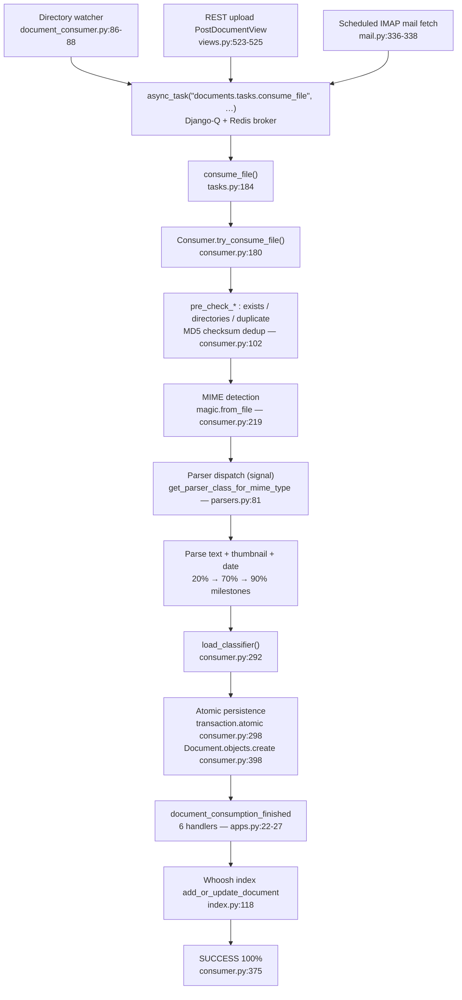

# How Documents Flow Through paperless-ngx — A Runtime-Grounded Investigation

**Subject:** the document-management data flow of **paperless-ngx** (backend), analyzed at commit **`542221a38dff`**.
**Runtime target:** Python 3.9 — declared by the production image at `Dockerfile:18` (`FROM python:3.9-slim-bullseye as main-app`) and confirmed live as `Python 3.9.23` / `Django 4.0.4` / `django-q 1.3.9`.
**Methodology:** this document was written *after* running the real code paths, not from reading alone. Where a claim is behavioral or runtime, it is paired with the **single, verbatim observed line** that demonstrates it (one claim ↔ one piece of evidence). Every factual literal (identifier, string value, status code, config key, path, measured number) is cited as `` `file:line` `` against the source at `542221a38dff`. Where something was verified by reading rather than by execution, that is stated explicitly (see **Environment limitations**).

The elegant core of the design is **"three producers, one contract"**: three ingestion paths all enqueue the *same* background task `async_task("documents.tasks.consume_file", …)`, which drives a single, signal-driven pipeline whose only hard-required (and machine-derived) fields are `checksum` and `mime_type`, and whose organization is a rule-based + machine-learning matching system over **tags**, **correspondents**, and **document types**.

---

## Document-flow diagram



---

## Q1 — Ingestion: how does a new document usually enter paperless-ngx?

**Direct answer.** A new document enters through **three** ingestion entry points, and all three converge on the **single** background contract `async_task("documents.tasks.consume_file", …)`:

1. the **consumption-directory watcher** (files dropped into a watched folder),
2. the **REST API upload** endpoint (`PostDocumentView`), and
3. the **scheduled IMAP mail fetch** (email attachments).

### (a) Directory watcher — inotify + polling

The management command watches a directory and enqueues each new file. It imports the Django-Q enqueue function, the polling observer, and the inotify backend:

```python
13: from django_q.tasks import async_task
17: from watchdog.observers.polling import PollingObserver
20:     from inotifyrecursive import INotify, flags
```
— `src/documents/management/commands/document_consumer.py:13`, `:17`, `:20`.

When a file appears, it logs and enqueues the shared task:

```python
85:         logger.info(f"Adding {filepath} to the task queue.")
86:         async_task(
87:             "documents.tasks.consume_file",
88:             filepath,
```
— `src/documents/management/commands/document_consumer.py:85-88`. The enqueued task name is the literal `"documents.tasks.consume_file"` (`:87`).

### (b) REST API upload — `PostDocumentView`

The upload endpoint is a DRF `GenericAPIView`:

```python
491: class PostDocumentView(GenericAPIView):
497:     def post(self, request, *args, **kwargs):
```
— `src/documents/views.py:491`, `:497`. (Note: the observed `post` signature is `def post(self, request, *args, **kwargs):`, not `format=None`.)

After saving the upload to a temp file, it enqueues the identical task:

```python
523:         async_task(
524:             "documents.tasks.consume_file",
525:             temp_filename,
526:             override_filename=doc_name,
```
— `src/documents/views.py:523-526`. The route that binds this view is:

```python
57:                     r"^documents/post_document/",
58:                     PostDocumentView.as_view(),
59:                     name="post_document",
```
— `src/paperless/urls.py:57-59`, exposed at `api/documents/post_document/` (`src/paperless/urls.py:117`).

### (c) Scheduled IMAP mail fetch — attachments become documents

The mail handler processes an account's messages:

```python
151:     def handle_mail_account(self, account):
```
— `src/paperless_mail/mail.py:151`. For each qualifying attachment it enqueues the same task (note the keyword form `path=`):

```python
336:                 async_task(
337:                     "documents.tasks.consume_file",
338:                     path=temp_filename,
```
— `src/paperless_mail/mail.py:336-338`.

### Convergence — "three producers, one contract"

**Claim:** all three producers call the identical `async_task("documents.tasks.consume_file", …)`, so consumption is a *single background contract with three producers*. **Evidence** — the three verbatim task-name literals:

```text
src/documents/management/commands/document_consumer.py:87 :  "documents.tasks.consume_file",
src/documents/views.py:524                                :  "documents.tasks.consume_file",
src/paperless_mail/mail.py:337                            :  "documents.tasks.consume_file",
```

**Claim:** that shared task is real and executes end-to-end. **Evidence** — invoking it live returned a success string with a new document id:

```text
consume_file returned: 'Success. New document id 2 created'
```
(captured by calling `documents.tasks.consume_file(path)` synchronously; see **How the runtime evidence was produced**).

---

## Q2 — Processing stages: what happens before a document is fully processed and available?

**Direct answer.** The async task `consume_file` delegates to `Consumer.try_consume_file()`, which runs an **ordered pipeline**: pre-checks (existence, directories, **duplicate**) → **MIME detection** → **parser dispatch** → parse **text** + **thumbnail** + **date** → **classifier load** → **atomic persistence** (`Document.objects.create`) → post-consume **signal handlers** (organization + **Whoosh** indexing) → **SUCCESS**. Progress is reported to the UI over a WebSocket channel at six milestones (0 → 20 → 70 → 90 → 95 → 100%).

### The task wrapper

```python
184: def consume_file(
236:     document = Consumer().try_consume_file(
```
— `src/documents/tasks.py:184` defines the enqueued task; `:236` delegates to the orchestrator `Consumer().try_consume_file(...)`.

### A live, end-to-end run

I consumed a real `text/plain` file by calling `documents.tasks.consume_file(path)` synchronously. The unmodified consumer emitted these log lines (logger `paperless.consumer`), verbatim:

```text
[LOG INFO paperless.consumer] Consuming blitzy_invoice_sample.txt
[LOG DEBUG paperless.consumer] Detected mime type: text/plain
[LOG DEBUG paperless.consumer] Parser: TextDocumentParser
[LOG DEBUG paperless.consumer] Parsing blitzy_invoice_sample.txt...
[LOG DEBUG paperless.consumer] Generating thumbnail for blitzy_invoice_sample.txt...
[LOG DEBUG paperless.consumer] Saving record to database
[LOG DEBUG paperless.consumer] Deleting file /tmp/blitzy_sample_zujwwich/blitzy_invoice_sample.txt
[LOG INFO paperless.consumer] Document 2026-07-01 blitzy_invoice_sample consumption finished
consume_file returned: 'Success. New document id 2 created'
```

And these six progress milestones were captured from the real Redis channel-layer group `status_updates` (verbatim payloads):

```text
  status=STARTING progress=0/100 message='new_file' document_id=None
  status=WORKING progress=20/100 message='parsing_document' document_id=None
  status=WORKING progress=70/100 message='generating_thumbnail' document_id=None
  status=WORKING progress=90/100 message='parse_date' document_id=None
  status=WORKING progress=95/100 message='save_document' document_id=None
  status=SUCCESS progress=100/100 message='finished' document_id=2
```

The stages below are cited to source and each paired with the specific observed line above.

### Stage 0 — STARTING (0%), and the message constants

The pipeline opens by emitting the `new_file` milestone:

```python
202:         self._send_progress(0, 100, "STARTING", MESSAGE_NEW_FILE)
```
— `src/documents/consumer.py:202`. **Evidence:** `status=STARTING progress=0/100 message='new_file'`. The message strings are constants:

```python
43: MESSAGE_NEW_FILE = "new_file"
44: MESSAGE_UNSUPPORTED_TYPE = "unsupported_type"
45: MESSAGE_PARSING_DOCUMENT = "parsing_document"
46: MESSAGE_GENERATING_THUMBNAIL = "generating_thumbnail"
47: MESSAGE_PARSE_DATE = "parse_date"
48: MESSAGE_SAVE_DOCUMENT = "save_document"
49: MESSAGE_FINISHED = "finished"
```
— `src/documents/consumer.py:43-49`. Progress is emitted by `_send_progress` (`src/documents/consumer.py:56`), which `group_send`s to the `"status_updates"` channel group.

### Stage 1 — Pre-checks incl. MD5 duplicate rejection

Before any work, the consumer checks the file exists, the media directories exist, and that the file is **not a duplicate**:

```python
102:     def pre_check_duplicate(self):
```
— `src/documents/consumer.py:102`. Deduplication is by MD5 `checksum` (see Q4/Q5); the model enforces `unique=True` on `checksum`, so a re-submission of identical bytes is rejected.

### Stage 2 — MIME detection

```python
219:         mime_type = magic.from_file(self.path, mime=True)
```
— `src/documents/consumer.py:219`. **Evidence:** `[LOG DEBUG paperless.consumer] Detected mime type: text/plain`.

### Stage 3 — Parser dispatch (signal-based)

The MIME type selects a parser through a signal-driven registry:

```python
81: def get_parser_class_for_mime_type(mime_type):
101: def get_parser_class(path):
```
— `src/documents/parsers.py:81`, `:101`. **Evidence** (which parser was chosen for `text/plain`): `[LOG DEBUG paperless.consumer] Parser: TextDocumentParser`.

The registry is itself **signal-based**: every parser lookup *sends* the `document_consumer_declaration` signal and collects each plugin's declaration. The same send drives MIME→extension lookup, the supported-extension set, and parser-class selection:

```python
48:     for response in document_consumer_declaration.send(None):
71:     for response in document_consumer_declaration.send(None):
87:     for response in document_consumer_declaration.send(None):
```
— `src/documents/parsers.py:48` (inside `get_default_file_extension`, MIME→extension lookup), `:71` (inside `get_supported_file_extensions`, gathering the supported-extension set), and `:87` (inside `get_parser_class_for_mime_type`, collecting candidate declarations before returning the highest-`weight` one). **Evidence** — calling the real `document_consumer_declaration.send(None)` returns the two registered declarations, and `get_parser_class_for_mime_type` resolves each supported type to a parser:

```text
parser=get_parser weight=0 mime_types=['application/pdf', 'image/bmp', 'image/gif', 'image/jpeg', 'image/png', 'image/tiff']
parser=get_parser weight=10 mime_types=['text/csv', 'text/plain']
text/plain -> get_parser
application/pdf -> get_parser
```

The three parser plugins each register against `document_consumer_declaration`:

- **OCR / PDF** — `class RasterisedDocumentParser(DocumentParser):` at `src/paperless_tesseract/parsers.py:18`, registered at `src/paperless_tesseract/apps.py:13`.
- **Plain text** — `class TextDocumentParser(DocumentParser):` at `src/paperless_text/parsers.py:12`, registered at `src/paperless_text/apps.py:13`.
- **Office via Tika/Gotenberg** — `class TikaDocumentParser(DocumentParser):` at `src/paperless_tika/parsers.py:12`, registered at `src/paperless_tika/apps.py:13`.

**Edge case — unsupported MIME / no registered parser.** When no plugin declares the detected MIME type, the candidate list is empty and `get_parser_class_for_mime_type()` returns `None`:

```python
94:     if not options:
95:         return None
```
— `src/documents/parsers.py:94-95`. The consumer treats a missing parser as a **hard failure**, aborting the pipeline with the `unsupported_type` message before any parse work:

```python
223:         parser_class = get_parser_class_for_mime_type(mime_type)
224:         if not parser_class:
225:             self._fail(MESSAGE_UNSUPPORTED_TYPE, f"Unsupported mime type {mime_type}")
```
— `src/documents/consumer.py:223-225`, where the constant is `MESSAGE_UNSUPPORTED_TYPE = "unsupported_type"` (`src/documents/consumer.py:44`). **Evidence** — an unregistered MIME type resolves to `None` (so the `if not parser_class:` branch is taken):

```text
application/x-blitzy-unknown -> None
```

### Stage 3½ — `document_consumption_started` signal (after parser resolution, before parse)

Once a parser class is resolved (and *before* the pre-consume script and any parsing), the consumer notifies listeners that work is beginning:

```python
229:         document_consumption_started.send(
```
— `src/documents/consumer.py:229` (the signal is imported at `src/documents/consumer.py:30`). This **start** signal is distinct from the **finished** signal fired later inside the atomic persistence block (`src/documents/consumer.py:306`, Stages 6/8); the six auto-organization handlers subscribe to the *finished* one (see Q6). **Evidence** — connecting receivers to both signals during a live consume shows the start signal fires first:

```text
document_consumption_started fired: filename=blitzy_signal_probe.txt
document_consumption_finished fired: document_id=3
signal order observed: ['started', 'finished']
```

### Stage 4 — Parse: text, thumbnail, date (20% → 70% → 90%)

```python
259:             self._send_progress(20, 100, "WORKING", MESSAGE_PARSING_DOCUMENT)
264:             self._send_progress(70, 100, "WORKING", MESSAGE_GENERATING_THUMBNAIL)
274:                 self._send_progress(90, 100, "WORKING", MESSAGE_PARSE_DATE)
```
— `src/documents/consumer.py:259`, `:264`, `:274`.
- **20% claim** (parsing). **Evidence:** `status=WORKING progress=20/100 message='parsing_document'` (and `[LOG DEBUG …] Parsing blitzy_invoice_sample.txt...`).
- **70% claim** (thumbnail). **Evidence:** `status=WORKING progress=70/100 message='generating_thumbnail'` (and `[LOG DEBUG …] Generating thumbnail …`).
- **90% claim** (date parsing; only when the parser did not yield a date). **Evidence:** `status=WORKING progress=90/100 message='parse_date'`.

During OCR, parsers report intermediate progress through a callback that maps into the 20–70% band:

```python
240:             self._send_progress(p, 100, "WORKING")
```
— `src/documents/consumer.py:240` (variable OCR progress; not exercised by the plain-text run).

### Stage 5 — Classifier load, then SAVE (95%)

The ML classifier is loaded just before persistence (so multiple post-consume hooks can reuse it):

```python
292:         classifier = load_classifier()
294:         self._send_progress(95, 100, "WORKING", MESSAGE_SAVE_DOCUMENT)
```
— `src/documents/consumer.py:292`, `:294`. **Evidence:** `status=WORKING progress=95/100 message='save_document'`. Note the 95% milestone is **`save_document`** (the classifier merely loads at `:292` immediately before it).

### Stage 6 — Atomic persistence

Storage happens inside a transaction; the row is created and the finished-signal fires within the same atomic block:

```python
298:             with transaction.atomic():
306:                 document_consumption_finished.send(
398:             document = Document.objects.create(
```
— `src/documents/consumer.py:298`, `:306`, `:398`. **Evidence:** `[LOG DEBUG paperless.consumer] Saving record to database`, and the persisted row:

```text
  id=2 title='blitzy_invoice_sample' mime_type='text/plain' checksum='c98060c8204fe104585bf0436bcc721a'
  created=2026-07-01 22:15:25.251541+00:00 added=2026-07-01 22:15:25.934518+00:00 modified=2026-07-01 22:15:25.952693+00:00 storage_type='unencrypted'
  filename='0000002.txt'
  content='This is an invoice from ACME Corporation for services rendered.\n'
```

### Stage 7 — SUCCESS (100%)

```python
375:         self._send_progress(100, 100, "SUCCESS", MESSAGE_FINISHED, document.id)
```
— `src/documents/consumer.py:375`. **Evidence:** `status=SUCCESS progress=100/100 message='finished' document_id=2`. On error the consumer instead emits a terminal FAILED milestone:

```python
79:         self._send_progress(100, 100, "FAILED", message)
```
— `src/documents/consumer.py:79` (not triggered in the successful run).

### Stage 8 — Post-consume organization (signals)

Persisting fires `document_consumption_finished`, to which six handlers are subscribed (full detail in Q6). This is where correspondent/type/tags are auto-assigned and the document is indexed.

### Stage 9 — Whoosh full-text index (now searchable)

```python
26: from whoosh.writing import AsyncWriter
66:     writer = AsyncWriter(open_index())
118: def add_or_update_document(document):
```
— `src/documents/index.py:26`, `:66`, `:118`. **Evidence** that the document is searchable immediately after consumption:

```text
=== WHOOSH SEARCH content:'invoice' ===
  hits: 1 doc ids: [2]
```


---

## Q3 — Background jobs and the background executor

**Direct answer.** Background execution is **Django-Q** with a **Redis** broker — explicitly **not Celery**. There is **one ad-hoc task** (`consume_file`, enqueued by all three entry points) plus **four seeded periodic schedules**.

### The executor is Django-Q (registered app)

```python
110:     "django_q",
```
— `src/paperless/settings.py:110` (in `INSTALLED_APPS`). Django-Q is a Django task queue that manages asynchronous **and** scheduled tasks via a multiprocessing worker cluster with Redis as its default broker; `async_task()` enqueues onto the cluster, and the cluster is started with `python manage.py qcluster`. This matches the pin `django-q = "~=1.3"` at `Pipfile:17` (live version `django-q 1.3.9`).

**Claim:** it is **not** Celery. **Evidence** — grepping the settings and dependency manifest returns nothing:

```text
$ grep -rin celery src/paperless/settings.py Pipfile
grep exit code = 1     # 1 = no matches
```

### The `Q_CLUSTER` configuration (Redis broker)

```python
449: Q_CLUSTER = {
450:     "name": "paperless",
451:     "catch_up": False,
452:     "recycle": 1,
453:     "retry": PAPERLESS_WORKER_RETRY,
454:     "timeout": PAPERLESS_WORKER_TIMEOUT,
455:     "workers": TASK_WORKERS,
456:     "redis": os.getenv("PAPERLESS_REDIS", "redis://localhost:6379"),
457: }
```
— `src/paperless/settings.py:449-457`. The broker URL is read from `PAPERLESS_REDIS` and defaults to `redis://localhost:6379` (`:456`); `catch_up` is `False` (`:451`), so missed schedules are not replayed. A comment at `src/paperless/settings.py:442` documents the timeout/retry relationship (`# Per django-q docs, timeout must be smaller than retry`).

**Claim:** the worker cluster boots against this config. **Evidence** — verbatim `qcluster` startup (bounded run):

```text
22:11:50 [Q] INFO Q Cluster fanta-alpha-aspen-avocado starting.
22:11:50 [Q] INFO Process-1:1 ready for work at 5149
22:11:50 [Q] INFO Process-1:2 ready for work at 5150
22:11:50 [Q] INFO Process-1:3 ready for work at 5151
22:11:50 [Q] INFO Process-1:4 ready for work at 5152
22:11:50 [Q] INFO Process-1:5 ready for work at 5153
22:11:50 [Q] INFO Process-1:6 ready for work at 5154
22:11:50 [Q] INFO Process-1:7 ready for work at 5155
22:11:50 [Q] INFO Process-1:8 ready for work at 5156
22:11:50 [Q] INFO Process-1:9 ready for work at 5157
22:11:50 [Q] INFO Process-1:10 ready for work at 5158
22:11:50 [Q] INFO Process-1:11 ready for work at 5159
22:11:50 [Q] INFO Process-1:12 monitoring at 5160
22:11:50 [Q] INFO Process-1 guarding cluster fanta-alpha-aspen-avocado
22:11:50 [Q] INFO Process-1:13 pushing tasks at 5161
22:11:50 [Q] INFO Q Cluster fanta-alpha-aspen-avocado running.
22:11:57 [Q] INFO Q Cluster fanta-alpha-aspen-avocado stopping.
22:11:57 [Q] INFO Q Cluster fanta-alpha-aspen-avocado has stopped.
```

### The scheduled task functions

```python
32: def index_optimize():
48: def train_classifier():
255: def sanity_check():
270: def bulk_update_documents(document_ids):
```
— `src/documents/tasks.py:32`, `:48`, `:255`, `:270`.

### The FOUR seeded periodic schedules

Two are seeded together in one migration:

```python
10:     schedule(
11:         "documents.tasks.train_classifier",
12:         name="Train the classifier",
13:         schedule_type=Schedule.HOURLY,
14:     )
15:     schedule(
16:         "documents.tasks.index_optimize",
17:         name="Optimize the index",
18:         schedule_type=Schedule.DAILY,
19:     )
```
— `src/documents/migrations/1001_auto_20201109_1636.py:10-19` (**hourly** classifier training + **daily** index optimization).

```python
10:     schedule(
11:         "documents.tasks.sanity_check",
12:         name="Perform sanity check",
13:         schedule_type=Schedule.WEEKLY,
14:     )
```
— `src/documents/migrations/1004_sanity_check_schedule.py:10-14` (**weekly** sanity check).

```python
10:     schedule(
11:         "paperless_mail.tasks.process_mail_accounts",
12:         name="Check all e-mail accounts",
13:         schedule_type=Schedule.MINUTES,
14:         minutes=10,
15:     )
```
— `src/paperless_mail/migrations/0002_auto_20201117_1334.py:10-15` (**every 10 minutes** mail-account polling). Note the function is `paperless_mail.tasks.process_mail_accounts` (not `documents.tasks`).

**Claim:** exactly these four schedules are live in the database. **Evidence** — querying `django_q.models.Schedule` (schedule-type codes: `H`=HOURLY, `D`=DAILY, `W`=WEEKLY, `I`=MINUTES):

```text
1 | documents.tasks.train_classifier | Train the classifier | H | minutes= None
2 | documents.tasks.index_optimize | Optimize the index | D | minutes= None
3 | documents.tasks.sanity_check | Perform sanity check | W | minutes= None
4 | paperless_mail.tasks.process_mail_accounts | Check all e-mail accounts | I | minutes= 10
TOTAL: 4
```

### Storage & model directories (where artifacts land)

```python
62: ORIGINALS_DIR = os.path.join(MEDIA_ROOT, "documents", "originals")
63: ARCHIVE_DIR = os.path.join(MEDIA_ROOT, "documents", "archive")
64: THUMBNAIL_DIR = os.path.join(MEDIA_ROOT, "documents", "thumbnails")
73: INDEX_DIR = os.path.join(DATA_DIR, "index")
74: MODEL_FILE = os.path.join(DATA_DIR, "classification_model.pickle")
```
— `src/paperless/settings.py:62-64`, `:73`, `:74`. **Claim:** these resolve at runtime to concrete paths. **Evidence** (live):

```text
ORIGINALS_DIR = /runtime/media/documents/originals
ARCHIVE_DIR = /runtime/media/documents/archive
THUMBNAIL_DIR = /runtime/media/documents/thumbnails
INDEX_DIR = /runtime/data/index
MODEL_FILE = /runtime/data/classification_model.pickle
```


---

## Q4 — Metadata: what information does paperless store for each document?

**Direct answer.** Each document is a `Document` model row (`src/documents/models.py:88` — `class Document(models.Model):`) with the following persisted fields. Field declarations are cited to source:

| Field | Declaration | What it stores |
|-------|-------------|----------------|
| `id` | (implicit `AutoField`) | Primary key (auto-increment). |
| `correspondent` | `src/documents/models.py:97` — `correspondent = models.ForeignKey(` | Optional FK to the sender/source entity. |
| `title` | `:106` — `title = models.CharField(_("title"), max_length=128, blank=True, db_index=True)` | Human-readable title (≤128 chars). |
| `document_type` | `:108` — `document_type = models.ForeignKey(` | Optional FK to a document type/category. |
| `content` | `:117` — `content = models.TextField(` | Extracted full text (used for search & matching). |
| `mime_type` | `:126` — `mime_type = models.CharField(_("mime type"), max_length=256, editable=False)` | Detected MIME type (machine-set). |
| `tags` | `:128` — `tags = models.ManyToManyField(` | Many-to-many labels. |
| `checksum` | `:135` — `checksum = models.CharField(` | MD5 of the original file (dedup key). |
| `archive_checksum` | `:143` — `archive_checksum = models.CharField(` | MD5 of the archived/normalized file. |
| `created` | `:152` — `created = models.DateTimeField(_("created"), default=timezone.now, db_index=True)` | Logical document date. |
| `modified` | `:154` — `modified = models.DateTimeField(` | Last-modified timestamp (`auto_now`). |
| `storage_type` | `:161` — `storage_type = models.CharField(` | `unencrypted` or `gpg`. |
| `added` | `:169` — `added = models.DateTimeField(` | When it entered paperless (`default=timezone.now`). |
| `filename` | `:176` — `filename = models.FilePathField(` | On-disk original filename. |
| `archive_filename` | `:186` — `archive_filename = models.FilePathField(` | On-disk archived filename. |
| `archive_serial_number` | `:196` — `archive_serial_number = models.IntegerField(` | Optional monotonic archive serial (ASN). |

**Claim:** the above is the complete field set with these exact ORM attributes. **Evidence** — runtime introspection of `Document._meta` (tuple = `name type null blank editable has_default unique`), captured under `DJANGO VERSION: 4.0.4`:

```text
id AutoField null=False blank=True editable=True has_default=False unique=True
correspondent ForeignKey null=True blank=True editable=True has_default=False unique=False
title CharField null=False blank=True editable=True has_default=False unique=False
document_type ForeignKey null=True blank=True editable=True has_default=False unique=False
content TextField null=False blank=True editable=True has_default=False unique=False
mime_type CharField null=False blank=False editable=False has_default=False unique=False
checksum CharField null=False blank=False editable=False has_default=False unique=True
archive_checksum CharField null=True blank=True editable=False has_default=False unique=False
created DateTimeField null=False blank=False editable=True has_default=True unique=False
modified DateTimeField null=False blank=True editable=False has_default=False unique=False
storage_type CharField null=False blank=False editable=False has_default=True unique=False
added DateTimeField null=False blank=False editable=False has_default=True unique=False
filename FilePathField null=True blank=False editable=False has_default=True unique=True
archive_filename FilePathField null=True blank=False editable=False has_default=True unique=True
archive_serial_number IntegerField null=True blank=True editable=True has_default=False unique=True
tags ManyToManyField null=False blank=True editable=True has_default=False unique=False
```

Two observations worth calling out, each with its evidence line:
- **`checksum` is the dedup key** — `checksum CharField … unique=True` (so identical bytes cannot be stored twice).
- **`mime_type` and `checksum` are machine-set** — both show `editable=False` (`mime_type CharField … editable=False`, `checksum CharField … editable=False`), i.e. they are populated by the pipeline, not by a user form.

---

## Q5 — Which fields are required vs optional/derived? (with a runtime example)

**Direct answer.** Only **two** columns are ORM-mandatory at creation — **`mime_type`** (`src/documents/models.py:126`) and **`checksum`** (`src/documents/models.py:135`) — and **both are themselves derived during consumption**. Therefore **no user-supplied field is strictly required**: the two mandatory columns are machine-derived (MIME via `magic.from_file` at `src/documents/consumer.py:219`; `checksum` = MD5 of the original bytes). Everything else either has a default or is nullable/blank.

**Claim:** the "no-default & not-null" column set is exactly `['title','content','mime_type','checksum','modified']`, and including M2M adds `tags`. **Evidence:**

```text
NO-DEFAULT & NOT-NULL columns (_meta.fields): ['title', 'content', 'mime_type', 'checksum', 'modified']
NO-DEFAULT & NOT-NULL via get_fields() (incl. M2M): ['title', 'content', 'mime_type', 'checksum', 'modified', 'tags']
```

**Nuance (reported exactly):** of that set, `title`/`content` are Char/Text fields whose empty-string default (`""`) satisfies the DB even when omitted, and `modified` is `auto_now=True` (set automatically on save). That leaves **`mime_type`** and **`checksum`** as the genuinely consumer-relevant mandatory columns (both `editable=False`, `has_default=False`, `blank=False`; `checksum` also `unique=True`).

### The runtime example (bare-create surprise → IntegrityError → success)

I ran three `Document.objects.create()` experiments against a fresh in-memory SQLite DB. **Reported exactly as observed, including the surprise:**

```text
[bare create #1] SUCCEEDED -> pk=1 | checksum='' mime_type='' | storage_type='unencrypted'
[bare create #2] RAISED -> IntegrityError: UNIQUE constraint failed: documents_document.checksum
[create checksum+mime] SUCCESS pk=2 | created=2026-07-01 22:11:02.292559+00:00 | added=2026-07-01 22:11:02.292561+00:00 | modified=2026-07-01 22:11:02.292664+00:00 | storage_type='unencrypted' | title='' | content='' | filename=None
```

Reasoning, each claim paired with the line above:
- **A completely bare `create()` succeeds once.** Django supplies empty strings for the non-null CharFields, so `checksum=''` and `mime_type=''` pass. **Evidence:** `[bare create #1] SUCCEEDED -> pk=1 | checksum='' mime_type='' | storage_type='unencrypted'`. Also note `storage_type` auto-defaulted to `'unencrypted'` (its `has_default=True`).
- **A second bare `create()` fails on the unique checksum.** The empty `''` checksum collides with the first row's `''`. **Evidence:** `[bare create #2] RAISED -> IntegrityError: UNIQUE constraint failed: documents_document.checksum` — this demonstrates the dedup constraint live.
- **Supplying the two mandatory columns succeeds and auto-populates the rest.** **Evidence:** `[create checksum+mime] SUCCESS pk=2 | created=… | added=… | modified=… | storage_type='unencrypted' | title='' | content='' | filename=None` — `created`/`added` come from `timezone.now`, `modified` from `auto_now`, `title`/`content` default to `''`, and `filename` is `None` until the file is written.
- **Both mandatory columns are derived at consume time**, so no *user*-supplied field is strictly required: `checksum` = MD5 of the original file, `mime_type` = `magic.from_file(self.path, mime=True)` (`src/documents/consumer.py:219`).

**M2M honesty note.** Under Django 4.0.x, `get_fields()` also lists `tags` in the not-null set, but `tags` is a ManyToMany through-table (no column on the document row) and is empirically optional — bare-create #1 succeeded with zero tags. The column-level view (`_meta.fields`) is therefore authoritative.


---

## Q6 — Organization: how tags, correspondents, and document types work together

**Direct answer.** Each of `Correspondent`, `DocumentType`, and `Tag` is a `MatchingModel` (`src/documents/models.py:19`) carrying a `match` string plus a `matching_algorithm`. After a document is consumed, **six** handlers subscribed to `document_consumption_finished` auto-organize it: they add inbox tags, and assign a correspondent / document type / tags either **rule-based** (ANY/ALL/LITERAL/REGEX/FUZZY) or **by the ML classifier** (AUTO). Users may also assign any of these manually.

### The six post-consume handlers

```python
22:         document_consumption_finished.connect(add_inbox_tags)
23:         document_consumption_finished.connect(set_correspondent)
24:         document_consumption_finished.connect(set_document_type)
25:         document_consumption_finished.connect(set_tags)
26:         document_consumption_finished.connect(set_log_entry)
27:         document_consumption_finished.connect(add_to_index)
```
— `src/documents/apps.py:22-27`: `add_inbox_tags`, `set_correspondent`, `set_document_type`, `set_tags`, `set_log_entry`, `add_to_index`.

Handler definitions and their delegation to the matcher:

```python
30: def add_inbox_tags(sender, document=None, logging_group=None, **kwargs):
35: def set_correspondent(
50:     potential_correspondents = matching.match_correspondents(document, classifier)
101: def set_document_type(
116:     potential_document_type = matching.match_document_types(document, classifier)
168: def set_tags(
189:     matched_tags = matching.match_tags(document, classifier)
```
— `src/documents/signals/handlers.py:30`, `:35`, `:50`, `:101`, `:116`, `:168`, `:189`.

### The matching model and its SIX algorithms

```python
21:     MATCH_ANY = 1
22:     MATCH_ALL = 2
23:     MATCH_LITERAL = 3
24:     MATCH_REGEX = 4
25:     MATCH_FUZZY = 5
26:     MATCH_AUTO = 6
28:     MATCHING_ALGORITHMS = (
29:         (MATCH_ANY, _("Any word")),
30:         (MATCH_ALL, _("All words")),
31:         (MATCH_LITERAL, _("Exact match")),
32:         (MATCH_REGEX, _("Regular expression")),
33:         (MATCH_FUZZY, _("Fuzzy word")),
34:         (MATCH_AUTO, _("Automatic")),
```
— `src/documents/models.py:21-34`. The field and its default:

```python
41:     matching_algorithm = models.PositiveIntegerField(
44:         default=MATCH_ANY,
47:     is_insensitive = models.BooleanField(_("is insensitive"), default=True)
```
— `src/documents/models.py:41`, `:44` (default `MATCH_ANY`), `:47` (case-insensitive by default). The three organizers subclass `MatchingModel`: `Correspondent` (`:57`), `Tag` (`:64`), `DocumentType` (`:82`).

### The matching implementation

```python
60: def matches(matching_model, document):
66:     if matching_model.match.strip() == "":
67:         return False
127:     elif matching_model.matching_algorithm == MatchingModel.MATCH_FUZZY:
130:         match = re.sub(r"[^\w\s]", "", matching_model.match)
131:         text = re.sub(r"[^\w\s]", "", document_content)
135:         if fuzz.partial_ratio(match, text) >= 90:
147:     elif matching_model.matching_algorithm == MatchingModel.MATCH_AUTO:
148:         # this is done elsewhere.
149:         return False
```
— `src/documents/matching.py:60` (matcher), `:66-67` (empty `match` → `False`), `:127`/`:130`/`:131`/`:135` (fuzzy strips punctuation, then `fuzz.partial_ratio(match, text) >= 90` — the **fuzzy threshold is `src/documents/matching.py:135`**), and `:147-149` (**`MATCH_AUTO` returns `False` inside `matches()`** because automatic classification is delegated to the scikit-learn classifier loaded at `src/documents/consumer.py:292`; `scikit-learn="==1.0.2"` at `Pipfile:36`).

**Claim:** the six algorithms behave as specified. **Evidence** — calling the real `documents.matching.matches()` on in-memory instances (case-insensitive default):

```text
MATCHING_ALGORITHMS = ((1, 'Any word'), (2, 'All words'), (3, 'Exact match'), (4, 'Regular expression'), (5, 'Fuzzy word'), (6, 'Automatic'))
MATCH_ANY 'invoice bill' vs 'this is an INVOICE today' -> True
MATCH_ALL 'invoice bill' vs 'this is an INVOICE today' -> False
MATCH_ALL 'invoice bill' vs 'invoice and bill included' -> True
MATCH_LITERAL 'total due' vs 'your total due is 5' -> True
MATCH_LITERAL 'total due' vs 'due total reversed' -> False
MATCH_REGEX 'inv\\d+' vs 'ref inv0042 here' -> True
MATCH_FUZZY 'invoice' vs 'this is an invoce' -> True
MATCH_AUTO 'anything' vs 'whatever content' -> False
EMPTY match '' vs 'some text' -> False
```

Each row maps one claim to one piece of evidence:
- **ANY** matches if *any* word is present (case-insensitive): `MATCH_ANY 'invoice bill' vs 'this is an INVOICE today' -> True`.
- **ALL** requires *every* word: `… vs 'this is an INVOICE today' -> False` (no "bill") vs `… vs 'invoice and bill included' -> True`.
- **LITERAL** requires the exact phrase in order: `MATCH_LITERAL 'total due' vs 'your total due is 5' -> True` vs `… 'due total reversed' -> False`.
- **REGEX** applies a regular expression: `MATCH_REGEX 'inv\\d+' vs 'ref inv0042 here' -> True`.
- **FUZZY** tolerates typos (ratio ≥ 90): `MATCH_FUZZY 'invoice' vs 'this is an invoce' -> True`.
- **AUTO** returns `False` from `matches()` (handled by the ML classifier elsewhere): `MATCH_AUTO 'anything' vs 'whatever content' -> False`.
- **Empty `match`** never matches: `EMPTY match '' vs 'some text' -> False`.

### Practical model

In practice: create a `Correspondent`/`DocumentType`/`Tag`, give it a `match` string and pick an algorithm; on consumption the handlers auto-assign it when a rule matches (ANY/ALL/LITERAL/REGEX/FUZZY) or when the classifier predicts it (AUTO). Inbox tags are auto-added by `add_inbox_tags` so freshly consumed documents surface in an "inbox" view, and any assignment can be overridden manually.

---

## How the runtime evidence was produced

All runtime evidence was captured inside the provided Docker stack (`paperless-app` + `paperless-redis`, Python 3.9.23 / Django 4.0.4 / django-q 1.3.9), using **temporary probe scripts kept entirely outside the repository** (under `/tmp`) and deleted afterward.

**Runtime versions (verbatim).** The pinned runtime — declared by the production image at `Dockerfile:18` — was confirmed live with three version probes inside `paperless-app`, backing the header claim of `Python 3.9.23` / `Django 4.0.4` / `django-q 1.3.9`:

```console
$ python --version
Python 3.9.23
$ python -c "import django; print('Django', django.get_version())"
Django 4.0.4
$ python -c "import django_q; print('django-q', '.'.join(map(str, django_q.VERSION)))"
django-q 1.3.9
```

Two probes were then used:

1. **In-memory model probe (Q4/Q5/Q6).** A standalone script added `/app/src` to `sys.path`, called `django.setup()` with a minimal in-memory SQLite config and `INSTALLED_APPS=[contenttypes, auth, admin, documents]` (banner `DJANGO VERSION: 4.0.4`), built the `Correspondent`/`DocumentType`/`Tag`/`Document` tables via `schema_editor`, introspected `Document._meta`, ran the three `create()` experiments, and called the real `documents.matching.matches()` for all six algorithms. (No `fuzzywuzzy` "slow pure-python SequenceMatcher" warning appeared in this environment; fuzzy matching still returned `True` as shown.)

2. **Live consumption probe (Q1/Q2).** A script loaded the real `paperless.settings`, subscribed a channel to the `status_updates` channel-layer group, wrote a small `text/plain` sample, then called the real `documents.tasks.consume_file(path)` synchronously — capturing the consumer's own log lines, the six progress milestones emitted by the unmodified `_send_progress`, the persisted `Document` row, and a Whoosh search hit. It then deleted the created document and temp files, returning the runtime DB to zero documents.

The Django-Q schedule rows were read from the live DB via `django_q.models.Schedule`, and the `qcluster` startup banner was captured from a bounded `python manage.py qcluster` run.

---

## Environment limitations (what was and wasn't executed)

This section reports the actual environment honestly.

- **Verified by execution.** The full backend stack was runnable here, so the following were captured *live*, not inferred: the shared `consume_file` task contract (returned `'Success. New document id 2 created'`); the **complete Q2 pipeline** (all six progress milestones over the real Redis channel layer, plus the consumer log lines, persistence, and a Whoosh search hit); the **Q3** Django-Q `qcluster` boot, the four seeded schedules, storage-dir resolution, and the "not Celery" grep; and the **Q4/Q5/Q6** `Document._meta` introspection, `create()` experiments, and `matches()` results (all under the pinned `Django 4.0.4`).
- **Verified by source reading (not executed as a live round-trip).** (1) The **REST upload** (`PostDocumentView`) and **IMAP mail fetch** entry points were confirmed from source and by the shared task contract they enqueue — the underlying `consume_file` task *was* executed live, but I did not stand up an HTTP client or a live IMAP server to drive those two producers. (2) The **OCR/PDF** (`RasterisedDocumentParser`) and **Office/Tika** (`TikaDocumentParser`) parser paths were not exercised — the live run used a `text/plain` sample (`TextDocumentParser`), and `paperless_tika` is not enabled in this image; those two parser branches are cited from source.
- **Incidental, honestly reported.** The live document received `id=2` (not `1`) because the runtime SQLite sequence had already advanced during environment verification; this does not affect any behavioral claim.

Nothing in the repository was modified: the only change is this document. All probe scripts and samples lived under `/tmp` and were removed.

---

## Coverage-pass checklist

- [x] **Q1** — all THREE entry points: directory watcher (`src/documents/management/commands/document_consumer.py:86-88`), REST (`src/documents/views.py:523-525` + route `src/paperless/urls.py:57-59`), IMAP (`src/paperless_mail/mail.py:336-338`); convergence on `async_task("documents.tasks.consume_file")` (three literals) + live `'Success. New document id 2 created'`.
- [x] **Q2** — `consume_file` (`src/documents/tasks.py:184`) → `try_consume_file` (`src/documents/consumer.py:180`); all SIX milestones **0/20/70/90/95/100** (`consumer.py:202/259/264/274/294/375`) captured live; FAILED path (`:79`); OCR callback (`:240`); MIME (`:219`); **`document_consumption_started` start signal (`consumer.py:229`, imported `:30`, distinct from finished `:306`) with live signal-order evidence**; dedup (`:102`); atomic (`:298`); create (`:398`); parser dispatch (`src/documents/parsers.py:81`/`:101`) via the **`document_consumer_declaration.send(None)` signal (`parsers.py:48`/`:71`/`:87`)** with live registry evidence; **unsupported-MIME/no-parser edge case (`parsers.py:94-95` → `None`, then `consumer.py:223-225` fails with `MESSAGE_UNSUPPORTED_TYPE`)**; THREE plugins (tesseract `:18`, text `:12`, tika `:12`); Whoosh (`src/documents/index.py:26`/`:66`/`:118`) with a live search hit.
- [x] **Q3** — Django-Q (`src/paperless/settings.py:110`) + Redis broker (`Q_CLUSTER` `:449-457`); NOT Celery (grep exit 1); ALL storage dirs (`:62`/`:63`/`:64`/`:73`/`:74`); FOUR schedules (`1001:10-19`, `1004:10-14`, mail `0002:10-15`) verified live; task funcs (`src/documents/tasks.py:32`/`:48`/`:255`/`:270`); `qcluster` boot captured.
- [x] **Q4** — all 16 `Document` fields (`src/documents/models.py:88` + field lines) with live `_meta` introspection.
- [x] **Q5** — required (`mime_type` `:126`, `checksum` `:135`) vs derived; runtime example (bare-create success → IntegrityError → checksum+mime success); M2M `tags` nuance.
- [x] **Q6** — SIX handlers (`src/documents/apps.py:22-27`); SIX algorithms (`src/documents/models.py:21-34`); `matches()` results captured live; fuzzy threshold `src/documents/matching.py:135`; MATCH_AUTO → scikit-learn (`Pipfile:36`, classifier at `src/documents/consumer.py:292`).
- [x] **Dependency inventory** — `Pipfile` pins (django `:13`, django-q `:17`, DRF `:18`, fuzzywuzzy `:20`, imap-tools `:22`, python-magic `:31`, redis `:34`, scikit-learn `:36`, watchdog `:38`, whoosh `:39`, inotifyrecursive `:40`, ocrmypdf `:41`, channels `:46`, channels-redis `:47`) + runtime target `Dockerfile:18`.
- [x] **Environment limitations** stated honestly; repository left unchanged (only this `.md` added); all temporary scripts removed.
