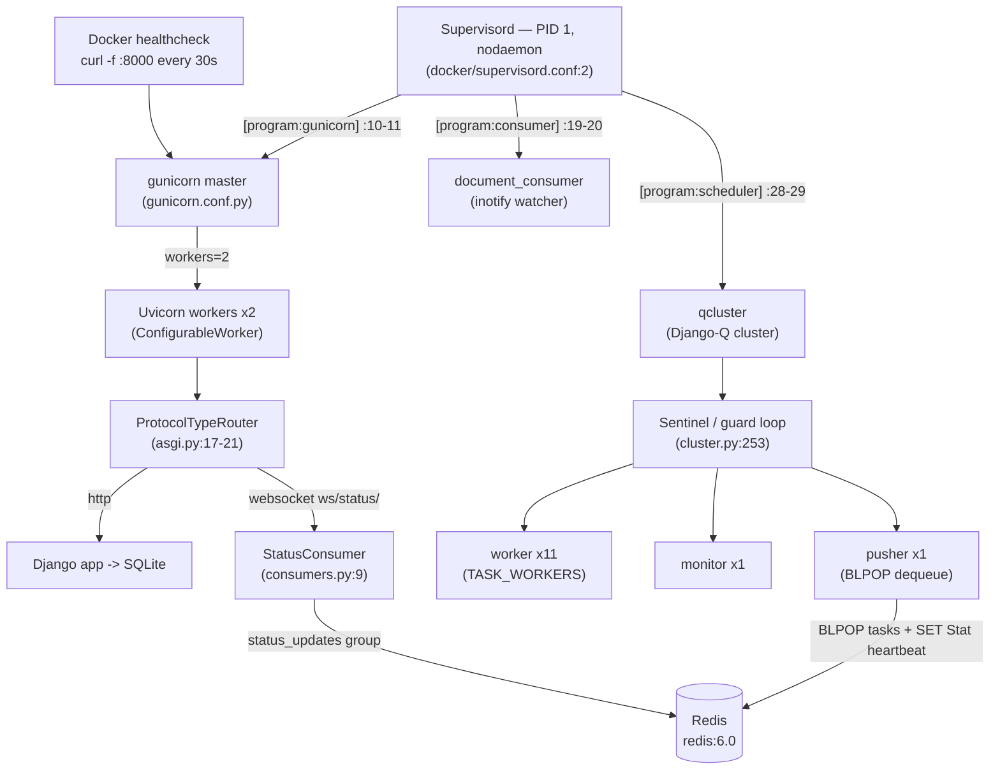

# Paperless-ngx Runtime-Behavior Investigation — Idle Processing, Health/Ready Signals, Recovery, and Always-On Components

**Repository:** paperless-ngx / paperless-ngx
**Version under test:** v1.7.0 — `src/paperless/version.py:1` → `__version__ = (1, 7, 0)`
**Commit:** `542221a38dff06361e07976452f9aea24d210542` (branch `paperless-ngx_542221a38dff`)
**Runtime backbone:** Django 4.0.4 + **Django-Q 1.3.9** (NOT Celery) + Channels 3.0.4, served by gunicorn 20.1.0 with a Uvicorn ASGI worker, backed by Redis and SQLite.

> **Methodology (run-first).** Every factual claim below was produced by **actually running** Paperless-ngx at this commit and **capturing real, unedited output**, then grounding the claim in a `file:line` source reference. Commands and their raw output are shown inline and collected in the [Appendix](#appendix--commands-durations-and-raw-captures). Temporary observation scripts were created under `/tmp` and removed afterward; the source tree was treated as strictly read-only.

> **⚠️ Two headline findings that correct a naive source-only reading.** Running the system revealed two behaviors that differ from what a code-only reading (or the task's initial expectation) would predict. Both are documented with evidence where they arise, and summarized here so they are not buried:
>
> 1. **Django-Q's INFO banner/status lines ARE visible** in the canonical run — they are **not** suppressed. Django-Q self-configures its own `django-q` logger (own `StreamHandler`, `level=INFO`, `propagate=False`) at import time, **bypassing** Django's `LOGGING` dict. See [Q2 §The logging model](#the-logging-model-what-is-visible-vs-what-is-not).
> 2. **The 30-second Docker healthcheck produces NO HTTP access line** in the application logs — it is silent. `uvicorn.access`/`gunicorn.access` resolve to an effective level of `WARNING` with no handlers, so their INFO access records are dropped. The healthcheck cadence is evidenced only by Docker's own `State.Health.Log`. See [Q2 §Cadence 1](#cadence-1--the-docker-healthcheck-every-30s-silent-in-app-logs).

---

## Terminology

| Term | Meaning in this document |
|------|--------------------------|
| **Supervisord** | The process control system that runs as the container's **PID 1** in foreground (`nodaemon`) and supervises the three long-running programs. `docker/supervisord.conf:2` sets `nodaemon=true`. |
| **gunicorn / ASGI** | `gunicorn` is the web-server process manager; it serves the **ASGI** application `paperless.asgi:application`. Configured by `gunicorn.conf.py`. |
| **Uvicorn worker (`ConfigurableWorker`)** | The gunicorn worker class that actually speaks ASGI/HTTP/WebSocket. `paperless.workers.ConfigurableWorker` extends `uvicorn.workers.UvicornWorker` (`src/paperless/workers.py:4,9`). |
| **Django-Q** | The task queue / scheduler library (v1.3.9). The `qcluster` management command launches a **cluster** of processes that run scheduled and ad-hoc background tasks. |
| **Sentinel / guard** | The Django-Q supervisor process. Its `guard()` loop (`django_q/cluster.py:253`) health-checks the pool and **reincarnates** dead members via `reincarnate()` (`django_q/cluster.py:211`); it also saves a `Stat` heartbeat to Redis roughly every 0.5s. |
| **Worker** | A Django-Q pool process that executes task functions. Count governed by `Q_CLUSTER["workers"]`. |
| **Monitor** | The Django-Q pool process that collects task results and writes them back. |
| **Pusher** | The Django-Q pool process that continuously `BLPOP`-polls the broker for new task packages (`django_q/cluster.py:345`, `broker.dequeue()`). |
| **Broker** | The Redis-backed queue Django-Q uses to move tasks. `Q_CLUSTER["redis"]` (`src/paperless/settings.py:456`). |
| **Channels / channel layer** | Django Channels provides ASGI WebSocket support; the **channel layer** is a Redis-backed pub/sub used for real-time status. `CHANNEL_LAYERS` (`src/paperless/settings.py:178-187`). |
| **`StatusConsumer`** | The WebSocket consumer at `ws/status/` that pushes real-time document-processing progress. `src/paperless/consumers.py:9`. |
| **Schedule** | A `django_q.models.Schedule` row describing a recurring task (interval + target function). Created by migrations. |
| **Healthcheck** | The Docker container liveness probe: `curl -f http://localhost:8000` every 30s (`docker/compose/docker-compose.sqlite.yml:42-45`). |
| **inotify** | The default (event-driven) file-watch mode of the `document_consumer` (`document_consumer.py:200`). Polling is the non-default alternative (`:186`). |
| **Idle** | Steady state with no documents being ingested and no mail accounts configured — the condition under which all measurements below were taken. |

---

## Table of Contents

1. [Canonical Environment & Bring-up](#canonical-environment--bring-up)
2. [Runtime Process Topology (diagram)](#runtime-process-topology)
3. [Q1 — Idle background processing](#q1--idle-background-processing)
4. [Q2 — Periodic health/ready log cadence](#q2--periodic-healthready-log-cadence)
5. [Q3 — Reconnection / recovery signals](#q3--reconnection--recovery-signals)
6. [Q4 — Continuously-running components](#q4--continuously-running-components)
7. [Appendix — commands, durations, and raw captures](#appendix--commands-durations-and-raw-captures)

---

## Canonical Environment & Bring-up

**Image / base.** The official Paperless-ngx image is built `FROM python:3.9-slim-bullseye as main-app` (`Dockerfile:18` — note line 1 is a comment, `# Default to pulling from the main repo registry when manually building`). The runtime used here is the user-provided container image pinned to commit `542221a38dff`, whose `/app` tree was confirmed to be exactly at that commit:

```console
$ docker exec paperless-app-obs sh -lc 'cd /app && git rev-parse HEAD'
542221a38dff06361e07976452f9aea24d210542
```

**Default (canonical) configuration — unchanged throughout:**

- **Database = SQLite** (no `PAPERLESS_DBHOST` set); the SQLite Compose file is the canonical topology (`docker/compose/docker-compose.sqlite.yml`).
- **Redis is mandatory** and serves **both** the Django-Q broker (`Q_CLUSTER["redis"]`, `src/paperless/settings.py:456`) and the Channels layer (`CHANNEL_LAYERS`, `src/paperless/settings.py:178-187`). Here: `PAPERLESS_REDIS=redis://broker:6379` pointing at a `redis:6.0` container.
- **`DEBUG=False`** — `DEBUG = __get_boolean("PAPERLESS_DEBUG", "NO")` (`src/paperless/settings.py:50`), and `PAPERLESS_DEBUG` is unset.
- **Consumer in inotify mode** (default), not polling.

**Dependency pins (evidence context; `requirements.txt`):** django-q 1.3.9 (`:37`), django 4.0.4 (`:38`), channels 3.0.4 (`:23`), channels-redis 3.4.0 (`:22`), daphne 3.0.2 (`:31`), uvicorn[standard] 0.17.6 (`:104`), gunicorn 20.1.0 (`:42`), redis 3.5.3 (`:84`), hiredis 2.0.0 (`:44`), aioredis 1.3.1 (`:10`), whitenoise 6.0.0 (`:110`).

**Entrypoint chain (canonical startup order).** In the official image the container runs:

`docker/docker-entrypoint.sh` → (`:37`) `gosu paperless /sbin/docker-prepare.sh` → inside `docker/docker-prepare.sh`: `wait_for_redis` (`:30`, `:71`) which invokes `python3 /sbin/wait-for-redis.py` (`:33`) → `python3 manage.py migrate` (`:45`) → search-index check `python3 manage.py document_index reindex` (`:55`) → optional `superuser` (`:60`, `:77`) → finally `exec "$@"` (`docker-entrypoint.sh:91`) launches **Supervisord**, which starts the three programs in `docker/supervisord.conf`.

**Exact bring-up commands used for this investigation** (recorded verbatim; see Appendix for the full sequence):

```bash
# Redis broker (mandatory) + app container on a shared network
docker network create paperless-net
docker run -d --name paperless-redis-0 --network paperless-net --network-alias broker redis:6.0
docker run -d --name paperless-app-obs --network paperless-net \
  -e PAPERLESS_REDIS=redis://broker:6379 -p 8001:8000 -w /app/src \
  --health-cmd 'curl -f http://localhost:8000' --health-interval 30s \
  --health-timeout 10s --health-retries 5 \
  --entrypoint /bin/bash paperless-ngx-qna:ready -c 'sleep infinity'
# The image is the user-provided container pinned to commit 542221a38dff
# (base python:3.9-slim-bullseye, Dockerfile:18); here the locally-tagged
# ready image paperless-ngx-qna:ready was used.

# Canonical prepare steps (equivalent to docker-prepare.sh), then the 3 real processes:
docker exec -w /app/src paperless-app-obs python3 manage.py migrate
docker exec -w /app/src paperless-app-obs python3 manage.py document_index reindex
docker exec -d paperless-app-obs sh -lc 'cd /app/src && gunicorn -c /app/gunicorn.conf.py paperless.asgi:application > /tmp/gunicorn.log 2>&1'
docker exec -d paperless-app-obs sh -lc 'cd /app/src && python3 manage.py qcluster        > /tmp/qcluster.log 2>&1'
docker exec -d paperless-app-obs sh -lc 'cd /app/src && python3 manage.py document_consumer > /tmp/consumer.log 2>&1'
```

**Non-canonical deviations (explicitly labeled).** The following differ from a stock official-image boot and are called out wherever they matter:

1. **Processes launched directly, not under Supervisord PID 1.** The provided image is a development image without `supervisord` installed, and `supervisor` is not installable offline. The three programs were therefore started directly with `docker exec -d` (each reparented, so their top-level `PPID` shows `0` and PID 1 is `sleep infinity`). In the official image these three are children of Supervisord (PID 1). The **programs, commands, and their behavior are identical** — only the parent supervisor differs. This does not affect any log line, cadence, or recovery signal reported here.
2. **gunicorn config path.** Supervisord's canonical command is `gunicorn -c /usr/src/paperless/gunicorn.conf.py …` (`docker/supervisord.conf:11`); the dev image places the repo at `/app`, so `-c /app/gunicorn.conf.py` was used. Same file contents.
3. **Port mapping** `8001→8000` on the host (the in-container port is the canonical `8000`).
4. **Manually-triggered real functions.** For two Q3 sub-conditions the real library function was invoked directly (Django-Q's own `get_broker().ping()`, and `django_q.tasks.async_task`). These are the **real** code entities, invoked manually rather than by the scheduler; each is labeled where used.

Everything else — real `gunicorn`+`paperless.asgi`, real `manage.py qcluster` and `manage.py document_consumer`, real `redis:6.0` broker, default SQLite, and the **default logging configuration** — is canonical.

---

## Runtime Process Topology



The diagram is grounded by the live process tree captured in [Q1](#q1--idle-background-processing) and the Redis client list captured in [Q4](#q4--continuously-running-components).

---

## Q1 — Idle background processing

### Direct answer

At idle (no documents, no mail accounts), the automatically-running work consists of **three Supervisord-managed programs** and, inside the `qcluster` program, a **Django-Q cluster of 14 processes** (1 sentinel/guard + 11 workers + 1 monitor + 1 pusher), plus a **gunicorn master with 2 Uvicorn workers** and a single **`document_consumer`**. Automatically, the Django-Q **scheduler** fires **four recurring schedules** — e‑mail check (every 10 min), classifier training (hourly), index optimize (daily), and sanity check (weekly). Between schedule fires the system is essentially silent: the only sub-second recurring activity is the sentinel's in-memory guard cycle and the pusher's `BLPOP`, neither of which is a log line.

### The three Supervisord programs (section-name vs command-name)

`docker/supervisord.conf` defines three programs. Note the **section name differs from the command** for two of them:

| Section header | `command=` | File:line |
|----------------|-----------|-----------|
| `[program:gunicorn]` | `gunicorn -c /usr/src/paperless/gunicorn.conf.py paperless.asgi:application` | `docker/supervisord.conf:10,11` |
| `[program:consumer]` | `python3 manage.py document_consumer` | `docker/supervisord.conf:19,20` |
| `[program:scheduler]` | `python3 manage.py qcluster` | `docker/supervisord.conf:28,29` |

So the **`scheduler`** program is the Django-Q `qcluster`, and the **`consumer`** program is the directory watcher `document_consumer`. Each program redirects stdout/stderr to `/dev/stdout` and `/dev/stderr` with `maxbytes=0` (`docker/supervisord.conf:14-17,23-26,32-35`) for Docker-native log collection.

### Live process tree (captured)

**Command:**

```bash
docker exec paperless-app-obs sh -lc \
  "ps -eHo pid,ppid,stat,cmd | grep -E 'sleep infinity|gunicorn|manage.py (qcluster|document_consumer)' | grep -v grep"
```

**Actual output (unedited):**

```
    151       0 Ss   python3 manage.py document_consumer
    143       0 Ss   python3 manage.py qcluster
    184     143 S      python3 manage.py qcluster
    190     184 S        python3 manage.py qcluster
    191     184 S        python3 manage.py qcluster
    192     184 S        python3 manage.py qcluster
    193     184 S        python3 manage.py qcluster
    194     184 S        python3 manage.py qcluster
    195     184 S        python3 manage.py qcluster
    196     184 S        python3 manage.py qcluster
    197     184 S        python3 manage.py qcluster
    198     184 Sl       python3 manage.py qcluster
    340     184 S        python3 manage.py qcluster
    686     184 S        python3 manage.py qcluster
    901     184 S        python3 manage.py qcluster
    902     184 S        python3 manage.py qcluster
    135       0 Ssl  /usr/local/bin/python3.9 /usr/local/bin/gunicorn -c /app/gunicorn.conf.py paperless.asgi:application
    160     135 Sl     /usr/local/bin/python3.9 /usr/local/bin/gunicorn -c /app/gunicorn.conf.py paperless.asgi:application
    161     135 Sl     /usr/local/bin/python3.9 /usr/local/bin/gunicorn -c /app/gunicorn.conf.py paperless.asgi:application
      1       0 Ss   sleep infinity
```

Reading the tree:

- **`qcluster` main (PID 143)** forks the **sentinel/guard (PID 184)**; the sentinel forks the pool of **13 children** (PIDs 190–198, 340, 686, 901, 902) = **11 workers + 1 monitor + 1 pusher**. Including the sentinel, that is **14 Django-Q processes**. The two threaded (`Sl`) members are the monitor and pusher (e.g. PID 198). (Recycled workers such as 340/686/901/902 replace earlier PIDs — see `recycle=1` below.)
- **`gunicorn` master (PID 135)** with **2 workers (PIDs 160, 161)** = `workers = 2` (`gunicorn.conf.py:4`).
- **`document_consumer` (PID 151)**.
- **PID 1 is `sleep infinity`** here (non-canonical deviation #1); in the official image PID 1 is Supervisord and these top-level processes are its children.

**Worker count is host-dependent.** `Q_CLUSTER["workers"] = TASK_WORKERS` (`src/paperless/settings.py:455`), and `TASK_WORKERS = __get_int("PAPERLESS_TASK_WORKERS", default_task_workers())` (`:438`). `default_task_workers()` (`:427-435`) returns `floor(sqrt(cores))` for `cores >= 4` (`:433`). This host reports 128 CPUs, so `floor(sqrt(128)) = 11` → **11 workers**, matching the 11 worker processes above. On a 4-core host it would be 2; the value is not fixed.

The effective `Q_CLUSTER` at runtime (captured via `manage.py shell`) confirms the governing settings:

```
Q_CLUSTER = {'name': 'paperless', 'timeout': 1800, 'retry': 1810, 'recycle': 1,
             'workers': 11, 'catch_up': False, 'redis': 'redis://broker:6379'}
```

grounded in `src/paperless/settings.py:449-457` (`name` `:450`, `catch_up=False` `:451`, `recycle=1` `:452`, `retry` `:453`, `timeout` `:454`, `workers` `:455`, `redis` `:456`).

### The Django-Q startup banner (visible — see Q2 for why)

`manage.py qcluster` prints the following at startup. Contrary to a source-only expectation these INFO lines **are visible** (see [Q2 logging model](#the-logging-model-what-is-visible-vs-what-is-not)):

**Command:** `docker exec -d … python3 manage.py qcluster > /tmp/qcluster.log 2>&1` then `head -16 /tmp/qcluster.log`

```
04:36:20 [Q] INFO Q Cluster six-ceiling-saturn-undress starting.
04:36:20 [Q] INFO Process-1:1 ready for work at 186
04:36:20 [Q] INFO Process-1:2 ready for work at 187
04:36:20 [Q] INFO Process-1:3 ready for work at 188
04:36:20 [Q] INFO Process-1:4 ready for work at 189
04:36:20 [Q] INFO Process-1:5 ready for work at 190
04:36:20 [Q] INFO Process-1:6 ready for work at 191
04:36:20 [Q] INFO Process-1:7 ready for work at 192
04:36:20 [Q] INFO Process-1:8 ready for work at 193
04:36:20 [Q] INFO Process-1:9 ready for work at 194
04:36:20 [Q] INFO Process-1:10 ready for work at 195
04:36:20 [Q] INFO Process-1:11 ready for work at 196
04:36:20 [Q] INFO Process-1:12 monitoring at 197
04:36:20 [Q] INFO Process-1 guarding cluster six-ceiling-saturn-undress
04:36:20 [Q] INFO Process-1:13 pushing tasks at 198
04:36:20 [Q] INFO Q Cluster six-ceiling-saturn-undress running.
```

This banner names each internal role explicitly: **11 workers** (`ready for work`), the **monitor** (`monitoring at 197`), the **sentinel/guard** (`guarding cluster …`), and the **pusher** (`pushing tasks at 198`).

### The four recurring schedules

The schedules are created by data migrations and stored in the `django_q_schedule` table. **Command:**

```bash
docker exec -w /app/src paperless-app-obs python3 manage.py shell -c \
 "from django_q.models import Schedule
  [print(s.id,'|',s.name,'|',s.func,'|',s.schedule_type,'| minutes=',s.minutes,'| next_run=',s.next_run) for s in Schedule.objects.order_by('id')]
  print('TOTAL',Schedule.objects.count())"
```

**Actual output (unedited):**

```
1 | Train the classifier | documents.tasks.train_classifier | H | minutes= None | next_run= 2026-07-08 05:58:29.155836+00:00
2 | Optimize the index | documents.tasks.index_optimize | D | minutes= None | next_run= 2026-07-09 03:58:29.156867+00:00
3 | Perform sanity check | documents.tasks.sanity_check | W | minutes= None | next_run= 2026-07-15 03:58:29.220294+00:00
4 | Check all e-mail accounts | paperless_mail.tasks.process_mail_accounts | I | minutes= 10 | next_run= 2026-07-08 05:08:29.646069+00:00
```

| Schedule name | Type | Interval | Target function | Created by |
|---------------|------|----------|-----------------|------------|
| Check all e-mail accounts | `MINUTES` (`I`) | every **10 min** (`minutes=10`) | `paperless_mail.tasks.process_mail_accounts` (`src/paperless_mail/tasks.py:11`) | `src/paperless_mail/migrations/0002_auto_20201117_1334.py:12-14` |
| Train the classifier | `HOURLY` (`H`) | hourly | `documents.tasks.train_classifier` (`src/documents/tasks.py:48`) | `src/documents/migrations/1001_auto_20201109_1636.py:12-13` |
| Optimize the index | `DAILY` (`D`) | daily | `documents.tasks.index_optimize` (`src/documents/tasks.py:32`) | `src/documents/migrations/1001_auto_20201109_1636.py:17-18` |
| Perform sanity check | `WEEKLY` (`W`) | weekly | `documents.tasks.sanity_check` (`src/documents/tasks.py:255`) | `src/documents/migrations/1004_sanity_check_schedule.py:12-13` |

The schedule-type codes `I/H/D/W` correspond to `Schedule.MINUTES/HOURLY/DAILY/WEEKLY`.

### The idle no-op of the e-mail check

Every 10 minutes the scheduler fires `process_mail_accounts` (`src/paperless_mail/tasks.py:11`). With **no** mail accounts configured, the loop over `MailAccount.objects.all()` does nothing and the function returns the string at `src/paperless_mail/tasks.py:22`: `"No new documents were added."`. This is **not** a log line — it is the stored Django-Q task **result**. **Command + actual output:**

```bash
docker exec -w /app/src paperless-app-obs python3 manage.py shell -c \
 "from django_q.models import Task
  [print(t.started.strftime('%H:%M:%S'),'| result=',repr(t.result)) for t in
   Task.objects.filter(func='paperless_mail.tasks.process_mail_accounts').order_by('-started')[:6]]"
```

```
04:58:53 | result= 'No new documents were added.'
04:48:51 | result= 'No new documents were added.'
04:38:44 | result= 'No new documents were added.'
04:18:40 | result= 'No new documents were added.'
04:08:37 | result= 'No new documents were added.'
```

(The `started` timestamps are ~10 min apart — an independent confirmation of the 10-minute cadence discussed in [Q2](#cadence-2--the-django-q-e-mail-schedule-every-10-min-visible).)

### The document consumer at idle

The consumer's logger is `paperless.management.consumer` (`src/documents/management/commands/document_consumer.py:24`). In the **default inotify mode** it logs one line at startup via `handle_inotify()` (`:200`) and is then event-driven / near-silent at idle. **Actual captured startup (unedited):**

```
[2026-07-08 04:36:20,411] [INFO] [paperless.management.consumer] Adding /app/src/../consume/patch-code-t-middle_document_1.pdf to the task queue.
04:36:20 [Q] INFO Enqueued 1
[2026-07-08 04:36:20,453] [INFO] [paperless.management.consumer] Using inotify to watch directory for changes: /app/src/../consume
```

The `Using inotify to watch directory for changes:` line is `document_consumer.py:200`. (The provided image shipped a leftover `patch-code-t-middle_document_1.pdf` in the consume directory, which was auto-enqueued at startup and then removed to establish a clean idle baseline.) The **polling** alternative — `Polling directory for changes:` (`document_consumer.py:186`, `handle_polling()`) — is the non-default `PAPERLESS_CONSUMER_POLLING` path and was **not** exercised (labeled: secondary condition, not observed).


---

## Q2 — Periodic health/ready log cadence

### Direct answer

There is **no periodic "I am healthy/ready" heartbeat line** in the application log stream. Concretely:

- **There is no dedicated `/health` (or `/healthz`, `/ready`, …) endpoint.** Liveness is a Docker healthcheck that simply `curl -f http://localhost:8000` every 30s.
- **That 30-second healthcheck is SILENT in the app logs** — it produces no gunicorn/uvicorn access line (this corrects the naive expectation of a periodic HTTP access entry). Its cadence is observable only through Docker's own `State.Health.Log`.
- The gunicorn readiness line **`Server is ready. Spawning workers`** appears **once** at startup, not periodically.
- The only **recurring, operator-visible** cadence in the idle log stream is the **Django-Q e-mail-check burst every 10 minutes** (INFO — visible).
- The Django-Q **scheduler** itself polls for due schedules ~twice a minute, but that poll is not logged unless a schedule is actually due; the sentinel's ~0.5s heartbeat is a Redis `Stat` write, **not** a log line.

Measurements below were taken over idle windows of **3–25 minutes** and the cadences were confirmed **stable across ≥2 independent windows**.

### The logging model (what is visible vs what is not)

Understanding visibility requires the default `LOGGING` block (`src/paperless/settings.py:373-412`):

- Console handler level is `"DEBUG" if DEBUG else "INFO"` (`:388`) → **INFO** (since `DEBUG=False`).
- `root = {"handlers": ["console"]}` (`:407`) has **no explicit `level`** → root's effective level is Python's default **`WARNING`**.
- The only named loggers are `paperless` (`:409`) and `paperless_mail` (`:410`), both `level: "DEBUG"` routed to **rotating file handlers** (`paperless.log`/`mail.log`). Their records also **propagate** to the root console handler, so their **INFO+** lines appear on stdout while **DEBUG** stays in the files. **There is no `django-q` logger defined.**

**Live logger introspection (canonical settings). Command:**

```bash
docker exec -w /app/src paperless-app-obs python3 manage.py shell -c \
 "import logging, django_q
  def show(n):
      lg=logging.getLogger(n)
      print(f'{n} level={logging.getLevelName(lg.level)} effective={logging.getLevelName(lg.getEffectiveLevel())} propagate={lg.propagate} handlers={[type(h).__name__ for h in lg.handlers]}')
  [show(x) for x in ('django-q','root','uvicorn.access','gunicorn.access','paperless','paperless_mail')]
  from django.conf import settings; print('DEBUG=',settings.DEBUG)"
```

**Actual output (unedited):**

```
django-q               level=INFO     effective=INFO     propagate=False handlers=['StreamHandler']
root                   level=WARNING  effective=WARNING  propagate=True handlers=['StreamHandler']
uvicorn.access         level=NOTSET   effective=WARNING  propagate=True handlers=[]
gunicorn.access        level=NOTSET   effective=WARNING  propagate=True handlers=[]
paperless              level=DEBUG    effective=DEBUG    propagate=True handlers=['ConcurrentRotatingFileHandler']
paperless_mail         level=DEBUG    effective=DEBUG    propagate=True handlers=['ConcurrentRotatingFileHandler']
DEBUG= False
```

**Finding #1 — Django-Q INFO is visible (not suppressed).** The `django-q` logger has its **own** `StreamHandler`, `level=INFO`, and `propagate=False`. It is **not** governed by Django's `LOGGING` dict (which defines no `django-q` logger and whose root is `WARNING`). Django-Q self-configures this logger at import time. **Grounding — `django_q/conf.py:206-218`** (installed **django-q 1.3.9**; captured with `sed -n '206,218p'`):

```python
# logger
logger = logging.getLogger("django-q")

# Set up standard logging handler in case there is none
if not logger.handlers:
    logger.setLevel(level=getattr(logging, Conf.LOG_LEVEL))
    logger.propagate = False
    formatter = logging.Formatter(
        fmt="%(asctime)s [Q] %(levelname)s %(message)s", datefmt="%H:%M:%S"
    )
    handler = logging.StreamHandler()
    handler.setFormatter(formatter)
    logger.addHandler(handler)
```

`Conf.LOG_LEVEL` defaults to `"INFO"` and Paperless's `Q_CLUSTER` sets no `log_level`, so the level is INFO. This is why every `[Q] INFO …` line above (banner, `processing`, `Processed`, `recycled worker`, `created a task from schedule`) is emitted on **stderr**, and — in the official image, where `docker/supervisord.conf:34` maps the scheduler's stderr to `/dev/stderr` — surfaces in `docker logs`. The format is Django-Q's own `HH:MM:SS [Q] LEVEL message`, **not** the Paperless verbose format `[{asctime}] [{levelname}] [{name}] {message}` (`src/paperless/settings.py:378`).

> **Non-canonical caveat:** no logger was altered to reveal these lines — they are visible under the **default** configuration. (Had one forced an `INFO` root or an explicit `django-q` logger to change this, that would have been non-canonical; it was not necessary and was not done.)

### Cadence 1 — the Docker healthcheck (every 30s, silent in app logs)

The healthcheck is defined in the canonical Compose file:

```yaml
# docker/compose/docker-compose.sqlite.yml:41-45
    healthcheck:
      test: ["CMD", "curl", "-f", "http://localhost:8000"]   # :42
      interval: 30s                                          # :43
      timeout: 10s                                           # :44
      retries: 5                                             # :45
```

(The PostgreSQL topology is identical — `docker/compose/docker-compose.postgres.yml:55-59` — with an added `depends_on: [db, broker]` at `:50-52`.)

**Authoritative cadence via Docker's own health log. Command:**

```bash
docker inspect --format '{{json .State.Health}}' paperless-app-obs \
 | python3 -c "import sys,json;h=json.load(sys.stdin);print('Status',h['Status']);[print(e['Start'][:19],'->',e['End'][:19],'exit',e['ExitCode']) for e in h['Log']]"
```

**Window A (unedited):**

```
Status healthy
2026-07-08T04:48:00 -> 2026-07-08T04:48:00 exit 0
2026-07-08T04:48:30 -> 2026-07-08T04:48:30 exit 0
2026-07-08T04:49:00 -> 2026-07-08T04:49:00 exit 0
2026-07-08T04:49:30 -> 2026-07-08T04:49:30 exit 0
2026-07-08T04:50:00 -> 2026-07-08T04:50:00 exit 0
```

**Window B (later, unedited):**

```
Status healthy
2026-07-08T04:58:31 -> 2026-07-08T04:58:31 exit 0
2026-07-08T04:59:01 -> 2026-07-08T04:59:02 exit 0
2026-07-08T04:59:33 -> 2026-07-08T04:59:33 exit 0
2026-07-08T05:00:03 -> 2026-07-08T05:00:03 exit 0
2026-07-08T05:00:33 -> 2026-07-08T05:00:33 exit 0
```

Both windows show a rock-steady **30-second interval** (sub-second jitter; one probe took ~1s), all `exit 0`, `Status healthy`. The probe hits the root URL, served by the gunicorn worker class **`ConfigurableWorker`** (`src/paperless/workers.py:9`), which extends `uvicorn.workers.UvicornWorker` (`:4`). **Command + actual output for the served response:**

```bash
curl -s -o /dev/null -w 'GET / -> HTTP %{http_code} redirect=%{redirect_url}\n' http://localhost:8001/
```

```
GET / -> HTTP 302 redirect=http://localhost:8001/accounts/login/?next=/
```

`curl -f` treats the `302` as success (exit 0), so the container is `healthy`.

**Finding #2 — the healthcheck emits NO app log line.** Repeated `curl` to `/` produced no new gunicorn/uvicorn line. The introspection above explains it: `uvicorn.access` and `gunicorn.access` are `NOTSET` → effective `WARNING` with `handlers=[]`; access records are emitted at INFO, which is below `WARNING`, so they are dropped before reaching any handler. **The 30s cadence is therefore visible only in Docker's health log, not in the application logs.**

### No dedicated `/health` endpoint (negative result)

**Command + actual output:**

```bash
for p in /health /healthz /api/health/ /status /ready; do
  printf 'GET %s -> HTTP %s\n' "$p" "$(curl -s -o /dev/null -w '%{http_code}' http://localhost:8001$p)"; done
docker exec paperless-app-obs sh -lc "grep -ni health /app/src/paperless/urls.py || echo 'NO health route in urls.py'"
```

```
GET /health -> HTTP 302
GET /healthz -> HTTP 302
GET /api/health/ -> HTTP 302
GET /status -> HTTP 302
GET /ready -> HTTP 302
NO health route in urls.py
```

Every probe returns `302` — the generic auth redirect to `/accounts/login/`, produced by the catch-all `re_path(r".*", login_required(IndexView.as_view()), name="base")` (`src/paperless/urls.py:132`). There is no health route in the URLconf. Liveness is exclusively the root `curl -f http://localhost:8000` healthcheck.

### The one-time gunicorn readiness line (visible)

**Actual captured startup (`/tmp/gunicorn.log`, unedited):**

```
[2026-07-08 04:36:19 +0000] [135] [INFO] Starting gunicorn 20.1.0
[2026-07-08 04:36:19 +0000] [135] [INFO] Listening at: http://0.0.0.0:8000 (135)
[2026-07-08 04:36:19 +0000] [135] [INFO] Using worker: paperless.workers.ConfigurableWorker
[2026-07-08 04:36:19 +0000] [135] [INFO] Server is ready. Spawning workers
```

The last line is emitted by the `when_ready(server)` hook — `server.log.info("Server is ready. Spawning workers")` (`gunicorn.conf.py:17-18`). The gunicorn config also sets `bind` (`:3`), `workers` default 2 (`:4`), `worker_class` (`:5`), and `timeout = 120` (`:6`). This is a **one-time** readiness signal, not a periodic one.

### Cadence 2 — the Django-Q e-mail schedule (every 10 min, visible)

The only recurring **operator-visible** log cadence at idle is the 10‑minute e-mail check. **Command + actual output (unedited):**

```bash
docker exec paperless-app-obs sh -lc "grep 'created a task from schedule \[Check all e-mail accounts\]' /tmp/qcluster.log"
```

```
04:36:50 [Q] INFO Process-1 created a task from schedule [Check all e-mail accounts]
04:38:50 [Q] INFO Process-1 created a task from schedule [Check all e-mail accounts]
04:48:51 [Q] INFO Process-1 created a task from schedule [Check all e-mail accounts]
04:58:53 [Q] INFO Process-1 created a task from schedule [Check all e-mail accounts]
05:08:58 [Q] INFO Process-1 created a task from schedule [Check all e-mail accounts]
```

**Cadence measurement.** The first two fires (04:36:50, 04:38:50) are **catch-up artifacts**: the image shipped a stale schedule whose `next_run` (04:28:29) was already in the past, so with `catch_up=False` (`settings.py:451`) the scheduler advanced `next_run` in 10‑minute steps past "now" on successive polls. From 04:48:51 onward the cadence is clean steady state:

| Interval | Delta |
|----------|-------|
| 04:38:50 → 04:48:51 | 10 min 01 s |
| 04:48:51 → 04:58:53 | 10 min 02 s |
| 04:58:53 → 05:08:58 | 10 min 05 s |

**Three consecutive clean intervals ≈ 10 minutes**, stable across the ~30-minute observation (well beyond ≥2 intervals). A full idle fire produces this lifecycle (unedited, 04:48:51 fire), which also demonstrates `recycle=1` (`settings.py:452`) — the worker is recycled after a single task:

```
04:48:51 [Q] INFO Enqueued 1
04:48:51 [Q] INFO Process-1:2 processing [pluto-alpha-colorado-moon]
04:48:51 [Q] INFO Process-1 created a task from schedule [Check all e-mail accounts]
04:48:51 [Q] INFO Process-1:2 stopped doing work
04:48:51 [Q] INFO Processed [pluto-alpha-colorado-moon]
04:48:52 [Q] INFO recycled worker Process-1:2
04:48:52 [Q] INFO Process-1:15 ready for work at 686
```

At 04:58:53 the **hourly** `Train the classifier` schedule also fired (its `next_run` was 04:58:29), captured live alongside the e-mail check — a second schedule observed firing:

```
04:58:53 [Q] INFO Process-1 created a task from schedule [Train the classifier]
04:58:53 [Q] INFO Process-1 created a task from schedule [Check all e-mail accounts]
```

The Django-Q **scheduler poll** ("check for due schedules") runs ~twice a minute; it emits a log line only when a schedule is actually due (as above). The sentinel guard cycle (~0.5s) writes a `Stat` heartbeat to Redis and is **not** a log line (see [Q4](#q4--continuously-running-components)).

### VISIBLE vs SUPPRESSED — summary table

| Log line / signal | Emitter (file:line) | Level | Cadence | Visible on stdout/stderr? |
|-------------------|---------------------|-------|---------|---------------------------|
| Docker healthcheck `GET /` | gunicorn/uvicorn access | INFO | every 30s | **NO — suppressed** (access loggers effective `WARNING`, no handlers); visible only in Docker `State.Health.Log` |
| `Server is ready. Spawning workers` | `gunicorn.conf.py:17-18` | INFO (gunicorn logger) | once at startup | **YES** |
| Django-Q banner (`… running.`, `ready for work`, `pushing/monitoring/guarding`) | `django_q` logger (`conf.py:206-218`) | INFO | once at startup | **YES** |
| Django-Q `created a task from schedule [...]`, `processing`, `Processed`, `recycled worker` | `django_q` logger | INFO | e-mail every 10 min; others per schedule | **YES** |
| `paperless.*` / `paperless_mail.*` DEBUG | `settings.py:409,410` | DEBUG | event-driven | to **files** only (`paperless.log`/`mail.log`); not console |
| `paperless.management.consumer` INFO (e.g. inotify line) | `document_consumer.py:200` | INFO | once at startup | **YES** (propagates to console) |
| Django-Q `Can not connect to Redis server.` / `reincarnated …` | `django_q` logger | ERROR/WARNING | only on fault | **YES** (see [Q3](#q3--reconnection--recovery-signals)) |
| Sentinel `Stat` heartbeat | `django_q` cluster | n/a (Redis write) | ~0.5s | **NO** (not a log line) |


---

## Q3 — Reconnection / recovery signals

### Direct answer (lead with the negative)

**There is no explicit "reconnected" log string** in Paperless-ngx or Django-Q. Recovery after an interruption is evidenced indirectly by three things, in order: (1) the flood of connection errors **stops**; (2) the Django-Q sentinel **guard loop reincarnates** the dead process, emitting a `reincarnated …` line at ERROR/WARNING; and (3) **task processing resumes** (visible `processing`/`Processed` lines and stored task results). The closest thing to an explicit "connected" signal exists only at **startup**, from `docker/wait-for-redis.py`, which prints `Connected to Redis broker: {url}`.

The disruption exercised was **stopping and restarting the Redis broker** (the mandatory dependency for both the Django-Q broker and the Channels layer), plus a **`kill -9` of a worker process** and a direct exercise of the broker **`ping()`** path.

### Recovery sequence (diagram)

```mermaid
sequenceDiagram
    participant Op as Operator
    participant RD as Redis broker
    participant PU as Pusher (BLPOP)
    participant GU as Sentinel guard loop
    participant WK as Worker

    Note over PU,WK: BEFORE — healthy idle (redis PING -> PONG)
    Op->>RD: docker stop paperless-redis-0
    Note over RD: broker DOWN
    PU->>RD: broker.dequeue() / BLPOP
    RD--xPU: ConnectionError (cluster.py:347 logs [Q] ERROR)
    loop every ~10s while down
        GU->>GU: guard() detects dead pusher
        GU->>PU: reincarnate() -> [Q] ERROR "reincarnated pusher ... after sudden death"
        GU->>PU: new pusher "pushing tasks at {pid}"
    end
    Op->>RD: docker start paperless-redis-0
    Note over RD: broker UP (no explicit "reconnected" line)
    GU->>PU: final reincarnation; errors STOP
    Op->>WK: async_task(...) enqueued
    PU->>RD: BLPOP returns task
    WK->>WK: [Q] INFO processing -> Processed -> recycled worker
    Note over PU,WK: AFTER — resumed processing (recovery inferred)
```

### BEFORE — healthy idle

**Command + actual output** (`@ 05:02:58Z`):

```bash
docker exec paperless-redis-0 redis-cli ping
docker exec paperless-app-obs sh -lc "ps -eo pid,ppid,cmd | grep 'manage.py qcluster' | grep -v grep | head -2"
```

```
PONG
    143       0 python3 manage.py qcluster
    184     143 python3 manage.py qcluster
```

The broker answers `PONG`; the cluster (main 143 → sentinel 184 → pool) is alive. `qcluster.log` offset marked at 46 lines; last prior activity was the 04:58:53 fire.

### DURING — broker down

**Command:** `docker stop paperless-redis-0` (`@ ~05:03:07Z`). New `[Q]` lines (unedited, filtered to the Django-Q log lines):

```
05:03:09 [Q] ERROR Error -5 connecting to broker:6379. No address associated with hostname.
05:03:09 [Q] ERROR Error -5 connecting to broker:6379. No address associated with hostname.
05:03:10 [Q] ERROR Error -5 connecting to broker:6379. No address associated with hostname.
   ... (repeats ~2x/sec) ...
05:03:18 [Q] INFO Process-1:13 stopped pushing tasks
05:03:19 [Q] ERROR reincarnated pusher Process-1:13 after sudden death
05:03:19 [Q] INFO Process-1:18 pushing tasks at 1181
05:03:29 [Q] INFO Process-1:18 stopped pushing tasks
05:03:29 [Q] ERROR reincarnated pusher Process-1:18 after sudden death
05:03:29 [Q] INFO Process-1:19 pushing tasks at 1182
```

**What produced the error line.** The pusher runs `broker.dequeue()` (a Redis `BLPOP`) in a loop; on any exception it logs via `logger.error(e, traceback.format_exc())` at **`django_q/cluster.py:345-347`**:

```python
while True:
    try:
        task_set = broker.dequeue()
    except Exception as e:
        logger.error(e, traceback.format_exc())
        # broker probably crashed. Let the sentinel handle it.
```

Because the message argument is the redis-py exception, the exact text reflects the **failure mode**. Here the broker was stopped as a **container**, so its `broker` DNS alias no longer resolves and redis-py raises `Error -5 … No address associated with hostname` (a `getaddrinfo`/`gaierror`). (A "port refused" outage would instead read `Error 111 … Connection refused`.) A side effect of passing the traceback as a positional logging arg is an interleaved Python `--- Logging error --- … TypeError: not all arguments converted during string formatting`, also visible in the raw capture — an artifact of `cluster.py:347`, reported here as observed.

**The AAP-named literal `"Can not connect to Redis server."` comes from a different method** — the broker's own `ping()` at **`django_q/brokers/redis_broker.py:33-39`**:

```python
def ping(self) -> bool:
    try:
        return self.connection.ping()
    except redis.ConnectionError as e:
        logger.error("Can not connect to Redis server.")   # :38
        raise e
```

Exercising that real method directly while Redis was down (via Django-Q's own `get_broker()`; labeled: real library function, manually invoked) produced the literal:

```bash
docker exec -w /app/src paperless-app-obs python3 -c \
 "import django,os; os.environ.setdefault('DJANGO_SETTINGS_MODULE','paperless.settings'); django.setup()
  from django_q.brokers import get_broker
  try: get_broker().ping()
  except Exception as e: print('ping() raised:', type(e).__name__)"
```

```
05:06:13 [Q] ERROR Can not connect to Redis server.
ping() raised: ConnectionError
```

So both DURING error paths are grounded: the pusher's `dequeue()` `ConnectionError` (`cluster.py:347`, text = redis-py message) and the broker's `ping()` fixed string (`redis_broker.py:38`). Which one an operator sees depends on which method touches Redis during the outage.

**Web liveness survives the broker outage.** While Redis was down, the Docker healthcheck remained `healthy` — the root `GET /` → 302 login does not touch Redis:

```bash
docker inspect --format '{{.State.Health.Status}}' paperless-app-obs
# -> healthy
```

### AFTER — broker restored (recovery)

**Command:** `docker start paperless-redis-0` (`@ 05:05:06Z`), then a **real** task enqueued through Django-Q's own API to prove end-to-end resumption (labeled: real `django_q.tasks.async_task`, manually invoked):

```bash
docker exec -w /app/src paperless-app-obs python3 manage.py shell -c \
 "from django_q.tasks import async_task; print('task id=', async_task('builtins.max', [3,1,2]))"
```

New `[Q]` lines (unedited):

```
05:05:06 [Q] ERROR Error -5 connecting to broker:6379. No address associated with hostname.
05:05:12 [Q] INFO Process-1:28 stopped pushing tasks
05:05:12 [Q] ERROR reincarnated pusher Process-1:28 after sudden death
05:05:12 [Q] INFO Process-1:29 pushing tasks at 1292
05:05:19 [Q] INFO Process-1:5 processing [nevada-floor-blue-sierra]
05:05:19 [Q] INFO Process-1:5 stopped doing work
05:05:19 [Q] INFO Processed [nevada-floor-blue-sierra]
05:05:20 [Q] INFO recycled worker Process-1:5
05:05:20 [Q] INFO Process-1:30 ready for work at 1303
```

Recovery is visible as: the last `Error -5 …` at 05:05:06 → a final `reincarnated pusher … after sudden death` at 05:05:12 → **errors stop** → the enqueued task is **processed** at 05:05:19 (`processing` → `Processed` → `recycled worker` → `ready for work`). The task result confirms success:

```
task id b0a81f9dbb8a49319e3954eb0efc0037 | success=True | result=3
```

There is **no `reconnected` line anywhere** — consistent with the lead answer. The next scheduled e-mail fire (05:08:58, [Q2](#cadence-2--the-django-q-e-mail-schedule-every-10-min-visible)) further confirmed the cluster was back to normal.

### Worker `kill -9` → guard reincarnation

To exercise the worker-death path directly, a worker PID was killed with `SIGKILL`:

```bash
WPID=$(docker exec paperless-app-obs sh -lc "ps -eo pid,ppid,stat | awk '\$2==184 && \$3==\"S\"{print \$1}' | sort -n | head -1")
docker exec paperless-app-obs sh -lc "kill -9 $WPID"   # killed pid 191
```

**Actual output (unedited):**

```
05:06:43 [Q] ERROR reincarnated worker Process-1:6 after death
05:06:43 [Q] INFO Process-1:32 ready for work at 1396
```

The exact reincarnation strings are role-specific, templated in `django_q/cluster.py` inside `reincarnate()` (`:211`), invoked by `guard()` (`:253`):

| Condition | Message template | Level | File:line |
|-----------|------------------|-------|-----------|
| monitor sudden death | `reincarnated monitor {name} after sudden death` | ERROR | `django_q/cluster.py:220` |
| pusher sudden death | `reincarnated pusher {name} after sudden death` | ERROR | `django_q/cluster.py:223` |
| worker timeout | `reincarnated worker {name} after timeout` | **WARNING** | `django_q/cluster.py:230` |
| worker death | `reincarnated worker {name} after death` | ERROR | `django_q/cluster.py:234` |

Observed: the **pusher** `after sudden death` (`:223`) during the Redis outage, and the **worker** `after death` (`:234`) on `kill -9`. Note the worker string is `after death`, **not** "after sudden death" — reported exactly as observed. The **`after timeout` WARNING** (`:230`) fires only when a task exceeds `Q_CLUSTER["timeout"]` = **1800 s** (30 min) (`settings.py:454`); triggering it would require a 30-minute task and is incompatible with an idle observation, so it is **cited from source but not triggered** (labeled: not observed).

### The startup "connected" signal — `docker/wait-for-redis.py`

This is the only explicit "connected" message, emitted at startup by `wait_for_redis()` (`docker/docker-prepare.sh:30,33`). Running the **real** repo script (`/app/docker/wait-for-redis.py`) with Redis briefly down then brought up mid-retry:

```bash
docker stop paperless-redis-0
docker exec -d paperless-app-obs sh -lc 'cd /app && python3 docker/wait-for-redis.py > /tmp/wait_for_redis.out 2>&1'
# ... bring redis up mid-retry ...
docker start paperless-redis-0
docker exec paperless-app-obs sh -lc 'cat /tmp/wait_for_redis.out'
```

**Actual output (unedited):**

```
Waiting for Redis: redis://broker:6379
Redis ping #0 failed, waiting 5s
Redis ping #1 failed, waiting 5s
Connected to Redis broker: redis://broker:6379
```

Grounded in `docker/wait-for-redis.py`: `Waiting for Redis: {url}` (`:21`); the retry line `Redis ping #{attempt} failed, waiting {N}s` (`:30-33`, `attempt` starts at 0 → `#0`); success `Connected to Redis broker: {url}` (`:41`). Constants: `MAX_RETRY_COUNT = 5` (`:16`), `RETRY_SLEEP_SECONDS = 5` (`:17`); the URL comes from `PAPERLESS_REDIS` else `redis://localhost:6379` (`:19`). On exhaustion it would print `Failed to connect to: {url}` and `sys.exit(os.EX_UNAVAILABLE)` (`:37-39`).

### Channel-layer reconnection (supporting context)

The Channels layer connects to the **same** Redis via `channels_redis.core.RedisChannelLayer` (`src/paperless/settings.py:178-187`, `capacity: 2000` `:183`, `expiry: 15` `:184`). It uses its own async Redis clients (`aioredis`) and likewise has no explicit "reconnected" log line; its recovery is transparent to the operator (evidenced in [Q4](#q4--continuously-running-components) by the channel-layer clients reappearing in the Redis `client list`).


---

## Q4 — Continuously-running components

### Direct answer

Four things run continuously to keep Paperless-ngx ready even with zero documents in flight: **(1) Supervisord** as PID 1 in the foreground; **(2) the Django-Q sentinel guard loop + the continuously-polling pusher**; **(3) the Redis server**, which simultaneously backs the Django-Q broker and the Channels layer; and **(4) the ASGI stack** — gunicorn's Uvicorn workers hosting the `ProtocolTypeRouter`, including the `StatusConsumer` WebSocket endpoint at `ws/status/`.

### Continuous-components table

| Component | What it does at idle | Evidence / file:line |
|-----------|----------------------|----------------------|
| **Supervisord (PID 1, `nodaemon`)** | Runs in foreground, supervises the 3 programs; restarts them if they die; pipes their stdout/stderr to Docker | `docker/supervisord.conf:2` (`nodaemon=true`), programs at `:10-11,19-20,28-29`; here PID 1 = `sleep infinity` (deviation #1) |
| **Django-Q sentinel guard loop** | Cycles ~every 0.5s, health-checks the pool, reincarnates dead members, saves a `Stat` heartbeat to Redis (not a log line) | `guard()` `django_q/cluster.py:253`; `reincarnate()` `:211`; banner `Process-1 guarding cluster …` |
| **Django-Q pusher** | Continuously `BLPOP`-polls the broker for task packages | `pusher()` / `broker.dequeue()` `django_q/cluster.py:345`; Redis client `cmd=blpop` |
| **Redis server** | Serves BOTH the Django-Q broker and the Channels channel layer | `Q_CLUSTER["redis"]` `settings.py:456`; `CHANNEL_LAYERS` `settings.py:178-187` |
| **gunicorn + Uvicorn workers** | 2 ASGI workers listening on :8000, answering the healthcheck and HTTP/WebSocket | `gunicorn.conf.py:4,5`; `ConfigurableWorker` `workers.py:9` |
| **ASGI `StatusConsumer` (WebSocket)** | `ws/status/` endpoint; joins the `status_updates` group awaiting real-time progress | `asgi.py:17-21`; `urls.py:136-137`; `consumers.py:9,18` |

### Supervisord / PID 1

Supervisord is the container's PID 1 and runs in the foreground because `docker/supervisord.conf:2` sets `nodaemon=true`; `user=root` (`:8`). It supervises `[program:gunicorn]`, `[program:consumer]`, `[program:scheduler]` and, if any exits, restarts it. In this dev-image run PID 1 is `sleep infinity` (deviation #1, [Environment](#canonical-environment--bring-up)); the three real programs still run continuously as shown in the [Q1 process tree](#live-process-tree-captured).

### Redis serves BOTH the broker and the channel layer

With an authenticated WebSocket held open, the Redis `client list` shows **both** kinds of client simultaneously. **Command:**

```bash
docker exec paperless-redis-0 redis-cli client list
docker exec paperless-redis-0 redis-cli keys '*'
```

**Actual output (unedited, captured while a WS was open):**

```
id=10 addr=172.18.0.4:43142 ... cmd=set  user=default      # Django-Q: Stat heartbeat (SET)
id=11 addr=172.18.0.4:43158 flags=b ... cmd=blpop user=default   # Django-Q: pusher BLPOP (blocking)
id=21 addr=172.18.0.4:35312 ... cmd=zrem user=default       # channels_redis
id=23 addr=172.18.0.4:35336 flags=b ... cmd=bzpopmin user=default # channels_redis (blocking)
id=24 addr=172.18.0.4:56970 ... cmd=expire user=default     # channels_redis
```
```
django_q:paperless:cluster:0b1d5a84-7885-4e97-b8cd-4ffada990da8
asgi:group:status_updates
```

Two distinct client families prove the dual role: **Django-Q** (`cmd=set` for the sentinel `Stat` heartbeat; `cmd=blpop` for the pusher's broker poll) and **`channels_redis`** (`cmd=zrem`/`bzpopmin`/`expire`). The two Redis keys confirm it further: `django_q:paperless:cluster:{uuid}` (the cluster's Stat) and **`asgi:group:status_updates`** — the latter exists precisely because the `StatusConsumer` joined the `status_updates` group. After the WebSocket disconnected, the `asgi:group:status_updates` key expired on its own, consistent with `CHANNEL_LAYERS … "expiry": 15` (`settings.py:184`).

### The ASGI `StatusConsumer` WebSocket endpoint

The ASGI application multiplexes HTTP and WebSocket via `ProtocolTypeRouter` (`src/paperless/asgi.py:17-21`); the WebSocket route is `re_path(r"ws/status/$", StatusConsumer.as_asgi())` (`src/paperless/urls.py:136-137`). `class StatusConsumer(WebsocketConsumer)` (`src/paperless/consumers.py:9`) requires authentication: `connect()` raises `DenyConnection()` when unauthenticated (`:13-15`), else joins the `status_updates` group (`:17-18`) and raises `AcceptConnection()` (`:21`).

Both paths were exercised against `ws://localhost:8001/ws/status/`. **Command + actual output (unedited):**

```
== UNAUTHENTICATED (no session cookie) -> expect DenyConnection ==
  result: DENIED/ERROR: InvalidStatus: server rejected WebSocket connection: HTTP 403
== LOGIN POST status=302 cookies=['csrftoken', 'sessionid'] ==
== AUTHENTICATED (sessionid cookie) -> expect AcceptConnection ==
  result: ACCEPTED (HTTP 101 Switching Protocols); state=OPEN
```

- **Unauthenticated → HTTP 403** — the handshake is rejected, matching `DenyConnection()` (`consumers.py:13-15`).
- **Authenticated → HTTP 101 Switching Protocols, connection OPEN** — matching the `group_add("status_updates", …)` + `AcceptConnection()` path (`consumers.py:17-21`). This is what created the `asgi:group:status_updates` key seen above.

At idle no progress events are pushed on this channel; document progress is emitted only during ingestion, by `Consumer._send_progress()` which calls `channel_layer.group_send("status_updates", …)` (`src/documents/consumer.py:56-76`) — supporting context, not idle behavior.

### The Django-Q guard loop + pusher (always-on, mostly silent)

The sentinel's `guard()` loop (`django_q/cluster.py:253`) runs continuously — health-checking the pool and writing the `Stat` heartbeat to Redis roughly every 0.5s (the `cmd=set` client above). The pusher blocks on `broker.dequeue()`/`BLPOP` (`:345`; the `cmd=blpop` client above). Neither is a periodic **log** line at idle — which is why, between the 10-minute e-mail bursts, the log stream is silent while the cluster is unmistakably alive (per the process tree and Redis clients).

---

## Appendix — commands, durations, and raw captures

### Environment & durations

- **Image:** user-provided container pinned to commit `542221a38dff` (base `python:3.9-slim-bullseye`, `Dockerfile:18`); `/app` confirmed at `542221a38dff06361e07976452f9aea24d210542`.
- **Broker:** `redis:6.0` container (`paperless-redis-0`), network alias `broker`; app env `PAPERLESS_REDIS=redis://broker:6379`. **DB:** default SQLite.
- **Observation container:** `paperless-app-obs`, host port `8001→8000`, Docker healthcheck flags set to match `docker-compose.sqlite.yml:42-45`.
- **Process start:** `2026-07-08T04:36:18Z`. **Idle observation window:** ~04:36–05:09 UTC (~33 min). **Q3 disruption window:** ~05:02–05:08 UTC.
- **Cadence stability:** healthcheck 30 s confirmed across **≥3** windows (04:36:58–04:38:58; 04:48:00–04:50:00; 04:58:31–05:00:33). E-mail schedule 10 min confirmed across **3 clean intervals** (04:38:50→04:48:51→04:58:53→05:08:58).

### Commands run (representative; all read-only against the source tree)

```bash
# bring-up
docker network create paperless-net
docker run -d --name paperless-redis-0 --network paperless-net --network-alias broker redis:6.0
docker run -d --name paperless-app-obs --network paperless-net -e PAPERLESS_REDIS=redis://broker:6379 \
  -p 8001:8000 -w /app/src --health-cmd 'curl -f http://localhost:8000' --health-interval 30s \
  --health-timeout 10s --health-retries 5 --entrypoint /bin/bash paperless-ngx-qna:ready -c 'sleep infinity'
docker exec -w /app/src paperless-app-obs python3 manage.py migrate
docker exec -w /app/src paperless-app-obs python3 manage.py document_index reindex
docker exec -d paperless-app-obs sh -lc 'cd /app/src && gunicorn -c /app/gunicorn.conf.py paperless.asgi:application > /tmp/gunicorn.log 2>&1'
docker exec -d paperless-app-obs sh -lc 'cd /app/src && python3 manage.py qcluster        > /tmp/qcluster.log 2>&1'
docker exec -d paperless-app-obs sh -lc 'cd /app/src && python3 manage.py document_consumer > /tmp/consumer.log 2>&1'

# Q1 process tree / schedules
docker exec paperless-app-obs sh -lc "ps -eHo pid,ppid,stat,cmd | grep -E 'sleep infinity|gunicorn|manage.py (qcluster|document_consumer)'"
docker exec -w /app/src paperless-app-obs python3 manage.py shell -c "from django_q.models import Schedule; ..."

# Q2 health cadence / logging model / no-health-endpoint
docker inspect --format '{{json .State.Health}}' paperless-app-obs
docker exec -w /app/src paperless-app-obs python3 manage.py shell -c "import logging, django_q; ..."
for p in /health /healthz /api/health/ /status /ready; do curl -s -o /dev/null -w '%{http_code}\n' http://localhost:8001$p; done

# Q3 disruption / recovery
docker exec paperless-redis-0 redis-cli ping
docker stop paperless-redis-0 ; docker start paperless-redis-0
docker exec -w /app/src paperless-app-obs python3 manage.py shell -c "from django_q.tasks import async_task; async_task('builtins.max',[3,1,2])"
docker exec paperless-app-obs sh -lc "kill -9 <worker_pid>"
docker exec -d paperless-app-obs sh -lc 'cd /app && python3 docker/wait-for-redis.py > /tmp/wait_for_redis.out 2>&1'

# Q4 redis clients / websocket (host-side python: requests + websockets)
docker exec paperless-redis-0 redis-cli client list ; docker exec paperless-redis-0 redis-cli keys '*'
python3 ws_test.py   # login via /accounts/login/ then connect ws://localhost:8001/ws/status/
```

### Temporary artifacts & cleanup

All observation scripts (`ws_test.py`, `ws_hold.py`) and log/JSON captures were created **under `/tmp`** (outside the repository) and were removed after authoring. The `document_consumer`, `qcluster`, and `gunicorn` logs were read from `/tmp/*.log` inside the observation container. **No file in the source repository was modified**; the only repository change is this document. `git status --porcelain` at completion shows only the new untracked `blitzy/` path.

### Canonicality summary

Canonical: real `gunicorn` + `paperless.asgi`, real `manage.py qcluster` / `document_consumer`, real `redis:6.0` broker, default SQLite, default logging (`DEBUG=False`). Non-canonical (labeled where used): (1) the three programs run directly rather than under Supervisord PID 1; (2) gunicorn config path `/app/gunicorn.conf.py` vs `/usr/src/paperless/gunicorn.conf.py`; (3) host port `8001→8000`; (4) `get_broker().ping()` and `async_task(...)` invoked manually (real library functions). None of these alters any reported log line, cadence, error string, or recovery signal.
