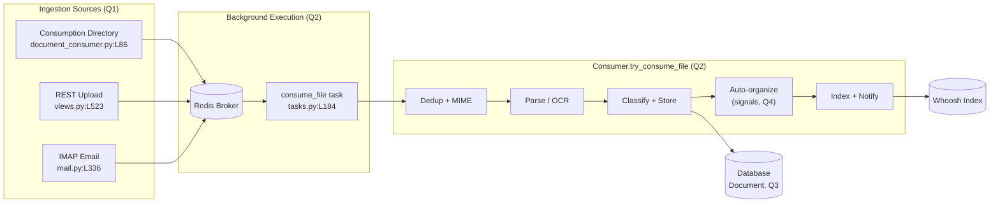

# How Documents Flow Through paperless-ngx

> **Exact checkout this document describes**
>
> - **Branch:** `paperless-ngx_542221a38dff`
> - **HEAD commit:** `542221a38dff06361e07976452f9aea24d210542`
>
> Every factual claim below carries a `file:line` citation and is phrased **cause → effect** (it explains _why_ a behavior happens, not merely _where_ the code lives). All line numbers correspond to the commit above.

## Section 0 — Preamble & Reading Guide

This is a knowledge-extraction document that answers four questions about how documents move through **this exact revision** of paperless-ngx:

- **Q1 — Ingestion:** How does a new document _usually_ enter paperless-ngx, and what are the alternatives?
- **Q2 — Pipeline & background execution:** Once a document is received, what stages does it pass through before it is "fully processed and available," are there background jobs, and what runs them?
- **Q3 — Metadata model:** What information is stored per document, and which fields are _required_ versus _optional_ versus _derived at runtime_? (With a runtime example.)
- **Q4 — Organization:** How do **tags**, **correspondents**, and **document types** work together, in practice, to organize documents?

**How to read the citations.** A reference such as `src/documents/consumer.py:L219` points at the line of source that establishes the claim. Claims are written as cause → effect so the mechanism is explicit — for example: _"Because the consumer only enqueues the file (`src/documents/management/commands/document_consumer.py:L86`), ingestion is asynchronous — the file waits in Redis until a worker picks it up."_

**Labeling convention — observed vs source-traced vs inferred.** Three labels are used consistently throughout this document. **(observed)** means the claim was confirmed by _actually running the code_ and capturing the output, with that evidence embedded next to the claim — this label is reserved for the three genuine runtime captures: the Q3 transcript (Section 4(d)), the dependency-load probe (Section 4(e)), and the fuzzy-matching scores (Section 5.2). **(source-traced)** means the claim was read directly from the cited source or manifest at the given `file:line` but was _not_ executed at runtime — for example a pinned dependency version, an `import` statement, or a config default's derivation. **(inferred)** means the claim was reasoned from static reading or depends on how the software is built/configured, and is reported for the **default/canonical configuration** (for example, the default Redis URL `redis://localhost:6379` and the default consumption directory). Any claim carrying a `file:line` citation without one of these labels is a direct code fact of the kind that reading the cited line settles unambiguously.

**Version note you must not skip — Django-Q, _not_ Celery.** In this checkout the background task engine is **Django-Q backed by a Redis broker**, configured through `Q_CLUSTER` (`src/paperless/settings.py:L449-L457`) and pinned as `django-q==1.3.9` (`requirements.txt:L37`). Current upstream paperless-ngx documentation describes **Celery**, but that reflects a _later_ migration — paperless-ngx transitioned the backend to Celery in **release v1.10.0** via upstream PR **#1648** (_"Transition to celery for background tasks"_), well after this commit — and **does not apply here**. Wherever this document mentions "workers," "the task queue," or "background execution," it means Django-Q — never Celery.

**Runtime grounding.** The Q3 answer embeds a real, reproduced runtime transcript created by loading the actual `documents` app and calling the real ORM `Document.objects.create(...)` — not a mock. It was captured in the canonical pinned stack (Python 3.9.23 / Django 4.0.4).

---

## Section 1 — The Big Picture

At a high level, **many ingestion sources all funnel into one place**: whichever way a document arrives — dropped into a watched folder, uploaded through the REST API, or pulled from an IMAP mailbox — the code path ends in a single enqueue call to the asynchronous task `documents.tasks.consume_file` (`src/documents/tasks.py:L184`). Because each source only _enqueues_ work to Redis rather than processing inline, ingestion is **asynchronous**: the HTTP request or file-watcher event returns immediately, and the file waits in the Redis broker until a **Django-Q worker (a separate process)** dequeues it.

Once a worker runs `consume_file`, what happens next depends on **one configuration switch**. In the **default configuration** — barcode separation disabled (`settings.CONSUMER_ENABLE_BARCODES`, `src/paperless/settings.py:L502-L504`; it is **off by default** because that assignment passes _no_ explicit default to the `__get_boolean` helper (`src/paperless/settings.py:L34`), whose own default is the string `"NO"`, and `"no"` is not among the truthy tokens `("yes", "y", "1", "t", "true")` the helper accepts (`src/paperless/settings.py:L39`), so the switch resolves to `False`) — `consume_file` dispatches to `Consumer().try_consume_file(...)` (`src/documents/tasks.py:L236`), which executes an **ordered pipeline** (`src/documents/consumer.py:L180-L377`): deduplicate → detect MIME type → parse/OCR → extract text, thumbnail, and date → classify → persist a `Document` row → fire the auto-organization signals (tags, correspondent, document type) → add the document to the Whoosh full-text index → broadcast a `SUCCESS` status over a WebSocket. Only after the database row, the on-disk files, the search index, and the status notification are all done is the document **"fully processed and available."** On this default path the task returns `"Success. New document id {} created"` (`src/documents/tasks.py:L247`) — a return value that _includes_ the new document's primary key.

There is **one important exception to "every task reaches `try_consume_file`."** Before the dispatch above, `consume_file` first checks `if settings.CONSUMER_ENABLE_BARCODES:` (`src/documents/tasks.py:L195`). When that setting is enabled _and_ separator barcodes are found, `consume_file` takes a **different branch**: it splits the source into child PDFs, writes each back into the consumption directory via `save_to_dir(...)` (`src/documents/tasks.py:L210`), deletes the original with `os.unlink(path)` (`src/documents/tasks.py:L214`), broadcasts a `SUCCESS` status **carrying no `document_id`** (`src/documents/tasks.py:L217-L224`), and returns the string `"File successfully split"` (`src/documents/tasks.py:L233`) — **bypassing `try_consume_file` entirely**. Cause → effect: on this branch a single `consume_file` invocation creates **no** `Document` row of its own; instead each split child is dropped back into the watched folder and re-ingested as a _fresh_ `consume_file` task. So "`SUCCESS` means a document exists" holds only on the default (barcode-disabled / no-separator) path; on the split branch `SUCCESS` merely means the source was divided and re-queued.

The diagram below traces the **default (barcode-disabled) flow** end to end. The three ingestion sources (Q1) converge on the Redis-backed `consume_file` task (Q2), which drives the `try_consume_file` pipeline (Q2); the pipeline writes the `Document` record (Q3), runs the auto-organization signals (Q4), and updates the Whoosh index. (The barcode split branch described above is a pre-pipeline short-circuit and is called out beneath the diagram rather than drawn as a separate node.)



**Reading the diagram (and the one branch it omits).** The `consume_file task` node represents the default path only. In this checkout, `consume_file` first evaluates the barcode switch (`src/documents/tasks.py:L195`); the arrow `TASK --> P1` therefore applies only when barcode separation is disabled or no separator page is found. When barcode separation _is_ enabled and a separator is detected, `consume_file` short-circuits **before** `P1` — it splits the file, re-queues the children into the consumption directory (`src/documents/tasks.py:L210`), deletes the original (`src/documents/tasks.py:L214`), emits a `SUCCESS` status with no document id (`src/documents/tasks.py:L217-L224`), and returns `"File successfully split"` (`src/documents/tasks.py:L233`) without touching the `Consumer.try_consume_file` pipeline. Each re-queued child then re-enters the diagram from the top as its own `consume_file` task.

---

## Section 2 — Q1: How a New Document Enters (Ingestion Entry Points)

**The usual/default path is the watched consumption directory.** Whatever the source, every entry point converges on the _same_ asynchronous task: `documents.tasks.consume_file` (`src/documents/tasks.py:L184`). In the default configuration that task's body dispatches to `Consumer().try_consume_file(...)` (`src/documents/tasks.py:L236`) and, on success, returns the string `"Success. New document id {} created"` (`src/documents/tasks.py:L247`). (As explained in Section 1, if barcode separation is enabled and a separator page is detected, `consume_file` first takes the split branch at `src/documents/tasks.py:L195-L233` and returns `"File successfully split"` without reaching `try_consume_file`; the four entry points below describe how a file _reaches_ `consume_file`, which is identical regardless of that switch.) Because there is exactly one downstream task, the four entry points differ only in _how they hand a file to it_ — after that, they share one pipeline.

The single most important cause → effect for Q1: **each entry point only _notifies_ the task processor by enqueuing to Redis via `async_task("documents.tasks.consume_file", …)`.** As a result, ingestion is **asynchronous** — the watcher event or HTTP request returns immediately, and the file simply waits in the Redis broker until a **Django-Q worker (a separate process)** dequeues it and runs `consume_file`. The web/consumer process never blocks on parsing or OCR.

| Entry point                                            | "Usual"?          | Enqueue site (`async_task` → `consume_file`)                 | Notes                                                                                                                                                                                   |
| ------------------------------------------------------ | ----------------- | ------------------------------------------------------------ | --------------------------------------------------------------------------------------------------------------------------------------------------------------------------------------- |
| Watched consumption directory                          | **Yes — default** | `src/documents/management/commands/document_consumer.py:L86` | Filesystem watcher; inotify or polling fallback                                                                                                                                         |
| REST API upload (`POST /api/documents/post_document/`) | No (alternative)  | `src/documents/views.py:L523`                                | Authenticated + multipart-only; returns `Response("OK")` at `src/documents/views.py:L535` in this checkout                                                                              |
| IMAP email attachments                                 | No (alternative)  | `src/paperless_mail/mail.py:L336`                            | Driven by scheduled `process_mail_accounts` (`src/paperless_mail/tasks.py:L11`)                                                                                                         |
| Web-UI / mobile upload                                 | No (alternative)  | _(same as REST)_ `src/documents/views.py:L523`               | No separate ingestion path; web-UI POSTs to `post_document` from the Angular service (`src-ui/src/app/services/rest/document.service.ts:L145-L150`, source-traced), mobile _(inferred)_ |

### 2.1 Watched consumption directory (the default path)

This is what most users mean by "adding a document": drop a file into a folder and paperless picks it up. The management command `document_consumer` provides the helper `_consume(filepath)` (`src/documents/management/commands/document_consumer.py:L46`) that ultimately enqueues the work. Before enqueuing, `_consume` applies several guards: it skips directories and ignored patterns (`src/documents/management/commands/document_consumer.py:L47-L48`), skips a path that has already moved away (`src/documents/management/commands/document_consumer.py:L50-L52`), rejects unsupported file extensions (`src/documents/management/commands/document_consumer.py:L54-L56`), and retries opening the file up to 50 times with a 10 ms sleep between attempts — up to 500 ms total (`os_error_retry_count = 50` at `src/documents/management/commands/document_consumer.py:L59`, `os_error_retry_wait = 0.01` at `src/documents/management/commands/document_consumer.py:L60`, loop at `src/documents/management/commands/document_consumer.py:L65-L75`) — so it does not grab a file another process still holds. Only then does it optionally derive tags from sub-directory names when `CONSUMER_SUBDIRS_AS_TAGS` is set (`src/documents/management/commands/document_consumer.py:L79-L80`), log `"Adding {} to the task queue."` (`src/documents/management/commands/document_consumer.py:L85`), and enqueue `async_task("documents.tasks.consume_file", …)` (`src/documents/management/commands/document_consumer.py:L86`). Because `_consume` hands the path to `async_task` and returns, the watcher is free immediately — the actual consumption happens later in a worker, which is _why_ dropping a large scanned PDF into the folder does not freeze the watcher.

**How the folder is watched.** The filesystem-event handlers do **not** call `_consume` directly. `Handler(FileSystemEventHandler).on_created` (`src/documents/management/commands/document_consumer.py:L129`) and `on_moved` (`src/documents/management/commands/document_consumer.py:L132`) each start a `Thread` running `_consume_wait_unmodified` (`src/documents/management/commands/document_consumer.py:L130`, `src/documents/management/commands/document_consumer.py:L133`; defined at `src/documents/management/commands/document_consumer.py:L99`). That function polls the file's `mtime` and size until they stop changing and only then calls `_consume` (`src/documents/management/commands/document_consumer.py:L117-L118`) — this stability debounce is _why_ a file that is still being copied in is not consumed prematurely. In addition, at startup `Command.handle()` (`src/documents/management/commands/document_consumer.py:L156`) first scans the directory **once**, walking it recursively (`src/documents/management/commands/document_consumer.py:L166-L170`) or via `os.scandir` (`src/documents/management/commands/document_consumer.py:L171-L173`) and calling `_consume` on every file already present — so files dropped while the watcher was down are still ingested on the next start. After that scan, `handle()` chooses one of two live-watch strategies:

- **inotify (preferred):** when polling is disabled and the kernel `INotify` API is available (`CONSUMER_POLLING == 0` and `INotify` importable, `src/documents/management/commands/document_consumer.py:L178`), it runs `handle_inotify(...)` (`src/documents/management/commands/document_consumer.py:L199`), watching the flags `CLOSE_WRITE | MOVED_TO` (`src/documents/management/commands/document_consumer.py:L203`) via `inotifyrecursive`. Watching `CLOSE_WRITE`/`MOVED_TO` (rather than raw "create") is deliberate — it fires only once the file is fully written or atomically moved in. The inotify loop then waits out a 0.5-second debounce with no further events (`src/documents/management/commands/document_consumer.py:L211`) before calling `_consume` directly (`src/documents/management/commands/document_consumer.py:L230`), so a burst of writes settles before consumption. (Note: this branch calls `_consume` directly and does **not** use the `_consume_wait_unmodified` thread — that thread is the _polling_ path's stability mechanism.)
- **polling (fallback):** otherwise it runs `handle_polling(...)` (`src/documents/management/commands/document_consumer.py:L185`) using a watchdog `PollingObserver` that dispatches to the `Handler` above; on this path stability is enforced by the `_consume_wait_unmodified` thread rather than by inotify flags. Polling exists so the feature still works on filesystems where inotify is unavailable (e.g. some network mounts).

**Which folder.** The watched directory is `CONSUMPTION_DIR`, whose default is `os.path.join(BASE_DIR, "..", "consume")` and which is overridable via the `PAPERLESS_CONSUMPTION_DIR` environment variable (`src/paperless/settings.py:L78`). _(inferred / config-default — the actual path depends on `BASE_DIR` and the environment.)_

### 2.2 REST API upload

Programmatic and browser uploads go through `PostDocumentView` (`src/documents/views.py:L491`), routed at `POST /api/documents/post_document/` (`src/paperless/urls.py:L56-L60`). The endpoint is **authenticated** — `permission_classes = (IsAuthenticated,)` (`src/documents/views.py:L493`) — and **multipart-only** — `parser_classes = (parsers.MultiPartParser,)` (`src/documents/views.py:L495`) — so an unauthenticated or non-multipart request is rejected before any consumption work is scheduled. The `post()` handler (`src/documents/views.py:L497`) first validates the request with `serializer.is_valid(raise_exception=True)` (`src/documents/views.py:L500`); on invalid input DRF returns **HTTP 400** and **nothing is enqueued**. Only after validation does it stream the uploaded bytes into a temporary file under `SCRATCH_DIR` (`src/documents/views.py:L510-L519`), generate a task id with `task_id = str(uuid.uuid4())` (`src/documents/views.py:L521`), and enqueue `async_task("documents.tasks.consume_file", …)` (`src/documents/views.py:L523-L533`). Writing to a scratch file first is what lets the endpoint return before parsing — the worker reads the scratch file later.

**Important detail for THIS checkout:** the endpoint returns `Response("OK")` (`src/documents/views.py:L535`) — i.e. HTTP 200 with the body `"OK"`, **not** the task UUID. _Later_ versions of paperless return the consumption task id to the caller, but in this revision the response body is simply `"OK"`; a client cannot use the return value to poll the task. This is a genuine behavioral difference of this commit, so any integration written against it must not expect a UUID here. Beyond polling, this thin response has an operational consequence when the broker or network misbehaves — see the _ambiguous-acceptance_ caveat in Section 3(b).

**The upload contract** is defined by `PostDocumentSerializer` (`src/documents/serialisers.py:L413`) — which is a plain `serializers.Serializer`, **distinct from the model-backed `DocumentSerializer` (`src/documents/serialisers.py:L201`)** used by the document CRUD endpoints. `PostDocumentSerializer` declares exactly **five** fields, and only the file is mandatory: `document` is a `FileField` that is **required** (`src/documents/serialisers.py:L415`); `title` (`src/documents/serialisers.py:L420`), `correspondent` (`src/documents/serialisers.py:L426`), `document_type` (`src/documents/serialisers.py:L434`), and `tags` (`src/documents/serialisers.py:L442`) are each declared `required=False`. **There is no `created` or `archive_serial_number` field on this endpoint** — those exist only on `DocumentSerializer` (`created` at `src/documents/serialisers.py:L229`, `archive_serial_number` at `src/documents/serialisers.py:L232`), and the view reads only `document`, `correspondent`, `document_type`, `tags`, and `title` from `validated_data` (`src/documents/views.py:L502-L506`). Cause → effect: a client that sends `created` or `archive_serial_number` to `post_document/` has those keys **silently ignored** — they never reach `consume_file`. The uploaded file is also **content-validated**: `validate_document` reads the bytes and runs `magic.from_buffer(...)`, raising a validation error (→ HTTP 400, no enqueue) when `is_mime_type_supported(...)` is false (`src/documents/serialisers.py:L450-L459`). Because only the file is required, a minimal upload is just the file bytes; each of the four optional values the caller supplies becomes an `override_*` argument applied during storage (see Section 3's `_store` discussion).

### 2.3 IMAP email attachments

paperless can pull documents out of email. For each attachment whose detected MIME type is supported (`src/paperless_mail/mail.py:L319`), `MailAccountHandler` writes the attachment bytes to a temporary file under `SCRATCH_DIR` (`src/paperless_mail/mail.py:L326-L327`) and then enqueues `async_task("documents.tasks.consume_file", …)` (`src/paperless_mail/mail.py:L336-L349`). The enqueued arguments are `path=temp_filename` (`src/paperless_mail/mail.py:L338`) plus the mail rule's overrides — `override_filename` (`src/paperless_mail/mail.py:L339-L341`), `override_title` (`src/paperless_mail/mail.py:L342`), `override_correspondent_id` (`src/paperless_mail/mail.py:L343-L345`), `override_document_type_id` (`src/paperless_mail/mail.py:L346`), and `override_tag_ids` (`src/paperless_mail/mail.py:L347`). Passing `override_*` arguments is _why_ an emailed document can arrive already titled and attributed to a correspondent — the mail rule supplies those overrides, which `_store` later applies (Section 3).

Mailboxes are not watched in real time; they are **polled** by the scheduled task `process_mail_accounts` (`src/paperless_mail/tasks.py:L11`). It iterates over every configured `MailAccount` (`src/paperless_mail/tasks.py:L13`) and, for each, calls `MailAccountHandler().handle_mail_account(account)` (`src/paperless_mail/tasks.py:L15`) — **not** the similarly named single-account helper `process_mail_account(name)` (`src/paperless_mail/tasks.py:L25`). Per-account error handling is **partial, not total**: the loop wraps each call in `try: … except MailError:` (`src/paperless_mail/tasks.py:L14-L17`), so any failure raised **as a `MailError`** is logged and the loop moves on to the next account. Authentication failures are isolated this way — `handle_mail_account` (`src/paperless_mail/mail.py:L151`) wraps `M.login(...)` (`src/paperless_mail/mail.py:L166`) in a `try/except` that re-raises as `MailError` (`src/paperless_mail/mail.py:L165-L168`). **But the mailbox is _constructed before_ that login guard exists:** `handle_mail_account` opens `with get_mailbox(account.imap_server, account.imap_port, account.imap_security)` (`src/paperless_mail/mail.py:L159`), and `get_mailbox` (`src/paperless_mail/mail.py:L92`) instantiates the client — `MailBoxUnencrypted` / `MailBoxTls` / `MailBox` (`src/paperless_mail/mail.py:L94`, `L96`, `L98`) — whose constructor opens the IMAP socket. A connection-time failure (unreachable host, DNS failure, TLS error) therefore surfaces _inside the constructor_, before the login `try`, as a `socket.gaierror`/`OSError` — **not** a `MailError`. Cause → effect: because `process_mail_accounts` only excepts `MailError` (`src/paperless_mail/tasks.py:L16`), that error is **not** caught, propagates out of the loop, and **aborts the aggregate task — skipping the remaining accounts** in this run. So the accurate guarantee is narrower than "one failing mailbox never affects the others": `MailError`s (including authentication) are isolated per account, but a _connection-time_ failure to one mailbox can prevent later mailboxes from being polled. That scheduling is covered in Section 3(c). Because email ingestion still ends in the same `async_task(...consume_file...)` enqueue, an emailed document travels through the identical pipeline as a folder-dropped one.

**Verified at runtime** (prescribed container, `imap-tools` 0.54.0): constructing a mailbox client to an unresolvable host raises from the constructor itself — with no `login()` call — and the error is an `OSError` (`socket.gaierror`), not a `MailError`:

```text
# Construct IMAP clients to an unresolvable host; NO .login() is called.
MailBox("paperless.invalid.nonexistent.example", 993)              # SSL
  -> socket.gaierror: [Errno -2] Name or service not known
MailBoxUnencrypted("paperless.invalid.nonexistent.example", 143)   # unencrypted
  -> socket.gaierror: [Errno -2] Name or service not known
# socket.gaierror is an OSError, not a MailError, so `except MailError` cannot catch it;
# the failure escapes process_mail_accounts and aborts the run for the remaining accounts.
```

### 2.4 Web-UI / mobile upload

Uploads from the Angular web UI do **not** have a separate ingestion code path — the SPA's `DocumentService.uploadDocument(formData)` (`src-ui/src/app/services/rest/document.service.ts:L145-L150`) issues `http.post(getResourceUrl(null, 'post_document'), …)`, i.e. it POSTs to the same REST endpoint described in Section 2.2 (`src/documents/views.py:L491`; canonical route `src/paperless/urls.py:L56-L60`; enqueue at `src/documents/views.py:L523`). Everything said about the REST contract (authenticated, multipart-only, only `document` required, the other four fields optional, MIME-validated, `Response("OK")` returned in this checkout) therefore applies verbatim to web-UI uploads. **Mobile uploads are _(inferred)_:** this checkout has no mobile-specific server code, so third-party mobile clients necessarily reach paperless through the same authenticated REST endpoint. This is reasoned from the fact that `PostDocumentView` is the _only handler_ that enqueues `consume_file` from an HTTP request — reachable via its canonical DRF route (`src/paperless/urls.py:L56-L60`) and also via a legacy top-level alias `^push$`, a `csrf_exempt` `RedirectView` that redirects to `settings.BASE_URL + "api/documents/post_document/"` (`src/paperless/urls.py:L113-L120`). Both routes therefore land on the same `post_document` view, so any mobile client uploads through it; no observed mobile-client run backs the mobile case, so it is labeled inferred rather than observed.

**Coverage note (Q1):** all four named entry points — consumption directory (default), REST upload, IMAP email, and web-UI/mobile (via REST) — are accounted for, and each was traced to its `async_task("documents.tasks.consume_file", …)` enqueue. The shared asynchrony (enqueue-to-Redis, then a worker runs the task) is the reason all sources behave consistently downstream.

---

## Section 3 — Q2: The Processing Pipeline & Background Execution

### 3(a) The ordered pipeline: `Consumer.try_consume_file`

Once a Django-Q worker runs `consume_file`, it calls `Consumer().try_consume_file(...)` (`src/documents/tasks.py:L236`), whose body (`src/documents/consumer.py:L180-L377`) executes the stages below **in order**. (This is the default, **barcode-disabled** path. As covered in Sections 1 and 2, if `CONSUMER_ENABLE_BARCODES` is on and a separator page is detected, `consume_file` short-circuits at `src/documents/tasks.py:L195-L233` — splitting the file and returning `"File successfully split"` — and **never calls `try_consume_file`**; the stages below therefore describe the normal pipeline only.) The whole point of the ordering is fail-fast economy: cheap rejections (missing file, duplicate) happen before expensive work (OCR), and nothing becomes "available" until the row, files, index, and status are all done.

| #   | Stage                                 | What happens                                                                                                                                                                                                                                                                                                                                                                                                                                                                                                                                                                                                                                                                                                                                                                                                                                                                                              | Citation                                                                                                  | Cause → effect                                                                                                                                                                                                                                                                                                                                                                                                                                                                                                                                                                                                      |
| --- | ------------------------------------- | --------------------------------------------------------------------------------------------------------------------------------------------------------------------------------------------------------------------------------------------------------------------------------------------------------------------------------------------------------------------------------------------------------------------------------------------------------------------------------------------------------------------------------------------------------------------------------------------------------------------------------------------------------------------------------------------------------------------------------------------------------------------------------------------------------------------------------------------------------------------------------------------------------- | --------------------------------------------------------------------------------------------------------- | ------------------------------------------------------------------------------------------------------------------------------------------------------------------------------------------------------------------------------------------------------------------------------------------------------------------------------------------------------------------------------------------------------------------------------------------------------------------------------------------------------------------------------------------------------------------------------------------------------------------- |
| 1   | Initialize & announce                 | Set instance state from the call args; broadcast `STARTING`; renew the logging group                                                                                                                                                                                                                                                                                                                                                                                                                                                                                                                                                                                                                                                                                                                                                                                                                      | `src/documents/consumer.py:L194-L200`, `src/documents/consumer.py:L202`, `src/documents/consumer.py:L207` | `_send_progress(0,100,"STARTING")` (`src/documents/consumer.py:L202`) pushes a WebSocket event so the UI shows the job began before any work runs                                                                                                                                                                                                                                                                                                                                                                                                                                                                   |
| 2   | Pre-checks                            | `pre_check_file_exists` (called `src/documents/consumer.py:L211`, def `src/documents/consumer.py:L95`), `pre_check_directories` (called `src/documents/consumer.py:L212`, def `src/documents/consumer.py:L115`), `pre_check_duplicate` (called `src/documents/consumer.py:L213`, def `src/documents/consumer.py:L102`)                                                                                                                                                                                                                                                                                                                                                                                                                                                                                                                                                                                    | `src/documents/consumer.py:L211-L213`                                                                     | The duplicate check computes an md5 and queries `Q(checksum=…) \| Q(archive_checksum=…)` (`src/documents/consumer.py:L105-L107`), then calls `_fail(MESSAGE_DOCUMENT_ALREADY_EXISTS, …)` (`src/documents/consumer.py:L110-L113`) — so identical files are rejected _before_ any parsing cost is paid                                                                                                                                                                                                                                                                                                                |
| 3   | MIME detection & parser select        | `mime_type = magic.from_file(self.path, mime=True)` (`src/documents/consumer.py:L219`); then `get_parser_class_for_mime_type(mime_type)` (`src/documents/consumer.py:L223`)                                                                                                                                                                                                                                                                                                                                                                                                                                                                                                                                                                                                                                                                                                                               | `src/documents/consumer.py:L219-L225`                                                                     | The detected MIME type _decides which parser runs_ (Tesseract OCR / plain text / Tika); an unsupported type triggers `_fail(MESSAGE_UNSUPPORTED_TYPE, …)` here (`src/documents/consumer.py:L224-L225`) rather than later                                                                                                                                                                                                                                                                                                                                                                                            |
| 4   | `document_consumption_started` signal | Notify listeners that consumption began                                                                                                                                                                                                                                                                                                                                                                                                                                                                                                                                                                                                                                                                                                                                                                                                                                                                   | `src/documents/consumer.py:L229-L233`                                                                     | Lets pluggable pre-processing hooks run at a well-defined point                                                                                                                                                                                                                                                                                                                                                                                                                                                                                                                                                     |
| 5   | Pre-consume script                    | `run_pre_consume_script()` (def `src/documents/consumer.py:L121`)                                                                                                                                                                                                                                                                                                                                                                                                                                                                                                                                                                                                                                                                                                                                                                                                                                         | `src/documents/consumer.py:L235`                                                                          | Optional user hook — runs an external command before parsing (e.g. custom preprocessing). It calls `Popen((script, self.path)).wait()` (`src/documents/consumer.py:L135`) but **does not inspect the exit code**, so a script that _exits nonzero_ does **not** fail consumption; only a **missing** script file (`os.path.isfile` check → `_fail` at `src/documents/consumer.py:L125-L126`) or an **exception launching it** (`except Exception` → `_fail` at `src/documents/consumer.py:L136-L137`) aborts the pipeline                                                                                           |
| 6   | Parse / OCR (the slow stage)          | Instantiate the parser **first** — `document_parser = parser_class(...)` (`src/documents/consumer.py:L244`), _before_ the parse `try`; the `try` then **begins at** `src/documents/consumer.py:L258` and wraps the progress-20% announce (`src/documents/consumer.py:L259`) and `document_parser.parse(...)` (`src/documents/consumer.py:L261`)                                                                                                                                                                                                                                                                                                                                                                                                                                                                                                                                                           | `src/documents/consumer.py:L244-L261`                                                                     | This is the expensive step (OCR). Because the parser is constructed _before_ the `try`, a failure while _building_ the parser is **not** caught by the `except ParseError` boundary (`src/documents/consumer.py:L278`) — only errors _during_ `parse(...)` are; doing pre-checks first is _why_ the worker doesn't waste OCR time on duplicates                                                                                                                                                                                                                                                                     |
| 7   | Thumbnail                             | `get_optimised_thumbnail(...)` at progress 70%                                                                                                                                                                                                                                                                                                                                                                                                                                                                                                                                                                                                                                                                                                                                                                                                                                                            | `src/documents/consumer.py:L264-L269`                                                                     | Produces the preview image the UI shows in lists                                                                                                                                                                                                                                                                                                                                                                                                                                                                                                                                                                    |
| 8   | Text extraction                       | `get_text()`                                                                                                                                                                                                                                                                                                                                                                                                                                                                                                                                                                                                                                                                                                                                                                                                                                                                                              | `src/documents/consumer.py:L271`                                                                          | The extracted text becomes `Document.content` and later feeds the search index and the classifier                                                                                                                                                                                                                                                                                                                                                                                                                                                                                                                   |
| 9   | Date extraction                       | `get_date()` (`src/documents/consumer.py:L272`); if empty, `parse_date(...)` at progress 90% (`src/documents/consumer.py:L273-L275`)                                                                                                                                                                                                                                                                                                                                                                                                                                                                                                                                                                                                                                                                                                                                                                      | `src/documents/consumer.py:L272-L275`                                                                     | If the parser cannot determine a date, `parse_date` guesses from the text, which is _why_ `created` can differ from the file's timestamp                                                                                                                                                                                                                                                                                                                                                                                                                                                                            |
| 10  | Archive path & parse-error exit       | `get_archive_path()` (`src/documents/consumer.py:L276`); on any parse failure the `except ParseError` branch first cleans the parser (`src/documents/consumer.py:L279`) then calls `_fail(...)` (`src/documents/consumer.py:L280-L285`)                                                                                                                                                                                                                                                                                                                                                                                                                                                                                                                                                                                                                                                                   | `src/documents/consumer.py:L276-L285`                                                                     | Determines whether an archival (PDF/A) version exists; a parse error short-circuits to `_fail` (which raises) **before** any database work begins                                                                                                                                                                                                                                                                                                                                                                                                                                                                   |
| 11  | Load classifier, then announce 95%    | `classifier = load_classifier()` (`src/documents/consumer.py:L292`) runs **first**, then a _separate_ `_send_progress(95, 100, "WORKING", MESSAGE_SAVE_DOCUMENT)` (`src/documents/consumer.py:L294`) is emitted                                                                                                                                                                                                                                                                                                                                                                                                                                                                                                                                                                                                                                                                                           | `src/documents/consumer.py:L292-L294`                                                                     | The ML classifier is loaded **once** here and reused by the auto-organization hooks, avoiding a reload per entity type; the 95% event is emitted _after_ the load and its message is `MESSAGE_SAVE_DOCUMENT` (`"save_document"`, `src/documents/consumer.py:L48`) — it announces the _upcoming save_, not the classifier load                                                                                                                                                                                                                                                                                       |
| 12  | Persist + organize (DB-atomic)        | Inside `with transaction.atomic()` (`src/documents/consumer.py:L298`): `_store(...)` creates the row (`src/documents/consumer.py:L301`) → `document_consumption_finished.send(..., classifier=classifier)` (`src/documents/consumer.py:L306-L311`) → under `with FileLock(settings.MEDIA_LOCK)` (`src/documents/consumer.py:L315`) set `filename` via `generate_unique_filename` (`src/documents/consumer.py:L316`), write the original to `source_path` (`src/documents/consumer.py:L319`), write the thumbnail (`src/documents/consumer.py:L321-L325`), and if an archive exists set `archive_filename` + `archive_checksum = hashlib.md5(...)` (`src/documents/consumer.py:L327-L344`); then `document.save()` (`src/documents/consumer.py:L346`), `os.unlink(self.path)` (`src/documents/consumer.py:L350`), and delete the leftover "shadow" file if present (`src/documents/consumer.py:L353-L360`) | `src/documents/consumer.py:L298-L360`                                                                     | `transaction.atomic()` makes the **database** writes all-or-nothing; the `document_consumption_finished` signal is what triggers auto-organization (Q4). The exact — and limited — guarantee this provides is spelled out in "Error & rollback behavior" below                                                                                                                                                                                                                                                                                                                                                      |
| 13  | Failure exit & parser cleanup         | If the storage block raises, `except Exception` calls `_fail(...)` (`src/documents/consumer.py:L362-L366`); the `finally: document_parser.cleanup()` (`src/documents/consumer.py:L368-L369`) then runs whether storage succeeded or failed (a _separate_ `cleanup()` already ran in the `except ParseError` branch at `src/documents/consumer.py:L279` if parsing failed)                                                                                                                                                                                                                                                                                                                                                                                                                                                                                                                                 | `src/documents/consumer.py:L362-L369`                                                                     | The `finally` guarantees temp parser artifacts are removed on both success and failure of the storage step                                                                                                                                                                                                                                                                                                                                                                                                                                                                                                          |
| 14  | Post-consume script                   | `run_post_consume_script(document)` (def `src/documents/consumer.py:L143`)                                                                                                                                                                                                                                                                                                                                                                                                                                                                                                                                                                                                                                                                                                                                                                                                                                | `src/documents/consumer.py:L371`                                                                          | Runs **after** the row is persisted and files are in place — so a post-consume notification fires only once the document truly exists. Like the pre-consume hook it calls `Popen(...).wait()` (`src/documents/consumer.py:L160-L172`) and **ignores the exit code**: a nonzero-exiting script does **not** fail the task; only a **missing** script (`isfile` → `_fail` at `src/documents/consumer.py:L147-L148`) or an **exception launching it** (`except Exception` → `_fail` at `src/documents/consumer.py:L173-L174`) does — and even then the document is already committed (see "Error & rollback behavior") |
| 15  | Announce success & return             | `_send_progress(100,100,"SUCCESS", MESSAGE_FINISHED, document.id)` (`src/documents/consumer.py:L375`); `return document` (`src/documents/consumer.py:L377`)                                                                                                                                                                                                                                                                                                                                                                                                                                                                                                                                                                                                                                                                                                                                               | `src/documents/consumer.py:L375-L377`                                                                     | Only after the DB row, files, index, and status are all done does the pipeline report `SUCCESS` **with the document id** — precisely the moment the document is "fully processed and available". (Contrast the barcode-split branch, which earlier emits a `SUCCESS` payload carrying **no** document id and returns `"File successfully split"` at `src/documents/tasks.py:L217-L233` without ever entering this pipeline.)                                                                                                                                                                                        |

**How the required fields get populated — `_store`.** The row itself is created by `_store` (`src/documents/consumer.py:L379-L412`). It computes `created` from the parser/date logic (`src/documents/consumer.py:L389-L393`), sets `storage_type = STORAGE_TYPE_UNENCRYPTED` (`src/documents/consumer.py:L395`), and then calls `Document.objects.create(title=…, content=…, mime_type=mime_type, checksum=hashlib.md5(f.read()).hexdigest(), created=…, modified=…, storage_type=…)`. The two DB-required values are produced right here: **`mime_type` is passed at `src/documents/consumer.py:L401`** and **`checksum` is computed and passed at `src/documents/consumer.py:L402`**. After creation, any caller-supplied overrides (title, correspondent, etc.) are applied (`src/documents/consumer.py:L408`) and persisted with `document.save()` (`src/documents/consumer.py:L410`). This is the concrete link to Q3: the fields that are _required in the database_ are the ones the consumer _derives at runtime_ — see Section 4.

**Error & rollback behavior (the precise guarantee).** Two failure mechanisms bracket the pipeline, and the exact scope of the "atomic" guarantee is easy to overstate — so here is what actually happens. First, `_fail(...)` (`src/documents/consumer.py:L78-L81`) is the _uniform_ failure exit: it broadcasts a `FAILED` status over WebSockets (`src/documents/consumer.py:L79`) and then **raises** `ConsumerError` (`src/documents/consumer.py:L81`). Cause → effect: a duplicate, an unsupported MIME type, and a parse error all surface to the Django-Q worker as a _raised exception_ — never a silent return — so the task is recorded as failed rather than as a phantom success. Second, the storage step runs inside `with transaction.atomic()` (`src/documents/consumer.py:L298`); if anything inside raises, the **database** row (plus the tag/log rows written by the finished-signal handlers) is rolled back. What that atomicity does **not** cover is the important nuance: the same block also performs _filesystem_ writes — the original copied to `source_path` (`src/documents/consumer.py:L319`), the thumbnail (`src/documents/consumer.py:L321-L325`), and the archive (`src/documents/consumer.py:L327-L344`) — and it triggers a _Whoosh search-index_ write via the `document_consumption_finished` → `add_to_index` handler (`src/documents/apps.py:L27` → `src/documents/index.py:L118-L120`). Neither the on-disk files nor the Whoosh commit participates in the database transaction, so a rollback that happens _after_ those writes can leave orphaned files or a stale index entry behind — the DB row disappears but the side effects can outlive it. The `FileLock(settings.MEDIA_LOCK)` (`src/documents/consumer.py:L315`) is **not** an atomicity mechanism either: it is a cross-process mutex that serializes filename generation and the file-move operations so two concurrent consumptions cannot collide on the same generated filename (the code even releases it before `document.save()` at `src/documents/consumer.py:L346` because saving re-acquires it). Finally, duplicate handling is **configurable**: when `pre_check_duplicate` finds a checksum match it deletes the incoming file **only if** `CONSUMER_DELETE_DUPLICATES` is set (`src/documents/consumer.py:L108-L109`) before calling `_fail` (`src/documents/consumer.py:L110-L113`) — otherwise the rejected duplicate is left in the consumption directory for the operator to inspect. And note the ordering consequence: because the post-consume script runs at `src/documents/consumer.py:L371`, _after_ the atomic block has committed, even a genuinely _failing_ post-consume hook (one that raises while launching) cannot roll back an already-persisted document — and a hook that merely _exits nonzero_ is not treated as a failure at all, since `run_post_consume_script` never checks the exit code of `Popen(...).wait()` (`src/documents/consumer.py:L160-L172`).

### 3(b) The background-execution engine: Django-Q + Redis (NOT Celery)

**Yes, background jobs exist, and the engine is Django-Q backed by Redis.** The evidence:

- Django-Q is an installed app: `django_q` appears in `INSTALLED_APPS` (`src/paperless/settings.py:L110`). Registering the app is what makes its worker/scheduler management commands and `Schedule` model available.
- The cluster is configured by `Q_CLUSTER` (`src/paperless/settings.py:L449-L457`): the cluster is named `"paperless"` (`src/paperless/settings.py:L450`); `catch_up: False` (`src/paperless/settings.py:L451`) means missed scheduled runs are **not** replayed after downtime (so, e.g., an offline period does not trigger a burst of catch-up classifier trainings); `recycle: 1` (`src/paperless/settings.py:L452`) recycles a worker after each task, which bounds memory growth from heavy OCR jobs; `retry` (`src/paperless/settings.py:L453`) and `timeout` (`src/paperless/settings.py:L454`) bound task lifetime; `workers` is set to `TASK_WORKERS` (`src/paperless/settings.py:L455`); and the broker is `redis`, read from `PAPERLESS_REDIS` and defaulting to `"redis://localhost:6379"` (`src/paperless/settings.py:L456`).
- `TASK_WORKERS` (`src/paperless/settings.py:L438`) defaults to a value derived from the machine's CPU cores. _(inferred / config-dependent — the concrete worker count depends on the host and `PAPERLESS_TASK_WORKERS`.)_ The per-task timeout `PAPERLESS_WORKER_TIMEOUT` defaults to **1800** seconds (`src/paperless/settings.py:L440`); a 30-minute ceiling exists because OCR on large documents can legitimately run for many minutes.
- The dependency is pinned as `django-q==1.3.9` (`requirements.txt:L37`) — a **(source-traced)** confirmation, read directly from the pinned manifest rather than observed at runtime, that Django-Q (not Celery) is the engine for this revision.

**Cause → effect of the architecture.** Because the web server / consumer process only _enqueues_ to Redis and a _separate_ Django-Q worker process dequeues and runs the task, ingestion is decoupled: the front door stays responsive while heavy OCR happens elsewhere. Redis is the hand-off point between the two process groups.

**Operational caveat — at-most-once delivery (inferred from Django-Q 1.3.9's Redis broker).** The flip side of this decoupling is that the hand-off is _not_ a durable, redelivering queue in this revision. Django-Q's Redis broker dequeues with a destructive pop (`blpop`), so the instant a worker picks up a `consume_file` task it is removed from Redis; and the corresponding `Task`/`Failure` bookkeeping row is written only _after_ the worker returns a result. Cause → effect: if a worker is killed abruptly (OOM kill, `SIGKILL`, container eviction) _while_ running `consume_file`, the task is already gone from Redis, no result is ever recorded, and the live-status stream simply stops — the document silently fails to appear, with **no automatic retry** and **no `Task`/`Failure` row** to point at, while the scratch/consumption file is left in place for an operator to re-submit. Two `Q_CLUSTER` keys that _look_ like they would rescue it do not, for this broker: `catch_up: False` (`src/paperless/settings.py:L451`) governs only whether the _scheduler_ replays missed **scheduled** runs after downtime (Section 3(c)), not redelivery of an in-flight ad-hoc task; and `retry` (`src/paperless/settings.py:L453`) applies to brokers that issue delivery receipts, which the list-based Redis broker does not. The cluster sentinel does restart the dead worker **process** so throughput recovers, but it does not re-run the task that vanished with it. This is labeled **inferred** — it follows from Django-Q 1.3.9's broker semantics plus the cited `Q_CLUSTER` configuration, not from a reproduced worker-kill run.

**Operational caveat — ambiguous acceptance on broker/network failure.** Because the REST endpoint generates a task id (`task_id = str(uuid.uuid4())`, `src/documents/views.py:L521`) but then **discards it**, returning only `Response("OK")` (`src/documents/views.py:L535`, Section 2.2), the client is left with no handle to reconcile against. If Redis is down the `async_task(...)` enqueue itself fails and the caller sees an error — that case is unambiguous; but if the network connection drops or times out _after_ the server has already enqueued the task, the client cannot tell whether the upload was accepted and, lacking a task id, cannot query its status. Cause → effect: a naive client retry can enqueue the **same** document twice — the duplicate is not deduplicated at the API but is caught later inside the pipeline by the checksum duplicate check (`pre_check_duplicate`, Section 3(a)), which _fails_ the redundant task with `MESSAGE_DOCUMENT_ALREADY_EXISTS` rather than succeeding idempotently. So an integration should treat a lost or timed-out `post_document/` response as _unknown_ (not _failed_) and reconcile by listing documents rather than blindly re-posting.

> **Version note (mandatory):** Current upstream paperless-ngx documentation describes **Celery** as the task processor. That is a **later migration** — introduced in paperless-ngx **v1.10.0** via upstream PR **#1648** (_"Transition to celery for background tasks"_) — and **does not apply to this checkout**. Here the engine is **Django-Q + Redis** as cited above; none of Celery's machinery (celery workers, beat, brokers other than the Django-Q/Redis setup) is present or relevant.

### 3(c) Scheduled maintenance jobs

Recurring jobs are **not** configured by an external scheduler file; they are registered as Django-Q `Schedule` rows created by **data migrations**, so they are seeded into the database the first time migrations run:

| Job                     | Cadence              | Registered by (migration)                                                                                                                                                                                                                               | Task body                         |
| ----------------------- | -------------------- | ------------------------------------------------------------------------------------------------------------------------------------------------------------------------------------------------------------------------------------------------------- | --------------------------------- |
| `train_classifier`      | **HOURLY**           | `src/documents/migrations/1001_auto_20201109_1636.py:L10-L14` (`schedule_type=Schedule.HOURLY` at `src/documents/migrations/1001_auto_20201109_1636.py:L13`)                                                                                            | `src/documents/tasks.py:L48`      |
| `index_optimize`        | **DAILY**            | `src/documents/migrations/1001_auto_20201109_1636.py:L15-L19` (`schedule_type=Schedule.DAILY` at `src/documents/migrations/1001_auto_20201109_1636.py:L18`)                                                                                             | `src/documents/tasks.py:L32`      |
| `sanity_check`          | **WEEKLY**           | `src/documents/migrations/1004_sanity_check_schedule.py:L10-L14` (`schedule_type=Schedule.WEEKLY` at `src/documents/migrations/1004_sanity_check_schedule.py:L13`)                                                                                      | `src/documents/tasks.py:L255`     |
| `process_mail_accounts` | every **10 minutes** | `src/paperless_mail/migrations/0002_auto_20201117_1334.py:L10-L15` (`schedule_type=Schedule.MINUTES` at `src/paperless_mail/migrations/0002_auto_20201117_1334.py:L13`, `minutes=10` at `src/paperless_mail/migrations/0002_auto_20201117_1334.py:L14`) | `src/paperless_mail/tasks.py:L11` |

Each of these migrations imports `Schedule` from `django_q.models` (e.g. `src/documents/migrations/1001_auto_20201109_1636.py:L5`) to create the row — an additional **(source-traced)** confirmation, read from the migration source rather than observed at runtime, that the scheduler is Django-Q's, not Celery beat. Cause → effect worth calling out precisely: `train_classifier` is a **training _check_ scheduled hourly**, not a guaranteed hourly retrain that steadily "improves." When it runs it can **no-op** in two common ways — it returns early if there are no `MATCH_AUTO` correspondents/types/tags to train on (`src/documents/tasks.py:L49-L54`), and even when it does call `classifier.train()` (`src/documents/tasks.py:L63`) that method returns `False` when the training data is unchanged since the last run, in which case the model is **not** re-saved and the branch simply logs `"Training data unchanged."` (`src/documents/tasks.py:L68-L69`) — or it can **fail** and be swallowed, since exceptions during training are caught and logged rather than propagated (`src/documents/tasks.py:L71-L72`). So the accurate statement is: the classifier is _re-evaluated_ hourly and is only rebuilt when there is `MATCH_AUTO` data that has actually changed. Separately, because `process_mail_accounts` runs every **10 minutes** (`src/paperless_mail/migrations/0002_auto_20201117_1334.py:L14`), emailed documents appear within that interval rather than instantly — the mail path is _polled_, not event-driven.

### 3(d) Live status over WebSockets

The `_send_progress(...)` calls sprinkled through the pipeline (Section 3(a)) broadcast to a `status_updates` group over a **Redis-backed Django Channels layer**: `CHANNEL_LAYERS` uses `RedisChannelLayer` (`src/paperless/settings.py:L180`) with a host defaulting to `redis://localhost:6379` (`src/paperless/settings.py:L182`). _(The default host is inferred/config-default; it is overridable.)_ Because progress is published to a channel layer that the web process subscribes to, the UI can show a live progress bar (`STARTING` → percentages → `SUCCESS`) even though the actual work runs in a separate worker process.

**Coverage note (Q2):** the ordered pipeline (15 stages, `src/documents/consumer.py:L180-L377`) is enumerated; background jobs are confirmed to exist; the engine is identified as **Django-Q + Redis** via `Q_CLUSTER` (`src/paperless/settings.py:L449-L457`); all four scheduled jobs are cited to their migrations and task bodies; the WebSocket status mechanism is explained; and the operational limits of the Django-Q/Redis hand-off — at-most-once delivery (a killed worker can silently lose an in-flight task) and ambiguous acceptance on a broker/network failure — are called out as caveats in Section 3(b).

---

## Section 4 — Q3: What Metadata Is Stored per Document (with a Runtime Example)

The persisted metadata lives on the `Document` model (`src/documents/models.py:L88-L283`; the next class, `Log`, begins at `src/documents/models.py:L285`, which bounds the class). Below, the field set is first counted at runtime (observed), then classified **required / optional / derived**, then the **derived `@property`** accessors are listed, and finally a **real runtime transcript** is embedded.

### 4(a) Field & property counts (observed)

Runtime introspection of `Document` (loading the real `documents` app and inspecting `Document._meta`) reports **16 concrete fields** — the implicit auto `id` primary key plus **15 explicitly declared fields**, of which `tags` is the only many-to-many — and **9 `@property` accessors**. Of those 9 properties, **one (`pk`) is inherited from `django.db.models.Model`**, so exactly **8 are paperless-defined** derived accessors. These counts are **(observed)** — they were confirmed by running the code (Section 4(d)), not asserted from reading, precisely because "how many fields" is the kind of thing that is easy to miscount statically.

### 4(b) Field-classification table (required / optional / derived)

The key insight for Q3: a field's _pipeline_ obligation and its _runtime origin_ are two different axes. Two fields — `mime_type` and `checksum` — are simultaneously **pipeline-required** (the consumer always produces them; `checksum` additionally carries `unique=True`, which the duplicate check depends on) **and runtime-derived** (computed by the consumer during ingestion, never user-supplied). Note carefully how two _different_ guards interact. At the **database** level both columns **are** `NOT NULL` (neither declares `null=True`; the 4(d) `PRAGMA table_info` reports `notnull=1` for each), so passing an **explicit `None`** is rejected — `Document.objects.create(mime_type=None, ...)` raises `IntegrityError: NOT NULL constraint failed` (4(d) negative case B, observed). What "required" does **not** mean, however, is "the ORM refuses a save that merely _omits_ the field": when the kwarg is absent Django substitutes the empty string `''` (its convention for a non-null `CharField` with no `default`), so the row still persists (4(d) negative case A, observed). The **domain** obligation is therefore _stronger_ than the DB guard — the consumer always computes a real `mime_type` and `checksum` at ingestion, so for a genuinely ingested document neither the empty-string nor the `None` path is ever taken.

| Field                   | Full declaration (schema attributes)                                                                                                                                                                                                                         | Classification                               | Notes / cause → effect                                                                                                                                                                                                                                              |
| ----------------------- | ------------------------------------------------------------------------------------------------------------------------------------------------------------------------------------------------------------------------------------------------------------ | -------------------------------------------- | ------------------------------------------------------------------------------------------------------------------------------------------------------------------------------------------------------------------------------------------------------------------- |
| `id` (implicit)         | `AutoField`, primary key, auto-increment — synthesized because no field declares `primary_key=True`, so Django applies the project `DEFAULT_AUTO_FIELD = "django.db.models.AutoField"` (`src/paperless/settings.py:L320`)                                    | **Derived**                                  | Assigned by the database on insert; never supplied by the user                                                                                                                                                                                                      |
| `correspondent`         | `ForeignKey(Correspondent, blank=True, null=True, related_name="documents", on_delete=SET_NULL)` — `src/documents/models.py:L97-L104` (`related_name="documents"` at `src/documents/models.py:L101`, `on_delete=SET_NULL` at `src/documents/models.py:L102`) | **Optional**                                 | `null=True` → column may be `NULL`; `SET_NULL` means deleting a `Correspondent` nulls this FK instead of cascading document deletion                                                                                                                                |
| `title`                 | `CharField(max_length=128, blank=True, db_index=True)` — `src/documents/models.py:L106`                                                                                                                                                                      | **Optional**                                 | `blank=True` lets the serializer/form omit it; `db_index=True` builds an index for fast title lookups                                                                                                                                                               |
| `document_type`         | `ForeignKey(DocumentType, blank=True, null=True, related_name="documents", on_delete=SET_NULL)` — `src/documents/models.py:L108-L115`                                                                                                                        | **Optional**                                 | Same nullable / `SET_NULL` / `related_name="documents"` semantics as `correspondent`                                                                                                                                                                                |
| `content`               | `TextField(blank=True)` — `src/documents/models.py:L117-L124`                                                                                                                                                                                                | **Optional**                                 | Populated from the parser's extracted text (`get_text`, Section 3); `''` when no parser ran                                                                                                                                                                         |
| `mime_type`             | `CharField(max_length=256, editable=False)` — **no `default`, non-null** — `src/documents/models.py:L126`                                                                                                                                                    | **Required (domain) AND Derived-at-runtime** | Detected by libmagic (`src/documents/consumer.py:L219`) and stored in `_store` (`src/documents/consumer.py:L401`); `editable=False` hides it from admin/forms. See 4(d) for both the DB `NOT NULL` guard (explicit `None`) and the empty-string fallback (omission) |
| `tags`                  | `ManyToManyField(Tag, related_name="documents", blank=True)` — `src/documents/models.py:L128-L133`                                                                                                                                                           | **Optional**                                 | The only M2M field — it has **no column** on the `documents` table (a join table backs it); `blank=True` allows none; assignment is additive (Q4)                                                                                                                   |
| `checksum`              | `CharField(max_length=32, editable=False, unique=True)` — **no `default`, non-null** — `src/documents/models.py:L135-L141`                                                                                                                                   | **Required (domain) AND Derived-at-runtime** | `hashlib.md5(f.read()).hexdigest()` (`src/documents/consumer.py:L402`); `unique=True` is exactly what powers duplicate detection (Section 3, stage 2)                                                                                                               |
| `archive_checksum`      | `CharField(max_length=32, editable=False, blank=True, null=True)` — `src/documents/models.py:L143-L150`                                                                                                                                                      | **Optional / derived**                       | Set only when a PDF/A archive version exists (`src/documents/consumer.py:L340-L342`)                                                                                                                                                                                |
| `created`               | `DateTimeField(default=timezone.now, db_index=True)` — `src/documents/models.py:L152`                                                                                                                                                                        | **Optional (defaulted)**                     | `default=timezone.now` supplies a value when omitted (see 4(d) negative case) but is commonly overridden by the parser-extracted date (`get_date`, Section 3); indexed because it is the default ordering key                                                       |
| `modified`              | `DateTimeField(auto_now=True, editable=False, db_index=True)` — `src/documents/models.py:L154-L159`                                                                                                                                                          | **Derived**                                  | `auto_now=True` rewrites it on _every_ save → reflects the last write, never user input                                                                                                                                                                             |
| `storage_type`          | `CharField(max_length=11, choices=STORAGE_TYPES, default="unencrypted", editable=False)` — `src/documents/models.py:L161-L167`                                                                                                                               | **Optional (default "unencrypted")**         | Two choices — `unencrypted` / `gpg` (`src/documents/models.py:L92-L95`); set to `unencrypted` by `_store` (`src/documents/consumer.py:L395`)                                                                                                                        |
| `added`                 | `DateTimeField(default=timezone.now, editable=False, db_index=True)` — `src/documents/models.py:L169-L174`                                                                                                                                                   | **Derived / defaulted at creation**          | Records when paperless ingested the file (distinct from `created`, the document's own date)                                                                                                                                                                         |
| `filename`              | `FilePathField(max_length=1024, editable=False, default=None, unique=True, null=True)` — `src/documents/models.py:L176-L184`                                                                                                                                 | **Optional / derived**                       | Set during the file move by `generate_unique_filename` (`src/documents/consumer.py:L316`); `unique=True` stops two documents claiming one on-disk path                                                                                                              |
| `archive_filename`      | `FilePathField(max_length=1024, editable=False, default=None, unique=True, null=True)` — `src/documents/models.py:L186-L194`                                                                                                                                 | **Optional / derived**                       | Set only when an archive (PDF/A) version is produced                                                                                                                                                                                                                |
| `archive_serial_number` | `IntegerField(blank=True, null=True, unique=True, db_index=True)` — `src/documents/models.py:L196-L205`                                                                                                                                                      | **Optional**                                 | Manual "ASN" value; `unique=True` + `db_index=True`; not derived                                                                                                                                                                                                    |

**Restating the critical nuance (and correcting a common misconception):** `mime_type` (`src/documents/models.py:L126`) and `checksum` (`src/documents/models.py:L135`) are declared `editable=False` with **no `default`**. Two distinct behaviors follow from that declaration, and it is easy to conflate them. First, both columns **are** `NOT NULL` at the database level (the 4(d) `PRAGMA table_info` shows `notnull=1` for each), so passing an **explicit `None`** violates the constraint: `Document.objects.create(mime_type=None, ...)` raises `IntegrityError: NOT NULL constraint failed: documents_document.mime_type` (4(d) negative case B, observed). Second, **omitting** the field does _not_ raise — Django fills in the empty string `''` (its standard convention for a non-null `CharField` with no `default`), so `Document.objects.create()` with neither field supplied still **persists a row** with `''` in each (4(d) negative case A, observed), after which `checksum`'s `unique=True` would reject only a _second_ empty value. So "required" for these two is a **domain** obligation enforced by paperless's pipeline — the consumer always computes them (`src/documents/consumer.py:L401` for `mime_type`, `src/documents/consumer.py:L402` for `checksum`) — layered _on top of_ a real DB `NOT NULL` guard that fires on explicit `None` but is sidestepped by Django's empty-string fallback on omission. A field can thus be **both "required" (by the pipeline) and "computed at ingestion" (never user-supplied)**; that duality is the heart of the required-vs-derived distinction.

### 4(c) Derived `@property` accessors (all derived; never stored)

These 8 paperless-defined properties are **computed on access** from stored fields — they occupy no column and cannot be set directly:

| Property              | Citation                            | Derivation                                                                                                                                                                                                                                                                                                                                                                                                             |
| --------------------- | ----------------------------------- | ---------------------------------------------------------------------------------------------------------------------------------------------------------------------------------------------------------------------------------------------------------------------------------------------------------------------------------------------------------------------------------------------------------------------- |
| `source_path`         | `src/documents/models.py:L222-L231` | **Two branches:** if `filename` is set, it returns `ORIGINALS_DIR/{filename}` — the stored path (`src/documents/models.py:L224-L225`); **otherwise** it falls back to `ORIGINALS_DIR/{pk:07}{file_type}` (`src/documents/models.py:L227`), appending `.gpg` when `storage_type == "gpg"` (`src/documents/models.py:L228-L229`). The 4(d) transcript exercises the _fallback_ branch because `filename` is `None` there |
| `source_file`         | `src/documents/models.py:L233-L235` | Opens the file at `source_path` (`open(..., "rb")`)                                                                                                                                                                                                                                                                                                                                                                    |
| `has_archive_version` | `src/documents/models.py:L237-L239` | `True` when `archive_filename is not None` — the boolean that gates `archive_path`                                                                                                                                                                                                                                                                                                                                     |
| `archive_path`        | `src/documents/models.py:L241-L246` | Path to the archival PDF/A when `has_archive_version` (`src/documents/models.py:L242-L243`), else `None` (`src/documents/models.py:L245`)                                                                                                                                                                                                                                                                              |
| `archive_file`        | `src/documents/models.py:L248-L250` | Opens the file at `archive_path`                                                                                                                                                                                                                                                                                                                                                                                       |
| `file_type`           | `src/documents/models.py:L268-L270` | Derived from `mime_type` via `get_default_file_extension(...)` — e.g. `application/pdf` → `.pdf`                                                                                                                                                                                                                                                                                                                       |
| `thumbnail_path`      | `src/documents/models.py:L272-L278` | Builds `{pk:07}.png` under `THUMBNAIL_DIR` (`src/documents/models.py:L274`), appending `.gpg` when `storage_type == "gpg"` (`src/documents/models.py:L275-L276`)                                                                                                                                                                                                                                                       |
| `thumbnail_file`      | `src/documents/models.py:L280-L282` | Opens the file at `thumbnail_path`                                                                                                                                                                                                                                                                                                                                                                                     |

The `__str__` representation is likewise **derived** (`src/documents/models.py:L212-L220`): it renders `"{created-date} {correspondent} {title}"` when _both_ a correspondent and a title are present, and `"{created-date} {title}"` otherwise — which is _why_ the runtime example below prints `'2026-07-14 Test Bank March Statement'`. (Note: `get_public_filename` at `src/documents/models.py:L252` is a **method**, not a property, so it is not among the 8.)

### 4(d) Runtime example (observed)

The user explicitly asked to "show with a runtime example." The transcript below was produced by loading the **real** `documents` app and calling the **real** ORM `Document.objects.create(...)` — not a mock — in the **canonical pinned stack (Python 3.9.23 / Django 4.0.4)**. The script (a) introspects the field/property counts, (b) creates a `Correspondent` and a `Document` and prints every stored field and derived property, and (c) runs **two negative cases** — `Document.objects.create()` with _no_ arguments, and a second call passing an explicit `mime_type=None` — to show exactly how the ORM and the database each treat these fields. The complete, runnable script is shown verbatim (nothing is elided), followed by its captured output.

**Command** — a minimal, throwaway Django shell run **outside** the repository that adds only the repo's `src/` to `sys.path`, configures a bare settings object, loads only the `documents` app, and creates a real instance (it writes nothing into the repository):

```python
# blitzy_adhoc_q3.py — throwaway runtime grounding for Q3.
# Runs OUTSIDE the repo; reads the repo's src/ only; creates NOTHING inside the repo.
# TemporaryDirectory() guarantees every scratch file is removed on exit.
# Run it as:  python blitzy_adhoc_q3.py <path-to-checkout>/src
import os, sys, tempfile, datetime, django
from django.conf import settings

REPO_SRC = sys.argv[1] if len(sys.argv) > 1 else "<repo>/src"

def rel(path, media):                       # render <MEDIA>/… so the transcript is portable
    if path is None:
        return None
    s = str(path)
    return s.replace(media, "<MEDIA>") if media in s else s

with tempfile.TemporaryDirectory() as MEDIA:            # auto-removed when the block exits
    settings.configure(
        DEBUG=True, BASE_DIR=MEDIA,
        INSTALLED_APPS=["django.contrib.contenttypes", "django.contrib.auth",
                        "django.contrib.admin.apps.SimpleAdminConfig",
                        "django.contrib.sessions", "documents"],
        DATABASES={"default": {"ENGINE": "django.db.backends.sqlite3", "NAME": ":memory:"}},
        MIGRATION_MODULES={"documents": None},   # skip the data migrations that import django_q
        ORIGINALS_DIR=os.path.join(MEDIA, "originals"),
        ARCHIVE_DIR=os.path.join(MEDIA, "archive"),
        THUMBNAIL_DIR=os.path.join(MEDIA, "thumbnails"),
        INDEX_DIR=os.path.join(MEDIA, "index"), MEDIA_LOCK=os.path.join(MEDIA, "media.lock"),
        USE_TZ=True, DEFAULT_AUTO_FIELD="django.db.models.AutoField")
    sys.path.insert(0, REPO_SRC)             # add the Django source root to sys.path
    django.setup()

    from django.core.management import call_command
    call_command("migrate", run_syncdb=True, verbosity=0)
    from documents.models import Document, Correspondent

    print(f"PY {sys.version.split()[0]} | DJANGO {django.get_version()}")

    # --- field & property introspection ---
    concrete = list(Document._meta.fields)               # non-m2m, includes auto id
    m2m = list(Document._meta.many_to_many)              # ['tags']
    props = sorted(n for n in dir(Document)
                   if isinstance(getattr(Document, n, None), property))
    print(f"[CONCRETE FIELDS incl auto id] count = {len(concrete) + len(m2m)}"
          f"   # {len(concrete)} non-m2m + {len(m2m)} m2m {[f.name for f in m2m]}")
    print(f"[@property] count = {len(props)} -> {props}")
    print(f"# 'pk' is inherited from django.db.models.Model -> {len(props) - 1} paperless-defined")

    # --- POSITIVE case: supply the two domain-required fields + a few optional ones ---
    c = Correspondent.objects.create(name="Test Bank")
    doc = Document.objects.create(
        correspondent=c, title="March Statement",
        mime_type="application/pdf", checksum="0123456789abcdef0123456789abcdef",
        created=datetime.datetime(2026, 7, 14, 9, 0, tzinfo=datetime.timezone.utc))
    print("\nSTORED FIELDS:")
    print(f"  pk (auto id)          = {doc.pk}")
    print(f"  correspondent         = {doc.correspondent}")
    print(f"  title                 = {doc.title!r}")
    print(f"  document_type         = {doc.document_type}")
    print(f"  content               = {doc.content!r}")
    print(f"  mime_type             = {doc.mime_type!r}")
    print(f"  checksum              = {doc.checksum!r}")
    print(f"  archive_checksum      = {doc.archive_checksum}")
    print(f"  created               = {doc.created.isoformat()}")
    print(f"  modified              = {doc.modified.isoformat()}      # auto_now")
    print(f"  storage_type          = {doc.storage_type!r}                  # default")
    print(f"  added                 = {doc.added.isoformat()}      # default timezone.now")
    print(f"  filename              = {doc.filename}")
    print(f"  archive_filename      = {doc.archive_filename}")
    print(f"  archive_serial_number = {doc.archive_serial_number}")
    print(f"  tags                  = {list(doc.tags.all())}")

    print("\nDERIVED @property / __str__:")
    print(f"  file_type             = {doc.file_type!r}                         # from mime_type")
    print(f"  source_path           = {rel(doc.source_path, MEDIA)}  # stored filename OR '{{:07}}{{ext}}'.format(pk)")
    print(f"  has_archive_version   = {doc.has_archive_version}                          # archive_filename is None")
    print(f"  archive_path          = {rel(doc.archive_path, MEDIA)}")
    print(f"  thumbnail_path        = {rel(doc.thumbnail_path, MEDIA)}")
    print(f"  __str__               = {str(doc)!r}")

    # --- NEGATIVE case A: OMIT the fields -> Django substitutes '' (a non-null value) ---
    empty = Document.objects.create()        # omit mime_type, checksum, created
    print("\nNEGATIVE CASE A  Document.objects.create()  with NO arguments -> row persists:")
    print(f"  pk                    = {empty.pk}    # row WAS saved")
    print(f"  mime_type             = {empty.mime_type!r}    # omitted -> Django writes '' (a non-null value)")
    print(f"  checksum              = {empty.checksum!r}    # omitted -> Django writes '' (a non-null value)")
    print(f"  title                 = {empty.title!r}")
    print(f"  storage_type          = {empty.storage_type!r}")
    print(f"  created (auto-default) = {empty.created.isoformat()}   # timezone.now default (not supplied)")
    print(f"  added   (auto-default) = {empty.added.isoformat()}   # timezone.now default (not supplied)")

    # --- NEGATIVE case B: pass explicit None -> the DB NOT NULL guard fires ---
    from django.db import IntegrityError, transaction
    print("\nNEGATIVE CASE B  Document.objects.create(mime_type=None, ...) -> DB NOT NULL guard fires:")
    try:
        with transaction.atomic():
            Document.objects.create(mime_type=None, checksum="b" * 32)
        print("  create(mime_type=None) -> NO ERROR (unexpected)")
    except IntegrityError as e:
        print(f"  create(mime_type=None) -> IntegrityError: {e}")
```

**Observed output** — captured verbatim from the canonical Python 3.9.23 / Django 4.0.4 run. `MIGRATION_MODULES={"documents": None}` skips the `django_q`-importing data migrations (model _definitions_ are unaffected). The `modified`, `added`, and negative-case-A `created`/`added` timestamps are **wall-clock at run time**, so they differ on every re-run — that variability is itself the evidence for their **derived / defaulted** classification:

```
PY 3.9.23 | DJANGO 4.0.4
[CONCRETE FIELDS incl auto id] count = 16   # 15 non-m2m + 1 m2m ['tags']
[@property] count = 9 -> ['archive_file', 'archive_path', 'file_type', 'has_archive_version', 'pk', 'source_file', 'source_path', 'thumbnail_file', 'thumbnail_path']
# 'pk' is inherited from django.db.models.Model -> 8 paperless-defined

STORED FIELDS:
  pk (auto id)          = 1
  correspondent         = Test Bank
  title                 = 'March Statement'
  document_type         = None
  content               = ''
  mime_type             = 'application/pdf'
  checksum              = '0123456789abcdef0123456789abcdef'
  archive_checksum      = None
  created               = 2026-07-14T09:00:00+00:00
  modified              = 2026-07-15T04:47:20.161142+00:00      # auto_now
  storage_type          = 'unencrypted'                  # default
  added                 = 2026-07-15T04:47:20.161004+00:00      # default timezone.now
  filename              = None
  archive_filename      = None
  archive_serial_number = None
  tags                  = []

DERIVED @property / __str__:
  file_type             = '.pdf'                         # from mime_type
  source_path           = <MEDIA>/originals/0000001.pdf  # stored filename OR '{:07}{ext}'.format(pk)
  has_archive_version   = False                          # archive_filename is None
  archive_path          = None
  thumbnail_path        = <MEDIA>/thumbnails/0000001.png
  __str__               = '2026-07-14 Test Bank March Statement'

NEGATIVE CASE A  Document.objects.create()  with NO arguments -> row persists:
  pk                    = 2    # row WAS saved
  mime_type             = ''    # omitted -> Django writes '' (a non-null value)
  checksum              = ''    # omitted -> Django writes '' (a non-null value)
  title                 = ''
  storage_type          = 'unencrypted'
  created (auto-default) = 2026-07-15T04:47:20.165437+00:00   # timezone.now default (not supplied)
  added   (auto-default) = 2026-07-15T04:47:20.165441+00:00   # timezone.now default (not supplied)

NEGATIVE CASE B  Document.objects.create(mime_type=None, ...) -> DB NOT NULL guard fires:
  create(mime_type=None) -> IntegrityError: NOT NULL constraint failed: documents_document.mime_type
```

**What this proves (cause → effect):**

- `title` and `correspondent` were supplied, so they appear as given — these are **optional** inputs (`src/documents/models.py:L106`, `src/documents/models.py:L97-L104`).
- `document_type` and `archive_serial_number` stayed `None` because they are **optional** and were not provided (`src/documents/models.py:L108-L115`, `src/documents/models.py:L196-L205`).
- `content` is `''` because no parser ran — it is **optional** and normally filled from `get_text()` during real consumption (`src/documents/models.py:L117-L124`).
- **`mime_type` and `checksum`: a DB `NOT NULL` guard _plus_ a stronger domain invariant.** In this _positive_ run both were supplied, so they carry the given values. The **negative cases** below dissect the two guards: case A (`Document.objects.create()` with no arguments) still persists a row, storing `''` in both, because Django substitutes the empty string for an omitted non-null `CharField` that has no default; case B (an explicit `mime_type=None`) is _rejected_ with `IntegrityError: NOT NULL constraint failed`, because the column really is `NOT NULL`. So the ORM does not force the _caller_ to supply these fields, yet the database still forbids a literal `NULL`. In practice the consumer makes both moot by always **deriving** them at ingestion (`src/documents/consumer.py:L401` for `mime_type`, `src/documents/consumer.py:L402` for `checksum`), and `checksum`'s `unique=True` (`src/documents/models.py:L135-L141`) forbids a _second_ empty value; both are declared `editable=False` with no default (`src/documents/models.py:L126`, `src/documents/models.py:L135`).
- **`created` was supplied here, so it was NOT auto-populated (corrected).** The run passed `created=2026-07-14T09:00Z`, which is exactly why the transcript shows that value. Its `default=timezone.now` (`src/documents/models.py:L152`) fires **only when `created` is omitted** — as the negative case shows, where `created` takes the run's wall clock. By contrast, `storage_type` (`default="unencrypted"`, `src/documents/models.py:L161-L167`), `added` (`default=timezone.now`, `src/documents/models.py:L169-L174`), and `modified` (`auto_now=True`, `src/documents/models.py:L154-L159`) **were** auto-populated in this run because none of them were supplied — which is precisely why they are classed **derived / defaulted**.
- **The two negative cases are the decisive observations for the required-vs-derived axis:** omitting the fields persisted a `Document` with `mime_type=''` and `checksum=''` (empty strings, _not_ a rejected save), while an explicit `mime_type=None` was rejected with `IntegrityError: NOT NULL constraint failed`. Together they confirm that "required" for these two fields is a **domain/pipeline invariant enforced by the consumer** that sits _on top of_ the database's own `NOT NULL` guard — the guard fires on a literal `None`, but Django's empty-string fallback means mere omission slips past it.
- `file_type`, `source_path`, `thumbnail_path`, `has_archive_version`, and `__str__` were **computed** from the stored values (`src/documents/models.py:L268-L270`, `src/documents/models.py:L222-L231`, `src/documents/models.py:L272-L278`, `src/documents/models.py:L237-L239`, `src/documents/models.py:L212-L220`) and are never stored themselves — confirming the derived-property classification of Section 4(c).

### 4(e) Reproducibility guidance

- For the **full, exact-pinned** stack (`django==4.0.4`, OCRmyPDF, Tika, scikit-learn, Channels), reproduce inside the project's Docker image, where every pin from `requirements.txt` applies; the transcript above was captured in exactly that canonical Python 3.9.23 / Django 4.0.4 environment **(observed)**.
- **Minimal dependency set (observed).** The introspection above needs **`Django`, `python-dateutil`, `pathvalidate`, `python-magic`, and `filelock` (plus the system `libmagic` shared library)** — nothing heavier. This was confirmed at runtime: importing `documents.models` under a `django.setup()` that registers the `documents` app loads **five** third-party top-level modules — `dateutil`, `six`, `pathvalidate`, `magic`, and `filelock`. The import chain explains each: `src/documents/models.py` imports `dateutil.parser` (`src/documents/models.py:L8`) and `pathvalidate` (`src/documents/models.py:L9`) directly — and because `python-dateutil` depends on `six`, importing `dateutil.parser` also pulls in `six` transitively; it reaches `magic` through `from documents.parsers import get_default_file_extension`, since `src/documents/parsers.py:L9` does `import magic`; and `django.setup()` runs `DocumentsConfig.ready()` (`src/documents/apps.py:L11`), which imports the signal handlers (`src/documents/apps.py:L13-L20`), and `src/documents/signals/handlers.py:L16` does `from filelock import FileLock`. Cause → effect: `filelock` is therefore a **hard requirement** — with it removed, `django.setup()` fails with `ModuleNotFoundError` (raised from `src/documents/signals/handlers.py:L16`) _before_ any introspection can run. Heavier pins are avoided, but for two _different_ reasons. **scikit-learn is _not_ loaded** because it is imported lazily _inside_ the classifier functions that use it (`src/documents/classifier.py:L188-L190`, `src/documents/classifier.py:L274`), not at module load. **Whoosh is _not_ loaded either**, but _not_ because it is a function-local import: `src/documents/index.py` imports Whoosh at **module** level (`src/documents/index.py:L9-L20`), so Whoosh _would_ load if `documents.index` were imported. It is avoided here because `documents.index` itself is imported lazily — only inside the `add_to_index` handler (`src/documents/signals/handlers.py:L429` does `from documents import index`), which does not run during introspection. The recipe reads only the repo's `src/` and creates nothing inside the repository, honoring the read-only mandate.
- **Cross-version stability (inferred, not separately observed).** The field and property _definitions_ are plain Django model declarations in `src/documents/models.py` (`src/documents/models.py:L88-L283`) that do not reference any Django-patch-level behavior, so the same required / optional / derived classification is _expected_ to hold across Django 4.x minor versions. This is **inferred from the static declarations** — only the canonical `django==4.0.4` run above was actually observed.

**Coverage note (Q3):** all 15 declared fields plus the implicit `id` are classified (required / optional / derived), the `mime_type`/`checksum` "required-AND-derived" nuance is made explicit, the 8 paperless-defined derived properties (+ inherited `pk`, + derived `__str__`) are enumerated, and a real runtime transcript is embedded and interpreted.

---

## Section 5 — Q4: How Tags, Correspondents & Document Types Organize Documents

### 5.1 One shared base: `MatchingModel`

Tags, correspondents, and document types are not three unrelated features — they are three subclasses of one abstract base, `MatchingModel` (`src/documents/models.py:L19-L55`). `Correspondent` (`src/documents/models.py:L57`), `Tag` (`src/documents/models.py:L64`), and `DocumentType` (`src/documents/models.py:L82`) all inherit it. Because they share the base, they share the same matching machinery: each carries a unique `name` (`src/documents/models.py:L37`), a `match` string (`src/documents/models.py:L39`), a `matching_algorithm` defaulting to `MATCH_ANY` (`src/documents/models.py:L41-L45`, with `default=MATCH_ANY` at `src/documents/models.py:L44`), and an `is_insensitive` flag defaulting to `True` (`src/documents/models.py:L47`). Cause → effect: this common base is _why_ the **matching step** is identical for all three — the same `matches()` evaluation (Section 5.2) runs against the document's text for every subclass. Of the four shared fields, though, only **three** actually drive that evaluation: `matches(matching_model, document)` (`src/documents/matching.py:L60`) reads `matching_model.match` (`src/documents/matching.py:L66`), `matching_model.is_insensitive` (`src/documents/matching.py:L69`), and `matching_model.matching_algorithm` (`src/documents/matching.py:L72`) — it **never** reads `name`. So `name` is an identity/label field (unique and human-facing), _not_ a matching input; the string compared against `match` is the document's own text/content, never the entity's name. What the shared base does **not** equalize is **cardinality/assignment**: a document has at most **one** `correspondent` and **one** `document_type` (single-valued ForeignKeys, `src/documents/models.py:L97-L104` and `src/documents/models.py:L108-L115`), whereas `tags` is **multi-valued** (a ManyToMany, `src/documents/models.py:L128-L133`) and its assignment is **additive** (Section 5.4). So the three share _how they are matched_ but differ in _how many can be attached_ — a distinction that shows up concretely in the handlers below.

The algorithm is selected by numeric constants (`src/documents/models.py:L21-L26`): `MATCH_ANY = 1`, `MATCH_ALL = 2`, `MATCH_LITERAL = 3`, `MATCH_REGEX = 4`, `MATCH_FUZZY = 5`, `MATCH_AUTO = 6`.

### 5.2 The six matching algorithms

All rule-based matching is dispatched by `matches(matching_model, document)` (`src/documents/matching.py:L60-L152`). Two guards apply before the dispatch: an empty `match` string short-circuits to `False` (`src/documents/matching.py:L66-L67`) — so an entity with no configured pattern never matches anything — and when `is_insensitive` is set, the regex is compiled with `re.IGNORECASE` (`src/documents/matching.py:L69-L70`).

| Algorithm              | Value | Behavior                                                                                                                                            | Citation                                                                              |
| ---------------------- | ----- | --------------------------------------------------------------------------------------------------------------------------------------------------- | ------------------------------------------------------------------------------------- |
| **Any**                | 1     | Matches if **any** keyword in `match` is present (word-boundary regex; first hit wins)                                                              | `src/documents/matching.py:L84-L89`                                                   |
| **All**                | 2     | Matches only if **every** keyword is present (word-boundary regex for each)                                                                         | `src/documents/matching.py:L72-L82`                                                   |
| **Literal**            | 3     | Matches the exact escaped phrase, with word boundaries                                                                                              | `src/documents/matching.py:L91-L105`                                                  |
| **Regular expression** | 4     | `re.search(...)`; a malformed pattern is caught (`re.error`) and treated as no match                                                                | `src/documents/matching.py:L107-L125`                                                 |
| **Fuzzy**              | 5     | Strips punctuation (`re.sub(r"[^\w\s]", "", …)`), lowercases both sides when insensitive, then matches when `fuzz.partial_ratio(match, text) >= 90` | `src/documents/matching.py:L127-L145` (threshold at `src/documents/matching.py:L135`) |
| **Auto**               | 6     | Returns `False` here — a comment notes it is "done elsewhere"                                                                                       | `src/documents/matching.py:L147-L149`                                                 |

Two cause → effect points matter most here. First, **Fuzzy** exists to tolerate OCR noise: because it accepts a `partial_ratio >= 90` (`src/documents/matching.py:L135`) rather than an exact match, small OCR corruptions still match. The exact threshold matters — it is a genuine cutoff, not "close enough." Applying the code's own preprocessing (strip `[^\w\s]`, lowercase) and `fuzzywuzzy==0.18.0`, the scores below are **(observed)** — captured at runtime in the prescribed container, with the transcript embedded immediately after this paragraph: a `match` string `"Bank Statement"` against document text OCR'd as `"Bank 5tatement"` scores `partial_ratio == 93`, which is `>= 90`, so it **matches**; but `"Test Bank"` against `"Test 8ank"` scores only `partial_ratio == 89`, which is **below 90, so it does _not_ match**. That near-miss is the point: a single mis-OCR'd character in a short string can drop the score under the cutoff.

```text
# Prescribed container; fuzzywuzzy 0.18.0 (python-Levenshtein present).
# Preprocessing mirrors matching.py: re.sub(r"[^\w\s]", "", s) then .lower().
partial_ratio("bank statement",   "bank 5tatement")  -> 93   # >= 90  -> MATCH
partial_ratio("test bank",        "test 8ank")        -> 89   # <  90  -> no match
partial_ratio("invoice",          "1nvoice")          -> 86   # <  90  -> no match
partial_ratio("acme corporation", "acme corp")        -> 100  # >= 90  -> MATCH
```

Second, **`MATCH_AUTO` is deliberately a no-op in `matches()`** (`src/documents/matching.py:L147-L149`) — it returns `False` because auto-matching is handled by the machine-learning classifier, _not_ by the rule engine. That single fact is the bridge between rule-based and ML-based organization (Section 5.4).

### 5.3 Rules and the classifier are combined

The per-entity dispatchers merge rule matches with classifier predictions, so a document is organized by _both_ mechanisms at once:

- `match_correspondents(document, classifier)` (`src/documents/matching.py:L21-L31`) returns every correspondent for which `matches(o, document)` is true **or** whose pk equals `classifier.predict_correspondent(...)`.
- `match_document_types(document, classifier)` (`src/documents/matching.py:L34-L44`) does the same for document types.
- `match_tags(document, classifier)` (`src/documents/matching.py:L47-L57`) returns tags where `matches(o, document)` is true **or** the tag's pk is in the classifier's predicted tag-id list.

Cause → effect: because each dispatcher OR-combines a rule hit with a classifier prediction, an entity configured with `MATCH_AUTO` (no usable rule) can still be assigned — via the classifier — while entities with explicit rules also match. This is how the three entity types cooperate rather than compete.

### 5.4 Automatic assignment at consumption time (the signal handlers)

The dispatchers above are invoked from signal handlers in `src/documents/signals/handlers.py`, all fired by the `document_consumption_finished` signal (sent from the pipeline at `src/documents/consumer.py:L306-L311`). The handlers are:

- **`add_inbox_tags`** (`src/documents/signals/handlers.py:L30`) — filters for every `Tag` with `is_inbox_tag=True` (`src/documents/signals/handlers.py:L31`) and adds them to the new document (`src/documents/signals/handlers.py:L32`). Cause → effect: brand-new documents automatically land in the inbox so they surface for review/triage.
- **`set_correspondent`** (`src/documents/signals/handlers.py:L35`) — first, if the document already has a correspondent and `replace` was not requested, it **returns without touching it** (`src/documents/signals/handlers.py:L47-L48`), so manual choices win over automation. Otherwise it calls `match_correspondents(...)` (`src/documents/signals/handlers.py:L50`) and picks a **single** value — `selected = potential_correspondents[0]`, i.e. the **first** candidate (`src/documents/signals/handlers.py:L53-L54`). When more than one candidate is found, the behavior depends on the `use_first` flag (default `True`, `src/documents/signals/handlers.py:L41`): with `use_first` it keeps that first candidate (`src/documents/signals/handlers.py:L57-L58`); with `use_first=False` it **declines and assigns nothing** (`return`, `src/documents/signals/handlers.py:L70`). The chosen value is persisted with `document.save(update_fields=("correspondent",))` (`src/documents/signals/handlers.py:L98`). Cause → effect: because a document holds exactly one correspondent, the handler must _choose one_ — and its default is "take the first match unless you told me to be strict when the match is ambiguous."
- **`set_document_type`** (`src/documents/signals/handlers.py:L101`) — the **same** single-value pattern: manual-precedence skip (`src/documents/signals/handlers.py:L113-L114`), `match_document_types(...)` (`src/documents/signals/handlers.py:L116`), first-candidate selection `selected = potential_document_type[0]` (`src/documents/signals/handlers.py:L120`), and the identical `use_first` fork — keep first (`src/documents/signals/handlers.py:L125`) or decline entirely (`return`, `src/documents/signals/handlers.py:L137`).
- **`set_tags`** (`src/documents/signals/handlers.py:L168`) — **contrasts** with the two above: it computes `matched_tags = match_tags(...)` (`src/documents/signals/handlers.py:L189`), takes only the ones not already present (`relevant_tags = set(matched_tags) - current_tags`, `src/documents/signals/handlers.py:L191`), and **adds all of them** with `document.tags.add(*relevant_tags)` (`src/documents/signals/handlers.py:L230`). Because this is **additive** — no `[0]` first-pick, no `use_first` — a single document can receive several tags at once, which is exactly the cardinality difference called out in Section 5.1.
- **`set_log_entry`** (`src/documents/signals/handlers.py:L413`) — creates a **single** Django admin `LogEntry` (`src/documents/signals/handlers.py:L418-L424`) with `action_flag=ADDITION` (`src/documents/signals/handlers.py:L419`), attributed to the built-in `"consumer"` user (`src/documents/signals/handlers.py:L416`) and describing the document via its `__str__` (`object_repr=document.__str__()`, `src/documents/signals/handlers.py:L424`). Precise reading: this records **one "document was added" audit event** in the admin log — it does **not** log the individual correspondent/type/tag assignments, and it is not a per-assignment trace. Cause → effect: the admin history simply shows that the consumer created the document.
- **`add_to_index`** (`src/documents/signals/handlers.py:L428`) — via a lazy `from documents import index` (`src/documents/signals/handlers.py:L429`), calls `index.add_or_update_document(document)` (`src/documents/signals/handlers.py:L431`) to add the document to the **Whoosh** full-text index. Cause → effect: this handler is precisely _what makes the document searchable_.

These are wired at app startup: `DocumentsConfig.ready()` (`src/documents/apps.py:L11`) connects them to `document_consumption_finished` — `add_inbox_tags` (`src/documents/apps.py:L22`), `set_correspondent` (`src/documents/apps.py:L23`), `set_document_type` (`src/documents/apps.py:L24`), `set_tags` (`src/documents/apps.py:L25`), `set_log_entry` (`src/documents/apps.py:L26`), and `add_to_index` (`src/documents/apps.py:L27`). Connecting them in `ready()` is _why_ auto-organization is active for every consumed document without any per-request wiring.

### 5.5 The scikit-learn classifier (powers `MATCH_AUTO`)

The auto-matching intelligence lives in `src/documents/classifier.py`. `load_classifier()` (`src/documents/classifier.py:L30`) loads a persisted model, `DocumentClassifier` (`src/documents/classifier.py:L60`) is the model class, and its prediction methods are `predict_correspondent` (`src/documents/classifier.py:L251`), `predict_document_type` (`src/documents/classifier.py:L262`), and `predict_tags` (`src/documents/classifier.py:L273`) — exactly the methods the dispatchers in Section 5.3 call. A training **check** is scheduled **hourly** via `train_classifier` (Section 3(c)) — but, as detailed there, that is _not_ a guaranteed hourly rebuild: it returns early when there are no `MATCH_AUTO` entities to learn from (`src/documents/tasks.py:L49-L54`), and even when `classifier.train()` runs it returns `False` and leaves the saved model untouched when the training data is unchanged (`src/documents/tasks.py:L63`, `src/documents/tasks.py:L68-L69`). So the model is _re-evaluated_ hourly and only rebuilt when `MATCH_AUTO` training data has actually changed — it does not silently "keep improving" on a fixed schedule. The dependency is pinned as `scikit-learn==1.0.2` (`requirements.txt:L88`). **(source-traced):** scikit-learn is imported **lazily inside functions** (e.g. `src/documents/classifier.py:L188-L190` and `src/documents/classifier.py:L274`) rather than at module load — cause → effect: importing the heavy ML stack only when actually training/predicting keeps normal consumption startup light. This mechanism's consequence is separately **(observed)** in Section 4(e): when `django.setup()` loads the `documents` app, scikit-learn is **absent** from the modules that get imported, precisely because nothing at module-load time reaches those function-local imports.

### 5.6 Inbox tags & manual assignment

An "inbox" is just a `Tag` whose `is_inbox_tag` flag is set (`src/documents/models.py:L68`, default `False`). Because `add_inbox_tags` adds _all_ such tags to each new document (Section 5.4), the inbox is an automatic staging area. Manual assignment always remains available: since `set_correspondent`/`set_document_type` respect an already-set value unless `replace` is requested (`src/documents/signals/handlers.py:L47`), a user can set correspondents, types, and tags by hand and the consumer will not clobber them. Cause → effect: the workflow is "auto-organize, then let a human refine," not "auto-organize and overwrite."

### 5.7 A practical worked example

> **This example is hypothetical/illustrative — it is _not_ an observed run.** It composes the individually verified mechanisms above (each step cites the real code) into one plausible end-to-end story to make the cooperation concrete. The entity names ("Test Bank", "Bank Statement", "Finance", "Inbox") are invented for illustration; only the cited line references and the fuzzy scores in Section 5.2 are observed facts.

Consider a bank-statement PDF dropped into the consumption folder:

1. **Ingestion & pipeline** — the watcher enqueues it (`src/documents/management/commands/document_consumer.py:L86`); a worker parses/OCRs it and creates the row (Sections 2–3), then fires `document_consumption_finished` (`src/documents/consumer.py:L306-L311`).
2. **Correspondent** — `set_correspondent` (`src/documents/signals/handlers.py:L35`) asks `match_correspondents` (`src/documents/matching.py:L21-L31`); a correspondent "Test Bank" could match either by a rule (e.g. a **Fuzzy** rule tolerating OCR noise, `src/documents/matching.py:L127-L145` — subject to the `>= 90` cutoff illustrated in Section 5.2) or by the classifier's `predict_correspondent` (`src/documents/classifier.py:L251`), and because a document holds one correspondent the handler assigns the single first candidate (`src/documents/signals/handlers.py:L53-L54`).
3. **Document type** — `set_document_type` (`src/documents/signals/handlers.py:L101`) assigns a single "Bank Statement" type via a rule match or `predict_document_type` (`src/documents/classifier.py:L262`), again picking the first candidate (`src/documents/signals/handlers.py:L120`).
4. **Tags** — `add_inbox_tags` (`src/documents/signals/handlers.py:L30`) adds the "Inbox" tag, and `set_tags` (`src/documents/signals/handlers.py:L168`) additively adds a "Finance" tag from a rule or `predict_tags` (`src/documents/classifier.py:L273`) via `document.tags.add(*relevant_tags)` (`src/documents/signals/handlers.py:L230`) — leaving `["Finance", "Inbox"]` (additive, so both coexist).
5. **Searchable** — `add_to_index` (`src/documents/signals/handlers.py:L428`) indexes it in Whoosh (`src/documents/signals/handlers.py:L431`).
6. **Human refinement** — after review the user removes the "Inbox" tag; because inbox membership is just a tag and manual edits are respected (Section 5.6), the document leaves the inbox while keeping "Test Bank," "Bank Statement," and "Finance."

This one flow illustrates the three entity types cooperating: a **correspondent** (single-valued, first-candidate pick), a **document type** (single-valued, same mechanism), and **tags** (multi-valued, additive, including the automatic inbox tag) — the exact cardinality contrast from Section 5.1.

### 5.8 Terminology cross-check (code remains source of truth)

The official docs corroborate the vocabulary: `docs/usage_overview.rst` describes correspondents (`docs/usage_overview.rst:L26`), tags with multiple-per-document semantics (`docs/usage_overview.rst:L28-L32`), and document types (`docs/usage_overview.rst:L33`), and it references the "automatic matching of tags, correspondents and types" (`docs/usage_overview.rst:L67`). `docs/advanced_usage.rst` lists the matching algorithms (`docs/advanced_usage.rst:L32-L41`) and describes the "Automatic matching" section (`docs/advanced_usage.rst:L57-L82`). Where the docs are vague — the Fuzzy entry literally defers to the source (`docs/advanced_usage.rst:L40`) — the behavior in this document is taken **from the code** (`src/documents/matching.py:L127-L145`).

**Coverage note (Q4):** the shared `MatchingModel` base and its three subclasses, all six matching algorithms (with Fuzzy's `>= 90` threshold and `MATCH_AUTO` delegated to the classifier), the rule+classifier combination, the six auto-assignment signal handlers and their `apps.py` wiring, the scikit-learn classifier, inbox tags, manual assignment, and a practical worked example are all covered.

---

## Section 6 — Version & Configuration Notes + Coverage Checklist

### 6.1 Version note recap: Django-Q, not Celery

To restate the single most important version fact: in this checkout the background task engine is **Django-Q + Redis** (`Q_CLUSTER` at `src/paperless/settings.py:L449-L457`, `django_q` app at `src/paperless/settings.py:L110`, pinned `django-q==1.3.9` at `requirements.txt:L37`). Current upstream documentation describes **Celery**, but that is a **later migration** — landed in paperless-ngx **v1.10.0** via upstream PR **#1648** (_"Transition to celery for background tasks"_) — and **does not apply here**; reading current docs would mislead you about this revision. Every "worker"/"task queue" reference in this document means Django-Q.

### 6.2 Pinned dependencies relevant to the flow

All versions below are the exact pins from `requirements.txt` at this commit; they are the dependencies that actually shape the four answers:

| Package               | Version | `requirements.txt`      | Relevant to                                        |
| --------------------- | ------- | ----------------------- | -------------------------------------------------- |
| `django`              | 4.0.4   | `requirements.txt:L38`  | ORM & `Document` model (Q3)                        |
| `django-q`            | 1.3.9   | `requirements.txt:L37`  | Background engine + scheduler (Q2)                 |
| `redis`               | 3.5.3   | `requirements.txt:L84`  | Django-Q broker + Channels layer (Q2)              |
| `djangorestframework` | 3.13.1  | `requirements.txt:L39`  | REST upload + `PostDocumentSerializer` (Q1)        |
| `channels`            | 3.0.4   | `requirements.txt:L23`  | WebSocket status updates (Q2)                      |
| `channels-redis`      | 3.4.0   | `requirements.txt:L22`  | Redis-backed Channels layer (Q2)                   |
| `watchdog`            | 2.1.7   | `requirements.txt:L106` | Consumption-directory polling fallback (Q1)        |
| `inotifyrecursive`    | 0.3.5   | `requirements.txt:L54`  | Recursive inotify watcher (Q1)                     |
| `imap-tools`          | 0.54.0  | `requirements.txt:L49`  | IMAP email ingestion (Q1)                          |
| `scikit-learn`        | 1.0.2   | `requirements.txt:L88`  | ML auto-classifier `predict_*` (Q4)                |
| `whoosh`              | 2.7.4   | `requirements.txt:L111` | Full-text index (`add_to_index`, `index_optimize`) |
| `fuzzywuzzy[speedup]` | 0.18.0  | `requirements.txt:L41`  | `MATCH_FUZZY` (`partial_ratio >= 90`) (Q4)         |
| `python-magic`        | 0.4.25  | `requirements.txt:L79`  | MIME detection during ingestion (Q2)               |
| `ocrmypdf`            | 13.4.3  | `requirements.txt:L60`  | OCR + PDF/A archive generation (Q2 parse stage)    |
| `pikepdf`             | 5.1.1   | `requirements.txt:L65`  | PDF manipulation supporting OCR/archive (Q2)       |

### 6.3 Observed / source-traced / inferred summary

This section applies the labeling convention from Section 0 (Preamble): **(observed)** claims carry embedded runtime evidence beside them; **(source-traced)** claims are read from the cited `file:line` without being executed; **(inferred / config-default)** claims are reasoned or depend on how the software is built/configured.

- **(observed)** — captured by running the real code, with the transcript embedded next to each claim:
  - the field/property counts and all runtime values in the Section 4(d) transcript (canonical Python 3.9.23 / Django 4.0.4 stack), including **negative case A** (`Document.objects.create()` persisting a row with `mime_type=''` and `checksum=''`), **negative case B** (an explicit `mime_type=None` raising `IntegrityError: NOT NULL constraint failed`), and the `created`-default behavior;
  - the minimal-dependency observation that importing `documents.models` (under a `django.setup()` that registers the `documents` app) loads exactly five third-party modules — `dateutil`, `six`, `pathvalidate`, `magic`, and `filelock` (Section 4(e)); the same run also showed scikit-learn **absent** from the loaded modules;
  - the `MATCH_FUZZY` scores under the code's own preprocessing (prescribed container, `fuzzywuzzy==0.18.0`, `python-Levenshtein` present) — `93` for `"Bank Statement"`/`"Bank 5tatement"` (matches), `89` for `"Test Bank"`/`"Test 8ank"` (near-miss, does not match), `86` for `"invoice"`/`"1nvoice"` (does not match), and `100` for `"acme corporation"`/`"acme corp"` (matches) (Section 5.2).
- **(source-traced)** — read directly from the cited source or manifest, not executed at runtime:
  - the background engine is Django-Q, from the pin `django-q==1.3.9` (`requirements.txt:L37`) and the `django_q` `Schedule` imports in the schedule-creating migrations (e.g. `src/documents/migrations/1001_auto_20201109_1636.py:L5`) (Sections 3(b), 3(c));
  - scikit-learn's **lazy, function-local import** (`src/documents/classifier.py:L188-L190`, `src/documents/classifier.py:L274`) — the _mechanism_ that causes its observed absence above (Section 5.5);
  - the barcode switch defaults **off** because `CONSUMER_ENABLE_BARCODES` (`src/paperless/settings.py:L502-L504`) passes no explicit default to `__get_boolean`, whose default is `"NO"` (`src/paperless/settings.py:L34`, `src/paperless/settings.py:L39`) (Section 1);
  - the implicit `id` primary key is an `AutoField` via the project `DEFAULT_AUTO_FIELD = "django.db.models.AutoField"` (`src/paperless/settings.py:L320`) (Section 4(b));
  - `matches()` reads only `match`, `is_insensitive`, and `matching_algorithm` — never `name` (`src/documents/matching.py:L66`, `src/documents/matching.py:L69`, `src/documents/matching.py:L72`) (Sections 5.1, 5.2).
- **(inferred / config-default):** the default Redis URL `redis://localhost:6379` (`src/paperless/settings.py:L456`, `src/paperless/settings.py:L182`); the default `CONSUMPTION_DIR` `os.path.join(BASE_DIR, "..", "consume")` (`src/paperless/settings.py:L78`); the default worker count derived from CPU cores (`src/paperless/settings.py:L438`); and the **cross-version stability** of the Q3 field/property classification beyond `django==4.0.4` (Section 4(e)) — inferred from the static model declarations, not separately observed. These depend on the host and environment variables and are reported for the canonical default configuration.

### 6.4 Coverage checklist (every named item addressed)

- **Q1 — Ingestion (all four paths):** watched consumption directory (default, `src/documents/management/commands/document_consumer.py:L86`), REST upload (`src/documents/views.py:L523`, returns `Response("OK")` at `src/documents/views.py:L535` in this checkout — **not** the task UUID), IMAP email (`src/paperless_mail/mail.py:L336`), and web-UI (source-traced to the Angular `DocumentService.uploadDocument`, `src-ui/src/app/services/rest/document.service.ts:L145-L150`, POSTing to the same REST endpoint) with mobile _(inferred)_. The REST view is reachable via its canonical route (`src/paperless/urls.py:L56-L60`) and a legacy `^push$` redirect alias (`src/paperless/urls.py:L113-L120`). All four _reach_ the same task `documents.tasks.consume_file` (`src/documents/tasks.py:L184`); note the REST contract is the 5-field `PostDocumentSerializer` (`src/documents/serialisers.py:L413`) with **no `created`/`archive_serial_number`**, distinct from `DocumentSerializer` (Section 2.2). ✔
- **Q2 — Pipeline (all 15 stages) + the barcode branch:** the ordered stages of `Consumer.try_consume_file` (`src/documents/consumer.py:L180-L377`), including `_store`'s required-field derivation (`mime_type` at `src/documents/consumer.py:L401`, `checksum` at `src/documents/consumer.py:L402`) and the precise (limited) scope of `transaction.atomic()` — DB-only rollback, filesystem/Whoosh side effects not covered (Section 3(a)). The default path is **barcode-disabled**; when barcode separation is enabled and a separator is found, `consume_file` short-circuits at `src/documents/tasks.py:L195-L233`, returns `"File successfully split"`, and never enters `try_consume_file` (Sections 1–3). The stage-level nuances are stated precisely: the parser is _constructed_ (`src/documents/consumer.py:L244`) **before** the parse `try` opens (`src/documents/consumer.py:L258`), so constructor failures fall outside the `ParseError` boundary; `load_classifier()` (`src/documents/consumer.py:L292`) runs **before** the 95%-progress emit (`src/documents/consumer.py:L294`); and a pre/post-consume hook that merely exits nonzero is **not** treated as a failure (`src/documents/consumer.py:L160-L172`, Section 3(a)). ✔
- **Q2 — Background engine + scheduled jobs:** Django-Q + Redis via `Q_CLUSTER` (`src/paperless/settings.py:L449-L457`), worker timeout 1800 (`src/paperless/settings.py:L440`), app registration (`src/paperless/settings.py:L110`); the four scheduled jobs `train_classifier` (HOURLY — a training _check_ that no-ops without changed `MATCH_AUTO` data, Section 3(c)), `index_optimize` (DAILY), `sanity_check` (WEEKLY), `process_mail_accounts` (every 10 minutes, `src/paperless_mail/migrations/0002_auto_20201117_1334.py:L14`); WebSocket status via `RedisChannelLayer` (`src/paperless/settings.py:L180`). Two operational caveats are called out in Section 3(b): **at-most-once delivery** (abrupt worker death after dequeue can silently lose the task with no retry/`Task`/`Failure` row) and **ambiguous acceptance** on broker/network failure (the REST endpoint returns only `Response("OK")` with no task id, so a timed-out client cannot confirm acceptance). Celery flagged as a later-version note only (introduced in v1.10.0 via PR #1648). ✔
- **Q3 — Metadata:** all 15 declared fields + implicit `id` classified required/optional/derived with full schema attributes, the `mime_type`/`checksum` "required-by-the-pipeline (domain), layered on a real DB `NOT NULL` guard" nuance (proven by the two observed negative cases — omission persists `''`, explicit `None` raises `IntegrityError`), the 8 paperless-defined derived properties (+ inherited `pk`, + derived `__str__`, + both `source_path` branches), and a complete, reproducible runtime transcript observed on Python 3.9.23 / Django 4.0.4 (cross-version stability beyond 4.0.4 is _inferred_, not separately observed). ✔
- **Q4 — Organization:** the shared `MatchingModel` base (`src/documents/models.py:L19-L55`) and its three subclasses (shared matching — though only **3 of the 4** base fields, `match`/`matching_algorithm`/`is_insensitive`, drive `matches()`, while `name` is identity-only; single-valued correspondent/type vs additive multi-valued tags); all six matching algorithms (`src/documents/matching.py:L60-L152`, Fuzzy `>= 90` at `src/documents/matching.py:L135` with observed 93-match/89-near-miss scores, `MATCH_AUTO` delegated to the classifier at `src/documents/matching.py:L147-L149`); the six auto-assignment handlers (first-candidate/`use_first` for correspondent & type, additive `tags.add(*relevant)`, and `set_log_entry`'s single document-added audit) + `apps.py` wiring; the scikit-learn classifier; inbox tags; manual assignment; and a worked example explicitly marked hypothetical. ✔

_End of document. Every claim above is anchored to commit `542221a38dff06361e07976452f9aea24d210542`._
