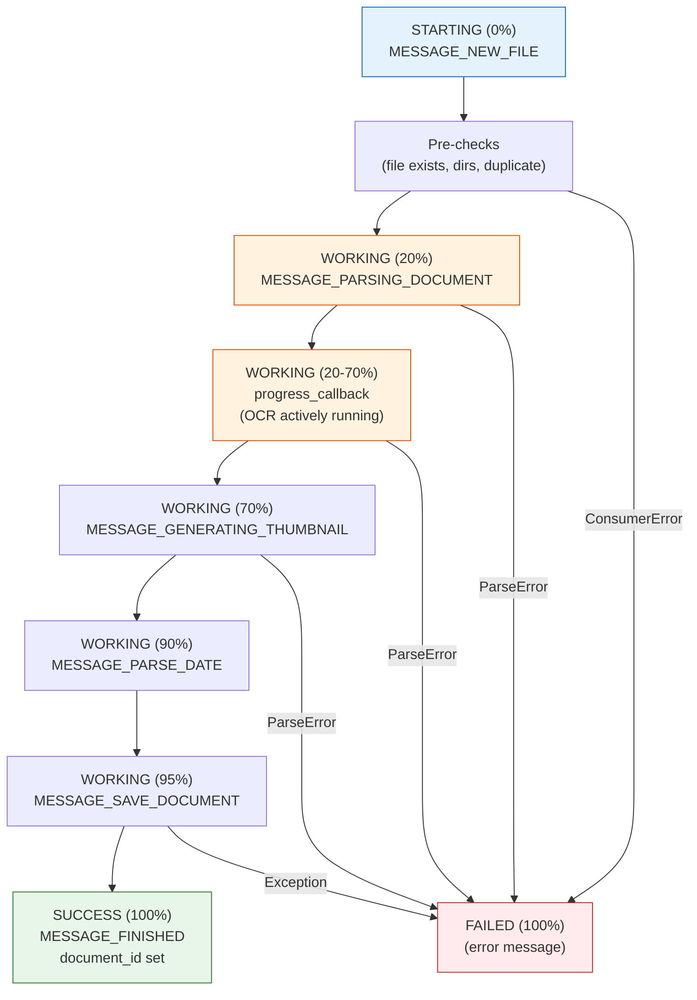
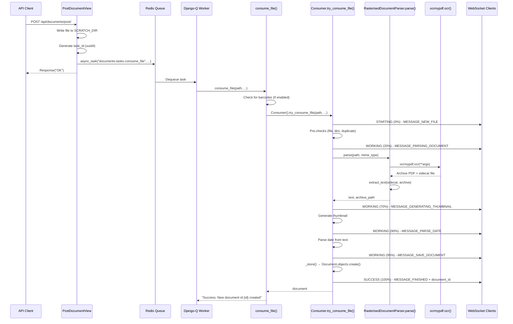
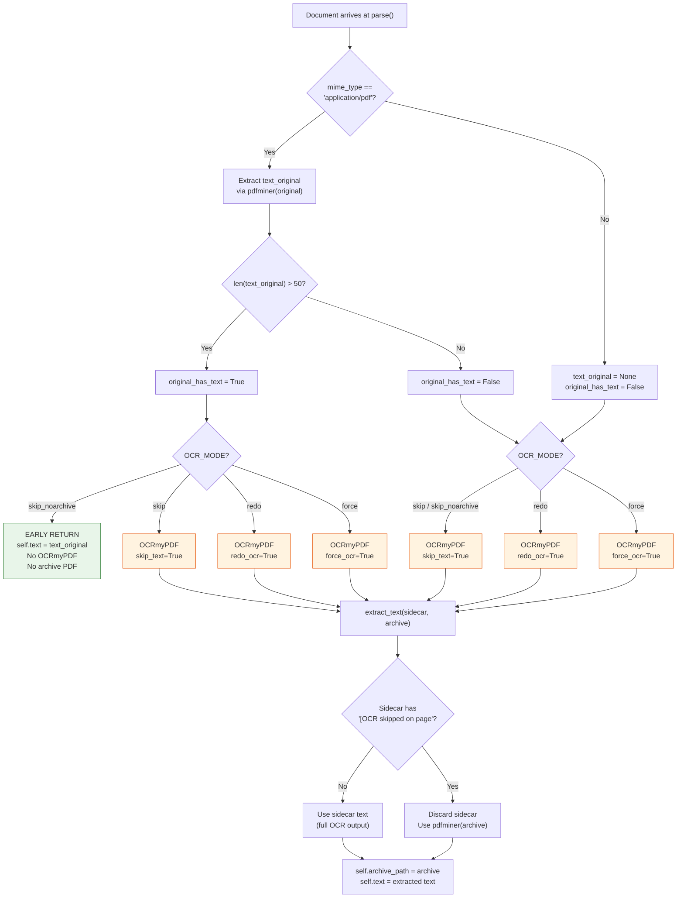
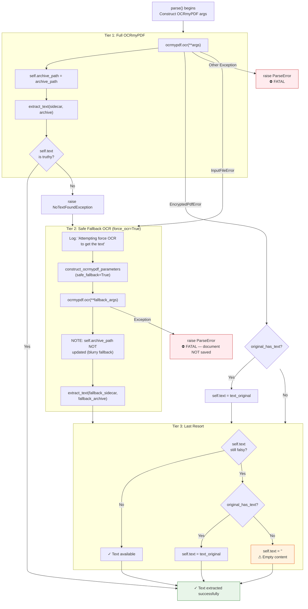

# Paperless-ngx OCR Subsystem: Runtime Behavior Analysis

## Introduction

### Scope

This document answers five specific runtime behavior questions about the OCR pipeline in paperless-ngx. Each question is addressed with code-traced evidence drawn exclusively from the paperless-ngx source repository, covering:

1. How a user can observe that OCR has started on a text-free image, and what the processing state looks like during OCR execution.
2. How background workers (Django-Q `qcluster`) behave during OCR, and what signals indicate active OCR work.
3. Whether the system skips OCR entirely when a document already contains embedded text, and how the user can tell the difference after processing completes.
4. What the final API responses look like for OCR-processed documents versus documents with pre-existing text, and which fields reveal the origin of the text.
5. What happens when OCR produces weak or incomplete results — whether the document still counts as fully processed, and how the outcome is reflected in metadata.

### Methodology

All answers in this document are derived from direct source code analysis of the paperless-ngx codebase (v1.7.0 era). **The code is treated as the single source of truth.** No assumptions are made beyond what the code explicitly implements.

Every factual behavioral claim references specific source files and line numbers using the format: `Source: <filepath>:<line-range>`. This allows readers to independently verify any claim against the repository.

### Questions Overview

| # | Theme | Question |
|---|---|---|
| Q1 | OCR Activation Visibility | How can a user observe that OCR has started on a text-free image, and what does the processing state look like? |
| Q2 | Background Worker Behavior | How do background workers behave during OCR, and what signals indicate active work? |
| Q3 | OCR Skip Behavior | When a document already contains embedded text, does the system skip OCR entirely? How can you tell the difference? |
| Q4 | API Response Comparison | What do final API responses look like for OCR-processed vs pre-existing text documents? |
| Q5 | Weak OCR Outcomes | When OCR produces weak results, what happens to the document's final state? |

---

## Q1: How Can a User Observe That OCR Has Started on a Text-Free Image?

### Thinking / Rationale

When a text-free image (e.g., a scanned JPEG with no embedded text layer) is uploaded to paperless-ngx, it flows through a multi-stage pipeline: API upload → background task dispatch → consumer ingestion → OCR parsing → storage. At each stage, the system emits observable signals — WebSocket progress messages, log entries, and state transitions — that allow a user (or monitoring system) to determine that OCR is actively running and track its progress.

The key insight is that the `Consumer` class in `src/documents/consumer.py` acts as an orchestrator that broadcasts progress updates via a WebSocket channel group, while the `RasterisedDocumentParser` in `src/paperless_tesseract/parsers.py` performs the actual OCR work. Both emit log messages that can be correlated using a UUID-based logging group.

### Upload Entry Point

When a user uploads a document via the REST API, the request is handled by `PostDocumentView.post()`.

**Source: `src/documents/views.py:497-535`**

The upload flow proceeds as follows:

1. **Request validation** (line 499-500): The serializer validates the incoming multipart form data.
2. **File persistence** (lines 510-519): The uploaded file is written to a temporary location inside `SCRATCH_DIR` using `tempfile.NamedTemporaryFile`.
3. **Task ID generation** (line 521): A unique `task_id` is created via `uuid.uuid4()`, which will identify this consumption job throughout its lifecycle.
4. **Asynchronous dispatch** (lines 523-533): The consumption job is dispatched to Django-Q via `async_task("documents.tasks.consume_file", ...)`, passing the temporary file path, override parameters, and the `task_id`.
5. **Immediate response** (line 535): The API returns `Response("OK")` immediately — the actual OCR work happens asynchronously in a background worker.

At this point, the upload is acknowledged but no OCR has started. The user must observe subsequent signals to know when OCR begins.

### Consumer Progress State Machine

The `Consumer.try_consume_file()` method implements a 10-stage pipeline that broadcasts progress updates at each stage. These updates are the primary mechanism for observing OCR activity.

**Source: `src/documents/consumer.py:180-377`**

The progress state machine proceeds through these stages:

| Stage | Progress | Status | Message Constant | Description |
|-------|----------|--------|-------------------|-------------|
| 1 | 0/100 | `STARTING` | `MESSAGE_NEW_FILE` | Task begins, file received |
| 2 | — | — | — | Pre-checks: file exists, directories exist, duplicate check (lines 211-213) |
| 3 | 20/100 | `WORKING` | `MESSAGE_PARSING_DOCUMENT` | OCR parsing begins (line 259) |
| 4 | 20-70/100 | `WORKING` | (none) | OCR progress updates via callback (lines 237-240) |
| 5 | 70/100 | `WORKING` | `MESSAGE_GENERATING_THUMBNAIL` | Thumbnail generation (line 264) |
| 6 | 90/100 | `WORKING` | `MESSAGE_PARSE_DATE` | Date extraction from text (line 274) — conditional: only fires when parser returns no date (line 273: `if not date`) |
| 7 | 95/100 | `WORKING` | `MESSAGE_SAVE_DOCUMENT` | Saving to database (line 294) |
| 8 | 100/100 | `SUCCESS` | `MESSAGE_FINISHED` | Consumption complete (line 375) |
| — | 100/100 | `FAILED` | (error message) | On any failure (line 79) |

**Source: `src/documents/consumer.py:37-49`** — The message constants are defined as module-level string constants:

```
MESSAGE_NEW_FILE = "new_file"
MESSAGE_PARSING_DOCUMENT = "parsing_document"
MESSAGE_GENERATING_THUMBNAIL = "generating_thumbnail"
MESSAGE_PARSE_DATE = "parse_date"
MESSAGE_SAVE_DOCUMENT = "save_document"
MESSAGE_FINISHED = "finished"
```

**The critical OCR observation window** is between progress 20 (stage 3) and progress 70 (stage 5). During this period, `RasterisedDocumentParser.parse()` is executing, which invokes OCRmyPDF. The progress callback (lines 237-240) maps the parser's internal progress into the 20-70 range:

```python
def progress_callback(current_progress, max_progress):
    # recalculate progress to be within 20 and 80
    p = int((current_progress / max_progress) * 50 + 20)
    self._send_progress(p, 100, "WORKING")
```

**Source: `src/documents/consumer.py:237-240`**

### WebSocket `status_update` Payload Anatomy

Each progress update is broadcast to all connected WebSocket clients via the `_send_progress()` method.

**Source: `src/documents/consumer.py:56-76`**

The payload structure is:

```json
{
  "filename": "<basename of the uploaded file>",
  "task_id": "<UUID assigned at upload time>",
  "current_progress": 0-100,
  "max_progress": 100,
  "status": "STARTING" | "WORKING" | "SUCCESS" | "FAILED",
  "message": "<MESSAGE_* constant or null>",
  "document_id": "<integer document ID or null>"
}
```

Key implementation details:

- The payload is sent to the `"status_updates"` channel group via `async_to_sync(self.channel_layer.group_send)` (lines 73-75).
- The `document_id` field is `null` for all progress updates except the final `SUCCESS` message (line 375), where it contains the newly created `document.id`.
- The `filename` field uses `os.path.basename(self.filename)` (line 65), so only the filename (not the full path) is exposed to clients.

**Source: `src/paperless/consumers.py:9-33`** — The `StatusConsumer` WebSocket consumer delivers these messages to authenticated clients:

- `connect()` (lines 13-21): Checks `self.scope["user"].is_authenticated`. If authenticated, the client joins the `"status_updates"` group. If not, the connection is denied via `DenyConnection()`.
- `status_update()` (lines 29-33): When a message arrives on the group, it sends `json.dumps(event["data"])` to the WebSocket client.

To observe OCR progress, a client opens a WebSocket connection to the `status_updates` endpoint and listens for messages where `status` is `"WORKING"` and `message` is `"parsing_document"`.

### Log Signals Indicating Active OCR

The system emits several log messages during OCR that are observable in `paperless.log`:

| Log Level | Message | Source |
|-----------|---------|--------|
| `info` | `"Consuming {filename}"` | `src/documents/consumer.py:215` |
| `debug` | `"Detected mime type: {mime_type}"` | `src/documents/consumer.py:221` |
| `debug` | `"Parsing {filename}..."` | `src/documents/consumer.py:260` |
| `debug` | `"Calling OCRmyPDF with args: {args}"` | `src/paperless_tesseract/parsers.py:260` |
| `debug` | `"Using text from sidecar file"` | `src/paperless_tesseract/parsers.py:107` |
| `info` | `"Document {document} consumption finished"` | `src/documents/consumer.py:373` |

**Log correlation**: All log entries for a single consumption run share the same UUID `logging_group`. This is implemented by the `LoggingMixin` class.

**Source: `src/documents/loggers.py:5-21`**

- `renew_logging_group()` (lines 11-12): Generates a new `uuid.uuid4()` at the start of each consumption run (called at `src/documents/consumer.py:207`).
- Every `self.log()` call passes `extra={"group": self.logging_group}` (line 21), which allows log entries to be filtered by consumption run.

To observe OCR activity in logs, search for the "Calling OCRmyPDF with args" debug message. The presence of this message confirms that OCRmyPDF has been invoked. The shared `logging_group` UUID allows you to correlate all messages belonging to the same document consumption.

### Processing State During OCR Execution

While OCR is actively running, the document's processing state (as seen via WebSocket) is:

- `status`: `"WORKING"`
- `message`: `"parsing_document"` (from the initial stage 3 broadcast) or `null` (from subsequent progress_callback broadcasts)
- `current_progress`: Between 20 and 70
- `max_progress`: 100

The document does **not yet exist** in the database at this point — it is only created later at stage 7 (`MESSAGE_SAVE_DOCUMENT`) when `Consumer._store()` calls `Document.objects.create()`.

**Source: `src/documents/consumer.py:294-301`** — The `_store()` call at line 301 is inside the `MESSAGE_SAVE_DOCUMENT` stage.

### Mermaid Diagram #1 — Consumer Progress State Machine



---

## Q2: How Do Background Workers Behave During OCR?

### Thinking / Rationale

OCR is CPU-intensive — Tesseract processes each page of a document, which can take seconds to minutes depending on page complexity and image quality. Paperless-ngx delegates this work to background workers managed by Django-Q, which runs a cluster of worker processes that dequeue tasks from a Redis-backed queue. The system carefully manages thread allocation to prevent resource exhaustion when multiple documents are being processed simultaneously.

The key design decision is that workers are **recycled after every task** (`recycle: 1`), which prevents memory leaks from accumulating across multiple OCR runs. Combined with the `OMP_THREAD_LIMIT=1` environment variable, this creates a predictable resource consumption pattern.

### Django-Q Cluster Architecture

The worker cluster is configured via the `Q_CLUSTER` dictionary in settings.

**Source: `src/paperless/settings.py:449-457`**

```python
Q_CLUSTER = {
    "name": "paperless",
    "catch_up": False,
    "recycle": 1,
    "retry": PAPERLESS_WORKER_RETRY,
    "timeout": PAPERLESS_WORKER_TIMEOUT,
    "workers": TASK_WORKERS,
    "redis": os.getenv("PAPERLESS_REDIS", "redis://localhost:6379"),
}
```

Configuration details:

| Parameter | Value | Source | Meaning |
|-----------|-------|--------|---------|
| `name` | `"paperless"` | Line 450 | Cluster identifier |
| `catch_up` | `False` | Line 451 | Don't replay missed scheduled tasks |
| `recycle` | `1` | Line 452 | Workers recycle (restart) after every single task, preventing memory leaks from OCR |
| `retry` | `PAPERLESS_WORKER_RETRY` (default: 1810s) | Lines 444-447, 453 | Time before a task is retried if no result received |
| `timeout` | `PAPERLESS_WORKER_TIMEOUT` (default: 1800s = 30 min) | Lines 440, 454 | Maximum time a single task can run |
| `workers` | `TASK_WORKERS` | Lines 438, 455 | Number of concurrent worker processes |
| `redis` | `PAPERLESS_REDIS` env var (default: `redis://localhost:6379`) | Line 456 | Redis broker URL |

**Worker count calculation** (`TASK_WORKERS`):

**Source: `src/paperless/settings.py:427-438`**

The `default_task_workers()` function (lines 427-435) computes: if CPU cores < 4, use all cores; otherwise use `floor(sqrt(cpu_count))`. This means:
- 1 core → 1 worker
- 2 cores → 2 workers
- 4 cores → 2 workers
- 8 cores → 2 workers
- 16 cores → 4 workers

**Timeout and retry relationship**:

**Source: `src/paperless/settings.py:440-447`**

`PAPERLESS_WORKER_TIMEOUT` defaults to 1800 seconds (30 minutes). `PAPERLESS_WORKER_RETRY` defaults to `PAPERLESS_WORKER_TIMEOUT + 10` (1810 seconds). Per Django-Q documentation, retry must be greater than timeout to avoid premature task retry while a task is still running.

### Worker Lifecycle for a `consume_file` Task

The dispatch chain from API upload to OCR execution:

1. **API dispatch** (`src/documents/views.py:523-533`): `PostDocumentView.post()` calls `async_task("documents.tasks.consume_file", ...)`, which serializes the task and pushes it to the Redis queue.

2. **Worker dequeue**: A Django-Q `qcluster` worker process picks up the task from Redis. The worker is a separate OS process, not a thread.

3. **Task execution** (`src/documents/tasks.py:184-252`): The `consume_file()` function runs:
   - **Barcode check** (lines 195-233): If `CONSUMER_ENABLE_BARCODES` is True, scans for barcode separators. If found, splits the document and sends a SUCCESS WebSocket notification for the split (lines 217-232), then returns early.
   - **Consumer invocation** (lines 236-244): Creates a `Consumer()` instance and calls `try_consume_file()` with all override parameters.
   - **Result handling** (lines 246-252): Returns a success string with the new document ID, or raises `ConsumerError` if consumption failed.

4. **Worker recycling**: After the task completes (success or failure), the worker process is recycled (`recycle: 1`) — Django-Q terminates the worker process and starts a fresh one for the next task.

### Thread Allocation and `OMP_THREAD_LIMIT`

The system carefully manages thread parallelism at two levels:

**Level 1 — OCRmyPDF thread pool** (`THREADS_PER_WORKER`):

**Source: `src/paperless/settings.py:460-472`**

`default_threads_per_worker()` (lines 460-466) computes `floor(cpu_count / TASK_WORKERS)`, minimum 1. This value is passed to OCRmyPDF as the `jobs` parameter.

**Source: `src/paperless_tesseract/parsers.py:148-149`**

```python
"use_threads": True,
"jobs": settings.THREADS_PER_WORKER,
```

The `use_threads: True` flag (line 148) is required because Django-Q workers are daemonized processes, and OCRmyPDF cannot fork child processes from a daemon — it must use threads instead.

**Level 2 — Tesseract core allocation** (`OMP_THREAD_LIMIT`):

**Source: `src/paperless_tesseract/parsers.py:230-232`**

```python
def parse(self, document_path, mime_type, file_name=None):
    # This forces tesseract to use one core per page.
    os.environ["OMP_THREAD_LIMIT"] = "1"
```

This environment variable constrains Tesseract's OpenMP parallelism to exactly one thread per page. Without this, Tesseract would attempt to use all available cores for each page, causing contention when multiple workers are active.

**Combined effect**: If a system has 8 cores with 2 workers and 4 threads per worker, OCRmyPDF processes 4 pages simultaneously per worker, with each page using exactly 1 core — totaling up to 8 cores fully utilized across both workers.

### Signals Indicating Active OCR Work

Multiple observable signals indicate that OCR is actively running in a background worker:

1. **WebSocket progress updates**: As documented in Q1, `status_update` messages with `status="WORKING"` and progress between 20-70 indicate active OCR. These are emitted by `Consumer._send_progress()`.

2. **Log entries**: The `"Calling OCRmyPDF with args: {args}"` debug message (Source: `src/paperless_tesseract/parsers.py:260`) confirms OCRmyPDF invocation. All log entries for the consumption share a UUID `logging_group` (Source: `src/documents/loggers.py:11-12`).

3. **Django-Q task records**: Django-Q tracks task state in its ORM-backed task table. Tasks transition from `Queued` → `Started` → `Success`/`Failed`. The task name matches `os.path.basename(doc_name)[:100]` (Source: `src/documents/views.py:532`).

4. **Process-level signals**: The `qcluster` worker process will show CPU activity proportional to `THREADS_PER_WORKER` × the number of active pages being OCR'd. The `OMP_THREAD_LIMIT=1` constraint ensures predictable per-page CPU usage.

### Mermaid Diagram #2 — Task Dispatch Flow



---

## Q3: When an Image Already Contains Embedded Text, Does the System Skip OCR?

### Thinking / Rationale

The answer depends entirely on the `PAPERLESS_OCR_MODE` configuration setting. The system implements four distinct OCR modes, each with different behavior when encountering a document that already contains text. The modes range from "always force OCR" to "skip OCR entirely when text exists." Understanding which mode is active is essential to predicting whether OCRmyPDF will be invoked.

The critical code path is in `RasterisedDocumentParser.parse()` (Source: `src/paperless_tesseract/parsers.py:230-328`), which first checks for existing text in the original document (for PDFs only), then decides based on `OCR_MODE` whether to invoke OCRmyPDF, and finally determines the source of the document's text content.

A subtle but important detail: even when `OCR_MODE="skip"` is set and OCRmyPDF "skips" text-bearing pages, OCRmyPDF **still runs** — it just passes through pages that already have text. This is different from `skip_noarchive`, which can bypass OCRmyPDF entirely.

### OCR_MODE Decision Matrix

The `OCR_MODE` setting (default: `"skip"`) controls how OCRmyPDF processes documents.

**Source: `src/paperless/settings.py:522`**

```python
OCR_MODE = os.getenv("PAPERLESS_OCR_MODE", "skip")
```

The mode maps to OCRmyPDF flags in `construct_ocrmypdf_parameters()`.

**Source: `src/paperless_tesseract/parsers.py:155-162`**

| OCR_MODE | OCRmyPDF Invoked? | OCRmyPDF Flag | Sidecar Has `[OCR skipped`? | Archive PDF Created? | Text Source |
|----------|-------------------|---------------|------------------------------|----------------------|-------------|
| `skip` (default) | **Yes** | `skip_text=True` | Yes (for text-bearing pages) | Yes | pdfminer extraction of archive PDF (sidecar discarded) |
| `skip_noarchive` | **Depends** — if `original_has_text` is True, OCRmyPDF is **NOT** invoked at all | `skip_text=True` (when invoked) | N/A or Yes | No (when skipped) / Yes (when invoked) | `text_original` from pdfminer (when skipped) / pdfminer of archive (when invoked) |
| `redo` | **Yes** | `redo_ocr=True` | No (replaces existing OCR) | Yes | Sidecar file or pdfminer extraction |
| `force` | **Yes** | `force_ocr=True` | No (forces OCR on all pages) | Yes | Sidecar file or pdfminer extraction |

### The `skip_noarchive` Early-Return Path

This is the **only** OCR mode that can completely bypass OCRmyPDF invocation.

**Source: `src/paperless_tesseract/parsers.py:241-244`**

```python
if settings.OCR_MODE == "skip_noarchive" and original_has_text:
    self.log("debug", "Document has text, skipping OCRmyPDF entirely.")
    self.text = text_original
    return
```

**Conditions for this path to trigger:**

1. `OCR_MODE` must be `"skip_noarchive"`.
2. `original_has_text` must be `True`.

**How `original_has_text` is determined** (Source: `src/paperless_tesseract/parsers.py:234-239`):

- For PDF files (line 234-236): `text_original` is extracted via pdfminer from the original document. `original_has_text = text_original and len(text_original) > 50`. The threshold is **50 characters** — documents with fewer than 50 characters of extractable text are treated as text-free.
- For images (lines 237-239): `text_original = None` and `original_has_text = False`. Images **never** trigger the early return because they cannot contain embedded text in the pdfminer sense.

**When this path triggers:**
- `self.text = text_original` — the text comes from pdfminer extraction of the original file.
- The method returns immediately — no OCRmyPDF invocation, no sidecar file, no archive PDF.
- Log message: `"Document has text, skipping OCRmyPDF entirely."` at debug level.

### Sidecar File Analysis and `[OCR skipped on page` Detection

When OCRmyPDF runs in `skip` mode, it generates a sidecar text file. For pages that already contain text, the sidecar file contains `[OCR skipped on page N]` markers instead of OCR output. The `extract_text()` method handles this.

**Source: `src/paperless_tesseract/parsers.py:99-133`**

The logic:

1. **Read sidecar file** (lines 100-102): Opens and reads the sidecar file content.
2. **Check for skip markers** (line 104): `if "[OCR skipped on page" not in text:` — if the marker is **absent**, the sidecar text is complete and usable.
   - **Marker absent** (lines 107-108): Log `"Using text from sidecar file"`, return the processed sidecar text. This means OCR was performed on all pages.
   - **Marker present** (line 110): Log `"Incomplete sidecar file: discarding."` — the sidecar is incomplete because some pages were skipped.
3. **Fallback to pdfminer** (lines 117-133): If the sidecar was discarded, pdfminer.six extracts text directly from the PDF file. This extracts **all** text — both pre-existing text and any OCR text layer added by OCRmyPDF.
4. **Failure case** (lines 124-133): If pdfminer fails, returns `None`.

**Critical insight**: In `skip` mode with a text-bearing PDF, the sidecar file is **always discarded** because it contains `[OCR skipped on page` markers. The text instead comes from pdfminer extraction of the archive PDF, which contains both the original text and any OCR text added to previously text-free pages.

### How to Tell the Difference After Processing

After consumption completes, the following fields on the `Document` model reveal whether OCRmyPDF ran:

**Source: `src/documents/models.py:186-194, 237-239`**

| Field | OCRmyPDF Ran (skip/redo/force) | skip_noarchive Skipped |
|-------|-------------------------------|----------------------|
| `archive_filename` | Present (e.g., `"0000001.pdf"`) | `None` |
| `archive_checksum` | Present (MD5 hash) | `None` |
| `has_archive_version` | `True` | `False` |
| `content` | Contains text (from sidecar or pdfminer) | Contains text (from pdfminer of original) |

The `has_archive_version` property (lines 238-239) is defined as:

```python
@property
def has_archive_version(self):
    return self.archive_filename is not None
```

**The strongest diagnostic signal** is `archive_filename`: if it is `None`, either `skip_noarchive` skipped OCRmyPDF or an error occurred during archive creation. If it is present, OCRmyPDF produced an archive PDF.

The `content` field alone does **not** reveal the text source — both OCR-extracted and pdfminer-extracted text end up in the same field.

### Mermaid Diagram #3 — OCR Decision Tree



---

## Q4: What Do Final API Responses Look Like for OCR-Processed vs Pre-Existing Text Documents?

### Thinking / Rationale

Two API endpoints expose a document's state after processing: the document detail endpoint (`/api/documents/<id>/`) and the metadata endpoint (`/api/documents/<id>/metadata/`). The key insight is that the **archive-related fields** are the primary differentiators between OCR-processed and non-OCR documents. The `content` field contains extracted text regardless of its origin, so it alone cannot reveal whether OCR was performed.

To understand the API response shape, we need to trace the `DocumentSerializer` class and the `metadata()` action method.

### Document Endpoint Field Anatomy (`/api/documents/<id>/`)

**Source: `src/documents/serialisers.py:201-235`**

The `DocumentSerializer` exposes the following fields (lines 222-235):

```python
fields = (
    "id",
    "correspondent",
    "document_type",
    "title",
    "content",
    "tags",
    "created",
    "modified",
    "added",
    "archive_serial_number",
    "original_file_name",
    "archived_file_name",
)
```

Key field behaviors:

- **`content`** (line 227): Returns `Document.content` — the extracted text as a string. This field does **not** indicate whether the text came from OCR or was pre-existing.

- **`original_file_name`** (lines 207, 210-211): Calls `obj.get_public_filename()` — returns the human-readable filename. Always present.

- **`archived_file_name`** (lines 207-208, 213-217):

  ```python
  def get_archived_file_name(self, obj):
      if obj.has_archive_version:
          return obj.get_public_filename(archive=True)
      else:
          return None
  ```

  Returns the archive PDF filename (e.g., `"2023-01-01 Correspondent Title.pdf"`) when an archive version exists, or `null` when it does not. **This is the primary OCR indicator in this endpoint.**

### Metadata Endpoint Field Anatomy (`/api/documents/<id>/metadata/`)

**Source: `src/documents/views.py:282-310`**

The `metadata()` action constructs a dictionary with both unconditional and conditional fields:

**Always-present fields** (lines 289-298):

| Field | Value | Description |
|-------|-------|-------------|
| `original_checksum` | `doc.checksum` | MD5 of original file |
| `original_size` | `self.get_filesize(doc.source_path)` | Size in bytes of original |
| `original_mime_type` | `doc.mime_type` | MIME type of original |
| `media_filename` | `doc.filename` | Storage filename |
| `has_archive_version` | `doc.has_archive_version` | Boolean: archive PDF exists? |
| `original_metadata` | PDF metadata array | Extracted PDF metadata |
| `archive_checksum` | `doc.archive_checksum` | MD5 of archive PDF, or `None` |
| `archive_media_filename` | `doc.archive_filename` | Archive storage filename, or `None` |

**Conditional fields** (lines 300-308):

```python
if doc.has_archive_version:
    meta["archive_size"] = self.get_filesize(doc.archive_path)
    meta["archive_metadata"] = self.get_metadata(doc.archive_path, "application/pdf")
else:
    meta["archive_size"] = None
    meta["archive_metadata"] = None
```

When `has_archive_version` is `False`, both `archive_size` and `archive_metadata` are explicitly set to `None`.

### Side-by-Side API Response Comparison

The following table compares the API response fields for two scenarios:
- **Column A**: An image (JPEG) uploaded and OCR-processed (OCR_MODE=`skip`, produces archive PDF)
- **Column B**: A text-bearing PDF uploaded with OCR_MODE=`skip_noarchive` (OCRmyPDF skipped entirely)

| Field | A: OCR-Processed Image | B: Text-Bearing PDF (skip_noarchive) |
|-------|----------------------|--------------------------------------|
| **Document endpoint** (`/api/documents/<id>/`) | | |
| `content` | `"<OCR-extracted text>"` | `"<pdfminer-extracted text>"` |
| `original_file_name` | `"scan.jpg"` | `"invoice.pdf"` |
| `archived_file_name` | `"2023-01-01 Title.pdf"` | `null` |
| **Metadata endpoint** (`/api/documents/<id>/metadata/`) | | |
| `original_mime_type` | `"image/jpeg"` | `"application/pdf"` |
| `has_archive_version` | `true` | `false` |
| `archive_checksum` | `"a1b2c3d4..."` | `null` |
| `archive_media_filename` | `"0000001.pdf"` | `null` |
| `archive_size` | `152340` (bytes) | `null` |
| `archive_metadata` | `[{"namespace": "...", "key": "...", "value": "..."}]` | `null` |
| `original_checksum` | `"e5f6g7h8..."` | `"i9j0k1l2..."` |
| `original_size` | `89420` (bytes) | `245670` (bytes) |

### Fields That Reveal OCR-Generated vs Existing Text

**Primary indicators** (strongest to weakest):

1. **`has_archive_version`** (boolean): The clearest signal. `true` means OCRmyPDF produced an archive PDF. `false` means it was skipped (or failed).

2. **`archived_file_name`** / **`archive_media_filename`**: Non-null values confirm an archive PDF exists — a direct product of OCRmyPDF execution.

3. **`archive_checksum`**: Non-null confirms an archive PDF was stored and its integrity recorded.

4. **`original_mime_type`** combined with archive presence: An image (`image/jpeg`, `image/png`, etc.) with `has_archive_version=true` **always** went through OCR, since images cannot have pre-existing text. A PDF with `has_archive_version=false` under `skip_noarchive` mode had text extracted directly without OCR.

**Not an indicator:**

- **`content`**: Contains text regardless of source. There is no field or flag within the content that identifies whether the text was OCR-generated or pre-existing.

---

## Q5: What Happens When OCR Produces Weak or Incomplete Results?

### Thinking / Rationale

OCR can produce weak results for many reasons: poor image quality, unusual fonts, skewed pages, or low resolution. The system accounts for this by implementing a **three-tier fallback chain** that progressively tries harder to extract text. Critically, even if all tiers produce empty text, the document is **still saved** with a `SUCCESS` status and a valid `document_id`. The only scenario that prevents document creation is a `ParseError` exception, which occurs when even the fallback OCR attempt fails catastrophically.

This means a document with empty `content` is not an error — it's a valid, fully processed document that simply had no extractable text.

### Three-Tier Fallback Chain Walkthrough

The fallback logic is implemented in `RasterisedDocumentParser.parse()`.

**Source: `src/paperless_tesseract/parsers.py:259-327`**

#### Tier 1 — Full OCRmyPDF (lines 259-267)

```python
try:
    self.log("debug", f"Calling OCRmyPDF with args: {args}")
    ocrmypdf.ocr(**args)

    self.archive_path = archive_path
    self.text = self.extract_text(sidecar_file, archive_path)

    if not self.text:
        raise NoTextFoundException("No text was found in the original document")
```

- OCRmyPDF runs with the configured mode flags.
- `self.archive_path` is set to the produced archive PDF (line 263).
- Text is extracted from the sidecar file or archive PDF (line 264).
- If no text is found, `NoTextFoundException` is raised (lines 266-267), triggering Tier 2.

#### Tier 1 — EncryptedPdfError Branch (lines 268-275)

```python
except EncryptedPdfError:
    self.log(
        "warning",
        "This file is encrypted, OCR is impossible. Using "
        "any text present in the original file.",
    )
    if original_has_text:
        self.text = text_original
```

- Encrypted PDFs cannot be OCR'd. If the original had extractable text (pre-encryption text layer), it is used. Otherwise, `self.text` remains `None`, which will be handled by Tier 3.
- No archive PDF is produced for encrypted files (self.archive_path is not set).

#### Tier 2 — Safe Fallback OCR (lines 276-310)

```python
except (NoTextFoundException, InputFileError) as e:
    self.log(
        "warning",
        f"Encountered an error while running OCR: {str(e)}. "
        f"Attempting force OCR to get the text.",
    )

    archive_path_fallback = os.path.join(self.tempdir, "archive-fallback.pdf")
    sidecar_file_fallback = os.path.join(self.tempdir, "sidecar-fallback.txt")

    args = self.construct_ocrmypdf_parameters(
        document_path, mime_type,
        archive_path_fallback, sidecar_file_fallback,
        safe_fallback=True,
    )

    try:
        self.log("debug", f"Fallback: Calling OCRmyPDF with args: {args}")
        ocrmypdf.ocr(**args)

        # Don't return the archived file here, since this file
        # is bigger and blurry due to --force-ocr.

        self.text = self.extract_text(
            sidecar_file_fallback, archive_path_fallback,
        )

    except Exception as e:
        # If this fails, we have a serious issue at hand.
        raise ParseError(f"{e.__class__.__name__}: {str(e)}")
```

Key details:

- **Triggered by** `NoTextFoundException` (no text from Tier 1) or `InputFileError` (OCRmyPDF couldn't process the input).
- **`safe_fallback=True`** causes `construct_ocrmypdf_parameters()` to set `force_ocr=True` (Source: line 155: `if settings.OCR_MODE == "force" or safe_fallback:`), which forces OCR on every page regardless of existing text.
- **Archive not used** (lines 300-301): The comment explains: "Don't return the archived file here, since this file is bigger and blurry due to --force-ocr." The `self.archive_path` still points to the Tier 1 archive (if any), not the fallback.
- **Fatal failure** (lines 308-310): If the fallback OCR also fails, a `ParseError` is raised. This is **fatal** — the document is NOT saved, and the consumer reports `FAILED`.

#### Tier 2 — Generic Exception Handler (lines 312-314)

```python
except Exception as e:
    # Anything else is probably serious.
    raise ParseError(f"{e.__class__.__name__}: {str(e)}")
```

Any exception not caught by the specific handlers above becomes a `ParseError` and is fatal.

#### Tier 3 — Last Resort (lines 316-327)

```python
# As a last resort, if we still don't have any text for any reason,
# try to extract the text from the original document.
if not self.text:
    if original_has_text:
        self.text = text_original
    else:
        self.log(
            "warning",
            f"No text was found in {document_path}, the content will "
            f"be empty.",
        )
        self.text = ""
```

- Runs **after** all try/except blocks, regardless of which path was taken.
- If `self.text` is still falsy (None, empty string, or whitespace-only):
  - If the original had text: use `text_original` from pdfminer (line 320).
  - Otherwise: set `self.text = ""` (line 327) — **an empty string, not `None`**.
- The warning log `"No text was found in {document_path}, the content will be empty."` is emitted at lines 323-325.

### Empty Content Path and Database Representation

When `self.text = ""` (line 327), the empty string flows through the system:

1. **Parser returns text**: `document_parser.get_text()` (Source: `src/documents/parsers.py:342-343`) returns `self.text`, which is `""`.

2. **Consumer receives text**: At `src/documents/consumer.py:271`, `text = document_parser.get_text()` receives the empty string.

3. **Consumer stores document**: At `src/documents/consumer.py:301`, `self._store(text=text, date=date, mime_type=mime_type)` is called.

4. **Document created in database**: In `_store()` (Source: `src/documents/consumer.py:398-406`):

   ```python
   document = Document.objects.create(
       title=(self.override_title or file_info.title)[:127],
       content=text,  # ← empty string ""
       mime_type=mime_type,
       checksum=hashlib.md5(f.read()).hexdigest(),
       created=created,
       modified=created,
       storage_type=storage_type,
   )
   ```

5. **Database field**: `Document.content` (Source: `src/documents/models.py:117-124`) is defined as `TextField(blank=True)` — it accepts and stores the empty string `""`.

### Does the Document Still Count as "Fully Processed"?

**Yes.** A document with empty content is fully processed and valid.

**Source: `src/documents/consumer.py:306-311, 375`**

The consumption pipeline proceeds through all remaining stages after parsing:

1. **`document_consumption_finished` signal fires** (lines 306-311): This triggers all 6 signal handlers wired in `src/documents/apps.py:22-27`:

   | Handler | Purpose | Source |
   |---------|---------|--------|
   | `add_inbox_tags` | Adds inbox tags | `src/documents/apps.py:22` |
   | `set_correspondent` | Auto-assigns correspondent via classifier | `src/documents/apps.py:23` |
   | `set_document_type` | Auto-assigns document type via classifier | `src/documents/apps.py:24` |
   | `set_tags` | Auto-assigns tags via classifier | `src/documents/apps.py:25` |
   | `set_log_entry` | Creates a log entry for the consumption | `src/documents/apps.py:26` |
   | `add_to_index` | Adds document to the search index | `src/documents/apps.py:27` |

2. **Archive file handling** (lines 327-342): If an archive path exists, it is stored. If not (e.g., `skip_noarchive` skipped, or encrypted PDF), this step is skipped.

3. **SUCCESS progress** (line 375): `self._send_progress(100, 100, "SUCCESS", MESSAGE_FINISHED, document.id)` — the document gets a valid `document.id`.

Within the parser's scope, `ParseError` is the primary failure mechanism that prevents document creation. However, `FAILED` status can also result from consumer-level exceptions:

- **Parser-level**: Tier 2 fallback OCR fails catastrophically, raising `ParseError` (line 310); or a generic unhandled exception in the parser raises `ParseError` (lines 312-314).
- **Consumer-level**: File not found (`_fail()` at lines 96-100), duplicate document detected (`pre_check_duplicate()`), unsupported MIME type (`_fail()` at line 225), database or file I/O errors (`_fail()` at lines 362-367).

### Sanity Checker Behavior for Empty-Content Documents

The sanity checker inspects all documents for integrity issues.

**Source: `src/documents/sanity_checker.py:127-128`**

```python
if not doc.content:
    messages.info(f"Document {doc.pk} has no content.")
```

Key observations:

- The check uses `not doc.content` — since `""` (empty string) is falsy in Python, this condition is `True` for documents with empty content.
- The message is at `info` level (line 128 calls `messages.info()`), **not** `error` or `warning`. Compare with the `SanityCheckMessages` class (lines 14-21) which distinguishes between `error()`, `warning()`, and `info()`.
- The `has_error()` method (line 38-39) only returns `True` for `logging.ERROR` level messages. An `info`-level message does **not** constitute a sanity check failure.

**Conclusion**: Empty content is a noted condition (informational), not a failure. The document remains valid and fully functional in the system.

### Metadata Reflection of Weak OCR

After processing, the document's metadata reflects the OCR outcome:

| Scenario | `content` | `has_archive_version` | `archive_checksum` | Observable Indicators |
|----------|-----------|----------------------|--------------------|-----------------------|
| Tier 1 success, strong text | Full text | `True` | Present | Normal processing |
| Tier 1 success, weak text | Sparse/partial text | `True` | Present | Short `content` field |
| Tier 2 fallback used | Text from fallback OCR | Depends: `True` if triggered by `NoTextFoundException` (Tier 1 set `self.archive_path` at line 263 before raising); `False` if triggered by `InputFileError` (line 261 raises before line 263 executes, so `self.archive_path` remains `None`) | Present (from Tier 1 archive if available) | Warning in logs: "Encountered an error while running OCR" |
| Tier 3: original text used | Original pdfminer text | Depends on Tier 1/2 | Depends | Warning in logs |
| Tier 3: empty content | `""` (empty string) | Depends on Tier 1/2 | Depends | Warning: "No text was found...content will be empty"; sanity checker info message |
| ParseError (fatal) | N/A — document not created | N/A | N/A | `FAILED` status, `ConsumerError` raised |

**Important**: There is no dedicated field or flag that distinguishes "OCR succeeded with weak results" from "OCR succeeded with good results." The `content` field length is the only direct evidence of OCR quality. A short or empty `content` field combined with `has_archive_version=True` suggests OCR ran but produced minimal output.

### Mermaid Diagram #4 — Three-Tier OCR Fallback Chain



---

## Summary and Quick-Reference Table

### Quick-Reference: Answers at a Glance

| Question | Key Signal | Where to Observe | Primary Source Reference |
|----------|-----------|------------------|------------------------|
| Q1: OCR started? | `status="WORKING"`, `message="parsing_document"`, progress 20-70 | WebSocket `status_updates` channel; `paperless.log` | `src/documents/consumer.py:259` |
| Q2: Worker active? | `qcluster` process CPU activity; Django-Q task state transitions; `"Calling OCRmyPDF"` log | Process monitor; Django-Q admin; `paperless.log` | `src/documents/tasks.py:236-244` |
| Q3: OCR skipped? | `has_archive_version` is `False`; `archived_file_name` is `null` | `/api/documents/<id>/metadata/`; `/api/documents/<id>/` | `src/paperless_tesseract/parsers.py:241-244` |
| Q4: OCR vs pre-existing text? | `has_archive_version`, `archive_checksum`, `archived_file_name` | `/api/documents/<id>/metadata/` | `src/documents/views.py:282-310` |
| Q5: Weak OCR outcome? | `content` is empty/short; sanity checker `info` message; `SUCCESS` status still reached | `/api/documents/<id>/`; sanity check report; WebSocket | `src/paperless_tesseract/parsers.py:316-327` |

### OCR Mode Configuration Matrix

| OCR_MODE | OCRmyPDF Flag | Archive PDF Created | Text Source (text-bearing PDF) | Text Source (text-free image) | Config |
|----------|---------------|--------------------|---------------------------------|-------------------------------|--------|
| `skip` (default) | `skip_text=True` | Yes | pdfminer of archive (sidecar discarded due to `[OCR skipped` markers) | Sidecar file (full OCR output) | `src/paperless/settings.py:522` |
| `skip_noarchive` | `skip_text=True` (or skipped entirely) | No (when text exists) / Yes (when no text) | `text_original` via pdfminer of original (OCRmyPDF not invoked) | Sidecar or pdfminer of archive | `src/paperless/settings.py:522` |
| `redo` | `redo_ocr=True` | Yes | Sidecar file (existing OCR replaced) | Sidecar file (full OCR output) | `src/paperless/settings.py:522` |
| `force` | `force_ocr=True` | Yes | Sidecar file (all pages re-OCR'd) | Sidecar file (full OCR output) | `src/paperless/settings.py:522` |

**Notes:**
- The `skip_noarchive` mode is the only mode that can bypass OCRmyPDF entirely (Source: `src/paperless_tesseract/parsers.py:241-244`).
- The `original_has_text` threshold is 50 characters (Source: `src/paperless_tesseract/parsers.py:236`).
- Images always have `original_has_text = False` because pdfminer cannot extract text from image formats (Source: `src/paperless_tesseract/parsers.py:237-239`).
- The `sidecar` parameter is only set when `OCR_PAGES` is 0 (default); otherwise sidecar is not generated (Source: `src/paperless_tesseract/parsers.py:181-185`).

### Key Architectural Patterns

| Pattern | Implementation | Source |
|---------|---------------|--------|
| Progress broadcasting | `Consumer._send_progress()` → Channels group_send → `StatusConsumer` → WebSocket clients | `src/documents/consumer.py:56-76`, `src/paperless/consumers.py:29-33` |
| Log correlation | UUID-based `logging_group` via `LoggingMixin` | `src/documents/loggers.py:5-21` |
| Task dispatch | `async_task()` → Redis → Django-Q `qcluster` worker → `consume_file()` | `src/documents/views.py:523-533`, `src/documents/tasks.py:184-252` |
| Parser selection | `document_consumer_declaration` signal → weight-based parser selection | `src/documents/parsers.py:81-98`, `src/paperless_tesseract/signals.py:7-19` |
| Post-consumption hooks | `document_consumption_finished` signal → 6 handlers | `src/documents/signals/__init__.py:4`, `src/documents/apps.py:22-27` |
| OCR fallback chain | Tier 1 (normal) → Tier 2 (force_ocr) → Tier 3 (original text or empty) | `src/paperless_tesseract/parsers.py:259-327` |
| Thread management | `OMP_THREAD_LIMIT=1` + `THREADS_PER_WORKER` → controlled parallelism | `src/paperless_tesseract/parsers.py:232`, `src/paperless/settings.py:469-472` |
