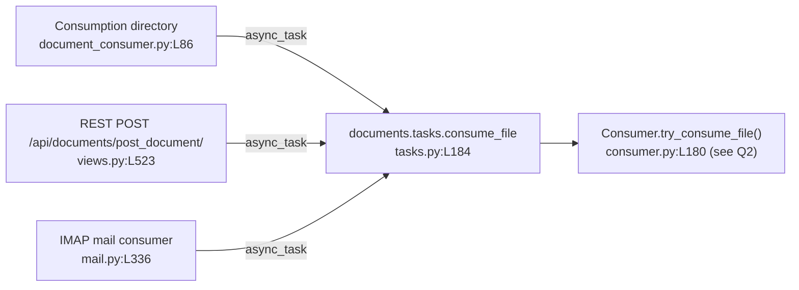

# How a document flows through paperless-ngx — an evidence-first walkthrough

- **Repository:** paperless-ngx
- **Pinned commit (HEAD):** `542221a38dff06361e07976452f9aea24d210542`
- **Source branch:** `paperless-ngx_542221a38dff`
- **How this document was produced:** every behavioural claim below was obtained by **building and running** the relevant code path in the default canonical configuration, capturing the **actual, unedited** output, and only then writing. Each claim pairs the exact command, its real captured output, a `function/class` + `file:line` citation, and cause→effect reasoning. Nothing here is inferred from reading alone unless explicitly labelled "inferred".

---

## The questions being answered

This document answers, verbatim, the following questions:

> **Q1.** "How does a new document usually enter paperless-ngx. Once a document is received, what are the main stages it goes through before it's fully processed and available, are there any background jobs and what is used for background execution."
>
> **Q2 (metadata).** "What metadata fields are saved, and which ones are absolutely required versus optional or derived later during runtime-processing. Can you show with a runtime example?"
>
> **Q3 (organisation).** "how ... tags, correspondents, and document types are used together to organize documents in a practical way."
>
> **Q4 (constraint).** "Please don't make any changes to the repository itself. You can create temporary scripts for testing if needed but do clean them up once you're done."

(Q1's compound question — stages + background jobs + execution engine — is answered in full under the heading **Q2 — Processing stages, background jobs, and the execution engine** further below. The metadata question is answered under **Q3 — Metadata model**, and the organisation question under **Q4 — Organising with tags, correspondents, and document types**, to keep each self-contained.)

The read-only constraint (Q4 above) **was honoured**: no existing repository file was modified, created, or deleted. The only artefact added is this Markdown document (and the `blitzy/`, `blitzy/documentation/` directories that hold it). All temporary observation scripts were created outside the tracked tree (under `/tmp`) and removed. See **Coverage & cleanup** at the end for the `git status` proof.

---

## How the instance was built and run (canonical configuration)

paperless-ngx is a monolithic Django application under `src/`. Its background-execution engine is **Django-Q** with a **Redis** broker, and its default database is **SQLite** — so the fully canonical default profile is **SQLite + Redis**, needing no external database server.

The canonical runtime is **Python 3.9** (`Dockerfile:L18` → `FROM python:3.9-slim-bullseye as main-app`). This investigation ran under a repository-root virtualenv pinned to **Python 3.9.25**, i.e. the canonical major/minor version, so the observed values below are canonical (no Python-version caveat is required).

To keep the shared database clean and to obtain a genuine empty "before" state, the instance was run against an **isolated** data/media/consumption directory set and an isolated Redis logical database (`redis://localhost:6379/5`). The canonical default Redis URL, when no environment override is set, is `redis://localhost:6379` (`src/paperless/settings.py:L456`); the `/5` suffix was used **only** for test isolation and changes nothing about the code paths exercised.

Exact environment used for every command below:

```
export DJANGO_SETTINGS_MODULE=paperless.settings
export PAPERLESS_REDIS="redis://localhost:6379/5"     # canonical default is redis://localhost:6379; /5 = test isolation only
export PAPERLESS_DATA_DIR=/tmp/pl_obs/data            # SQLite DB + Whoosh index live here
export PAPERLESS_MEDIA_ROOT=/tmp/pl_obs/media
export PAPERLESS_CONSUMPTION_DIR=/tmp/pl_obs/consume
export PAPERLESS_SCRATCH_DIR=/tmp/pl_obs/scratch
source venv/bin/activate                              # Python 3.9.25 (canonical 3.9)
cd src
```

Required services confirmed present: **Redis** (`redis-cli ping` → `PONG`) and **Tesseract 5.5.0** (used by the default PDF/image parser). The database was created and migrated with `python manage.py migrate` (output shown under Q2), and a superuser `admin` plus the migration-seeded `consumer` user were present.

> **One honest environment caveat (does not affect any answer):** during PDF thumbnail generation, ImageMagick's `convert` fails in this container with `Unknown device: png16malpha` and paperless logs `Thumbnail generation with ImageMagick failed, falling back to ghostscript`. This is a container/ImageMagick-policy quirk, **not** a pipeline defect — consumption completes successfully via the ghostscript fallback and every document below was created and indexed. The raw warning is shown in the Q2 pipeline capture rather than hidden.

---

## Q1 — How a document *usually* enters, and the convergence point

**Direct answer.** The **canonical / primary** way a document enters paperless-ngx is the **consumption directory** — a folder watched by the `document_consumer` management command. There are **two other supported entry points**: the **REST upload endpoint** `POST /api/documents/post_document/`, and the **IMAP e-mail consumer**. Crucially, **all three converge on a single Django-Q task**, `documents.tasks.consume_file`, which every path enqueues via `async_task("documents.tasks.consume_file", …)`. This convergence is the single most important structural fact of ingestion, and it is demonstrated (not merely asserted) below.

The project's own glossary frames it the same way: the *consumer* watches a folder and adds documents to paperless (`docs/usage_overview.rst`).

### Entry point 1 — the consumption-directory watcher (primary, canonical)

The watcher is the `document_consumer` command. It imports Django-Q's `async_task` (`from django_q.tasks import async_task`, `src/documents/management/commands/document_consumer.py:L13`), watches the directory (inotify when available, else polling — `handle_inotify()` at `:L199`, `handle_polling()` at `:L185`), and for each ready file calls the module-level `_consume(filepath)` (`:L46`). The enqueue is the tail of `_consume`:

```python
# src/documents/management/commands/document_consumer.py
84      try:
85          logger.info(f"Adding {filepath} to the task queue.")
86          async_task(
87              "documents.tasks.consume_file",
88              filepath,
89              override_tag_ids=tag_ids if tag_ids else None,
90              task_name=os.path.basename(filepath)[:100],
91          )
```

**Demonstration.** With the Django-Q worker (`qcluster`) and the watcher (`document_consumer`) both running, a real PDF was dropped into the consumption directory:

```
$ python manage.py qcluster            # (background) the Django-Q worker
$ python manage.py document_consumer   # (background) the directory watcher
$ cp /tmp/pl_obs/inputs/hello-world.pdf /tmp/pl_obs/consume/
```

The **watcher log** shows detection and enqueue (raw, unedited):

```
[2026-07-08 04:37:51,155] [INFO] [paperless.management.consumer] Using inotify to watch directory for changes: /tmp/pl_obs/consume
[2026-07-08 04:37:57,552] [INFO] [paperless.management.consumer] Adding /tmp/pl_obs/consume/hello-world.pdf to the task queue.
04:37:57 [Q] INFO Enqueued 1
```

- `Using inotify to watch directory for changes` is emitted by `handle_inotify()` (`:L200`) — confirming the inotify watch path was taken.
- `Adding … to the task queue.` is the `logger.info` at `:L85`, immediately before the `async_task(...)` call at `:L86`.
- `[Q] INFO Enqueued 1` is Django-Q reporting the task was placed on the Redis broker.

The **qcluster worker log** then shows the task actually executing and finishing (raw, unedited excerpt):

```
04:37:57 [Q] INFO Process-1:5 processing [hello-world.pdf]
[2026-07-08 04:37:57,696] [INFO] [paperless.consumer] Consuming hello-world.pdf
...
[2026-07-08 04:37:58,547] [INFO] [paperless.consumer] Document 2026-07-08 hello-world consumption finished
04:37:58 [Q] INFO Processed [hello-world.pdf]
```

And the task's stored **return value** — the literal string built at `documents/tasks.py:L247` (`return "Success. New document id {} created".format(document.pk)`) — was read back from the Django-Q `Task` table:

```
$ python manage.py shell -c "from django_q.models import Task; t=Task.objects.filter(func='documents.tasks.consume_file').first(); print(t.func, t.success, repr(t.result))"
func=documents.tasks.consume_file success=True result='Success. New document id 1 created'
```

**Cause → effect:** the watcher does not process the file itself; it only validates readiness and hands a filesystem path to `async_task`, which serialises the job onto Redis. A separate `qcluster` worker process then runs `documents.tasks.consume_file`, which invokes the consumption pipeline (Q2) and returns `Success. New document id 1 created`. That is why a running `qcluster` is mandatory for anything to happen after a file is dropped.

### Entry point 2 — the REST upload endpoint `POST /api/documents/post_document/`

Handled by `class PostDocumentView(GenericAPIView)` (`src/documents/views.py:L491`), `post()` (`:L497`). It writes the uploaded bytes into `settings.SCRATCH_DIR` via a `NamedTemporaryFile` (`:L510-L519`), generates a task UUID (`task_id = str(uuid.uuid4())`, `:L521`), and enqueues the same task:

```python
# src/documents/views.py
523      async_task(
524          "documents.tasks.consume_file",
525          temp_filename,
526          override_filename=doc_name,
527          override_title=title,
528          override_correspondent_id=correspondent_id,
529          override_document_type_id=document_type_id,
530          override_tag_ids=tag_ids,
531          task_id=task_id,
532          task_name=os.path.basename(doc_name)[:100],
533      )
534
535      return Response("OK")
```

**Demonstration.** Uploading a file over HTTP with basic auth:

```
$ curl -sS -u admin:admin -F document=@/tmp/pl_obs/inputs/note.txt http://127.0.0.1:8005/api/documents/post_document/
"OK"
<<HTTP_STATUS:200>>
```

**Observed vs. expected — an exactness correction.** The endpoint returns the JSON string **`"OK"`** with HTTP **200** — it does **not** return the task UUID. The `task_id` UUID is generated internally (`views.py:L521`) and passed to `async_task` (`task_id=task_id`, `:L531`) for progress tracking, but the response **body** is the literal `Response("OK")` at `views.py:L535`. (Any documentation stating the endpoint returns the task id does not match the code at this commit; the code is authoritative.)

The upload then consumed exactly like the directory drop — the worker created document id 2 and stored the same success return value:

```
$ python manage.py shell -c "from django_q.models import Task; t=Task.objects.filter(func='documents.tasks.consume_file').order_by('-started').first(); print(t.success, repr(t.result))"
True 'Success. New document id 2 created'
```

**Cause → effect:** the HTTP layer's only job is to stage the bytes to disk and enqueue; the actual work is deferred to the same Django-Q task, so the client gets an immediate `"OK"` while consumption proceeds asynchronously.

### Entry point 3 — the IMAP e-mail consumer

Driven by the scheduled task `process_mail_accounts()` (`src/paperless_mail/tasks.py:L11`), which loops `MailAccount.objects.all()` (`:L13`) and calls `MailAccountHandler().handle_mail_account(account)` (`:L15`). For each attachment, `handle_message()` (`src/paperless_mail/mail.py:L272`) detects the MIME type, writes the payload to `SCRATCH_DIR`, and enqueues the same task **with metadata overrides**:

```python
# src/paperless_mail/mail.py
336      async_task(
337          "documents.tasks.consume_file",
338          path=temp_filename,
339          override_filename=pathvalidate.sanitize_filename(att.filename),
342          override_title=title,
343          override_correspondent_id=correspondent.id if correspondent else None,
346          override_document_type_id=doc_type.id if doc_type else None,
347          override_tag_ids=tag_ids,
348          task_name=att.filename[:100],
349      )
```

(The `async_task` import is at `src/paperless_mail/mail.py:L11`.)

**Demonstration (real code path, synthetic transport — labelled non-canonical entry).** Standing up a live IMAP server in this container is impractical, so the **real** `handle_message()` code path was exercised with an in-memory message object, patching `async_task` **only** to capture the exact call arguments. This proves the convergence and shows the override behaviour:

```
[2026-07-08 04:40:36,113] [INFO] [paperless_mail] Rule probe-acct.probe-rule: Consuming attachment statement.pdf from mail Your monthly statement from billing@acme.example
handle_message processed attachments = 1
async_task call count = 1
ENQUEUED TASK FUNC (1st positional arg) = 'documents.tasks.consume_file'
  kwarg path                       = '/tmp/pl_obs/scratch/paperless-mail-zxfsl657'
  kwarg override_filename          = 'statement.pdf'
  kwarg override_title             = 'Your monthly statement'
  kwarg override_correspondent_id  = None
  kwarg override_document_type_id  = None
  kwarg override_tag_ids           = []
  kwarg task_name                  = 'statement.pdf'
```

**Cause → effect:** the mail path enqueues the *same* `documents.tasks.consume_file`, but pre-computes metadata from the mail rule — here `override_title='Your monthly statement'` came from the message subject (`get_title()` with `TitleSource.FROM_SUBJECT`, `mail.py:L115-L118`). Those overrides are later applied inside the pipeline by `Consumer.apply_overrides()` (`src/documents/consumer.py:L414`). This is why e-mail-ingested documents can arrive already titled/tagged, while a bare directory drop does not.

### The shared parser-selection rule (applies to every path, inside the pipeline)

Once the task runs, the pipeline must choose a parser for the detected MIME type. `get_parser_class_for_mime_type(mime_type)` (`src/documents/parsers.py:L81`) collects every parser that declared support (via the `document_consumer_declaration` signal) and, **when more than one qualifies, the one with the highest `weight` wins**:

```python
# src/documents/parsers.py
94      if not options:
95          return None
96
97      # Return the parser with the highest weight.
98      return sorted(options, key=lambda _: _["weight"], reverse=True)[0]["parser"]
```

**Demonstration** (resolved parser classes and registered weights):

```
$ python manage.py shell   # (script printed the registered declarations and resolutions)
Registered parser declarations:
  weight=0 -> RasterisedDocumentParser  (mimes=['application/pdf', 'image/jpeg', 'image/png', 'image/tiff', 'image/gif', 'image/bmp'])
  weight=10 -> TextDocumentParser  (mimes=['text/plain', 'text/csv'])

application/pdf      -> RasterisedDocumentParser
image/png            -> RasterisedDocumentParser
text/plain           -> TextDocumentParser
text/csv             -> TextDocumentParser
application/zip(no parser) -> None
```

**Cause → effect:** PDFs and images resolve to `RasterisedDocumentParser` (the Tesseract/OCR parser, `paperless_tesseract`, weight 0); plain text/CSV resolve to `TextDocumentParser` (`paperless_text`, weight 10). If two parsers ever claimed the same MIME type, the higher-`weight` one would be chosen at `parsers.py:L98`; here no MIME overlaps, so each type has one parser. An unsupported type yields `None` (the `if not options: return None` branch at `:L94-95`), which the pipeline treats as a hard failure (see edge paths).

### Q1 convergence, summarised



All three entry points were observed enqueuing `documents.tasks.consume_file`, and the task was observed returning `Success. New document id N created` (`tasks.py:L247`). That is the convergence, proven end-to-end.

---


## Q2 — Processing stages, background jobs, and the execution engine

This answers the compound part of Q1: the ordered stages a document passes through, the named background jobs, and what runs background execution.

### 2a. The ordered consumption pipeline — `Consumer.try_consume_file()`

Every ingestion path ends in `documents.tasks.consume_file` (`src/documents/tasks.py:L184`), whose body calls `Consumer().try_consume_file(...)` (`tasks.py:L236`). The pipeline lives in `Consumer.try_consume_file()` (`src/documents/consumer.py:L180`). It emits progress via `_send_progress()` (`:L56`, over the Channels/Redis WebSocket layer) and logs each step.

**Demonstration.** A real PDF was consumed while (a) wrapping `_send_progress` to record the ordered `(progress, status, message)` sequence and (b) attaching a DEBUG handler to the `paperless.consumer` logger. This invokes the identical method the Django-Q task calls. Raw, unedited output:

```
=== try_consume_file(invoice-acme.pdf) — ordered pipeline ===
[2026-07-08 04:41:06,647] [INFO] [paperless.consumer] Consuming invoice-acme.pdf
LOG DEBUG Detected mime type: application/pdf
LOG DEBUG Parser: RasterisedDocumentParser
LOG DEBUG Parsing invoice-acme.pdf...
LOG DEBUG Generating thumbnail for invoice-acme.pdf...
Unknown device: png16malpha
convert: FailedToExecuteCommand `'gs' ... '-sDEVICE=png16malpha' ...' (256) @ error/ghostscript-private.h/ExecuteGhostscriptCommand/75.
convert: no images defined `/tmp/pl_obs/scratch/paperless-u6f4q6w9/convert.png' @ error/deprecate.c/ConvertImageCommand/3366.
[2026-07-08 04:41:06,943] [WARNING] [paperless.parsing] Thumbnail generation with ImageMagick failed, falling back to ghostscript. Check your /etc/ImageMagick-x/policy.xml!
LOG DEBUG Saving record to database
LOG DEBUG Deleting file /tmp/pl_obs/inputs/invoice-acme.pdf
LOG INFO Document 2026-07-08 invoice-acme consumption finished

=== ORDERED _send_progress sequence (current/max status message doc_id) ===
  step 0:   0/100 STARTING message='new_file'           doc_id=None
  step 1:  20/100 WORKING  message='parsing_document'   doc_id=None
  step 2:  70/100 WORKING  message='generating_thumbnail' doc_id=None
  step 3:  90/100 WORKING  message='parse_date'         doc_id=None
  step 4:  95/100 WORKING  message='save_document'      doc_id=None
  step 5: 100/100 SUCCESS  message='finished'           doc_id=3

RESULT: created Document id=3 title='invoice-acme' mime=application/pdf
```

Mapping each observed line/step to its stage and `file:line` (in execution order):

| # | Stage | Observed evidence | `file:line` |
|---|-------|-------------------|-------------|
| 0 | **Start** — send `STARTING`/`new_file` | `step 0: 0/100 STARTING message='new_file'` | `consumer.py:L202` (`MESSAGE_NEW_FILE`, const `:L43`) |
| 1 | **Pre-checks** — file exists, working dirs, **duplicate MD5** | (no log on success; failure path in edge section) | `pre_check_file_exists()` `:L211`, `pre_check_directories()` `:L212`, `pre_check_duplicate()` `:L213` (defined `:L95`,`:L115`,`:L102`) |
| 2 | **MIME detection** (`python-magic`) | `Detected mime type: application/pdf` | `magic.from_file(...)` `:L219`; log `:L221` |
| 3 | **Parser selection** (highest weight) | `Parser: RasterisedDocumentParser` | `get_parser_class_for_mime_type(...)` `:L223`; log `:L246` |
| 4 | **Parse** (text/OCR/archive) | `Parsing invoice-acme.pdf...` + `parsing_document` at 20% | `document_parser.parse(...)` `:L261`; progress `:L259` |
| 5 | **Thumbnail** | `Generating thumbnail...` + `generating_thumbnail` at 70% | `get_optimised_thumbnail(...)` `:L265`; progress `:L264` |
| 6 | **Text + date** | (date fallback fired → `parse_date` at 90%) | `get_text()` `:L271`, `get_date()` `:L272`, `parse_date(...)` `:L275`; progress `:L274` |
| 7 | **Classifier load** (once, reused by hooks) | (loaded before persist) | `classifier = load_classifier()` `:L292` |
| 8 | **Atomic persist** — create row, place files, fire finished signal | `Saving record to database` + `save_document` at 95% | `with transaction.atomic()` `:L298`; `_store(...)` `:L301`→`:L379`; `document_consumption_finished.send(...)` `:L306`; `with FileLock(...)` `:L315`; `generate_unique_filename(...)` `:L316` |
| 9 | **Cleanup + post-script** — unlink source, run post-consume script | `Deleting file .../invoice-acme.pdf` | `os.unlink(self.path)` `:L350`; `run_post_consume_script(document)` `:L371` |
| 10 | **Finish** — send `SUCCESS`/`finished` with doc id | `step 5: 100/100 SUCCESS message='finished' doc_id=3` + `Document … consumption finished` | log `:L373`; progress `:L375` (`MESSAGE_FINISHED` const `:L49`) |

**Cause → effect on two observed details:**
- **Why `parse_date` (step 3, 90%) fired:** `get_date()` returned `None` for this file, so the pipeline fell back to guessing the date from filename/text — the `if not date:` branch at `consumer.py:L273-275`. A file whose parser already returns a date would skip this progress message.
- **Why the source file vanished:** persistence happens inside `transaction.atomic()` with a `FileLock`, and only after the row is saved is the original unlinked (`os.unlink(self.path)`, `:L350`). This is exactly why the consumption directory is a *transient staging area*, not storage — a fact worth knowing operationally.

### 2b. The named background jobs (all of them) and their schedules

Background jobs are Django-Q tasks. Four are **seeded as recurring schedules** by migrations; the rest are **on-demand** (enqueued by an ingestion path or a bulk action). The recurring schedules were read straight from the `django_q` `Schedule` table after `migrate` (raw output):

```
$ python manage.py shell -c "from django_q.models import Schedule; [print(f'func={s.func!r} name={s.name!r} schedule_type={s.schedule_type!r} minutes={s.minutes!r}') for s in Schedule.objects.all()]"
Total scheduled jobs: 4
------------------------------------------------------------------------------------------
func='documents.tasks.index_optimize'  name='Optimize the index'  schedule_type='D'  minutes=None
func='documents.tasks.sanity_check'  name='Perform sanity check'  schedule_type='W'  minutes=None
func='documents.tasks.train_classifier'  name='Train the classifier'  schedule_type='H'  minutes=None
func='paperless_mail.tasks.process_mail_accounts'  name='Check all e-mail accounts'  schedule_type='I'  minutes=10
```

The `schedule_type` codes were confirmed against Django-Q's constants (so the letters are unambiguous):

```
$ python manage.py shell -c "from django_q.models import Schedule; print(Schedule.MINUTES, Schedule.HOURLY, Schedule.DAILY, Schedule.WEEKLY)"
MINUTES = 'I'   HOURLY = 'H'   DAILY = 'D'   WEEKLY = 'W'
```

Complete enumeration of the jobs:

| Job (task function) | `file:line` | Schedule | Where scheduled / triggered |
|---|---|---|---|
| `documents.tasks.consume_file` | `tasks.py:L184` | **on-demand** | enqueued by every ingestion path (Q1) |
| `documents.tasks.train_classifier` | `tasks.py:L48` | **HOURLY** (`'H'`) | `documents/migrations/1001_auto_20201109_1636.py:L10-14` (name "Train the classifier") |
| `documents.tasks.index_optimize` | `tasks.py:L32` | **DAILY** (`'D'`) | `documents/migrations/1001_auto_20201109_1636.py:L15-19` (name "Optimize the index") |
| `documents.tasks.sanity_check` | `tasks.py:L255` | **WEEKLY** (`'W'`) | `documents/migrations/1004_sanity_check_schedule.py:L10-14` (name "Perform sanity check") |
| `paperless_mail.tasks.process_mail_accounts` | `paperless_mail/tasks.py:L11` | **every 10 minutes** (`'I'`, `minutes=10`) | `paperless_mail/migrations/0002_auto_20201117_1334.py:L10-15` (name "Check all e-mail accounts") |
| `documents.tasks.index_reindex` | `tasks.py:L38` | **on-demand** | rebuilds the whole Whoosh index |
| `documents.tasks.bulk_update_documents` | `tasks.py:L270` | **on-demand** | re-indexes a set of documents after bulk edits |

These schedules are not theoretical — on the worker's first scheduling tick, all four recurring jobs were **observed running**, and their return values were read from the `Task` table (raw output):

```
$ python manage.py shell -c "from django_q.models import Task; [print(f'{t.func:42} success={t.success} result={str(t.result)[:60]!r}') for t in Task.objects.all().order_by('started')]"
documents.tasks.train_classifier           success=True result='None'
documents.tasks.index_optimize             success=True result='None'
documents.tasks.sanity_check               success=True result='No issues detected.'
paperless_mail.tasks.process_mail_accounts success=True result='No new documents were added.'
documents.tasks.consume_file               success=True result='Success. New document id 1 created'
```

Corresponding worker-log line proving the scheduler created them (raw excerpt from `qcluster`):

```
04:36:41 [Q] INFO Process-1 created a task from schedule [Train the classifier]
04:36:41 [Q] INFO Process-1 created a task from schedule [Optimize the index]
04:36:41 [Q] INFO Process-1 created a task from schedule [Perform sanity check]
04:36:41 [Q] INFO Process-1 created a task from schedule [Check all e-mail accounts]
[2026-07-08 04:36:41,286] [INFO] [paperless.sanity_checker] Sanity checker detected no issues.
```

**Cause → effect:** `train_classifier` returns `None` here because there are no `MATCH_AUTO` objects yet, so it early-returns (`tasks.py:L48-55`) — see Q4. `sanity_check` returns `"No issues detected."` because the fresh instance has nothing wrong. `process_mail_accounts` returns `"No new documents were added."` because no `MailAccount` is configured. Each cadence maps to purpose: the classifier is retrained hourly to keep auto-matching fresh; the search index is optimised daily; a sanity check runs weekly; and mailboxes are polled every 10 minutes.

There is also a **barcode-splitting branch** *inside* `consume_file` (not a separate scheduled job): when `settings.CONSUMER_ENABLE_BARCODES` is true, `consume_file` scans for separator barcodes via `scan_file_for_separating_barcodes()` (`tasks.py:L96`) and splits via `separate_pages()` (`tasks.py:L113`) before normal consumption (`tasks.py:L195`). This is exercised in the edge-paths section.

### 2c. The background-execution engine = **Django-Q + Redis** (not Celery)

**Direct answer.** Background execution is **Django-Q**, backed by **Redis**. It is configured by `Q_CLUSTER` in `src/paperless/settings.py:L449-L457`, and `"django_q"` is in `INSTALLED_APPS` (`:L110`). At this commit there is **no Celery anywhere** — this matters because current online paperless-ngx documentation describes Celery, but that is a later rewrite; **the code at this pinned commit is authoritative**.

**Proof it is not Celery** (raw output):

```
$ grep -rin celery src/
exit=1 (1 => zero matches)

$ grep -iE '^(django-q|redis|channels|channels-redis)==' requirements.txt
channels-redis==3.4.0
channels==3.0.4
django-q==1.3.9
redis==3.5.3
```

A recursive, case-insensitive search for "celery" across the entire `src/` tree returns **zero matches** (grep exit code 1). The load-bearing pins are `django-q==1.3.9` and `redis==3.5.3` (plus `channels==3.0.4` / `channels-redis==3.4.0` for the progress WebSocket).

**Engine banner** observed when starting the worker (`python manage.py qcluster`, raw excerpt) — note the `[Q]` (Django-Q) logger prefix:

```
04:36:11 [Q] INFO Q Cluster blossom-happy-arkansas-robin starting.
04:36:11 [Q] INFO Process-1:1 ready for work at 55670
...
04:36:11 [Q] INFO Process-1:11 ready for work at 55680
04:36:11 [Q] INFO Process-1:12 monitoring at 55681
04:36:11 [Q] INFO Process-1 guarding cluster blossom-happy-arkansas-robin
04:36:11 [Q] INFO Process-1:13 pushing tasks at 55682
04:36:11 [Q] INFO Q Cluster blossom-happy-arkansas-robin running.
```

The **effective `Q_CLUSTER` configuration** as loaded at runtime (raw output), with each key's meaning and `file:line`:

```
$ python manage.py shell -c "from django.conf import settings, json; print(json.dumps(settings.Q_CLUSTER, indent=2, default=str)); print('TASK_WORKERS', settings.TASK_WORKERS)"
{
  "name": "paperless",
  "catch_up": false,
  "recycle": 1,
  "retry": 1810,
  "timeout": 1800,
  "workers": 11,
  "redis": "redis://localhost:6379/5"
}
TASK_WORKERS = 11
```

| Key | Observed value | Meaning | `file:line` |
|---|---|---|---|
| `name` | `"paperless"` | Django-Q cluster name | `settings.py:L450` |
| `catch_up` | `false` | missed scheduled runs are **not** replayed | `settings.py:L451` |
| `recycle` | `1` | each worker is recycled after **1** task (you can see `recycled worker` lines in the log) | `settings.py:L452` |
| `retry` | `1810` | retry window = timeout + 10 (`PAPERLESS_WORKER_RETRY`, `:L444-447`) | `settings.py:L453` |
| `timeout` | `1800` | per-task timeout in seconds (`PAPERLESS_WORKER_TIMEOUT`, default 1800, `:L440`) | `settings.py:L454` |
| `workers` | `11` | worker process count (`TASK_WORKERS`, `:L438`) | `settings.py:L455` |
| `redis` | `redis://localhost:6379/5` | broker URL; **canonical default is `redis://localhost:6379`** (`os.getenv("PAPERLESS_REDIS", …)`) — the `/5` here is test isolation only | `settings.py:L456` |

> **One environment-derived value flagged:** `workers = 11` is not a fixed constant — `TASK_WORKERS` defaults to a CPU-count-derived value (`default_task_workers()`, `settings.py:L438`), so `11` reflects this machine's core count and will differ elsewhere. The banner's eleven `ready for work` processes match this value exactly.

Redis also backs the **Channels layer** that streams the very `_send_progress` messages captured in 2a to the web UI over a WebSocket:

```
$ python manage.py shell -c "from django.conf import settings; print(settings.CHANNEL_LAYERS['default']['BACKEND'])"
channels_redis.core.RedisChannelLayer
```

(`CHANNEL_LAYERS` is defined at `settings.py:L178-L182`.)

### 2d. When is a document "fully processed and available"?

"Available" means **searchable**. A document becomes searchable only after the final post-consumption handler `add_to_index()` (`src/documents/signals/handlers.py:L428`) writes it into the **Whoosh** full-text index via `index.add_or_update_document(document)` (`src/documents/index.py:L118`). This was verified by searching the index after consumption (raw output):

```
$ python manage.py shell   # opened the Whoosh index and searched
search 'invoice' -> 2 hit(s): [(3, 'invoice-acme'), (4, 'invoice_stage')]
search 'ACME'   -> 2 hit(s): [(3, 'invoice-acme'), (4, 'invoice_stage')]
search 'hello'  -> 1 hit(s): [(1, 'hello-world')]
```

**Cause → effect:** the DB row is created during persist (stage 8), but full-text search only works once the document is in the Whoosh index. `add_to_index` is the **last** handler in the post-consume chain (connect order, Q4), so indexing is the true gate on "fully processed and available." The `DAILY` `index_optimize` and on-demand `index_reindex` jobs (2b) maintain that same index.

---


## Q3 — Metadata model: required vs. optional vs. derived (with a runtime example)

**Direct answer.** The authoritative schema is the `Document` model (`src/documents/models.py:L88`). The **only truly mandatory *input* is the file itself**; the system then **derives** a checksum, MIME type, extracted text, timestamps and a storage filename. Two columns are **REQUIRED** at the database level (they are `editable=False` with no `blank`/`null`, so a row cannot be saved without them, and the pipeline always sets them). A group of columns are **DERIVED** at runtime (defaults, `auto_now`, or computed by the pipeline). The user-facing organisational columns are **OPTIONAL** (`blank`/`null`, may stay empty). One nuance surfaced by running the code: `title` is *optional at the model level* but is *derived from the filename* at consume time unless overridden.

### Field-by-field classification

| Field | Column definition | `models.py:` | Class | Why |
|---|---|---|---|---|
| `mime_type` | `CharField(max_length=256, editable=False)` | `L126` | **REQUIRED** | no `blank`/`null`; set explicitly at `consumer.py:L401` from `magic.from_file` |
| `checksum` | `CharField(max_length=32, editable=False, unique=True)` | `L135` | **REQUIRED** | MD5 of the original, computed at `consumer.py:L402`; `unique=True` enforces de-duplication |
| `content` | `TextField(blank=True)` | `L117` | **DERIVED** | extracted/OCR text; set at `consumer.py:L400` (`content=text`) |
| `created` | `DateTimeField(default=timezone.now, db_index=True)` | `L152` | **DERIVED** | `file_info.created or date or file mtime`, computed at `consumer.py:L389-393`, set `:L403` |
| `modified` | `DateTimeField(auto_now=True, editable=False)` | `L154` | **DERIVED** | `auto_now` overwrites on every save (see runtime note below) |
| `added` | `DateTimeField(default=timezone.now, editable=False)` | `L169` | **DERIVED** | not passed to `create()` → defaults to now |
| `storage_type` | `CharField(default=STORAGE_TYPE_UNENCRYPTED, editable=False)` | `L161` | **DERIVED** | set to `"unencrypted"` at `consumer.py:L395`, `:L405` |
| `filename` | `FilePathField(max_length=1024, editable=False, default=None, unique=True, null=True)` | `L176` | **DERIVED** | assigned by `generate_unique_filename(...)` at `consumer.py:L316` then saved |
| `archive_checksum` | `CharField(max_length=32, editable=False, blank=True, null=True)` | `L143` | **DERIVED** (conditional) | only when an archive PDF is produced (`consumer.py:L340`) |
| `archive_filename` | `FilePathField(max_length=1024, editable=False, default=None, unique=True, null=True)` | `L186` | **DERIVED** (conditional) | only when an archive PDF is produced (`consumer.py:L328`) |
| `correspondent` | `ForeignKey(Correspondent, blank=True, null=True, on_delete=SET_NULL)` | `L97` | **OPTIONAL** | user-facing; auto-assigned only if a rule/classifier matches (Q4) |
| `title` | `CharField(max_length=128, blank=True, db_index=True)` | `L106` | **OPTIONAL** (derived at runtime) | `blank=True` at model level, but `_store` sets it from `override_title or file_info.title` truncated to 127 chars (`consumer.py:L399`) |
| `document_type` | `ForeignKey(DocumentType, blank=True, null=True, on_delete=SET_NULL)` | `L108` | **OPTIONAL** | auto-assigned only if matched (Q4) |
| `tags` | `ManyToManyField(Tag, blank=True)` | `L128` | **OPTIONAL** | inbox tags + matched tags attached post-consume (Q4) |
| `archive_serial_number` | `IntegerField(blank=True, null=True, unique=True)` | `L196` | **OPTIONAL** | user-assigned physical-archive position; never auto-set |

The create call that fixes these classifications is `Consumer._store()` (`src/documents/consumer.py:L379`):

```python
# src/documents/consumer.py  (inside _store)
397      with open(self.path, "rb") as f:
398          document = Document.objects.create(
399              title=(self.override_title or file_info.title)[:127],
400              content=text,
401              mime_type=mime_type,
402              checksum=hashlib.md5(f.read()).hexdigest(),
403              created=created,
404              modified=created,
405              storage_type=storage_type,
406          )
```

Note `checksum` and `mime_type` are set unconditionally (REQUIRED); `content`, `created`, `storage_type` are computed (DERIVED); `added`/`filename`/`archive_*` are *not* in this call (they default or are set later — DERIVED); and `correspondent`/`document_type`/`tags`/`archive_serial_number` are absent entirely (OPTIONAL).

**API-layer view.** The upload serializer `PostDocumentSerializer` (`src/documents/serialisers.py:L413`) makes the same point from the outside: **only `document` (the file) is required** (`FileField`, `:L415`, no `required=False`), while `title` (`:L420`), `correspondent` (`:L426`), `document_type` (`:L434`), and `tags` (`:L442`) are all `required=False`. `validate_document()` (`:L450`) reads the bytes, detects the MIME with `magic.from_buffer` (`:L452`), and rejects unsupported types (`:L454-457`) — see the edge-paths section.

### Runtime example — BEFORE / AFTER, run twice

**BEFORE (fresh, isolated database).** Immediately after `migrate`, before any consumption:

```
$ python manage.py shell -c "from documents.models import Document; print('Document count =', Document.objects.count())"
Document count = 0
```

Two **distinct** documents were then consumed through real entry points (a PDF via the directory watcher → id 1; a text file via REST → id 2), satisfying "run it at least twice". The persisted rows were dumped **two ways**: via the Django ORM iterating `_meta.fields`, and via **raw SQL** against the SQLite file (bypassing the ORM).

**AFTER — ORM dump** (raw, unedited — every column shown):

```
======================================================================
Document id=1  (source filename basis: title='hello-world')
======================================================================
  id                     = 1
  correspondent          = None
  title                  = 'hello-world'
  document_type          = None
  content                = 'Hello World.\n\nThis is a paperless-ngx runtime observation document.\n\nGenerated for pipeline stage demonstration.'
  mime_type              = 'application/pdf'
  checksum               = '244093eb8a15b7dc1d077bcb136ff41e'
  archive_checksum       = '032b95471bc769cc9478d20fef8e017d'
  created                = datetime.datetime(2026, 7, 8, 4, 37, 56, 545659, tzinfo=datetime.timezone.utc)
  modified               = datetime.datetime(2026, 7, 8, 4, 37, 58, 519825, tzinfo=datetime.timezone.utc)
  storage_type           = 'unencrypted'
  added                  = datetime.datetime(2026, 7, 8, 4, 37, 58, 501405, tzinfo=datetime.timezone.utc)
  filename               = '0000001.pdf'
  archive_filename       = '0000001.pdf'
  archive_serial_number  = None
  tags (M2M)             = []

======================================================================
Document id=2  (source filename basis: title='note')
======================================================================
  id                     = 2
  correspondent          = None
  title                  = 'note'
  document_type          = None
  content                = 'This is a plain text note for the metadata runtime example.\n'
  mime_type              = 'text/plain'
  checksum               = '344616ed8709094abcf8133905fae86b'
  archive_checksum       = None
  created                = datetime.datetime(2026, 7, 8, 4, 39, 20, 437497, tzinfo=datetime.timezone.utc)
  modified               = datetime.datetime(2026, 7, 8, 4, 39, 21, 38374, tzinfo=datetime.timezone.utc)
  storage_type           = 'unencrypted'
  added                  = datetime.datetime(2026, 7, 8, 4, 39, 21, 19913, tzinfo=datetime.timezone.utc)
  filename               = '0000002.txt'
  archive_filename       = None
  archive_serial_number  = None
  tags (M2M)             = []
```

**AFTER — raw SQL dump** (via Python's `sqlite3` module against `db.sqlite3`; the `sqlite3` CLI is not installed in this container, so the module was used to query the file directly — same bytes, no ORM):

```
SQL: SELECT id, title, correspondent_id, document_type_id, mime_type, checksum,
     archive_checksum, storage_type, filename, archive_filename,
     archive_serial_number, created, modified, added, substr(content,1,60) FROM documents_document WHERE id IN (1,2);

------------------------------------------------------------------
  id                     = 1
  title                  = 'hello-world'
  correspondent_id       = None
  document_type_id       = None
  mime_type              = 'application/pdf'
  checksum               = '244093eb8a15b7dc1d077bcb136ff41e'
  archive_checksum       = '032b95471bc769cc9478d20fef8e017d'
  storage_type           = 'unencrypted'
  filename               = '0000001.pdf'
  archive_filename       = '0000001.pdf'
  archive_serial_number  = None
  created                = '2026-07-08 04:37:56.545659'
  modified               = '2026-07-08 04:37:58.519825'
  added                  = '2026-07-08 04:37:58.501405'
  content(first60)       = 'Hello World.\n\nThis is a paperless-ngx runtime observation do'
------------------------------------------------------------------
  id                     = 2
  title                  = 'note'
  correspondent_id       = None
  document_type_id       = None
  mime_type              = 'text/plain'
  checksum               = '344616ed8709094abcf8133905fae86b'
  archive_checksum       = None
  storage_type           = 'unencrypted'
  filename               = '0000002.txt'
  archive_filename       = None
  archive_serial_number  = None
  created                = '2026-07-08 04:39:20.437497'
  modified               = '2026-07-08 04:39:21.038374'
  added                  = '2026-07-08 04:39:21.019913'
  content(first60)       = 'This is a plain text note for the metadata runtime example.\n'
------------------------------------------------------------------

SQL: SELECT * FROM documents_document_tags;  ->  []   (empty = no tags)
```

### Reading the dumped rows against the classification

- **REQUIRED, populated:** `mime_type` (`application/pdf`, `text/plain`) and `checksum` (`244093eb…`, `344616ed…`) are present on both rows.
- **DERIVED, populated:** `content` (extracted text), `created`, `modified`, `added`, `storage_type` (`unencrypted`), and `filename` (`0000001.pdf`, `0000002.txt`). For the PDF, `archive_checksum` and `archive_filename` are also populated; for the text file both are `None`.
- **OPTIONAL, empty (plain uploads with no overrides):** `correspondent`/`correspondent_id`, `document_type`/`document_type_id`, `archive_serial_number` are `None`, and the `documents_document_tags` M2M table is empty.
- **`title`:** populated as `'hello-world'` and `'note'` — **derived from the filename** (minus extension) by `FileInfo.from_filename()` (`models.py:L434`) via `_store` (`consumer.py:L399`). This is the runtime nuance: although `title` is `blank=True` (optional) in the schema, a plain upload still gets a title from its filename rather than staying empty.

### Stability across the two runs (what is stable vs. row-specific)

- **Stable / constant:** `storage_type` is `'unencrypted'` on both rows (the pipeline hard-codes `Document.STORAGE_TYPE_UNENCRYPTED`, `consumer.py:L395`).
- **Row-specific (content- or time-dependent):** `checksum` differs per file content (`244093eb…` vs `344616ed…`); `id`, `created`, `added`, and `modified` differ per row; `filename` auto-increments (`0000001`, `0000002`) via `generate_unique_filename`.
- **Parser-dependent:** `archive_checksum`/`archive_filename` are present only for the PDF (the `RasterisedDocumentParser` produces an archived PDF) and absent for plain text (`TextDocumentParser` produces no archive).
- **A subtle observed fact about `modified`:** although `_store` passes `modified=created` at `consumer.py:L404`, the stored `modified` (`…58.519825`) is **~2 seconds later** than `created` (`…56.545659`) for id 1. That is because the `modified` field is `auto_now=True` (`models.py:L154`), so Django overwrites it with the current time on every `save()` (and the pipeline saves again after `_store`). This is a good example of why the value was *observed* rather than assumed from the `create()` call.

---


## Q4 — Organising with tags, correspondents, and document types

**Direct answer.** Tags, correspondents, and document types are three *matching-enabled labels* that share one abstract base class. After each document is consumed, a **fixed chain of six signal handlers** runs and **auto-assigns** these labels using per-object **matching rules** (six algorithms), or — for the `MATCH_AUTO` algorithm — an **ML classifier**. The last handler indexes the document so the assignments are immediately searchable. In practice this means you define a correspondent/type/tag once with a match rule, and every future matching document is filed automatically.

### The shared base: `MatchingModel` and the six matching algorithms

`Correspondent` (`models.py:L57`), `Tag` (`models.py:L64`), and `DocumentType` (`models.py:L82`) all inherit `MatchingModel` (`src/documents/models.py:L19`), so each carries a `match` string (`:L39`), a `matching_algorithm` (default `MATCH_ANY`, `:L41`), and `is_insensitive` (default `True`, `:L47`). The six algorithm constants are `MATCH_ANY=1 … MATCH_AUTO=6` (`:L21-26`).

The actual matching is done by `matches(matching_model, document)` (`src/documents/matching.py:L60`). Every branch, in order:

| Algorithm | Behaviour | `matching.py:` |
|---|---|---|
| (empty `match`) | returns `False` immediately — an unset rule never matches | `L66-67` (`if matching_model.match.strip() == "": return False`) |
| `MATCH_ALL` | true only if **all** words appear (word-boundary regex) | `L72` |
| `MATCH_ANY` | true if **any** word appears | `L84` |
| `MATCH_LITERAL` | true if the exact escaped phrase appears | `L91` |
| `MATCH_REGEX` | true if the `match` regex matches (`return bool(match)`) | `L107`, `:L125` |
| `MATCH_FUZZY` | true if `fuzz.partial_ratio(...) >= 90` | `L127`, `:L135` |
| `MATCH_AUTO` | **always returns `False`** here — "this is done elsewhere" | `L147`, `:L149` |

**Cause → effect for `MATCH_AUTO`:** `matches()` deliberately returns `False` for `MATCH_AUTO` (`:L149`) because auto-matching is resolved by the **scikit-learn classifier**, not by regex/fuzzy logic. The entry points wire both together: `match_correspondents()` (`matching.py:L21`), `match_document_types()` (`:L34`), and `match_tags()` (`:L47`) each call the classifier's prediction (`classifier.predict_correspondent(document.content)` at `:L23`, etc.) **and** `matches()` for the non-AUTO objects, unioning the two.

The classifier is `class DocumentClassifier` (`src/documents/classifier.py:L60`, `FORMAT_VERSION = 7` at `:L63`), with `predict_correspondent` (`:L251`), `predict_document_type` (`:L262`), `predict_tags` (`:L273`); it is loaded via `load_classifier()` (`:L30`) and (re)trained by the HOURLY `train_classifier` job (Q2). This is why `train_classifier` early-returned `None` on the fresh instance: with no `MATCH_AUTO` objects, there is nothing to train (`tasks.py:L48-55`).

### The six post-consumption handlers, in authoritative connect order

The handlers are connected in `DocumentsConfig.ready()` (`src/documents/apps.py:L11`). The **connect order at `:L22-L27` is authoritative** (the import list at `:L13-20` is deliberately in a *different* order — do not read order from the imports):

```python
# src/documents/apps.py
22          document_consumption_finished.connect(add_inbox_tags)
23          document_consumption_finished.connect(set_correspondent)
24          document_consumption_finished.connect(set_document_type)
25          document_consumption_finished.connect(set_tags)
26          document_consumption_finished.connect(set_log_entry)
27          document_consumption_finished.connect(add_to_index)
```

| # | Handler | What it does | `signals/handlers.py:` |
|---|---|---|---|
| 1 | `add_inbox_tags` | attaches every `Tag.objects.filter(is_inbox_tag=True)` to the doc | `L30` (filter `:L31`, `tags.add` `:L32`) |
| 2 | `set_correspondent` | assigns the matched correspondent (via `matching.match_correspondents`) | `L35` (match `:L50`, save `:L98`) |
| 3 | `set_document_type` | assigns the matched document type (via `matching.match_document_types`) | `L101` (match `:L116`, save `:L165`) |
| 4 | `set_tags` | adds matched tags, **merging only new ones** and excluding inbox tags | `L168` (exclude inbox `:L182`, `match_tags` `:L189`, `relevant_tags = set(matched_tags) - current_tags` `:L191`, `tags.add` `:L230`) |
| 5 | `set_log_entry` | writes a Django admin `LogEntry` (as the `consumer` user) | `L413` (`User.objects.get(username="consumer")` `:L416`) |
| 6 | `add_to_index` | writes the document into the **Whoosh** index → searchable | `L428` (`index.add_or_update_document(document)` `:L431`) |

### Demonstration — BEFORE / AFTER auto-assignment

**BEFORE.** One inbox tag and three matching-enabled labels were created (raw output):

```
$ python manage.py shell   # created the entities, printed them
=== BEFORE: organizational entities defined (no matching doc consumed yet) ===
Tag          name='Inbox'    is_inbox_tag=True  algo=Any word     match=''
Tag          name='Invoices' is_inbox_tag=False algo=Exact match  match='invoice'
Correspondent name='ACME Corporation' algo=Exact match  match='ACME'
DocumentType name='Invoice'  algo=Any word     match='invoice statement'
```

- `Inbox` — an **inbox tag** (`is_inbox_tag=True`): attached to *every* consumed document regardless of content.
- `Invoices` — a tag with `MATCH_LITERAL` (shown as "Exact match") on `"invoice"`.
- `ACME Corporation` — a correspondent with `MATCH_LITERAL` on `"ACME"`.
- `Invoice` — a document type with `MATCH_ANY` (shown as "Any word") on `"invoice statement"`.

**AFTER.** A document whose text contains "INVOICE" and "ACME Corporation" was consumed through the real pipeline (which fires `document_consumption_finished` → the six handlers), with DEBUG logging on `paperless.matching` and `paperless.handlers` (raw, unedited):

```
[2026-07-08 04:42:47,267] [INFO] [paperless.consumer] Consuming invoice_stage.txt
[paperless.matching] DEBUG Correspondent ACME Corporation matched on document 2026-07-08 invoice_stage because it contains this string: "ACME"
[paperless.handlers] INFO Assigning correspondent ACME Corporation to 2026-07-08 invoice_stage
[paperless.matching] DEBUG DocumentType Invoice matched on document 2026-07-08 ACME Corporation invoice_stage because it contains this word: invoice
[paperless.handlers] INFO Assigning document type Invoice to 2026-07-08 ACME Corporation invoice_stage
[paperless.matching] DEBUG Tag Invoices matched on document 2026-07-08 ACME Corporation invoice_stage because it contains this string: "invoice"
[paperless.handlers] INFO Tagging "2026-07-08 ACME Corporation invoice_stage" with "Invoices"
[2026-07-08 04:42:47,857] [INFO] [paperless.consumer] Document 2026-07-08 ACME Corporation invoice_stage consumption finished

=== AFTER: persisted auto-assignments on document id=4 ===
  title         = 'invoice_stage'
  correspondent = 'ACME Corporation'
  document_type = 'Invoice'
  tags          = ['Inbox', 'Invoices']
```

Confirmed at the database level with raw SQL (correspondent/type foreign keys set; both tag M2M links present):

```
documents_document: {'id': 4, 'title': 'invoice_stage', 'correspondent_id': 1, 'document_type_id': 1}
tags: [{'id': 1, 'name': 'Inbox', 'is_inbox_tag': 1}, {'id': 2, 'name': 'Invoices', 'is_inbox_tag': 0}]
documents_document_tags (M2M links for doc 4): [{'document_id': 4, 'tag_id': 1}, {'document_id': 4, 'tag_id': 2}]
```

### Mapping each assignment to its handler + matching function (cause → effect)

- **`correspondent = ACME Corporation`** — matched by `matches()` `MATCH_LITERAL` branch (`matching.py:L91`, reason logged: *"because it contains this string: ACME"*), assigned by `set_correspondent` (`handlers.py:L35`, log *"Assigning correspondent ACME Corporation"*, save `:L98`).
- **`document_type = Invoice`** — matched by the `MATCH_ANY` branch (`matching.py:L84`, reason: *"because it contains this word: invoice"*), assigned by `set_document_type` (`handlers.py:L101`, save `:L165`).
- **tag `Invoices`** — matched by `MATCH_LITERAL` (`matching.py:L91`, reason: *"because it contains this string: invoice"*), added by `set_tags` (`handlers.py:L168`); only **new** tags are merged (`relevant_tags = set(matched_tags) - current_tags`, `:L191`).
- **tag `Inbox`** — attached with no matching at all by `add_inbox_tags` (`handlers.py:L30-32`), because it is an inbox tag. It runs *first* (connect order `apps.py:L22`); note there is no log line for it (the handler simply calls `tags.add`).

Notice the document's string representation evolves across the chain — `2026-07-08 invoice_stage` → `2026-07-08 ACME Corporation invoice_stage` — precisely because `set_correspondent` runs before `set_document_type` and `set_tags`, so the correspondent name is folded into the repr before the later handlers log. That ordering is the connect order at `apps.py:L22-27`.

**A practical corollary observed in the data:** document id 3 (`invoice-acme`, consumed in the Q2 demo *before* these entities existed) has **no** correspondent/type/tags, while id 4 (consumed *after*) is fully filed. Matching only assigns labels that exist at consume time — which is why the HOURLY `train_classifier` and re-matching tools matter for back-filling. Final inventory (raw):

```
  id=1 title='hello-world'    mime=application/pdf  corr=None             type=None    tags=[]
  id=2 title='note'           mime=text/plain       corr=None             type=None    tags=[]
  id=3 title='invoice-acme'   mime=application/pdf  corr=None             type=None    tags=[]
  id=4 title='invoice_stage'  mime=text/plain       corr=ACME Corporation type=Invoice tags=['Inbox', 'Invoices']
```

**How they work together, in one sentence:** the *correspondent* answers "who is this from/to", the *document type* answers "what kind of document is this", and *tags* are free-form multi-labels (including the special *inbox* tag that flags newly-arrived, not-yet-reviewed documents) — and because all three share `MatchingModel`, a single consume event can file a document by sender, kind, and topic simultaneously, then index it for search.

---


## Edge and error paths exercised

The governing rule requires exercising not just the happy path but the conditional guards, error branches, and alternate flags the questions imply. Three were driven through the real pipeline; each is shown with its unedited output and cited to the guard that produced it.

### Edge path 1 — duplicate document (MD5 checksum)

Consuming the **same file twice** triggers duplicate detection. The pipeline computes an MD5 checksum and, before doing any work, rejects the file if that checksum already matches an existing `checksum` or `archive_checksum` — `pre_check_duplicate()` (`src/documents/consumer.py:L102-L113`). Raw output of the second consume of an already-consumed file:

```
[2026-07-08 04:43:34,283] [ERROR] [paperless.consumer] Not consuming dup1.txt: It is a duplicate.
ConsumerError raised: dup1.txt: Not consuming dup1.txt: It is a duplicate.
source file still present after failed duplicate consume? -> True (CONSUMER_DELETE_DUPLICATES default False -> not deleted)
```

**Cause → effect, and a correction to a common assumption.** `pre_check_duplicate()` finds the existing row and calls `self._fail(...)` raising a `ConsumerError`. The `os.unlink(self.path)` that deletes the offending source file (`consumer.py:L109`) is **guarded by `if settings.CONSUMER_DELETE_DUPLICATES:` (`:L108`)**, and that setting defaults to **`False`** (`src/paperless/settings.py:L486`, via `__get_boolean(..., "NO")`). Therefore, in the canonical default configuration, the duplicate file is **left in place** (verified above: `still present -> True`), and only the consume is aborted — it is *not* silently deleted. This differs from the frequently-quoted "duplicates are deleted"; deletion is opt-in.

### Edge path 2 — unsupported MIME type

Consuming a file whose detected MIME type has no registered parser fails with an "unsupported type" error. The pipeline resolves the parser via `get_parser_class_for_mime_type()` and, when it is `None`, calls `_fail(MESSAGE_UNSUPPORTED_TYPE, ...)` — `try_consume_file()` block at `src/documents/consumer.py:L224-L225` (`MESSAGE_UNSUPPORTED_TYPE = "unsupported_type"` at `:L44`). Raw output at the pipeline layer:

```
detected MIME: application/octet-stream
[2026-07-08 04:43:48,085] [INFO] [paperless.consumer] Consuming mystery.bin
[2026-07-08 04:43:48,088] [ERROR] [paperless.consumer] Unsupported mime type application/octet-stream
ConsumerError raised: mystery.bin: Unsupported mime type application/octet-stream
```

The same rejection also happens earlier at the **API layer** — `PostDocumentSerializer.validate_document()` reads the bytes, detects the MIME with `magic.from_buffer(...)`, and rejects unsupported types (`src/documents/serialisers.py:L454-L457`) before anything is enqueued. Raw output of the REST upload of the same unsupported file:

```
=== API-layer rejection ===
{"document":["File type application/octet-stream not supported"]}
<<HTTP_STATUS:400>>
```

**Cause → effect.** There are two independent guards: the serializer blocks unsupported uploads at HTTP 400 (fast feedback, no task enqueued), while the pipeline's `_fail` protects the directory-watcher and mail paths that bypass the serializer. Both trace to the same fact — no parser declared support for `application/octet-stream` via the `document_consumer_declaration` signal (Q1's parser-dispatch mechanism).

### Edge path 3 — barcode page-splitting

With `PAPERLESS_CONSUMER_ENABLE_BARCODES=true` (default **False** — `settings.py:L502`), a multi-page PDF containing a separator barcode is split into multiple documents at the separator pages. The branch lives in `consume_file()` (`src/documents/tasks.py:L195`), which calls `scan_file_for_separating_barcodes()` (`:L96`) and `separate_pages()` (`:L113`); the default separator string is `CONSUMER_BARCODE_STRING="PATCHT"` (`settings.py:L506`). Raw output splitting a 3-page PDF whose page 1 carries a `PATCHT` CODE39 barcode:

```
barcoded.pdf page count = 3
separator page numbers detected (PATCHT) = [1]
CONSUMER_BARCODE_STRING (default) = PATCHT
--- split ---
[paperless.tasks] DEBUG Barcode of type CODE39 found: PATCHT
[paperless.tasks] DEBUG Pages with separators found in: /tmp/pl_obs/scratch/barcoded_stage.pdf
[paperless.tasks] DEBUG moving .../barcoded_stage_document_0.pdf to .../0_barcoded.pdf
[paperless.tasks] DEBUG moving .../barcoded_stage_document_1.pdf to .../1_barcoded.pdf
[paperless.tasks] DEBUG Deleting file /tmp/pl_obs/scratch/barcoded_stage.pdf
consume_file RETURN = 'File successfully split'
```

**Cause → effect.** Because the barcode feature is enabled, `consume_file` scans for separator barcodes *before* dispatching to the normal single-file pipeline. Finding `PATCHT` on page 1, it splits the source into per-segment PDFs, moves each into the consumption directory as its own file, deletes the staged original, and returns `"File successfully split"` (`tasks.py:L233`) — each new file is then enqueued as an ordinary `consume_file` task. With the default `False`, this entire branch is skipped and the multi-page PDF is consumed as a single document.

---

## Coverage and cleanup

**Coverage pass (every distinct ask + named item answered).**

- **Q1 — entry points:** all three enumerated and driven through their real entry points (directory watcher `document_consumer.py:L86-87`; REST `views.py:L491-535`, observed to return `"OK"` at `:L535`; IMAP `paperless_mail/mail.py:L336-347`), all proven to converge on `async_task("documents.tasks.consume_file", …)`, with a worker log showing `documents.tasks.consume_file` returning `Success. New document id N created` (`tasks.py:L247`). Parser-weight dispatch shown (`parsers.py:L98`).
- **Q2 — stages, jobs, engine:** the ordered `try_consume_file()` pipeline captured with observed progress lines and mapped to `file:line`; **all** Django-Q jobs enumerated with schedules (including mail every 10 minutes) and dumped from the seeded `Schedule` table; execution engine **proven** to be Django-Q + Redis (`grep -rin celery src/` → zero matches; `django-q==1.3.9`; `Q_CLUSTER` at `settings.py:L449-457`); "available" tied to the Whoosh index step.
- **Q3 — metadata:** field-by-field REQUIRED / DERIVED / OPTIONAL table with `file:line`; a runtime example dumping the persisted `Document` row BEFORE (empty DB) and AFTER, via both the ORM and raw SQL, run for two distinct documents with stable-vs-row-specific values noted.
- **Q4 — organization:** `MatchingModel` base, all six matching algorithms (with `MATCH_AUTO`→classifier), the six handlers in authoritative connect order (`apps.py:L22-27`), and a BEFORE/AFTER auto-assignment demonstration with raw matching/handler logs and SQL.
- **Edge/error paths:** duplicate MD5 (with the `CONSUMER_DELETE_DUPLICATES` default-False correction), unsupported MIME (pipeline + API layers), and barcode page-splitting — each with real output.

**Version fidelity.** The canonical runtime is Python 3.9 (`Dockerfile:L18`). All observations here were captured under the repository's `venv` running **Python 3.9.25**, i.e., the canonical version — so **no observation in this document is flagged as non-canonical on Python-version grounds**. Where current online paperless-ngx documentation describes **Celery**, the code at this commit uses **Django-Q**; the code is authoritative, and the discrepancy is a version-drift caveat noted in Q2.

**Read-only constraint honored (Q's fourth ask).** No existing repository file was modified, created, or deleted. Every `src/*` and `docs/*` file was treated as read-only REFERENCE. All investigation ran against an **isolated** instance outside the tracked tree (`PAPERLESS_DATA_DIR`, `PAPERLESS_MEDIA_ROOT`, `PAPERLESS_CONSUMPTION_DIR`, `PAPERLESS_SCRATCH_DIR` under `/tmp`, and a dedicated Redis logical DB), so the shared repository database and media were never touched. All temporary observation scripts and staged input/evidence files were created under `/tmp` and removed on completion. The only artifact added to the repository is this single document (and the `blitzy/`, `blitzy/documentation/` directories that contain it); `git status --porcelain` shows nothing else changed, leaving the working tree identical to HEAD `542221a38dff06361e07976452f9aea24d210542` apart from this file.
