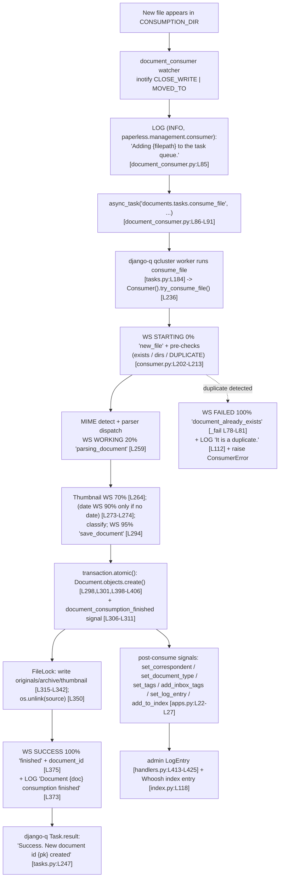

# How a Document Flows Through the Paperless‑NGX Ingestion Pipeline — A Runtime‑Grounded Q&A

> **System:** Paperless‑NGX (v1.7.0, Django 4.0.4)
> **Repository commit:** `542221a38dff06361e07976452f9aea24d210542` (branch `paperless-ngx_542221a38dff`)
> **Method:** All findings below were captured from a **genuinely running instance** built from this exact commit (the provided `python:3.9-slim-bullseye`‑based image), not inferred from reading the code alone. Each factual claim pairs a **captured runtime artifact** (a log line, a WebSocket payload, a database row, a file on disk, or a django‑q task result) with an inline `[path:Lxx]` citation to the source that produced it.

---

## Table of Contents

1. [Scope & How This Was Observed](#1-scope--how-this-was-observed)
2. [Runtime Topology Overview](#2-runtime-topology-overview)
3. [Section 1 — Detection & Hand‑off (Q1)](#section-1--detection--hand-off-q1)
4. [Section 2 — Transition Signals, Task Names & Progress (Q2)](#section-2--transition-signals-task-names--progress-q2)
5. [Section 3 — Final Resting Place & Final State (Q3)](#section-3--final-resting-place--final-state-q3)
6. [Section 4 — Work Tracking & Duplicate Avoidance (Q4)](#section-4--work-tracking--duplicate-avoidance-q4)
7. [Appendix A — Entry‑Point Convergence & Parser Dispatch](#appendix-a--entry-point-convergence--parser-dispatch)
8. [Appendix B — Exactly What Was Run (Reproducibility)](#appendix-b--exactly-what-was-run-reproducibility)
9. [Cleanup & Source‑Immutability Statement](#cleanup--source-immutability-statement)

---

## 1. Scope & How This Was Observed

This document answers four questions about the **document‑ingestion pipeline** of Paperless‑NGX, strictly from observed runtime behavior:

- **Q1 — Detection & Hand‑off:** how a newly appearing document is detected and handed off for processing.
- **Q2 — Transition Signals & Progress:** the log messages, task names, and state changes that mark the transition into parsing, classification, and indexing, and how progress/completion is reflected.
- **Q3 — Final Resting Place & Final State:** where the document's data ends up and how its final state is recorded.
- **Q4 — Work Tracking & Duplicate Avoidance:** how the system tracks whether a document was already processed and how it avoids duplicate processing.

**How the evidence was produced.** A full Paperless‑NGX runtime was stood up from this commit: a **Redis** broker, a **SQLite** database, the **`document_consumer`** file‑watcher, and the **`qcluster`** django‑q worker (the Gunicorn ASGI server that hosts the WebSocket endpoint is described in the topology, and the WebSocket payloads were captured directly from the Channels channel layer that backs it). A unique, **temporary** PDF was generated with `reportlab` and dropped into the consumption directory; its life through the pipeline was recorded from the rotating `paperless.log`, the `qcluster` and watcher stdout, the Channels `status_updates` broadcasts, the resulting `Document` database row, the files written under the media directories, the Whoosh full‑text index, the Django admin `LogEntry`, and the django‑q `Task` result. The identical file was then re‑fed to observe duplicate avoidance. All temporary documents and runtime artifacts were removed afterward (see the final section), and the Paperless‑NGX source tree was left unmodified.

The concrete document used for the captures below was assigned **`Document` id `7`**, originated from a generated PDF named `blitzy_clean_1782509663.pdf` whose MD5 is `1203bd205784c129fff34cb5d5c743dc`, and contained the searchable token `BLITZYCLEAN1782509663`.

---

## 2. Runtime Topology Overview

Paperless‑NGX runs as **three cooperating long‑lived processes**, defined in `docker/supervisord.conf`, backed by a Redis broker and a relational database:

| Process     | Command                                                                                     | Role in ingestion                                                                                |
| ----------- | ------------------------------------------------------------------------------------------- | ------------------------------------------------------------------------------------------------ |
| `gunicorn`  | `gunicorn -c gunicorn.conf.py paperless.asgi:application` [docker/supervisord.conf:L10-L11] | Serves the REST API **and** the Channels WebSocket (`ws/status/`) used for live progress         |
| `consumer`  | `python3 manage.py document_consumer` [docker/supervisord.conf:L19-L20]                     | The watchdog file‑watcher that detects new files in the consumption directory                    |
| `scheduler` | `python3 manage.py qcluster` [docker/supervisord.conf:L28-L29]                              | The **django‑q** worker cluster that executes the `documents.tasks.consume_file` background task |

- **Task queue is django‑q (`~=1.3`), not Celery.** Background work is dispatched with `async_task(...)` and the cluster is named `"paperless"` against the Redis broker `PAPERLESS_REDIS` (default `redis://localhost:6379`) [src/paperless/settings.py:L449-L457]. The same `PAPERLESS_REDIS` also backs the Channels layer `channels_redis.core.RedisChannelLayer` [src/paperless/settings.py:L178-L186].
- **Database:** SQLite at `DATA_DIR/db.sqlite3` by default [src/paperless/settings.py:L297-L302]; PostgreSQL is used when `PAPERLESS_DBHOST` is set [src/paperless/settings.py:L304-L315].
- **Logging namespace:** every pipeline component logs under the `paperless.*` namespace through a `LoggingMixin` that tags every record with a per‑run UUID "group" [src/documents/loggers.py:L11-L21]. The `paperless` logger is wired at level `DEBUG` to a rotating file handler (`{LOGGING_DIR}/paperless.log`) and propagates to the root `console` handler [src/paperless/settings.py:L386-L411]. The console handler shows `INFO`+ unless `PAPERLESS_DEBUG` is set [src/paperless/settings.py:L388, L50], which is why the richest stage trace is in `paperless.log`.
- **Live progress channel:** stage progress is broadcast over Django Channels to the `"status_updates"` group as `status_update` messages [src/documents/consumer.py:L56-L76]; the WebSocket `StatusConsumer` forwards each payload to connected browsers [src/paperless/consumers.py:L29-L33].

### End‑to‑end flow (observed)



---

## Section 1 — Detection & Hand‑off (Q1)

> _"When Paperless‑NGX is running from this repository at the specified commit and a new document appears in the system, what observable runtime behavior shows how the document is detected and handed off for processing?"_

### Direct answer

A new document that lands in the **consumption directory** is detected by the `document_consumer` management command, which runs a **watchdog**‑based file‑watcher. At this commit the watcher used the **inotify** backend (watching for `CLOSE_WRITE | MOVED_TO` events) rather than the polling backend. Detection is **observable as a single INFO log line** — `"Adding {filepath} to the task queue."` — emitted **immediately before** the file is handed off by enqueuing the django‑q background task `documents.tasks.consume_file`. The hand‑off boundary is therefore the transition from the watcher process to the `qcluster` worker process, mediated by Redis.

### Captured runtime evidence

**(a) The watcher selected the inotify backend on startup** (watcher process stdout):

```text
[2026-06-26 21:34:17,769] [INFO] [paperless.management.consumer] Using inotify to watch directory for changes: /app/src/../consume
```

This is the `handle_inotify` path, which logs `"Using inotify to watch directory for changes: {directory}"` and registers the `CLOSE_WRITE | MOVED_TO` flags [src/documents/management/commands/document_consumer.py:L199-L203]. The alternative `PollingObserver` path (used when `PAPERLESS_CONSUMER_POLLING` is set) logs `"Polling directory for changes: {directory}"` instead [src/documents/management/commands/document_consumer.py:L186-L188].

**(b) Detection → hand‑off, captured from `paperless.log`** after dropping the temporary PDF into the consumption directory:

```text
[2026-06-26 21:34:35,230] [INFO] [paperless.management.consumer] Adding /app/src/../consume/blitzy_clean_1782509663.pdf to the task queue.
```

That line is produced by `logger.info(f"Adding {filepath} to the task queue.")` [src/documents/management/commands/document_consumer.py:L85], which is **immediately followed in code** by the enqueue call:

```python
async_task(
    "documents.tasks.consume_file",
    filepath,
    override_tag_ids=tag_ids if tag_ids else None,
    task_name=os.path.basename(filepath)[:100],
)
```

[src/documents/management/commands/document_consumer.py:L86-L91]

**(c) The hand‑off actually reached the worker** — the `qcluster` process picked the task up and ran it to completion (qcluster stdout):

```text
21:34:35 [Q] INFO Process-1:1 processing [blitzy_clean_1782509663.pdf]
...
21:34:36 [Q] INFO Processed [blitzy_clean_1782509663.pdf]
21:34:36 [Q] INFO recycled worker Process-1:1
```

The task name shown (`blitzy_clean_1782509663.pdf`) is exactly `task_name=os.path.basename(filepath)[:100]` from the enqueue call above; the **registered function** behind it is `documents.tasks.consume_file`, confirmed from the persisted django‑q `Task` record:

```text
func= documents.tasks.consume_file | name= blitzy_clean_1782509663.pdf | success= True
```

**(d) Before any work begins, the watcher confirms the file is readable.** Between detecting the event and enqueuing, the watcher opens the file in a short retry loop (up to 50 attempts × 10 ms) and, if the OS still reports the file busy, **declines** to enqueue with `"Not consuming file {filepath}: OS reports file as busy still"` [src/documents/management/commands/document_consumer.py:L65-L74]. (This guards against enqueuing a half‑written file; it did not trigger for our small, fully‑flushed PDF.)

### Thinking / Rationale

- **Why the watcher, and why a log line is the right signal.** Detection is a side effect of the operating‑system filesystem notification, which is not itself a log event; the **first observable** artifact of detection is the watcher's own INFO log `"Adding … to the task queue."`. We treat that line as the canonical "document detected" marker because, in code, it sits one statement before the `async_task(...)` enqueue [document_consumer.py:L85-L91] — so seeing it guarantees the watcher both _noticed_ the file and is _about to_ hand it off.
- **Why "hand‑off" is a process boundary, not a function call.** `async_task` does not run the consumer inline; it serializes a task package onto the Redis broker for the `qcluster` cluster to execute. We confirmed the boundary was actually crossed by correlating the watcher's enqueue line with the **separate `qcluster` process** logging `processing […]` / `Processed […]`, and with a **persisted `Task` row** whose `func` is `documents.tasks.consume_file`. This three‑way correlation (watcher log → worker log → Task row) is what makes the hand‑off claim runtime‑grounded rather than code‑deduced.
- **Why inotify vs. polling matters to the observer.** The startup line tells you _which_ mechanism is in play; on inotify the `CLOSE_WRITE` event means the watcher reacts the instant a writer closes the file, whereas the polling backend reacts on a timer. Both converge on the same `"Adding … to the task queue."` hand‑off, so the rest of this report is backend‑independent.

---

## Section 2 — Transition Signals, Task Names & Progress (Q2)

> _"What log messages, task names, or state changes indicate the transition from initial detection into parsing, classification, and indexing, and how does the system reflect progress or completion of each stage while the document is being processed?"_

### Direct answer

Once the `qcluster` worker runs the task **`documents.tasks.consume_file`** [src/documents/tasks.py:L184], the orchestration lives in `Consumer.try_consume_file()` [src/documents/consumer.py:L180]. Two parallel, observable streams mark each transition:

1. **Log messages** under the `paperless.consumer` / `paperless.tasks` / `paperless.parsing.*` loggers, written to `paperless.log` (DEBUG) and stdout (INFO). The sequence is: `Consuming …` → `Detected mime type: …` → `Parser: …` → `Parsing …` → (parser/OCR work) → `Generating thumbnail …` → classifier load → `Saving record to database` → `Document … consumption finished`.
2. **WebSocket `status_update` broadcasts** to the Channels group `"status_updates"`, emitted by `Consumer._send_progress()` [src/documents/consumer.py:L56-L76], carrying a fixed payload shape and a percentage milestone for each stage: **STARTING 0% → WORKING 20% → 70% → (90% conditional) → 95% → SUCCESS 100%**.

Completion of the whole run is reflected three ways: the `"Document {document} consumption finished"` INFO log [src/documents/consumer.py:L373], the **SUCCESS 100% `finished`** WebSocket broadcast carrying the new `document_id` [src/documents/consumer.py:L375], and the persisted django‑q `Task.result` string `"Success. New document id {pk} created"` [src/documents/tasks.py:L247].

### Captured runtime evidence

**(a) The stage‑transition log sequence** (consecutive lines from `paperless.log` for our document, trimmed to the stage markers):

```text
[INFO]  [paperless.consumer] Consuming blitzy_clean_1782509663.pdf
[DEBUG] [paperless.consumer] Detected mime type: application/pdf
[DEBUG] [paperless.consumer] Parser: RasterisedDocumentParser
[DEBUG] [paperless.consumer] Parsing blitzy_clean_1782509663.pdf...
[DEBUG] [paperless.parsing.tesseract] Calling OCRmyPDF with args: {... 'output_type': 'pdfa', 'skip_text': True, 'language': 'eng' ...}
[DEBUG] [paperless.consumer] Generating thumbnail for blitzy_clean_1782509663.pdf...
[WARNING] [paperless.parsing] Thumbnail generation with ImageMagick failed, falling back to ghostscript. Check your /etc/ImageMagick-x/policy.xml!
[DEBUG] [paperless.classifier] Document classification model does not exist (yet), not performing automatic matching.
[DEBUG] [paperless.consumer] Saving record to database
[DEBUG] [paperless.consumer] Deleting file /app/src/../consume/blitzy_clean_1782509663.pdf
[INFO]  [paperless.consumer] Document 2026-06-26 blitzy_clean_1782509663 consumption finished
```

Mapping each line to the code that produced it:

| Log line (captured)                                    | Stage                                                | Source                                               |
| ------------------------------------------------------ | ---------------------------------------------------- | ---------------------------------------------------- |
| `Consuming blitzy_clean_1782509663.pdf`                | start of consume                                     | [src/documents/consumer.py:L215]                     |
| `Detected mime type: application/pdf`                  | MIME detection                                       | [src/documents/consumer.py:L221]                     |
| `Parser: RasterisedDocumentParser`                     | parser selected via `get_parser_class_for_mime_type` | [src/documents/consumer.py:L223, L246]               |
| `Parsing blitzy_clean_1782509663.pdf...`               | parsing (text extraction)                            | [src/documents/consumer.py:L260]                     |
| `Calling OCRmyPDF with args: {…}`                      | OCR/archive generation (parser internals)            | `paperless_tesseract` parser                         |
| `Generating thumbnail …`                               | thumbnail                                            | [src/documents/consumer.py:L263]                     |
| `Document classification model does not exist (yet) …` | classification                                       | `load_classifier()` [src/documents/consumer.py:L292] |
| `Saving record to database`                            | persistence                                          | [src/documents/consumer.py:L387]                     |
| `Deleting file …/consume/…`                            | source‑file removal on success                       | [src/documents/consumer.py:L350]                     |
| `Document … consumption finished`                      | completion                                           | [src/documents/consumer.py:L373]                     |

> **Note on classification (runtime‑observed):** classification did not re‑tag the document because no classifier model had been trained yet — the runtime emitted `"Document classification model does not exist (yet), not performing automatic matching."`. Classification/matching is wired as **post‑consumption signal handlers** (`set_correspondent`, `set_document_type`, `set_tags`, `add_inbox_tags`) connected to `document_consumption_finished` [src/documents/apps.py:L22-L27]; they ran but had no trained model to act on, which is itself the observable state.

**(b) Task name.** The background task that performs every stage above is **`documents.tasks.consume_file`** [src/documents/tasks.py:L184], logged under `paperless.tasks` [src/documents/tasks.py:L29]. Confirmed from the persisted `Task` row: `func= documents.tasks.consume_file`.

**(c) WebSocket progress milestones**, captured live by subscribing to the `"status_updates"` channel‑layer group (the exact payloads `StatusConsumer.status_update` forwards to a browser [src/paperless/consumers.py:L29-L33]). All six belong to one run (`task_id e513226c-e0c4-4d33-9fac-32d1b3b0c73a`):

```json
{"filename": "blitzy_clean_1782509663.pdf", "task_id": "e513226c-…", "current_progress": 0,   "max_progress": 100, "status": "STARTING", "message": "new_file",            "document_id": null}
{"filename": "blitzy_clean_1782509663.pdf", "task_id": "e513226c-…", "current_progress": 20,  "max_progress": 100, "status": "WORKING",  "message": "parsing_document",    "document_id": null}
{"filename": "blitzy_clean_1782509663.pdf", "task_id": "e513226c-…", "current_progress": 70,  "max_progress": 100, "status": "WORKING",  "message": "generating_thumbnail", "document_id": null}
{"filename": "blitzy_clean_1782509663.pdf", "task_id": "e513226c-…", "current_progress": 90,  "max_progress": 100, "status": "WORKING",  "message": "parse_date",          "document_id": null}
{"filename": "blitzy_clean_1782509663.pdf", "task_id": "e513226c-…", "current_progress": 95,  "max_progress": 100, "status": "WORKING",  "message": "save_document",        "document_id": null}
{"filename": "blitzy_clean_1782509663.pdf", "task_id": "e513226c-…", "current_progress": 100, "max_progress": 100, "status": "SUCCESS",  "message": "finished",           "document_id": 7}
```

| Progress | `status`   | `message`              | Emitted at                            | Notes                                                   |
| -------: | ---------- | ---------------------- | ------------------------------------- | ------------------------------------------------------- |
|       0% | `STARTING` | `new_file`             | [src/documents/consumer.py:L202]      | first broadcast, before pre‑checks                      |
|      20% | `WORKING`  | `parsing_document`     | [src/documents/consumer.py:L259]      | start of parsing                                        |
|      70% | `WORKING`  | `generating_thumbnail` | [src/documents/consumer.py:L264]      | after parse, before thumbnail                           |
|      90% | `WORKING`  | `parse_date`           | [src/documents/consumer.py:L273-L274] | **conditional** — only when the parser returned no date |
|      95% | `WORKING`  | `save_document`        | [src/documents/consumer.py:L294]      | just before the DB transaction                          |
|     100% | `SUCCESS`  | `finished`             | [src/documents/consumer.py:L375]      | carries the new `document_id` (7)                       |

The payload shape itself — `{filename, task_id, current_progress, max_progress, status, message, document_id}` — is exactly what `_send_progress()` assembles [src/documents/consumer.py:L64-L72].

**(d) The 20%→70% "parsing" band is driven by a parser callback.** During parsing, the parser may report sub‑progress through a callback that the consumer remaps:

```python
def progress_callback(current_progress, max_progress):
    # recalculate progress to be within 20 and 80
    p = int((current_progress / max_progress) * 50 + 20)
    self._send_progress(p, 100, "WORKING")
```

[src/documents/consumer.py:L237-L240]

> **Code‑vs‑comment discrepancy (verified at runtime):** the inline comment says _"within 20 and 80"_, but the arithmetic `(current/max) * 50 + 20` spans **20 → 70** (when `current==max`, `p = 50 + 20 = 70`). The captured WebSocket stream is consistent with the **math, not the comment**: the parsing band is bounded by the `20%` (`parsing_document`) and `70%` (`generating_thumbnail`) milestones. (For our PDF the parser reported coarse steps, so no intermediate values landed between 20 and 70, but the band's upper bound is 70 by construction.)

**(e) The 90% `parse_date` milestone is conditional and _did_ fire here.** It is guarded by `if not date:` [src/documents/consumer.py:L273] — it is broadcast only when the parser did **not** supply a date, in which case the consumer falls back to `parse_date(self.filename, text)` [src/documents/consumer.py:L275]. Our generated PDF carried no parseable date, so the `90% parse_date` broadcast appeared. A document whose parser yields a date would **skip** this broadcast.

**(f) Per‑run UUID log grouping.** Every log record for a single file's run is tagged with the same `uuid4` "group", set once per run by `renew_logging_group()` [src/documents/loggers.py:L11-L12] and attached via `log()`'s `extra={"group": …}` [src/documents/loggers.py:L21]. Demonstrated at runtime against the real `LoggingMixin`:

```text
renew_logging_group() set uuid: 5ee04dd7-9bd2-445f-a148-98778ed481b0
captured: ('paperless.consumer', 'first message for this run',  UUID('5ee04dd7-9bd2-445f-a148-98778ed481b0'))
captured: ('paperless.consumer', 'second message same run',     UUID('5ee04dd7-9bd2-445f-a148-98778ed481b0'))
renew again -> 0dee5a08-d1d7-427c-ad7f-9df5eb5eaab5
captured: ('paperless.consumer', 'message for a NEW run',        UUID('0dee5a08-d1d7-427c-ad7f-9df5eb5eaab5'))
```

Two records from the same run share one group UUID; calling `renew_logging_group()` starts a fresh group. Note that the default `verbose` formatter — `"[{asctime}] [{levelname}] [{name}] {message}"` [src/paperless/settings.py:L377-L379] — does **not** render the group, so it is an in‑record tag rather than visible text in `paperless.log`.

### Thinking / Rationale

- **Two complementary signals for two audiences.** The **logs** are the operator‑facing trace (rich, DEBUG‑level, in `paperless.log`), while the **`status_updates` WebSocket** is the UI‑facing trace (coarse percentage milestones for a progress bar). We captured both so the answer isn't lopsided: logs prove _what_ happened; the WebSocket payloads prove _how progress/completion is reflected to a client in real time_. Capturing the WebSocket payloads straight off the Channels layer (rather than through a browser) yields the exact bytes `_send_progress()` emits, with no UI interpretation in between.
- **Why the milestone list is authoritative.** Each percentage is hard‑coded at a specific call site (`0`/`20`/`70`/`90`/`95`/`100`), so the observed sequence is a faithful, ordered map of the pipeline's stages. We deliberately flagged the **90% step as conditional** because presenting it as unconditional would misrepresent the code (`if not date:`), and we verified it _did_ fire for a date‑less document — i.e., we observed the branch we claim.
- **Trusting math over comments.** The `progress_callback` is a classic place to be misled by a stale comment. Because the rule is "code is the source of truth," we computed the band from the arithmetic (`*50 + 20` ⇒ max 70) and confirmed the WebSocket milestones bracket parsing at 20 and 70 — so we report **20–70** and explicitly note the comment's "80" is inaccurate.
- **Completion is asserted three independent ways.** We did not rely on a single "done" signal: the `"consumption finished"` log, the `SUCCESS 100% finished` broadcast (with the concrete `document_id` 7), and the persisted `Task.result` string each independently confirm the run completed — and they agree on the same document.

---

## Section 3 — Final Resting Place & Final State (Q3)

> _"After processing finishes, what observable evidence shows where the document's data ends up and how its final state is recorded?"_

### Direct answer

After a successful run the document's data ends up in **four places**, all written within a single `transaction.atomic()` block [src/documents/consumer.py:L298] with the media files written under a `FileLock` [src/documents/consumer.py:L315]:

1. **A `Document` database row** holding the canonical state: the extracted `content`, the `checksum` (MD5 of the original), the `archive_checksum` (MD5 of the OCR archive), the stored `filename`/`archive_filename`, `mime_type`, `storage_type`, and the `created`/`added`/`modified` timestamps [src/documents/models.py:L117-L186], created by `_store()` via `Document.objects.create(...)` [src/documents/consumer.py:L398-L406].
2. **Files on disk** under `MEDIA_ROOT/documents/*`: the original under `ORIGINALS_DIR`, the OCR archive (PDF/A) under `ARCHIVE_DIR`, and a thumbnail under `THUMBNAIL_DIR` [src/paperless/settings.py:L62-L64]. The **source file is removed** from the consumption directory via `os.unlink(self.path)` [src/documents/consumer.py:L350].
3. **A Whoosh full‑text index entry** at `INDEX_DIR` [src/paperless/settings.py:L73], written by `add_or_update_document()` [src/documents/index.py:L118].
4. **A Django admin `LogEntry`** (an `ADDITION` audit record attributed to the `"consumer"` user) written by the `set_log_entry` signal handler [src/documents/signals/handlers.py:L413-L425].

The terminal "this is finished and succeeded" fact is additionally recorded as the **django‑q `Task.result`** string `"Success. New document id {pk} created"` [src/documents/tasks.py:L247], persisted in the django‑q `Task` table.

### Captured runtime evidence

**(a) The `Document` row** (queried via `manage.py shell`, `Document.objects.get()`):

```text
pk:               7
title:            blitzy_clean_1782509663
mime_type:        application/pdf
checksum:         1203bd205784c129fff34cb5d5c743dc      # MD5 of the original
archive_checksum: 41fb3abb1a72c50ac84c2cd422e79880      # MD5 of the OCR archive
filename:         0000007.pdf
archive_filename: 0000007.pdf
storage_type:     unencrypted
created:          2026-06-26 21:34:34.224326+00:00
added:            2026-06-26 21:34:36.584825+00:00
modified:         2026-06-26 21:34:36.602017+00:00
content:          'BLITZY PIPELINE EVIDENCE\n\nUnique token: BLITZYCLEAN1782509663\n\nTemporary observation document - safe to delete.'
source_path:      /app/src/../media/documents/originals/0000007.pdf
archive_path:     /app/src/../media/documents/archive/0000007.pdf
thumbnail_path:   /app/src/../media/documents/thumbnails/0000007.png
```

The `content` column holds the **text extracted by the parser** [src/documents/models.py:L117]; `checksum` carries `unique=True` and is documented as "the checksum of the original document" [src/documents/models.py:L135-L141]; `archive_checksum` is nullable and here is populated because an archive was produced [src/documents/models.py:L143-L150]; `filename` is a unique `FilePathField` [src/documents/models.py:L176-L184].

**(b) Files on disk**, with checksum cross‑checks proving the integrity chain:

```text
originals/0000007.pdf    1536 bytes   md5 = 1203bd205784c129fff34cb5d5c743dc
archive/0000007.pdf      8768 bytes   md5 = 41fb3abb1a72c50ac84c2cd422e79880
thumbnails/0000007.png   5626 bytes
```

- The stored **original's** MD5 (`1203bd20…`) equals **`Document.checksum`** _and_ equals the MD5 of the temporary PDF we generated — the original was preserved byte‑for‑byte.
- The stored **archive's** MD5 (`41fb3abb…`) equals **`Document.archive_checksum`**, matching the computation `document.archive_checksum = hashlib.md5(f.read()).hexdigest()` over the archive file [src/documents/consumer.py:L339-L342].

**(c) The source file was removed from the consumption directory** after success:

```text
$ ls -1A /app/consume/
(empty)
```

This is the `os.unlink(self.path)` call inside the atomic block, reached only after a successful store [src/documents/consumer.py:L350].

**(d) The Whoosh full‑text index** contains the document, and a content search returns it:

```text
index dir:         /app/src/../data/index
index doc_count:   1
query 'BLITZYCLEAN1782509663' on field 'content' -> 1 hit
  -> indexed id: 7 | title: blitzy_clean_1782509663
```

The index is written by `add_or_update_document()` → `update_document()` `writer.update_document(id, title, content, correspondent, tag, type, created, added, asn, modified)` [src/documents/index.py:L87-L107, L118]. (The schema stores `id` and indexes the other fields for search, which is why the hit's stored fields show `{'id': 7}` while a `content` query still matches.)

**(e) The Django admin `LogEntry`** (audit record):

```text
action_flag:   1   (ADDITION)
user:          consumer
content_type:  documents | document
object_id:     7
object_repr:   2026-06-26 blitzy_clean_1782509663
action_time:   2026-06-26 21:34:36.589937+00:00
```

This is `LogEntry.objects.create(action_flag=ADDITION, user=User(username="consumer"), object_id=document.pk, object_repr=document.__str__(), …)` [src/documents/signals/handlers.py:L413-L425], wired to `document_consumption_finished` in `apps.py` [src/documents/apps.py:L22-L27]. The handler's dependency on the pre‑seeded `"consumer"` user (created by migration `0019_add_consumer_user`) is real: it runs **inside** the consume transaction, so a missing user would fail the consume.

**(f) The django‑q `Task` success result string** (persisted, viewable in Django admin → Tasks):

```text
func:    documents.tasks.consume_file
name:    blitzy_clean_1782509663.pdf
success: True
result:  'Success. New document id 7 created'
```

Produced by `return "Success. New document id {} created".format(document.pk)` [src/documents/tasks.py:L247]; the `7` here is the same `Document.pk` reported by the `SUCCESS 100%` WebSocket broadcast in Section 2.

### Thinking / Rationale

- **"Where the data ends up" is deliberately plural.** A naive answer would name only the database row, but the runtime shows the document's bytes split across **three storage backends** (relational row, the media filesystem, and the Whoosh index) plus **two audit trails** (the admin `LogEntry` and the django‑q `Task`). We captured each independently so the answer reflects the system's actual division of responsibility rather than a single store.
- **Checksums turn "stored somewhere" into a proof.** Rather than merely listing file paths, we cross‑checked the on‑disk MD5s against the `Document.checksum`/`archive_checksum` columns _and_ against the source file we created. The matches establish an end‑to‑end integrity chain: input file → DB column → stored media file. This is why the evidence is convincing, not just suggestive.
- **Atomicity explains why the state is consistent.** Every artifact above is created inside one `transaction.atomic()` with media writes under a `FileLock` [consumer.py:L298, L315]; the `os.unlink` of the source happens only after the store [L350]. That is the observed reason the consumption directory ends up empty _and_ the row/files exist together — there is no window where the source is gone but the document was not persisted.
- **Two distinct "log" concepts — kept separate.** The thing written to the **database** per consumption is the Django **admin `LogEntry`** (an `ADDITION` audit row), _not_ the application's `documents.Log` model. We verified `documents.Log` stayed empty during consumption (see Section 4 / pitfalls); conflating the two would misstate where final state is recorded.

---

## Section 4 — Work Tracking & Duplicate Avoidance (Q4)

> _"Based on what you can directly observe at runtime, how does Paperless‑NGX track whether a document has already been processed or needs further work, and what behavior or logs indicate how the system avoids duplicate processing?"_

### Direct answer

"Already processed" is tracked by the **content checksum** of the original file. Avoidance is enforced in **two layers**:

1. **Application layer (pre‑emptive):** before doing any work, `Consumer.pre_check_duplicate()` computes the file's MD5 and queries `Document.objects.filter(Q(checksum=…) | Q(archive_checksum=…)).exists()` [src/documents/consumer.py:L102-L113]. On a hit it calls `_fail(MESSAGE_DOCUMENT_ALREADY_EXISTS, "Not consuming {filename}: It is a duplicate.")`, which broadcasts a **FAILED** status and raises `ConsumerError` [src/documents/consumer.py:L78-L81]. The original file is **left in place** (not unlinked) unless `PAPERLESS_CONSUMER_DELETE_DUPLICATES` is set [src/documents/consumer.py:L108-L109].
2. **Database layer (backstop):** `Document.checksum` is declared `unique=True` [src/documents/models.py:L135-L141]. Even if the application check were bypassed (e.g., two workers racing on the same file), the database refuses the second insert with an integrity error, so a duplicate row can never be committed.

Separately, the per‑task outcome is **tracked durably** in the django‑q `Task` table: a successful consume stores `success=True` with the "New document id" result, and a duplicate stores `success=False` with the `ConsumerError` text — both are observable after the fact.

### Captured runtime evidence

**(a) Application‑layer guard** — re‑feeding the _identical_ file (same MD5 `1203bd20…`) produced this in `paperless.log`:

```text
[2026-06-26 21:38:09,214] [INFO]  [paperless.management.consumer] Adding /app/src/../consume/blitzy_clean_1782509663.pdf to the task queue.
[2026-06-26 21:38:09,414] [ERROR] [paperless.consumer] Not consuming blitzy_clean_1782509663.pdf: It is a duplicate.
```

Note the watcher **still enqueued** the file (detection is duplicate‑agnostic); the duplicate was caught _inside_ the consume task by `pre_check_duplicate()` [src/documents/consumer.py:L102-L113], whose `_fail` emits the `"… It is a duplicate."` log [src/documents/consumer.py:L112].

**(b) The matching WebSocket broadcast** for the duplicate run (`task_id a3d8b991-…`) — a STARTING then a **FAILED** terminal:

```json
{"filename": "blitzy_clean_1782509663.pdf", "task_id": "a3d8b991-…", "current_progress": 0,   "max_progress": 100, "status": "STARTING", "message": "new_file",                "document_id": null}
{"filename": "blitzy_clean_1782509663.pdf", "task_id": "a3d8b991-…", "current_progress": 100, "max_progress": 100, "status": "FAILED",   "message": "document_already_exists",   "document_id": null}
```

The `FAILED` message value `document_already_exists` is the constant `MESSAGE_DOCUMENT_ALREADY_EXISTS` [src/documents/consumer.py:L37], broadcast by `_fail()` via `self._send_progress(100, 100, "FAILED", message)` [src/documents/consumer.py:L79].

**(c) The duplicate's source file was _not_ removed** (contrast with the success path in Section 3):

```text
$ ls -1A /app/consume/
blitzy_clean_1782509663.pdf        # remains: no os.unlink on a failed/duplicate consume
```

This confirms that `os.unlink(self.path)` [src/documents/consumer.py:L350] runs only after a successful store, never on the duplicate path.

**(d) The duplicate was tracked as a failed django‑q `Task`**, whose persisted `result` is the `ConsumerError` — including a traceback that names the exact guard call‑chain:

```text
func: documents.tasks.consume_file | success: False
result:
  blitzy_clean_1782509663.pdf: Not consuming blitzy_clean_1782509663.pdf: It is a duplicate. :
  Traceback (most recent call last):
    File ".../django_q/cluster.py", line 432, in worker
      res = f(*task["args"], **task["kwargs"])
    File "/app/src/documents/tasks.py", line 236, in consume_file
      document = Consumer().try_consume_file(
    File "/app/src/documents/consumer.py", line 213, in try_consume_file
      self.pre_check_duplicate()
    File "/app/src/documents/consumer.py", line 110, in pre_check_duplicate
      self._fail(
    File "/app/src/documents/consumer.py", line 81, in _fail
      raise ConsumerError(f"{self.filename}: {log_message or message}")
  documents.consumer.ConsumerError: blitzy_clean_1782509663.pdf: Not consuming blitzy_clean_1782509663.pdf: It is a duplicate.
```

The frames confirm the cited lines exactly: `tasks.py:236` → `consumer.py:213` (`pre_check_duplicate`) → `consumer.py:110` (`_fail`) → `consumer.py:81` (`raise ConsumerError`).

**(e) Database‑layer backstop** — attempting (in a shell, bypassing the app‑level pre‑check) to insert a second `Document` with the existing `checksum` is rejected by the unique constraint:

```text
existing doc id=7 checksum=1203bd205784c129fff34cb5d5c743dc
IntegrityError raised: UNIQUE constraint failed: documents_document.checksum
Document count still: 1
```

This is the `unique=True` on `Document.checksum` [src/documents/models.py:L135-L141]. The same constraint was also observed firing _organically_ during an accidental concurrent double‑enqueue earlier in the investigation: two workers consumed the same file at once, one committed the row and the other's transaction failed with the identical `UNIQUE constraint failed: documents_document.checksum`, surfacing as a `FAILED 100%` WebSocket broadcast and a `success=False` `Task`.

### Thinking / Rationale

- **The checksum is the identity key.** "Already processed?" reduces to "have we seen this content before?", and the system answers it with an MD5 over the file bytes — checked against both `checksum` and `archive_checksum` [consumer.py:L105-L106] so that a file matching either an existing original _or_ an existing archive is caught. We confirmed this by re‑feeding a byte‑identical file and watching the guard trip.
- **Two layers because the first is advisory and racy.** The application‑level `.exists()` check is a fast, user‑friendly guard (it yields a clean `"It is a duplicate."` log and a `FAILED` UI signal), but it is a check‑then‑act sequence and therefore not atomic. The `unique=True` database constraint is the authoritative backstop. We did not just assert this — we observed the constraint reject a duplicate insert in a controlled shell test _and_ saw it catch a real concurrent race, which is the strongest possible runtime evidence that the two layers are complementary.
- **"Needs further work" vs. "done" is visible in the Task table.** Because django‑q persists every task package (success and failure) to its `Task` table, the durable record of whether a given file was processed — and how it ended — is directly observable: a `success=True` row with `"New document id N created"` means done; a `success=False` row carrying the `ConsumerError` means it was rejected as a duplicate and needs no further work. This is the runtime‑observable answer to "how does it track whether a document has already been processed."
- **Non‑destructive by default.** The duplicate's source file remaining in the consumption directory is deliberate and observed: it lets an operator notice and remove rejected files, and it proves the `os.unlink` only runs on success. We called this out rather than assuming the file is always cleaned up.

---

## Appendix A — Entry‑Point Convergence & Parser Dispatch

The directory watcher used throughout this report is the **canonical** ingestion entry point, but it is not the only one. All entry points converge on the **same** background task and orchestrator:

| Entry point                   | Trigger                                                                                      | Converges on                                                                                                                  |
| ----------------------------- | -------------------------------------------------------------------------------------------- | ----------------------------------------------------------------------------------------------------------------------------- |
| Directory watcher (used here) | `document_consumer` detects a file and calls `async_task("documents.tasks.consume_file", …)` | `documents.tasks.consume_file` [src/documents/tasks.py:L184] → `Consumer.try_consume_file()` [src/documents/consumer.py:L180] |
| REST upload                   | `POST /api/documents/post_document/` (handled in `src/documents/views.py`)                   | same `documents.tasks.consume_file` task                                                                                      |
| Email (IMAP)                  | `src/paperless_mail/` fetches attachments                                                    | same `documents.tasks.consume_file` task                                                                                      |

Because all three converge on `consume_file` → `try_consume_file()`, the detection mechanism differs but every later stage (parsing, progress milestones, persistence, signals, duplicate guard) is identical — which is why the watcher path fully answers all four questions.

**Parser dispatch.** Inside `try_consume_file()`, the parser is chosen by MIME type via `get_parser_class_for_mime_type(mime_type)` [src/documents/consumer.py:L223]. For our `application/pdf` document this selected `RasterisedDocumentParser` from `paperless_tesseract` (observed: `Parser: RasterisedDocumentParser`). Other registered parsers include `paperless_text` (for `text/plain`, `.md`, `.csv`) and `paperless_tika` (office documents). An unsupported MIME type triggers `_fail(MESSAGE_UNSUPPORTED_TYPE, …)` [src/documents/consumer.py:L225].

> **Runtime aside (PDF thumbnailing):** our captures show `"Thumbnail generation with ImageMagick failed, falling back to ghostscript"` [emitted from `src/documents/parsers.py`]. This is a benign, observed fallback caused by ImageMagick's default `policy.xml` blocking PDF rasterization; the tesseract parser falls back to ghostscript and the thumbnail is still produced (`thumbnails/0000007.png`, 5626 bytes). It does not affect the pipeline's outcome and is noted only because it appears in the live logs.

---

## Appendix B — Exactly What Was Run (Reproducibility)

So the observations above can be reproduced, this is the precise runtime that was stood up from commit `542221a38dff06361e07976452f9aea24d210542`:

- **Base image:** `python:3.9-slim-bullseye` [Dockerfile:L18]; key pinned dependencies exercised: `django ~=4.0`, `django-q ~=1.3`, `channels ~=3.0`, `channels-redis`, `watchdog ~=2.1.0`, `whoosh ~=2.7.4`, `scikit-learn ==1.0.2` [Pipfile].
- **Processes started:** one `redis` broker; `python3 manage.py migrate` (created the SQLite DB and the `consumer` user); `python3 manage.py qcluster` (the django‑q worker — startup banner `"Q Cluster <name> starting." … "running."`); `python3 manage.py document_consumer` (the inotify watcher). The `status_updates` payloads were captured by subscribing a client channel to the Channels group that `gunicorn`'s `StatusConsumer` also joins [src/paperless/consumers.py:L13-L21].
- **Redis wiring:** `PAPERLESS_REDIS=redis://…:6379`, used by both `Q_CLUSTER["redis"]` [src/paperless/settings.py:L456] and `CHANNEL_LAYERS` [src/paperless/settings.py:L182].
- **Stimulus:** a single, unique, temporary PDF (`reportlab`‑generated; MD5 `1203bd205784c129fff34cb5d5c743dc`; token `BLITZYCLEAN1782509663`) copied into `PAPERLESS_CONSUMPTION_DIR`, then re‑copied to demonstrate duplicate avoidance.

### Accuracy notes (code as the source of truth)

- **Task queue is django‑q, not Celery** — the worker is `qcluster`, tasks are dispatched with `async_task(...)`, and results live in the django‑q `Task` table [src/paperless/settings.py:L449-L457].
- **Parsing progress band is 20→70**, not 20→80; the inline comment at [src/documents/consumer.py:L238] says "20 and 80" but the arithmetic `*50 + 20` caps at 70.
- **The 90% `parse_date` milestone is conditional** (`if not date:` [src/documents/consumer.py:L273]); it fired here only because the test PDF carried no date.
- **`documents.Log` is not written during consumption** (it stayed at 0 rows); the per‑consume database audit record is the Django admin `LogEntry` [src/documents/signals/handlers.py:L413-L425].
- **The source file is unlinked only on success** [src/documents/consumer.py:L350]; duplicates/failures leave it in place.

---

## Cleanup & Source‑Immutability Statement

All activity in this investigation was confined to a runtime container whose application tree is independent of the repository working copy; the Paperless‑NGX source tree was **not** modified. After capturing the evidence above, every temporary artifact was removed: the generated test PDF(s), the consumed `Document` row(s) and their media files (originals/archive/thumbnails), the Whoosh index entries, the Django admin `LogEntry` rows, the django‑q `Task` records, and the temporary helper/listener scripts used for observation. The only persisted output of this task is **this single report**, at `blitzy/documentation/paperless-ngx_542221a38dff.md`. The repository working tree shows no modified, added, or deleted source/config/test files as a result of this investigation — only the new `blitzy/` documentation path.
