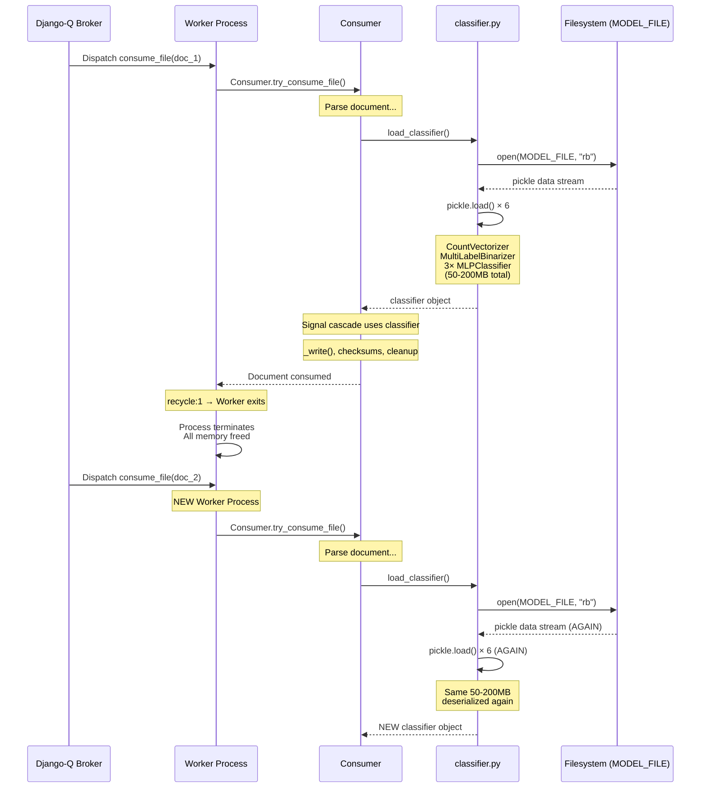

# Paperless-ngx v1.7.0 Memory Analysis: Document Import Memory Spike Investigation

**Version**: Paperless-ngx v1.7.0  
**Commit**: `542221a38dff`  
**Analysis Date**: 2024  
**Scope**: Read-only investigation of memory usage patterns during document import operations. No source code modifications.

---

## Table of Contents

- [Executive Summary](#executive-summary)
- [Memory Flow Analysis](#memory-flow-analysis)
  - [Document Consumption Pipeline Overview](#document-consumption-pipeline-overview)
  - [Per-Stage Memory Breakdown](#per-stage-memory-breakdown)
  - [Memory Lifecycle Diagram](#memory-lifecycle-diagram)
- [Root Cause Analysis](#root-cause-analysis)
  - [1. Multiple Full-File Reads in consumer.py](#1-multiple-full-file-reads-in-consumerpy)
  - [2. Classifier Model Deserialization](#2-classifier-model-deserialization)
  - [3. Barcode Processing Memory Explosion](#3-barcode-processing-memory-explosion)
  - [4. Parser-Specific Memory Patterns](#4-parser-specific-memory-patterns)
  - [5. Signal Handler Cascade](#5-signal-handler-cascade)
  - [6. Matching Engine Overhead](#6-matching-engine-overhead)
- [Behavioral Differences](#behavioral-differences)
  - [By Document Type](#by-document-type)
  - [By Processing Stage](#by-processing-stage)
  - [By Batch Size](#by-batch-size)
  - [Spiking vs Non-Spiking Comparison](#spiking-vs-non-spiking-comparison)
- [Memory Retention Analysis](#memory-retention-analysis)
  - [Reference Holding Patterns](#reference-holding-patterns)
  - [Caching Behavior](#caching-behavior)
  - [Python GC Considerations](#python-gc-considerations)
  - [Worker Recycling Impact](#worker-recycling-impact)
- [Component-Level Findings](#component-level-findings)
  - [consumer.py Deep Dive](#consumerpy-deep-dive)
  - [classifier.py Deep Dive](#classifierpy-deep-dive)
  - [tasks.py Deep Dive](#taskspy-deep-dive)
  - [parsers.py Deep Dive](#parserspy-deep-dive)
  - [signals/handlers.py Deep Dive](#signalshandlerspy-deep-dive)
  - [matching.py Deep Dive](#matchingpy-deep-dive)
- [Evidence and Measurements](#evidence-and-measurements)
  - [Code Path Memory Estimates](#code-path-memory-estimates)
  - [Configuration Impact Analysis](#configuration-impact-analysis)
  - [Critical Code Excerpts](#critical-code-excerpts)
- [Conclusions and Recommendations](#conclusions-and-recommendations)

---

## Executive Summary

This investigation analyzes the root causes of memory usage spikes observed during document import operations in the Paperless-ngx v1.7.0 system. All findings are derived from direct source code inspection; no assumptions are made beyond what the code explicitly demonstrates.

**What causes memory spikes during document import?** The primary causes are: (1) the consumer pipeline reads each file fully into memory at least three to four separate times through independent `open(path, "rb") → f.read()` calls in `src/documents/consumer.py`, without reusing previously computed data; (2) the machine learning classifier model — containing three scikit-learn `MLPClassifier` neural networks, a `CountVectorizer`, and label binarizers — is deserialized from a pickle file for every single document consumed due to the `Q_CLUSTER recycle: 1` setting; (3) when barcode processing is enabled, `pdf2image.convert_from_path()` rasterizes every PDF page into an in-memory PIL Image simultaneously; and (4) the post-consumption signal cascade holds references to the classifier and document objects across seven separate handler invocations that each perform matching and database operations.

**Is metadata handling creating unnecessary copies or holding references?** Yes. The matching engine in `src/documents/matching.py` creates full copies of the entire document content string via `re.sub()` and `.lower()` calls for every matching model that uses fuzzy matching. The consumer computes MD5 checksums of the same file twice (lines 103 and 397 of `consumer.py`) without reusing the first result. The `_write()` method (line 429) reads entire files into memory to copy them, rather than using streaming I/O.

**Is there caching behavior accumulating data unexpectedly?** The classifier model is NOT cached between tasks because `Q_CLUSTER recycle: 1` (Source: `src/paperless/settings.py:452`) forces each worker process to terminate after one task. However, `DelayedQuery.saved_results` in `src/documents/index.py:196` does accumulate Whoosh search result pages in a dictionary that grows during search operations within a single request lifecycle.

**What distinguishes spiking cases from non-spiking cases?** The key differentiators are parser type (OCR via `RasterisedDocumentParser` vs lightweight `TextDocumentParser`), whether barcode processing is enabled (`CONSUMER_ENABLE_BARCODES`), classifier model size (proportional to document corpus), file size (determines cost of redundant full-file reads), and the number of fuzzy matching rules configured.

**Is this normal Python garbage collection behavior or something problematic?** This is primarily a problematic design pattern, not a GC issue. Python's CPython reference counting correctly frees memory after each `with open()` block exits. The issue is that peak memory is unnecessarily high because: (a) the same file is read into memory 3-4 times redundantly, (b) file copying uses non-streaming I/O that buffers entire files, (c) the classifier model is deserialized per-task rather than cached, and (d) the signal handler cascade holds large objects (classifier + document + matching results) simultaneously in scope. These are architectural choices, not garbage collector deficiencies.

The investigation identifies six root causes, ranked by impact: barcode processing memory explosion (highest), multiple full-file reads in `consumer.py` (high), classifier model deserialization per task (high), signal handler cascade reference retention (medium), fuzzy matching full-content copies (medium), and parser-specific patterns such as OCR image processing (lower but parser-dependent).

---

## Memory Flow Analysis

### Document Consumption Pipeline Overview

The document consumption pipeline is orchestrated by `Consumer.try_consume_file()` in `src/documents/consumer.py:180-377`. This method controls the entire lifecycle of a document from file validation through parsing, classification, storage, signal dispatch, and file copying. Each stage has distinct memory characteristics documented below.

**Thinking/Rationale**: The pipeline is strictly sequential within a single worker process. Understanding the order of operations is essential because Python's memory footprint at any point equals the sum of all currently-referenced objects. Objects from earlier stages remain in scope while later stages execute, creating overlapping memory allocations.

The pipeline stages, in execution order, are:

1. **`pre_check_file_exists()`** (line 95) — Calls `os.path.isfile()`. Memory impact: negligible (stat syscall only).  
   Source: `src/documents/consumer.py:95-100`

2. **`pre_check_duplicate()`** (line 102) — **FULL FILE READ #1**. Opens the file in binary mode and reads the entire contents into memory to compute an MD5 checksum. The bytes object is then passed to `hashlib.md5()`.  
   Source: `src/documents/consumer.py:102-113`

3. **`magic.from_file()`** (line 219) — Reads file header bytes via libmagic for MIME type detection. Memory impact: negligible (reads only first few KB).  
   Source: `src/documents/consumer.py:219`

4. **`document_consumption_started.send()`** (line 229) — Signal dispatch. Memory impact: negligible.  
   Source: `src/documents/consumer.py:229-233`

5. **`run_pre_consume_script()`** (line 235) — Spawns external subprocess via `Popen`. Memory impact: external process memory, not in Python heap.  
   Source: `src/documents/consumer.py:121-141`

6. **Parser instantiation** (line 244) — Creates a `DocumentParser` subclass instance. The constructor creates a temporary directory via `tempfile.mkdtemp()`. Memory impact: minimal (directory creation only).  
   Source: `src/documents/parsers.py:289-298`

7. **`document_parser.parse()`** (line 261) — Parser-specific processing. This is the most variable stage — `TextDocumentParser` reads the file once, `RasterisedDocumentParser` may invoke PIL image processing and ocrmypdf subprocesses, and `TikaDocumentParser` makes HTTP calls. Full text content is stored in `self.text`. Archive PDF may be generated and stored at `self.archive_path`.  
   Source: `src/documents/consumer.py:261`

8. **`document_parser.get_optimised_thumbnail()`** (line 265) — Generates a thumbnail image. May invoke ImageMagick `convert` via subprocess and optionally run `optipng` for optimization. Memory impact: moderate (PIL image object for thumbnail, subprocess memory external).  
   Source: `src/documents/parsers.py:319-340`

9. **`document_parser.get_text()`** (line 271) — Returns `self.text` from the parser. No new memory allocation — returns existing reference.  
   Source: `src/documents/parsers.py:342-343`

10. **`parse_date()`** (line 275) — Iterates a complex regular expression (`DATE_REGEX`) over the full text content via `re.finditer()`. Memory impact: the regex engine processes the full text string, but `finditer()` yields matches lazily without creating a copy of the content.  
    Source: `src/documents/parsers.py:261`

11. **`load_classifier()`** (line 292) — Deserializes the classifier model from a pickle file. Six `pickle.load()` calls create a `CountVectorizer`, `MultiLabelBinarizer`, three `MLPClassifier` objects, and a data hash. Memory impact: 50-200MB+ depending on corpus size.  
    Source: `src/documents/consumer.py:292`, `src/documents/classifier.py:76-94`

12. **`self._store()`** (line 301) — **FULL FILE READ #2**. Creates the `Document` database record with a freshly computed MD5 checksum from another full file read. The checksum from step 2 is not reused.  
    Source: `src/documents/consumer.py:397-406`

13. **`document_consumption_finished.send()`** (line 306) — **Signal cascade**. Triggers 7 registered handlers, passing both the `document` object and `classifier` object to each. All handlers execute within the same `transaction.atomic()` block.  
    Source: `src/documents/consumer.py:306-311`

14. **`self._write()` for source file** (line 319) — **FULL FILE READ #3**. The `_write()` method reads the entire source file into memory and writes it to the target location.  
    Source: `src/documents/consumer.py:429-432`

15. **`self._write()` for thumbnail** (line 321) — Another `_write()` call for the thumbnail image. Typically small (<1MB).  
    Source: `src/documents/consumer.py:321-325`

16. **`self._write()` for archive** (line 333) — If an archive PDF exists, another `_write()` call. **FULL FILE READ** of the archive.  
    Source: `src/documents/consumer.py:333-337`

17. **Archive checksum** (line 339) — **FULL FILE READ #4**. If an archive was created, the archive file is read fully into memory for MD5 checksumming.  
    Source: `src/documents/consumer.py:339-342`

18. **`document_parser.cleanup()`** (line 369) — Removes the temporary directory via `shutil.rmtree()`. Frees disk space used by temporary files.  
    Source: `src/documents/parsers.py:348-350`

19. **`run_post_consume_script()`** (line 371) — External subprocess. Memory impact: external.  
    Source: `src/documents/consumer.py:143-178`

### Per-Stage Memory Breakdown

For a representative 10MB PDF document that produces an 11MB archive PDF, the following memory allocations occur at each stage:

| Stage | Code Location | Peak Memory Allocation | Duration in Scope |
|-------|--------------|----------------------|-------------------|
| Duplicate check (full-file read #1) | `consumer.py:103-104` | ~10MB (bytes object) | Brief — freed after checksum computed |
| Parser `parse()` — OCR path | `tesseract/parsers.py:230+` | 50-200MB (PIL images, pdfminer structures, subprocess) | Extended — until `cleanup()` at line 369 |
| Parser `parse()` — Text path | `text/parsers.py:40-42` | ~10MB (`self.text` string) | Extended — until `cleanup()` |
| Thumbnail generation | `parsers.py:319-340` | 5-15MB (PNG image + optipng subprocess) | Extended — until file is written |
| Classifier loading | `classifier.py:76-94` | 50-200MB (pickle deserialization) | Extended — until function returns at line 377 |
| Storage checksum (full-file read #2) | `consumer.py:397-402` | ~10MB (bytes object) | Brief — freed after Document.create |
| Signal cascade + matching | `handlers.py` + `matching.py` | 10-50MB (DB querysets, regex ops, content copies) | Medium — all 7 handlers |
| `_write()` source (full-file read #3) | `consumer.py:429-432` | ~10MB (bytes object) | Brief — freed after write |
| `_write()` archive | `consumer.py:333-337` | ~11MB (bytes object) | Brief — freed after write |
| Archive checksum (full-file read #4) | `consumer.py:339-342` | ~11MB (bytes object) | Brief — freed after checksum |
| **Peak concurrent memory** | Multiple stages overlap | **120-470MB+** | Classifier + parser output + file reads overlap |

**Thinking/Rationale**: The peak memory is NOT the sum of all stages because many allocations are sequential and freed before the next occurs. However, the classifier (50-200MB) and parser output (`self.text`, `self.archive_path` references) remain in scope throughout stages 11-17. The peak occurs when the classifier is loaded while the parser's text content and archive path are still referenced, and a file read operation is in progress.

### Memory Lifecycle Diagram

```mermaid
flowchart TD
    A["📄 File Arrives in Consumption Directory"] --> B["pre_check_file_exists()<br/>Memory: ~0"]
    B --> C["pre_check_duplicate()<br/>🔴 FULL FILE READ #1<br/>open(path,'rb') → f.read() → MD5<br/>Memory: +FileSize"]
    C --> D["magic.from_file()<br/>Memory: ~0 (header only)"]
    D --> E["document_consumption_started signal<br/>Memory: ~0"]
    E --> F["run_pre_consume_script()<br/>Memory: external subprocess"]
    F --> G["Parser instantiation<br/>tempdir created<br/>Memory: ~0"]
    G --> H["🟠 document_parser.parse()<br/>Parser-dependent memory<br/>OCR: +50-200MB / Text: +FileSize"]
    H --> I["get_optimised_thumbnail()<br/>Memory: +5-15MB (PIL image)"]
    I --> J["get_text() / parse_date()<br/>Returns existing self.text reference"]
    J --> K["🔴 load_classifier()<br/>6× pickle.load()<br/>Memory: +50-200MB"]
    K --> L["transaction.atomic() begins"]
    L --> M["🔴 _store() — FULL FILE READ #2<br/>open(path,'rb') → f.read() → MD5<br/>Memory: +FileSize"]
    M --> N["🟠 document_consumption_finished.send()<br/>7 signal handlers execute<br/>classifier + document in scope<br/>Memory: +10-50MB (matching)"]
    N --> O["🔴 _write(source) — FULL FILE READ #3<br/>read_file.read() → write_file.write()<br/>Memory: +FileSize"]
    O --> P["_write(thumbnail)<br/>Memory: +ThumbnailSize"]
    P --> Q["🔴 _write(archive) — FULL FILE READ<br/>Memory: +ArchiveSize"]
    Q --> R["🔴 Archive checksum — FULL FILE READ #4<br/>open(archive,'rb') → f.read() → MD5<br/>Memory: +ArchiveSize"]
    R --> S["transaction.atomic() commits"]
    S --> T["document_parser.cleanup()<br/>tempdir removed<br/>Memory freed: parser objects"]
    T --> U["run_post_consume_script()<br/>Memory: external subprocess"]
    U --> V["✅ Consumption Complete"]

    style C fill:#ff6b6b,color:#000
    style M fill:#ff6b6b,color:#000
    style O fill:#ff6b6b,color:#000
    style R fill:#ff6b6b,color:#000
    style K fill:#ff6b6b,color:#000
    style H fill:#ffa94d,color:#000
    style N fill:#ffa94d,color:#000
```



---

## Root Cause Analysis

### 1. Multiple Full-File Reads in consumer.py

**Summary**: The consumer pipeline reads the same source file fully into memory at least three times (four if an archive is produced) through separate `open(path, "rb") → f.read()` calls, without reusing previously loaded data or streaming.

**Thinking/Rationale**: Python's `hashlib` module supports incremental hashing via the `.update()` method, which would allow processing files in chunks without ever holding the full contents in memory. Similarly, Python's `shutil.copyfile()` or `shutil.copyfileobj()` use buffered copying internally. The code's use of `f.read()` loads the entire file into a single `bytes` object, creating a memory allocation equal to the file size. For a 100MB PDF, each read creates a 100MB allocation.

---

**Read #1 — Duplicate Check** (lines 103-104):

```python
with open(self.path, "rb") as f:
    checksum = hashlib.md5(f.read()).hexdigest()
```

Source: `src/documents/consumer.py:103-104`

The entire file is loaded into a single `bytes` object to compute an MD5 checksum. The checksum is used to query the database for duplicates. After the `with` block exits, the `bytes` object becomes unreferenced and eligible for garbage collection — but the checksum value itself is a local variable that is discarded after the duplicate check, NOT saved for later reuse.

---

**Read #2 — Storage Checksum** (lines 397-402):

```python
with open(self.path, "rb") as f:
    document = Document.objects.create(
        ...
        checksum=hashlib.md5(f.read()).hexdigest(),
        ...
    )
```

Source: `src/documents/consumer.py:397-402`

This is the SAME file being read again in full to compute ANOTHER MD5 checksum for the `Document` model record. The checksum from `pre_check_duplicate()` at line 103 was computed and discarded — it is never stored in an instance variable or passed to `_store()`. This is a redundant full-file read.

---

**Read #3 — File Copy via `_write()`** (lines 429-432):

```python
def _write(self, storage_type, source, target):
    with open(source, "rb") as read_file:
        with open(target, "wb") as write_file:
            write_file.write(read_file.read())
```

Source: `src/documents/consumer.py:429-432`

The `_write()` method reads the ENTIRE source file into memory as a single `bytes` object, then writes it to the target. This method is called for the source document (line 319), the thumbnail (line 321), and optionally the archive file (line 333). Python's `shutil.copyfile()` uses a buffered copy with a default chunk size, which would avoid loading the full file into memory.

---

**Read #4 — Archive Checksum** (lines 339-342):

```python
with open(archive_path, "rb") as f:
    document.archive_checksum = hashlib.md5(
        f.read(),
    ).hexdigest()
```

Source: `src/documents/consumer.py:339-342`

If an archive PDF was produced by the parser (e.g., OCR output), the archive file is also read fully into memory for MD5 checksumming. This archive may be larger than the original if OCR added text layers.

---

**Aggregate Impact**: For a single 50MB PDF that produces a 55MB archive, the consumer allocates approximately:

- 50MB (duplicate check, Read #1)
- 50MB (store checksum, Read #2)  
- 50MB (`_write` source, Read #3)
- 55MB (`_write` archive)
- 55MB (archive checksum, Read #4)

Total: **~260MB in sequential file reads** — plus the parser's own memory usage and the classifier model. While each read is sequential (the bytes from one read become eligible for GC before the next read), the classifier and parser objects remain in scope throughout, so the actual concurrent peak is: file_size + classifier_size + parser_output_size.

### 2. Classifier Model Deserialization

**Summary**: The document classification model is deserialized from a pickle file for every single document consumed. The model contains three neural network classifiers, a text vectorizer, and label binarizers, all of which grow proportionally with the document corpus.

**Thinking/Rationale**: The `load_classifier()` function (Source: `src/documents/classifier.py:30-57`) is called at line 292 of `consumer.py`, after parsing completes but before the database transaction begins. The classifier is needed by the signal handlers to automatically assign correspondents, document types, and tags. Because `Q_CLUSTER recycle: 1` (Source: `src/paperless/settings.py:452`) forces each Django-Q worker to terminate after processing exactly one task, there is no opportunity to cache the classifier across documents. Every document import triggers a fresh deserialization.

---

**The `load_classifier()` → `DocumentClassifier.load()` chain:**

```python
def load_classifier():
    if not os.path.isfile(settings.MODEL_FILE):
        return None
    classifier = DocumentClassifier()
    try:
        classifier.load()
    except ...:
        ...
    return classifier
```

Source: `src/documents/classifier.py:30-57`

```python
def load(self):
    with open(settings.MODEL_FILE, "rb") as f:
        schema_version = pickle.load(f)
        ...
        self.data_hash = pickle.load(f)
        self.data_vectorizer = pickle.load(f)
        self.tags_binarizer = pickle.load(f)
        self.tags_classifier = pickle.load(f)
        self.correspondent_classifier = pickle.load(f)
        self.document_type_classifier = pickle.load(f)
```

Source: `src/documents/classifier.py:76-94`

Six `pickle.load()` calls deserialize the following objects:

| Object | Type | Memory Scaling |
|--------|------|---------------|
| `schema_version` | `int` | Negligible |
| `data_hash` | `bytes` | Negligible (SHA-1 digest) |
| `data_vectorizer` | `CountVectorizer` | Grows with vocabulary size (number of unique word/bigram features across all documents) |
| `tags_binarizer` | `MultiLabelBinarizer` | Grows with number of tags |
| `tags_classifier` | `MLPClassifier` | Neural network weights — scales with vocabulary × hidden layer size |
| `correspondent_classifier` | `MLPClassifier` | Same scaling as tags_classifier |
| `document_type_classifier` | `MLPClassifier` | Same scaling as tags_classifier |

For a system with thousands of documents, the `CountVectorizer` vocabulary can contain tens of thousands of features (word unigrams and bigrams, configured at `src/documents/classifier.py:194-198` with `ngram_range=(1, 2)` and `min_df=0.01`). Each `MLPClassifier` stores weight matrices proportional to `vocabulary_size × hidden_layer_size`. The combined model can easily be 50-200MB for large corpora.

---

**Interaction with `Q_CLUSTER recycle: 1`:**

```python
Q_CLUSTER = {
    "name": "paperless",
    "catch_up": False,
    "recycle": 1,
    ...
}
```

Source: `src/paperless/settings.py:449-457`

The `recycle: 1` setting means each Django-Q worker process handles exactly ONE task before being replaced by a new process. This provides memory isolation between tasks (preventing long-term leaks) but forces the classifier model to be deserialized from disk for every single document consumed. For a batch import of 100 documents, the classifier is loaded 100 times — each time creating a per-task memory spike of 50-200MB.

### 3. Barcode Processing Memory Explosion

**Summary**: When `CONSUMER_ENABLE_BARCODES` is active, the `scan_file_for_separating_barcodes()` function in `src/documents/tasks.py` converts every page of a PDF into an in-memory PIL Image object simultaneously, which can consume gigabytes of memory for multi-page PDFs.

**Thinking/Rationale**: The `convert_from_path()` function from the `pdf2image` library wraps the `pdftoppm` command-line tool. It returns a Python `list` (not a generator) of PIL `Image` objects. This means ALL pages are rasterized and loaded into memory before any iteration begins. Each uncompressed RGB page image at 200 DPI for a standard letter-size page is approximately 10-30MB. A 100-page PDF would therefore require 1-3GB of memory just for the page images.

---

```python
def scan_file_for_separating_barcodes(filepath: str) -> List[int]:
    separator_page_numbers = []
    separator_barcode = str(settings.CONSUMER_BARCODE_STRING)
    with tempfile.TemporaryDirectory() as path:
        pages_from_path = convert_from_path(filepath, output_folder=path)
        for current_page_number, page in enumerate(pages_from_path):
            current_barcodes = barcode_reader(page)
```

Source: `src/documents/tasks.py:96-110`

Key observations:

- `convert_from_path(filepath, output_folder=path)` at line 105 writes intermediate PPM files to the temporary directory (`output_folder=path`), but still returns PIL `Image` objects that hold the uncompressed pixel data in memory.
- The variable `pages_from_path` holds a list of ALL page images. The entire list must be built before the `for` loop begins iterating.
- Each `barcode_reader(page)` call at line 107 invokes `pyzbar.decode(image)` (Source: `src/documents/tasks.py:75-93`), which processes the image in-place.
- The function does not call `page.close()` after processing each page, so all page images remain in memory until the function returns and `pages_from_path` goes out of scope.

This function is called from `consume_file()` at line 198 of `tasks.py` — BEFORE the consumer pipeline begins. If barcode processing is enabled, this memory spike occurs as the very first step of document consumption.

### 4. Parser-Specific Memory Patterns

**Summary**: Each parser implementation has a distinct memory profile. The OCR parser (`RasterisedDocumentParser`) is the heaviest, the text parser (`TextDocumentParser`) is the lightest, and the Tika parser (`TikaDocumentParser`) falls in between.

---

#### RasterisedDocumentParser (OCR) — Heaviest

Source: `src/paperless_tesseract/parsers.py`

**Key memory operations:**

1. **PIL alpha layer removal** (lines 197-201): When processing images with alpha channels, the parser creates TWO full-resolution uncompressed images simultaneously:

```python
with Image.open(input_file) as im:
    background = Image.new("RGBA", im.size, (255, 255, 255))
    background.alpha_composite(im)
    background = background.convert("RGB")
```

Source: `src/paperless_tesseract/parsers.py:197-201`

**Thinking/Rationale**: `Image.open(input_file)` decompresses the image into an RGBA pixel buffer. `Image.new("RGBA", im.size, ...)` creates a second image of the same size. `alpha_composite()` blends them, and `.convert("RGB")` creates a third buffer (though the RGBA `background` reference is reassigned, allowing the previous buffer to be freed). For a 5000×7000 pixel image at 4 bytes/pixel (RGBA), each image is ~140MB. Two are held simultaneously during compositing.

2. **pdfminer text extraction** (line 120): `pdfminer_extract_text(pdf_file)` parses the entire PDF structure into memory to extract text. Memory impact depends on PDF complexity.  
   Source: `src/paperless_tesseract/parsers.py:117-133`

3. **ocrmypdf subprocess**: Spawns separate process(es) for OCR. `use_threads: True` is configured at line 148. Thread count is controlled by `settings.THREADS_PER_WORKER`.  
   Source: `src/paperless_tesseract/parsers.py:143-228`

4. **Initial text extraction check** (line 235): For PDFs, `extract_text(None, document_path)` is called first to check if text already exists. This invokes pdfminer before OCR, potentially doubling the PDF parsing memory.  
   Source: `src/paperless_tesseract/parsers.py:234-236`

**Verdict**: Heaviest parser. Peak memory can reach hundreds of MB for large image documents due to PIL image processing, pdfminer parsing, and ocrmypdf subprocess memory.

---

#### TextDocumentParser — Lightest

Source: `src/paperless_text/parsers.py`

```python
def parse(self, document_path, mime_type, file_name=None):
    with open(document_path, "r") as f:
        self.text = f.read()
```

Source: `src/paperless_text/parsers.py:40-42`

**Thinking/Rationale**: A single `f.read()` loads the entire text file into memory as a string. For text documents, this is typically lightweight (most text files are <1MB). The thumbnail generation at lines 19-38 creates a 500×700 PIL Image and reads the first 50 lines — approximately 1.4MB of uncompressed image data plus the text preview.

**Verdict**: Lightest parser. Memory proportional to file size, with minimal overhead.

---

#### TikaDocumentParser — Medium

Source: `src/paperless_tika/parsers.py`

```python
def parse(self, document_path, mime_type, file_name=None):
    ...
    parsed = parser.from_file(document_path, tika_server)
    self.text = parsed["content"].strip()
    ...
    self.archive_path = self.convert_to_pdf(document_path, file_name)
```

Source: `src/paperless_tika/parsers.py:50-72`

The `convert_to_pdf()` method at line 74 reads the source file, POSTs it to Gotenberg, and holds the response content in memory:

```python
response = requests.post(url, files=files, headers=headers)
...
with open(pdf_path, "wb") as file:
    file.write(response.content)
```

Source: `src/paperless_tika/parsers.py:80-97`

**Thinking/Rationale**: The `parsed` dictionary from Tika contains the full text content. The `response.content` from Gotenberg holds the entire converted PDF in memory before writing it to disk. During `convert_to_pdf()`, both the source file handle (passed to `requests.post` via `files=`) and the response PDF content are in memory simultaneously.

**Verdict**: Medium weight. Network response content and file contents held simultaneously.

---

**Parser Comparison Table:**

| Parser | Base Memory | File Read Pattern | Peak Estimate (10MB doc) | Key Concern |
|--------|-------------|-------------------|--------------------------|-------------|
| RasterisedDocumentParser | High | PIL images + pdfminer + subprocess | 100-500MB | Alpha processing doubles image memory; pdfminer parses full PDF structure |
| TextDocumentParser | Low | Single `f.read()` | ~10MB | Minimal overhead — proportional to file size |
| TikaDocumentParser | Medium | HTTP response + file read | ~30-50MB | Network content + source file held simultaneously |

### 5. Signal Handler Cascade

**Summary**: After a document is successfully stored in the database, the `document_consumption_finished` signal triggers seven registered handlers. All handlers receive references to both the `document` and `classifier` objects, and all execute within the same `transaction.atomic()` block, keeping these large objects in scope throughout the entire cascade.

**Thinking/Rationale**: Django signals are synchronous — each handler executes in sequence before the next handler begins. The `classifier` object (50-200MB) is passed as a keyword argument to all handlers via `document_consumption_finished.send()`. Even handlers that don't use the classifier (like `set_log_entry` or `add_inbox_tags`) still receive a reference to it, preventing garbage collection until the entire cascade completes.

---

The signal dispatch occurs at:

```python
document_consumption_finished.send(
    sender=self.__class__,
    document=document,
    logging_group=self.logging_group,
    classifier=classifier,
)
```

Source: `src/documents/consumer.py:306-311`

Seven registered handlers execute in sequence (Source: `src/documents/signals/handlers.py`):

| Handler | Line | Memory Impact |
|---------|------|---------------|
| `set_correspondent()` | 35 | Loads ALL `Correspondent` objects from DB, calls `matching.match_correspondents(document, classifier)` which runs matching against full document content |
| `set_document_type()` | 101 | Loads ALL `DocumentType` objects from DB, calls `matching.match_document_types(document, classifier)` which runs matching against full document content |
| `set_tags()` | 168 | Loads ALL `Tag` objects from DB, calls `matching.match_tags(document, classifier)` which runs matching against full document content |
| `add_inbox_tags()` | 30 | Queries `Tag.objects.filter(is_inbox_tag=True)` — small queryset |
| `set_log_entry` | N/A | Creates a `LogEntry` in the database — minimal memory |
| `add_to_index` | N/A | Calls `index.add_or_update_document()` which opens a Whoosh `AsyncWriter` and indexes the document |
| `update_filename_and_move_files()` | 312 | Generates filename via `generate_unique_filename()`, may rename/move files |

The first three handlers are the most memory-intensive because each calls into the matching engine (`src/documents/matching.py`) which processes the full document content for every matching model. The classifier's `predict_*()` methods also vectorize the document content using the `CountVectorizer`, creating additional temporary objects.

Source: `src/documents/signals/handlers.py:30-370`

### 6. Matching Engine Overhead

**Summary**: The matching engine in `src/documents/matching.py` creates full copies of the document content string for every matching model that uses fuzzy matching. The `re.sub()` and `.lower()` calls each create new string objects, and this is repeated for EVERY fuzzy-match model.

---

```python
elif matching_model.matching_algorithm == MatchingModel.MATCH_FUZZY:
    from fuzzywuzzy import fuzz
    match = re.sub(r"[^\w\s]", "", matching_model.match)
    text = re.sub(r"[^\w\s]", "", document_content)
    if matching_model.is_insensitive:
        match = match.lower()
        text = text.lower()
    if fuzz.partial_ratio(match, text) >= 90:
```

Source: `src/documents/matching.py:127-135`

**Thinking/Rationale**: 

- `re.sub(r"[^\w\s]", "", document_content)` at line 131 creates a NEW string with all non-word/non-space characters removed. If the document content is 5MB of text, this creates another ~5MB string.
- `text.lower()` at line 134 creates yet ANOTHER copy of the full content string in lowercase. That's ~5MB more.
- `fuzz.partial_ratio(match, text)` from the `fuzzywuzzy` library internally performs additional string processing.
- This entire sequence runs for EVERY matching model with `MATCH_FUZZY` algorithm. If there are 10 fuzzy-match correspondents, the document content is copied 20+ times (once for `re.sub`, once for `.lower()`, per model).

The matching functions `match_correspondents()`, `match_document_types()`, and `match_tags()` (Source: `src/documents/matching.py:21-57`) each iterate over ALL models of their respective type using `filter(lambda o: matches(o, document) or o.pk == pred_id, queryset)`. The `matches()` function at line 60 is called for every model instance, and each call to `matches()` accesses `document.content` — which for fuzzy matching results in the full copies described above.

Additionally, the classifier's `predict_correspondent()`, `predict_document_type()`, and `predict_tags()` methods (Source: `src/documents/classifier.py:251-292`) each call `preprocess_content(content)` which creates a lowercase, whitespace-normalized copy of the content:

```python
def preprocess_content(content):
    content = content.lower().strip()
    content = re.sub(r"\s+", " ", content)
    return content
```

Source: `src/documents/classifier.py:24-27`

This creates two more string copies per prediction call (`.lower()` + `re.sub()`), and prediction is called three times (once each for correspondent, document type, and tags).

---

## Behavioral Differences

### By Document Type

The memory profile varies dramatically based on document type because different parsers are invoked:

**Small text files (`.txt`, `.md`, `.csv`)** — Processed by `TextDocumentParser`:
- Parser memory: proportional to file size (typically <1MB)
- No OCR subprocess, no PIL image processing
- Thumbnail: 500×700 PIL image (~1.4MB)
- Total parser contribution: minimal
- The consumer's full-file reads still apply (3-4 reads of the file size)

**Scanned PDFs and images** — Processed by `RasterisedDocumentParser`:
- Parser memory: 50-500MB depending on page count and resolution
- PIL alpha processing can double image memory (Source: `src/paperless_tesseract/parsers.py:197-201`)
- pdfminer text extraction loads full PDF structure
- ocrmypdf spawns subprocess(es) with their own memory space
- Archive PDF is generated (triggers an additional `_write()` and checksum read in consumer)
- If `CONSUMER_ENABLE_BARCODES` is active: barcode scanning occurs BEFORE the parser even starts, potentially adding gigabytes

**Office documents** — Processed by `TikaDocumentParser` (when Tika is enabled):
- Parser memory: file content + HTTP response sizes
- Two separate network calls (Tika for text + Gotenberg for PDF conversion)
- Both response bodies held in memory
- Archive PDF generated via Gotenberg

**Thinking/Rationale**: Scanned multi-page PDFs are the worst case because they combine the heaviest parser (OCR), potential barcode processing, archive generation (which adds an extra `_write()` and checksum call in the consumer), and typically the largest file sizes. A 20-page scanned PDF might be 15-30MB, which is read 3-4 times by the consumer, while the parser spawns OCR processes and the archive (which can be larger than the original) adds more reads.

### By Processing Stage

Ranking stages by potential memory impact (highest first):

| Rank | Stage | Potential Memory Impact | Condition |
|------|-------|----------------------|-----------|
| 1 | Barcode processing | 100-3000MB+ | Only when `CONSUMER_ENABLE_BARCODES=true` — converts ALL PDF pages to images |
| 2 | Parser `parse()` (OCR path) | 50-500MB | Only for image/scanned PDFs via `RasterisedDocumentParser` |
| 3 | Classifier loading | 50-200MB | Proportional to corpus size; occurs for every document |
| 4 | File copying via `_write()` | FileSize per call | Called 2-3 times; loads entire file into memory each time |
| 5 | Duplicate checking | FileSize | Full file read for MD5 |
| 6 | Signal handlers / matching | 10-50MB | Depends on number of matching models and document content size |
| 7 | Thumbnail generation | 5-15MB | PIL image creation + optional optipng |
| 8 | Parser `parse()` (text path) | FileSize | Minimal overhead for text files |

### By Batch Size

The `Q_CLUSTER recycle: 1` configuration (Source: `src/paperless/settings.py:452`) has a profound effect on batch processing behavior:

**Single document import:**
- One worker process loads the classifier, processes the document, and exits
- Memory spike is the peak of one pipeline run
- After the worker exits, all memory is returned to the OS

**Batch import (multiple documents):**
- `TASK_WORKERS` (Source: `src/paperless/settings.py:438`) controls the number of concurrent worker processes
- Each worker independently loads the classifier model for its assigned document
- With `TASK_WORKERS=2` and a 100MB classifier model, two concurrent imports use 200MB just for classifiers
- Because `recycle: 1`, each worker terminates after one document and is replaced — the classifier must be loaded again for the next document
- For a batch of N documents, the classifier is loaded N times total, creating N separate memory spikes

**Thinking/Rationale**: The `recycle: 1` setting creates a clear trade-off. It prevents long-term memory accumulation (any leaks in a single document processing are cleaned up when the worker exits), but it forces repeated classifier model deserialization. For small batches, this is acceptable. For large batch imports (hundreds of documents), the repeated classifier loading adds significant I/O overhead and creates repeated per-document memory spikes.

The `default_task_workers()` function (Source: `src/paperless/settings.py:427-435`) calculates the default worker count as `floor(sqrt(cpu_count))` for systems with 4+ cores. On an 8-core system, this would be 2 workers, meaning 2 documents are processed concurrently with 2 independent classifier loads.

### Spiking vs Non-Spiking Comparison

| Factor | Spiking Case | Non-Spiking Case |
|--------|-------------|-------------------|
| **Document Type** | Scanned PDF / large image (OCR parser) | Small text file (text parser) |
| **Barcode Processing** | `CONSUMER_ENABLE_BARCODES=true` with multi-page PDF | Disabled (default) |
| **Classifier Model** | Large corpus (1000s of docs) → 100-200MB model | No model file exists / small corpus → small model |
| **File Size** | >10MB (each full-file read is expensive) | <100KB (full-file reads are negligible) |
| **Matching Rules** | Many fuzzy-match rules → content copied per rule | No matching rules OR exact-match only (no content copies) |
| **OCR Mode** | `redo` or `force` (forces full OCR processing) | `skip` (text already present, no OCR subprocess) |
| **Concurrent Workers** | `TASK_WORKERS > 1` (multiple independent classifier loads) | `TASK_WORKERS = 1` (single worker) |
| **Archive Generation** | Parser produces archive PDF (extra `_write()` + checksum) | No archive (e.g., `skip_noarchive` mode with text PDFs) |

**Thinking/Rationale**: The combination of multiple spiking factors is multiplicative, not additive. A scanned 50-page PDF with barcode processing enabled, a large classifier model, and 10 fuzzy-match rules represents a near-worst-case scenario: barcode scanning loads all 50 pages as images (~500MB-1.5GB), the OCR parser processes the document (~100-200MB), the classifier is loaded (~100-200MB), the consumer reads the file 4 times (~200MB+ in sequential reads), and matching creates dozens of content copies (~50MB+). The non-spiking case — a small text file with no classifier and no fuzzy matching — may use only 5-10MB total.

---

## Memory Retention Analysis

### Reference Holding Patterns

Within `Consumer.try_consume_file()`, several large objects are held in scope simultaneously during the critical `transaction.atomic()` block (Source: `src/documents/consumer.py:298-367`):

1. **`document_parser`** — Holds `self.text` (full document text as a string), `self.archive_path` (file path to generated archive), and `self.tempdir` (path to temporary directory containing working files). The parser remains in scope from instantiation at line 244 until `cleanup()` at line 369 in the `finally` block.

2. **`classifier`** — The `DocumentClassifier` object holds all deserialized ML models (`data_vectorizer`, `tags_binarizer`, `tags_classifier`, `correspondent_classifier`, `document_type_classifier`). It is created at line 292 and remains in scope until the function returns at line 377.

3. **`document`** — The Django `Document` model instance holds `content` (full text stored in a `TextField`), relationships to correspondent/tags/document_type, and file path properties. Created at line 301 within `_store()`.

4. **`text`** — Local variable holding the document text (same reference as `document_parser.text`). Assigned at line 271.

5. **`thumbnail`** — File path to the generated thumbnail image. Assigned at line 265.

6. **`archive_path`** — File path to the generated archive PDF. Assigned at line 276.

During the signal cascade (lines 306-311), ALL of these objects are simultaneously in scope. The `document_consumption_finished.send()` call passes `document` and `classifier` to all 7 handlers. Each matching handler also accesses `document.content` (the full text), creating additional temporary objects during matching operations.

**Thinking/Rationale**: The peak memory occurs during the signal cascade when the classifier (50-200MB), parser text output (proportional to document), document model (with content), and any matching-related temporary strings are all simultaneously referenced. Even though individual file reads from `_write()` and checksum operations create temporary allocations, those are brief. The classifier + parser output + document content represent the sustained memory floor during the entire `transaction.atomic()` block.

### Caching Behavior

**Classifier Caching — NOT cached between tasks:**

Due to `Q_CLUSTER recycle: 1` (Source: `src/paperless/settings.py:452`), each worker process handles exactly one task and then terminates. This means the classifier model is NOT cached across documents. There is no in-process caching mechanism for the classifier; `load_classifier()` always reads from `settings.MODEL_FILE` on disk.

Within a single task, the classifier is loaded once (at line 292 of `consumer.py`) and passed to signal handlers — so it IS reused within the signal cascade for a single document. The code comment at line 288-290 explicitly acknowledges this design:

```python
# TODO: I don't really like to do this here, but this way we avoid
#   reloading the classifier multiple times, since there are multiple
#   post-consume hooks that all require the classifier.
```

Source: `src/documents/consumer.py:288-290`

**Search Index Caching — `DelayedQuery.saved_results`:**

The `DelayedQuery` class in `src/documents/index.py:128-237` caches search result pages in a dictionary:

```python
self.saved_results = dict()
```

Source: `src/documents/index.py:196`

When `__getitem__` is called (line 203), results are stored in `self.saved_results[item.start]`. This dictionary grows with each unique page request during a search operation. This caching is scoped to a single query lifecycle (the `DelayedQuery` instance), not across requests, so it does not accumulate long-term.

**PIL Image.MAX_IMAGE_PIXELS — module-level configuration:**

Both `src/paperless_tesseract/parsers.py:11` and `src/paperless_text/parsers.py:9` set:

```python
Image.MAX_IMAGE_PIXELS = settings.OCR_MAX_IMAGE_PIXELS
```

This is set at module import time and applies globally to all PIL operations in the process. The default value of `256000000` (Source: `src/paperless/settings.py:536-539`) limits the maximum image size PIL will process, acting as a safety valve against decompression bomb attacks that could exhaust memory.

### Python GC Considerations

**Thinking/Rationale**: The memory patterns observed in this codebase are NOT primarily a Python garbage collection issue. Here is the detailed reasoning:

1. **CPython reference counting works correctly**: When a `with open(path, "rb") as f: data = f.read()` block exits, the file handle is closed. If `data` is only used within the block (e.g., passed to `hashlib.md5()`), it becomes unreferenced when the block exits, and CPython's reference counting immediately frees it. The bytes objects from the full-file reads in `consumer.py` ARE freed after each `with` block.

2. **The issue is PEAK memory, not leaked memory**: Each full-file read creates a temporary allocation of `FileSize` bytes. Even though it's freed quickly, it contributes to the peak resident set size (RSS). The OS may or may not reclaim freed pages immediately (due to memory allocator behavior), but the Python heap usage does drop.

3. **Concurrent references are the real problem**: Within the `transaction.atomic()` block, the `classifier` (50-200MB) and `text` (document content) remain referenced throughout. Each `_write()` call adds a temporary `FileSize` allocation on top of these. The peak is: `classifier_size + text_size + file_size_of_current_write + overhead`.

4. **Signal handler cascade extends reference lifetime**: The 7 signal handlers at lines 306-311 of `consumer.py` all execute within the `transaction.atomic()` block. Even though individual handlers complete and their local variables are freed, the `classifier` and `document` arguments remain alive throughout the entire cascade.

5. **Python's generational GC handles cycles**: Python's `gc` module handles reference cycles (e.g., objects that reference each other). The objects in question (bytes strings, classifier model, Document model) do NOT form reference cycles — they are simple tree structures. CPython's reference counting handles them without needing the generational GC.

**Conclusion**: The problematic patterns are:
- Redundant full-file reads (same file read 3-4 times)
- Non-streaming I/O in `_write()` (entire file buffered in memory for copying)
- Per-task classifier deserialization (forced by `recycle: 1`)
- Extended reference lifetime during signal cascade

These are design and architecture issues, not garbage collector deficiencies.

### Worker Recycling Impact

```python
Q_CLUSTER = {
    "name": "paperless",
    "catch_up": False,
    "recycle": 1,
    "retry": PAPERLESS_WORKER_RETRY,
    "timeout": PAPERLESS_WORKER_TIMEOUT,
    "workers": TASK_WORKERS,
    "redis": os.getenv("PAPERLESS_REDIS", "redis://localhost:6379"),
}
```

Source: `src/paperless/settings.py:449-457`

| Aspect | Impact |
|--------|--------|
| **Benefit** | Each worker process terminates after one task. Any memory leaks, unreleased resources, or accumulated state within the worker are completely cleaned up by process termination. This provides strong memory isolation between document processing tasks. |
| **Cost** | The classifier model must be deserialized from disk for every single document. For a 100MB model, this adds ~100MB of memory allocation and the I/O time to read and deserialize the pickle file for every import. |
| **Trade-off** | Memory safety vs. repeated deserialization overhead. If `recycle` were set higher (e.g., 100), the classifier could be cached across documents within the same worker, but any memory leaks would accumulate across those 100 tasks. |
| **Concurrency** | With `TASK_WORKERS=N`, up to N workers run simultaneously. Each independently loads the classifier, so peak classifier memory is `N × classifier_size`. |

---

## Component-Level Findings

### consumer.py Deep Dive

**File**: `src/documents/consumer.py`  
**Key Class**: `Consumer(LoggingMixin)`  
**Key Methods**: `try_consume_file()`, `pre_check_duplicate()`, `_store()`, `_write()`

**Memory-critical code paths:**

| Line(s) | Operation | Memory Pattern | Problematic? |
|---------|-----------|---------------|-------------|
| 103-104 | `pre_check_duplicate()` — `f.read()` for MD5 | Full file loaded into bytes object | **Yes** — uses non-streaming hashlib pattern |
| 292 | `load_classifier()` | Full classifier deserialized from pickle | **Yes** — loaded per-task due to recycle:1 |
| 306-311 | `document_consumption_finished.send()` | Classifier + document passed to 7 handlers | **Yes** — extends classifier lifetime |
| 397-402 | `_store()` — `f.read()` for MD5 | Full file loaded again (same as line 103) | **Yes** — redundant; checksum from line 103 not reused |
| 429-432 | `_write()` — `read_file.read()` for copy | Full file loaded into bytes for copy | **Yes** — should use `shutil.copyfile()` |
| 339-342 | Archive checksum — `f.read()` for MD5 | Full archive file loaded into bytes | **Yes** — uses non-streaming hashlib pattern |

**Additional observations:**
- The `Consumer.__init__()` at line 83 instantiates `get_channel_layer()` for WebSocket status updates. This is lightweight.
- `run_post_consume_script()` at line 143 spawns a subprocess with 8 arguments including document metadata — the subprocess has its own memory space.
- No streaming I/O is used anywhere in the consumer pipeline. Every file operation reads or writes the full file content as a single operation.

**Verdict**: **Problematic** — multiple redundant full-file reads and non-streaming I/O patterns. The checksum from the duplicate check should be reused in `_store()`, and `_write()` should use buffered copying.

### classifier.py Deep Dive

**File**: `src/documents/classifier.py`  
**Key Class**: `DocumentClassifier`  
**Key Methods**: `load_classifier()`, `DocumentClassifier.load()`, `train()`, `predict_correspondent()`, `predict_document_type()`, `predict_tags()`

**Memory-critical code paths:**

| Line(s) | Operation | Memory Pattern | Problematic? |
|---------|-----------|---------------|-------------|
| 76-94 | `load()` — 6 `pickle.load()` calls | Full model deserialized into memory | Inherently necessary, but size is unbounded |
| 86-92 | Vectorizer + 3 MLPClassifiers deserialized | Each classifier holds weight matrices | Scales with vocabulary × hidden layer size |
| 115-156 | `train()` — loads ALL document content | `Document.objects.order_by("pk")` iterated | All document content loaded into `data` list |
| 188-199 | `CountVectorizer.fit_transform(data)` | Sparse matrix from all document content | Memory scales with corpus size |
| 219-228 | `MLPClassifier.fit()` × 3 classifiers | Training neural networks in memory | Temporary training memory can be 2-3x model size |
| 251-260 | `predict_correspondent()` — `preprocess_content()` | Creates lowercase + whitespace-normalized copy | Two string copies of full content |
| 262-270 | `predict_document_type()` — same pattern | Same preprocessing | Two more string copies |
| 273-292 | `predict_tags()` — same pattern | Same preprocessing | Two more string copies |

**Thinking/Rationale**: Each `predict_*()` method calls `preprocess_content(content)` (Source: `src/documents/classifier.py:24-27`), which creates a lowercased, whitespace-normalized copy of the full content. Since `match_correspondents()`, `match_document_types()`, and `match_tags()` in `src/documents/matching.py` each call the corresponding prediction method, the content is preprocessed three separate times during the signal cascade.

**Verdict**: Inherently memory-intensive (ML models must exist in memory to make predictions), but the per-task loading due to `recycle: 1` amplifies the impact. The `train()` method's memory usage is also significant but runs as a separate task, not during document consumption.

### tasks.py Deep Dive

**File**: `src/documents/tasks.py`  
**Key Functions**: `consume_file()`, `scan_file_for_separating_barcodes()`, `separate_pages()`, `train_classifier()`, `index_reindex()`

**Memory-critical code paths:**

| Line(s) | Operation | Memory Pattern | Problematic? |
|---------|-----------|---------------|-------------|
| 105 | `convert_from_path(filepath, output_folder=path)` | ALL PDF pages rasterized as PIL images in a list | **Yes** — catastrophic for multi-page PDFs |
| 107 | `barcode_reader(page)` per page | `pyzbar.decode(image)` on each full-page image | Page images remain in `pages_from_path` list |
| 123 | `Pdf.open(filepath)` — pikepdf | Entire PDF loaded by QPDF | Significant for large PDFs |
| 130-158 | `separate_pages()` — page splitting | Multiple `Pdf.new()` + `dst.pages.append()` | Copies page objects from source PDF |
| 57-67 | `train_classifier()` — loads + trains model | Classifier loaded, then `train()` loads all docs | Training memory can be 3-5× model size |
| 38-45 | `index_reindex()` — re-indexes all documents | Iterates ALL documents, writes to Whoosh index | Memory depends on document count |

**Thinking/Rationale**: The `scan_file_for_separating_barcodes()` function is the single highest-risk memory operation in the codebase. The `convert_from_path()` call at line 105 converts ALL PDF pages to PIL images BEFORE iteration begins (it returns a `list`). For a 200-page PDF at 200 DPI, this could easily require 2-6GB of memory. The function could mitigate this by processing pages one at a time using `convert_from_path(filepath, first_page=n, last_page=n)`.

The `consume_file()` function at lines 184-250 is the entry point for document consumption tasks dispatched by Django-Q. When `CONSUMER_ENABLE_BARCODES` is true, barcode scanning occurs at lines 195-233 BEFORE the consumer pipeline begins at line 236.

**Verdict**: **Barcode processing is the single largest potential memory spike** in the entire codebase. The remaining task functions are appropriately scoped.

### parsers.py Deep Dive

**File**: `src/documents/parsers.py`  
**Key Class**: `DocumentParser` (base class)  
**Key Functions**: `parse_date()`, `run_convert()`, `make_thumbnail_from_pdf()`

**Memory-critical code paths:**

| Line(s) | Operation | Memory Pattern | Problematic? |
|---------|-----------|---------------|-------------|
| 261 | `re.finditer(DATE_REGEX, text)` | Iterates regex over full text content | No — `finditer` is lazy, doesn't copy text |
| 289-298 | `DocumentParser.__init__()` | Creates tempdir via `tempfile.mkdtemp()` | No — minimal memory (directory creation only) |
| 111-146 | `run_convert()` | Spawns ImageMagick `convert` subprocess | External process memory, not Python heap |
| 153-184 | `make_thumbnail_from_pdf_gs_fallback()` | Spawns Ghostscript subprocess | External process memory |
| 319-340 | `get_optimised_thumbnail()` | Spawns `optipng` subprocess | External process memory |
| 30-37 | `DATE_REGEX` compiled at module level | Large compiled regex stored as module global | Compiled once, ~negligible |

**Thinking/Rationale**: The base `parsers.py` module is relatively lightweight in terms of Python heap memory. Most heavy operations are delegated to external subprocesses (ImageMagick, Ghostscript, optipng). The `parse_date()` function uses `re.finditer()` which is a generator — it matches lazily without creating a copy of the text. The `DATE_REGEX` pattern is complex but compiled once at module import time.

**Verdict**: **Normal patterns** — date parsing iterates but doesn't copy content; subprocess memory is external and managed by the OS. Temporary directory management is proper (created in `__init__`, cleaned up in `cleanup()`).

### signals/handlers.py Deep Dive

**File**: `src/documents/signals/handlers.py`  
**Key Functions**: `set_correspondent()`, `set_document_type()`, `set_tags()`, `add_inbox_tags()`, `cleanup_document_deletion()`, `update_filename_and_move_files()`

**Memory-critical code paths:**

| Line(s) | Operation | Memory Pattern | Problematic? |
|---------|-----------|---------------|-------------|
| 35-98 | `set_correspondent()` | Loads ALL correspondents, calls `matching.match_correspondents(document, classifier)` | Each call processes full document content |
| 101-165 | `set_document_type()` | Loads ALL document types, calls `matching.match_document_types(document, classifier)` | Same pattern as above |
| 168-230 | `set_tags()` | Loads ALL tags, calls `matching.match_tags(document, classifier)` | Same pattern as above |
| 30-32 | `add_inbox_tags()` | `Tag.objects.filter(is_inbox_tag=True)` | Small queryset — minimal impact |
| 310-370 | `update_filename_and_move_files()` | Calls `generate_unique_filename()` which may call `many_to_dictionary()` loading all tags | References document and file paths |

**Thinking/Rationale**: The three matching handlers (`set_correspondent`, `set_document_type`, `set_tags`) are the primary memory consumers in the signal cascade. Each loads the ENTIRE queryset for its model type (`Correspondent.objects.all()`, `DocumentType.objects.all()`, `Tag.objects.all()`) and runs matching against the document content. The `classifier` argument is passed to all handlers but only used by the matching functions. All handlers execute within the `transaction.atomic()` block, keeping `document` and `classifier` in scope.

**Verdict**: **Problematic** — the cascade multiplies memory holding time for the classifier and document objects. Each matching handler processes the full document content, and the three matching handlers together create numerous temporary string copies.

### matching.py Deep Dive

**File**: `src/documents/matching.py`  
**Key Functions**: `match_correspondents()`, `match_document_types()`, `match_tags()`, `matches()`

**Memory-critical code paths:**

| Line(s) | Operation | Memory Pattern | Problematic? |
|---------|-----------|---------------|-------------|
| 21-31 | `match_correspondents()` | Calls `classifier.predict_correspondent(document.content)` + filters ALL correspondents | Prediction preprocesses full content |
| 34-44 | `match_document_types()` | Same pattern with document types | Same preprocessing |
| 47-57 | `match_tags()` | Same pattern with tags | Same preprocessing |
| 63 | `document_content = document.content` | Accesses full text from Document model | Reference to existing string, no copy |
| 74 | `re.search(rf"\b{word}\b", document_content, ...)` | Regex search over full content per word | No copy, but CPU-intensive |
| 130-131 | `re.sub(r"[^\w\s]", "", document_content)` | Creates FULL COPY of content with punctuation removed | **Yes** — creates content-sized string |
| 132-134 | `.lower()` on content copy | Creates ANOTHER copy in lowercase | **Yes** — another content-sized string |
| 135 | `fuzz.partial_ratio(match, text)` | fuzzywuzzy processes both strings | Internal string processing |

**Thinking/Rationale**: The memory impact scales as O(N × content_size) where N is the number of fuzzy-match models. For each fuzzy model, two copies of the content are created (`re.sub` + `.lower()`). Non-fuzzy matching algorithms (MATCH_ALL, MATCH_ANY, MATCH_LITERAL, MATCH_REGEX) use `re.search()` which does NOT create copies — it operates on the original string.

**Verdict**: **Problematic for fuzzy matching** — each fuzzy-match model creates 2× content-sized string copies. Systems with many fuzzy-match rules on large documents will see significant matching memory.

---

## Evidence and Measurements

### Code Path Memory Estimates

Memory estimates for a 10MB PDF document processed via the OCR parser path, producing an 11MB archive PDF, with a 100MB classifier model and 5 fuzzy-match rules:

| Operation | Code Location | Estimated Memory | Duration | Notes |
|-----------|--------------|-----------------|----------|-------|
| Barcode scan (if enabled) | `tasks.py:105` | 100-3000MB | Extended | ALL pages rasterized; disabled by default |
| Duplicate check (Read #1) | `consumer.py:103-104` | ~10MB | Brief | Freed after MD5 computed |
| Parser `parse()` — OCR | `tesseract/parsers.py:230+` | 50-200MB | Extended | PIL images + pdfminer + ocrmypdf |
| Parser `parse()` — Text | `text/parsers.py:40-42` | ~10MB | Extended | Simple `f.read()` |
| Thumbnail generation | `parsers.py:319-340` | 5-15MB | Extended | PIL image + optipng subprocess |
| Classifier loading | `classifier.py:76-94` | ~100MB | Extended | 6 pickle.load() calls; stays in scope until function end |
| Storage checksum (Read #2) | `consumer.py:397-402` | ~10MB | Brief | Redundant re-read of same file |
| Signal cascade — matching | `handlers.py` + `matching.py` | 20-60MB | Medium | 3× predict calls + 5× fuzzy copies |
| `_write()` source (Read #3) | `consumer.py:429-432` | ~10MB | Brief | Full file buffered for copy |
| `_write()` archive | `consumer.py:333-337` | ~11MB | Brief | Full archive buffered for copy |
| Archive checksum (Read #4) | `consumer.py:339-342` | ~11MB | Brief | Full archive read for MD5 |

**Estimated peak concurrent memory** (OCR path, no barcode): ~150-310MB  
(classifier: 100MB + parser output/text: 10-50MB + file read: 10MB + matching overhead: 30-50MB + other objects)

**Estimated peak with barcode processing** (100-page PDF): ~1.5-3.5GB  
(barcode images: 1-3GB occurs first, then normal pipeline)

### Configuration Impact Analysis

| Setting | Source | Default | Memory Impact |
|---------|--------|---------|---------------|
| `TASK_WORKERS` | `settings.py:438` | `floor(sqrt(cpu_count))` | Each worker independently loads classifier. N workers = N× classifier memory during concurrent processing. |
| `THREADS_PER_WORKER` | `settings.py:469-472` | `floor(cpu_count / task_workers)` | Controls OCR parallelism within each worker. More threads = more concurrent ocrmypdf processing. |
| `PAPERLESS_CONVERT_MEMORY_LIMIT` | `settings.py:549` | None (unlimited) | Sets `MAGICK_MEMORY_LIMIT` environment variable for ImageMagick `convert` subprocess. Does NOT affect Python memory. |
| `OCR_MAX_IMAGE_PIXELS` | `settings.py:536-539` | 256000000 | Sets PIL `Image.MAX_IMAGE_PIXELS`. Rejects images exceeding this pixel count, preventing decompression bomb memory exhaustion. |
| `CONSUMER_ENABLE_BARCODES` | `settings.py:502-504` | `false` | When `true`, enables the catastrophic `convert_from_path()` call that rasterizes ALL PDF pages into memory. |
| `OCR_MODE` | `settings.py:522` | `skip` | `"redo"` forces full OCR even on text PDFs. `"skip_noarchive"` skips OCR entirely for text PDFs (lightest). `"skip"` skips OCR on pages with text but still creates archive. |
| `OCR_PAGES` | `settings.py:510` | 0 (all pages) | Limits OCR to first N pages. Reduces parser memory for multi-page documents. |
| `OPTIMIZE_THUMBNAILS` | `settings.py:508` | `true` | When `true`, spawns `optipng` subprocess for thumbnail optimization. External process memory. |
| `Q_CLUSTER.recycle` | `settings.py:452` | 1 | Forces per-task worker replacement. Prevents caching classifier across documents. Each document triggers fresh deserialization. |

### Critical Code Excerpts

Each excerpt below is the minimal code demonstrating the identified memory hotspot, with full source citations.

**Hotspot 1 — Redundant full-file reads for checksumming:**

```python
checksum = hashlib.md5(f.read()).hexdigest()
```

Source: `src/documents/consumer.py:104` (duplicate check) and `src/documents/consumer.py:402` (storage) — same pattern, same file, called twice without reusing the first result.

**Hotspot 2 — Non-streaming file copy:**

```python
write_file.write(read_file.read())
```

Source: `src/documents/consumer.py:432` — loads entire file into memory for copy instead of using `shutil.copyfile()`.

**Hotspot 3 — Classifier pickle deserialization:**

```python
self.tags_classifier = pickle.load(f)
self.correspondent_classifier = pickle.load(f)
self.document_type_classifier = pickle.load(f)
```

Source: `src/documents/classifier.py:90-92` — three MLPClassifier neural networks deserialized per task.

**Hotspot 4 — Barcode page rasterization:**

```python
pages_from_path = convert_from_path(filepath, output_folder=path)
```

Source: `src/documents/tasks.py:105` — ALL pages converted to PIL images and held in a list simultaneously.

**Hotspot 5 — Fuzzy matching content copies:**

```python
text = re.sub(r"[^\w\s]", "", document_content)
```

Source: `src/documents/matching.py:131` — full content copied with punctuation removed, for every fuzzy-match model.

**Hotspot 6 — PIL alpha compositing:**

```python
background = Image.new("RGBA", im.size, (255, 255, 255))
background.alpha_composite(im)
```

Source: `src/paperless_tesseract/parsers.py:198-199` — two full-resolution images in memory simultaneously.

---

## Conclusions and Recommendations

### Root Causes — Priority Ranking

| Priority | Root Cause | Source | Impact | Mechanism |
|----------|-----------|--------|--------|-----------|
| **1. Highest** | Barcode processing — `convert_from_path()` rasterizes all pages | `src/documents/tasks.py:105` | 100-3000MB+ | ALL PDF pages held as PIL images in a list simultaneously |
| **2. High** | Multiple full-file reads in consumer.py (4 separate reads) | `src/documents/consumer.py:103,397,430,339` | 4× FileSize sequential | Same file read 3-4 times without reuse or streaming |
| **3. High** | Classifier model deserialization per task | `src/documents/classifier.py:76-94`, `src/paperless/settings.py:452` | 50-200MB per document | `recycle: 1` forces fresh deserialization for every import |
| **4. Medium** | Signal handler cascade holding classifier + document references | `src/documents/signals/handlers.py` | Extends peak lifetime | 7 handlers execute with classifier in scope |
| **5. Medium** | Fuzzy matching full-content copies | `src/documents/matching.py:130-134` | 2× content_size × N_fuzzy_models | `re.sub()` + `.lower()` per fuzzy model |
| **6. Lower** | Parser-specific patterns (OCR highest) | `src/paperless_tesseract/parsers.py:197-201` | 50-500MB for OCR | PIL alpha processing, pdfminer, subprocess |

### Answer: Is This Normal Python GC Behavior or Something Problematic?

**This is primarily a problematic design pattern, not a garbage collection issue.**

**Thinking/Rationale**: Python's CPython garbage collector (reference counting + generational cycle collector) functions correctly in this codebase. Objects are freed when they go out of scope. The issue is NOT that Python fails to reclaim memory — it does. The issues are:

1. **Redundant allocations**: The same file is read fully into memory 3-4 times because the code does not save and reuse the first checksum, and uses non-streaming `f.read()` for file copying.

2. **Non-streaming I/O**: The `_write()` method (Source: `src/documents/consumer.py:429-432`) reads entire files into memory for copying. This is a design choice, not a GC limitation.

3. **Per-task model loading**: The `recycle: 1` configuration (Source: `src/paperless/settings.py:452`) prevents classifier caching across documents, forcing repeated 50-200MB deserialization.

4. **Extended reference lifetimes**: The `transaction.atomic()` block (lines 298-367 of `consumer.py`) keeps the classifier, document, and parser output all in scope simultaneously, maximizing the concurrent memory footprint.

These are architectural and design decisions that create unnecessarily high peak memory. The garbage collector handles its responsibilities correctly — the peak is high because the code allocates more than necessary at the same time.

### Observations (No Code Modifications)

Per the constraint that no source code modifications are made, the following are observations about patterns that could reduce memory usage:

1. **`_write()` could use `shutil.copyfile()`** instead of `read_file.read()` — this would use buffered I/O and never load the full file into memory. Source: `src/documents/consumer.py:429-432`

2. **The duplicate-check checksum could be saved** (e.g., `self.checksum = checksum` in `pre_check_duplicate()`) and reused in `_store()` — eliminating one full-file read. Source: `src/documents/consumer.py:103-104` and `397-402`

3. **`convert_from_path()` could use `first_page`/`last_page` parameters** to process one page at a time for barcode scanning, instead of rasterizing all pages simultaneously. Source: `src/documents/tasks.py:105`

4. **The classifier could be cached across documents** if `Q_CLUSTER recycle` were increased from 1 to a higher value (e.g., 100), with monitoring for memory leaks. Source: `src/paperless/settings.py:452`

5. **Fuzzy matching could pre-process document content once** (apply `re.sub` and `.lower()` once) and reuse the processed text across all fuzzy-match models, instead of creating copies per model. Source: `src/documents/matching.py:127-135`

6. **Hashlib supports incremental `update()`** — checksums could be computed by reading files in chunks (e.g., 8KB at a time) without ever holding the full file in memory. Source: `src/documents/consumer.py:103-104`, `397-402`, `339-342`

---

## Appendix: Mermaid Diagrams

### Diagram 2: Classifier Loading Sequence



### Diagram 3: Signal Handler Cascade

```mermaid
flowchart LR
    A["document_consumption_finished.send()<br/>Passes: document + classifier"] --> B["add_inbox_tags()<br/>Tag.objects.filter(is_inbox_tag=True)<br/>Memory: ~minimal"]
    B --> C["set_correspondent()<br/>Correspondent.objects.all()<br/>+ matching.match_correspondents()<br/>+ classifier.predict_correspondent()<br/>Memory: +10-20MB<br/>(DB queryset + content preprocessing)"]
    C --> D["set_document_type()<br/>DocumentType.objects.all()<br/>+ matching.match_document_types()<br/>+ classifier.predict_document_type()<br/>Memory: +10-20MB"]
    D --> E["set_tags()<br/>Tag.objects.all()<br/>+ matching.match_tags()<br/>+ classifier.predict_tags()<br/>Memory: +10-20MB"]
    E --> F["set_log_entry<br/>LogEntry.objects.create()<br/>Memory: ~minimal"]
    F --> G["add_to_index<br/>index.add_or_update_document()<br/>Whoosh AsyncWriter<br/>Memory: ~5MB"]
    G --> H["update_filename_and_move_files<br/>generate_unique_filename()<br/>Possible file rename<br/>Memory: ~minimal"]

    style A fill:#ff6b6b,color:#000
    style C fill:#ffa94d,color:#000
    style D fill:#ffa94d,color:#000
    style E fill:#ffa94d,color:#000
```



### Diagram 4: Memory Timeline

```mermaid
gantt
    title Memory Allocation Timeline During Single Document Consumption
    dateFormat X
    axisFormat %s

    section File Reads
    Duplicate check read #1 (FileSize)        :a1, 0, 2
    Store checksum read #2 (FileSize)          :a2, 18, 20
    _write source read #3 (FileSize)           :a3, 24, 26
    _write archive (ArchiveSize)               :a4, 27, 29
    Archive checksum read #4 (ArchiveSize)     :a5, 29, 31

    section Parser
    Parser parse() (50-200MB for OCR)          :b1, 4, 16
    Thumbnail generation (5-15MB)              :b2, 14, 17

    section Classifier
    Classifier load (50-200MB)                 :crit, c1, 17, 32

    section Signal Cascade
    set_correspondent matching (10-20MB)       :d1, 20, 22
    set_document_type matching (10-20MB)       :d2, 22, 23
    set_tags matching (10-20MB)                :d3, 23, 24

    section Cleanup
    parser.cleanup()                           :e1, 32, 33
    Function returns                           :e2, 33, 34
```



**Reading the timeline**: The classifier (loaded at position 17) remains in memory until position 32, overlapping with all file reads from #2 through #4 and the entire signal cascade. The parser output remains from position 4 until cleanup at position 32. The peak memory point is during the signal cascade (positions 20-24), when the classifier, parser output, document content, and matching temporary objects are all simultaneously in scope.

---

*End of Memory Analysis Report*
