# Paperless-NGX Document Ingestion Pipeline: Runtime Observability Guide

| Field          | Value                                            |
| -------------- | ------------------------------------------------ |
| **Version**    | 1.7.0                                            |
| **Commit**     | `542221a38dff`                                   |
| **Date**       | 2026-04-13                                       |
| **Purpose**    | Comprehensive runtime-observability reference for the Paperless-NGX document ingestion pipeline |

---

## Table of Contents

1. [How Are New Documents Detected?](#1-how-are-new-documents-detected)
   - [1.1 Filesystem Consumer](#11-filesystem-consumer-document_consumer-management-command)
   - [1.2 REST API Upload](#12-rest-api-upload)
   - [1.3 Email Ingestion](#13-email-ingestion)
   - [1.4 Convergence Point — The Async Task Queue](#14-convergence-point--the-async-task-queue)
2. [What Processing Stages Does a Document Pass Through?](#2-what-processing-stages-does-a-document-pass-through)
   - [2.0 Task Entry — consume_file()](#stage-0--task-entry--consume_file)
   - [2.1 Initialization](#stage-1--initialization)
   - [2.2 STARTING — WebSocket Notification](#stage-2--starting--websocket-notification)
   - [2.3 Logging Group Renewal](#stage-3--logging-group-renewal)
   - [2.4 Pre-checks](#stage-4--pre-checks)
   - [2.5 Consuming Log Entry](#stage-5--consuming-log-entry)
   - [2.6 MIME Detection & Parser Discovery](#stage-6--mime-detection--parser-discovery)
   - [2.7 Consumption Started Signal](#stage-7--consumption-started-signal)
   - [2.8 Pre-Consume Script](#stage-8--pre-consume-script)
   - [2.9 Parser Instantiation](#stage-9--parser-instantiation)
   - [2.10 Parsing / OCR](#stage-10--parsing--ocr)
   - [2.11 Thumbnail Generation](#stage-11--thumbnail-generation)
   - [2.12 Text & Date Extraction](#stage-12--text--date-extraction)
   - [2.13 Classifier Loading](#stage-13--classifier-loading)
   - [2.14 Save Document](#stage-14--save-document)
   - [2.15 Consumption Finished Signal — Six Handlers](#stage-15--consumption-finished-signal--six-handlers)
   - [2.16 File Storage Under Lock](#stage-16--file-storage-under-lock)
   - [2.17 Document Save & Filename Finalization](#stage-17--document-save--filename-finalization)
   - [2.18 Source File Cleanup](#stage-18--source-file-cleanup)
   - [2.19 Post-Consume Script](#stage-19--post-consume-script)
   - [2.20 SUCCESS](#stage-20--success)
3. [Where Does a Processed Document Reside at Rest?](#3-where-does-a-processed-document-reside-at-rest)
   - [3.1 Database Records](#31-database-records)
   - [3.2 Filesystem Artifacts](#32-filesystem-artifacts)
   - [3.3 Search Index](#33-search-index-whoosh)
   - [3.4 Classifier Model](#34-classifier-model)
4. [How Does Paperless-NGX Prevent Duplicate Processing?](#4-how-does-paperless-ngx-prevent-duplicate-processing)
5. [Runtime Logger Name Catalog](#5-runtime-logger-name-catalog)
   - [5.1 Logger Names](#51-logger-names)
   - [5.2 Logging Configuration](#52-logging-configuration)
6. [WebSocket Real-Time Progress Updates](#6-websocket-real-time-progress-updates)
   - [6.1 Architecture](#61-architecture)
   - [6.2 Status Transitions](#62-complete-status-transition-table)
   - [6.3 Payload Schema](#63-payload-schema)
7. [Error Handling & Failure Modes](#7-error-handling--failure-modes)
8. [Data Flow Diagram](#8-data-flow-diagram)

---

## Introduction

This document traces what an operator would **observe at runtime** — in log files, the database, the filesystem, and the WebSocket stream — when documents flow through the Paperless-NGX ingestion pipeline. Every claim made below is grounded in a specific code construct that produces an observable effect (log message, database record, filesystem change, WebSocket event, or task queue entry). Source file paths and line numbers from commit `542221a38dff` are cited throughout.

The Paperless-NGX ingestion pipeline has three entry points — filesystem consumer, REST API upload, and email ingestion — all of which converge on a single `django-q` async task (`documents.tasks.consume_file`). That task delegates to the `Consumer` class in `src/documents/consumer.py`, which orchestrates every subsequent stage from MIME detection through OCR, metadata extraction, classification, storage, and indexing.

---

## 1. How Are New Documents Detected?

### 1.1 Filesystem Consumer (`document_consumer` management command)

**Source**: `src/documents/management/commands/document_consumer.py`
**Logger**: `paperless.management.consumer` (line 24)
**Supervisor process**: `[program:consumer]` runs `python3 manage.py document_consumer` (from `docker/supervisord.conf` line 19–21)

#### Detection Modes

The command supports two filesystem-watching modes, chosen at line 178–181:

```python
if settings.CONSUMER_POLLING == 0 and INotify:
    self.handle_inotify(directory, recursive)
else:
    self.handle_polling(directory, recursive)
```

**Mode 1 — inotify (default on Linux)**

When `CONSUMER_POLLING == 0` (the default) and the `inotifyrecursive` package is available, the `handle_inotify()` method (line 199) is used.

*Observable log message (line 200):*

```
[INFO] [paperless.management.consumer] Using inotify to watch directory for changes: /path/to/consume
```

Watches for `CLOSE_WRITE | MOVED_TO` inotify events (line 203). A debounce timer of **0.5 seconds** prevents duplicate processing of rapid events (line 211: `inotify_debounce: Final[float] = 0.5`). After the debounce expires, `_consume(filepath)` is called (line 230).

**Mode 2 — watchdog PollingObserver (fallback)**

When inotify is unavailable or `CONSUMER_POLLING > 0`, the `handle_polling()` method (line 185) is used.

*Observable log message (line 186):*

```
[INFO] [paperless.management.consumer] Polling directory for changes: /path/to/consume
```

Uses `watchdog.observers.polling.PollingObserver` with `timeout=settings.CONSUMER_POLLING` (line 187). The `Handler` class (line 128) spawns threads calling `_consume_wait_unmodified()` on `on_created` and `on_moved` events (lines 129–133).

#### Startup Scan

On startup, before entering the watch loop, the command scans all existing files in the consumption directory (lines 166–173):

- If `CONSUMER_RECURSIVE` is true: uses `os.walk()` to traverse all subdirectories
- Otherwise: uses `os.scandir()` for a flat scan

Each discovered file is passed to `_consume()`.

#### File Stability Check

The `_consume_wait_unmodified()` function (line 99) ensures files are fully written before processing.

*Observable log message (line 103):*

```
[DEBUG] [paperless.management.consumer] Waiting for file /path/to/file to remain unmodified
```

It polls `os.stat()` for `st_mtime` and `st_size` up to `CONSUMER_POLLING_RETRY_COUNT` times, waiting `CONSUMER_POLLING_DELAY` seconds between each check (lines 104–123). If the file's size and modification time stabilize between two consecutive checks, `_consume()` is called (line 118).

*On timeout (line 125):*

```
[ERROR] [paperless.management.consumer] Timeout while waiting on file /path/to/file to remain unmodified.
```

*On file moved during wait (line 113–116):*

```
[DEBUG] [paperless.management.consumer] File /path/to/file moved while waiting for it to remain unmodified.
```

#### File Validation (`_consume()`, line 46)

Before queueing a task, the `_consume()` function validates the file:

| Check | Log Level | Log Message (line) |
| --- | --- | --- |
| Directory or ignored pattern | *(silent return)* | — (line 47–48) |
| File moved away | DEBUG | `Not consuming file {filepath}: File has moved.` (line 51) |
| Unsupported extension | WARNING | `Not consuming file {filepath}: Unknown file extension.` (line 55) |
| OS file busy (50 retries × 10ms) | WARNING | `Not consuming file {filepath}: OS reports file as busy still` (line 74) |
| Pattern ignore check | *(silent return)* | Via `_is_ignored()` matching against `CONSUMER_IGNORE_PATTERNS` (line 41–43) |

#### Subdirectory-as-Tags

If `CONSUMER_SUBDIRS_AS_TAGS` is true, the `_tags_from_path()` function (line 27) walks up the directory tree from the file to `CONSUMPTION_DIR` and creates or retrieves `Tag` objects for each directory component via `Tag.objects.get_or_create()` (line 34–36). These tag IDs are passed to the async task.

#### Task Queueing

*Observable log message (line 85):*

```
[INFO] [paperless.management.consumer] Adding /path/to/file to the task queue.
```

The actual task enqueue call (lines 86–91):

```python
async_task(
    "documents.tasks.consume_file",
    filepath,
    override_tag_ids=tag_ids if tag_ids else None,
    task_name=os.path.basename(filepath)[:100],
)
```

> **Rationale**: The `task_name` is truncated to 100 characters to fit django-q's database column constraint. The task name is what operators see in the django-q admin interface.

---

### 1.2 REST API Upload

**Source**: `src/documents/views.py`, `PostDocumentView.post()` (line 497)
**Endpoint**: `POST /api/documents/post_document/` (from `src/paperless/urls.py`)

#### Process

1. The uploaded document is validated using `PostDocumentSerializer` (line 499–500), which extracts `document`, `correspondent`, `document_type`, `tags`, and `title` fields.

2. The file data is written to a temporary file in `SCRATCH_DIR` with prefix `paperless-upload-` (lines 512–519):

   ```python
   with tempfile.NamedTemporaryFile(
       prefix="paperless-upload-",
       dir=settings.SCRATCH_DIR,
       delete=False,
   ) as f:
       f.write(doc_data)
       os.utime(f.name, times=(t, t))
       temp_filename = f.name
   ```

3. A unique `task_id` is generated: `task_id = str(uuid.uuid4())` (line 521).

4. The async task is enqueued (lines 523–533):

   ```python
   async_task(
       "documents.tasks.consume_file",
       temp_filename,
       override_filename=doc_name,
       override_title=title,
       override_correspondent_id=correspondent_id,
       override_document_type_id=document_type_id,
       override_tag_ids=tag_ids,
       task_id=task_id,
       task_name=os.path.basename(doc_name)[:100],
   )
   ```

5. Returns HTTP 200 with body `"OK"` immediately (line 535).

> **Rationale**: The API returns immediately because consumption is asynchronous. The `task_id` is returned so the frontend can track progress via the WebSocket `ws/status/` endpoint. The temp file prefix `paperless-upload-` distinguishes API uploads from mail and consumer files in `SCRATCH_DIR`.

---

### 1.3 Email Ingestion

**Source**: `src/paperless_mail/mail.py` (lines 319–349)

#### Process

1. For each supported attachment, the payload is written to a temporary file in `SCRATCH_DIR` with prefix `paperless-mail-` (lines 321–327):

   ```python
   os.makedirs(settings.SCRATCH_DIR, exist_ok=True)
   _, temp_filename = tempfile.mkstemp(
       prefix="paperless-mail-",
       dir=settings.SCRATCH_DIR,
   )
   with open(temp_filename, "wb") as f:
       f.write(att.payload)
   ```

2. *Observable log message (lines 329–334):*

   ```
   [INFO] [paperless_mail...] Rule {rule}: Consuming attachment {att.filename} from mail {message.subject} from {message.from_}
   ```

3. The async task is enqueued (lines 336–349):

   ```python
   async_task(
       "documents.tasks.consume_file",
       path=temp_filename,
       override_filename=pathvalidate.sanitize_filename(att.filename),
       override_title=title,
       override_correspondent_id=correspondent.id if correspondent else None,
       override_document_type_id=doc_type.id if doc_type else None,
       override_tag_ids=tag_ids,
       task_name=att.filename[:100],
   )
   ```

> **Rationale**: The attachment filename is sanitized via `pathvalidate.sanitize_filename()` to remove filesystem-unsafe characters. MIME type detection uses `magic.from_buffer(att.payload, mime=True)` (line 317) rather than trusting the email's Content-Type header, which may be generic `application/octet-stream`.

---

### 1.4 Convergence Point — The Async Task Queue

**All three entry points converge on the same django-q async task**: `"documents.tasks.consume_file"`

The task is enqueued to Redis via django-q's `Q_CLUSTER` configuration (from `src/paperless/settings.py` lines 449–457):

```python
Q_CLUSTER = {
    "name": "paperless",
    "catch_up": False,
    "recycle": 1,
    "retry": PAPERLESS_WORKER_RETRY,
    "timeout": PAPERLESS_WORKER_TIMEOUT,
    "workers": TASK_WORKERS,
    "redis": os.getenv("PAPERLESS_REDIS", "redis://localhost:6379"),
}
```

| Setting | Default | Purpose |
| --- | --- | --- |
| `name` | `"paperless"` | Cluster name visible in django-q admin |
| `catch_up` | `False` | Do not execute missed scheduled tasks on startup |
| `recycle` | `1` | Worker process is recycled after every task (prevents memory leaks) |
| `timeout` | `PAPERLESS_WORKER_TIMEOUT` (default: 1800s = 30min) | Max execution time per task |
| `retry` | `PAPERLESS_WORKER_RETRY` (default: timeout + 10s) | Retry interval for failed tasks |
| `workers` | Computed from CPU cores | Number of worker processes |
| `redis` | `redis://localhost:6379` | Redis broker URL |

**Supervisor process model** (from `docker/supervisord.conf`):

| Program | Command | Purpose |
| --- | --- | --- |
| `gunicorn` | `gunicorn -c /usr/src/paperless/gunicorn.conf.py paperless.asgi:application` | ASGI web server (HTTP + WebSocket) |
| `consumer` | `python3 manage.py document_consumer` | Filesystem watcher |
| `scheduler` | `python3 manage.py qcluster` | django-q task queue cluster (workers) |

> **Observable**: An operator can inspect the Redis queue to see pending tasks, or use the django-q admin interface (`/admin/django_q/`) to view task names, statuses (Queued → Started → Succeeded/Failed), and timestamps.

---

## 2. What Processing Stages Does a Document Pass Through?

### Stage 0 — Task Entry (`consume_file`)

**Source**: `src/documents/tasks.py`, `consume_file()` (line 184)
**Logger**: `paperless.tasks` (line 29)

When a django-q worker picks up the task, `consume_file()` runs:

1. **Barcode check** (line 195): If `CONSUMER_ENABLE_BARCODES` is true, the file is scanned for page-separating barcodes via `scan_file_for_separating_barcodes()` (line 198).

   - If separators are found, the PDF is split into parts via `separate_pages()`, each saved to `CONSUMPTION_DIR` for re-detection (lines 199–210).
   - The original file is deleted: `os.unlink(path)` (line 214).
   - *Observable log (line 213):* `"Deleting file {path}"`
   - A SUCCESS WebSocket payload is sent directly (lines 217–232) to unblock the UI progress bar.
   - *Observable log on broker failure (line 231):* `"OSError. It could be, the broker cannot be reached."`
   - Returns `"File successfully split"` (line 233).

2. **Normal consumption** (line 236): If no barcodes are found (or barcodes are disabled), creates a `Consumer()` instance and calls `try_consume_file()`:

   ```python
   document = Consumer().try_consume_file(
       path,
       override_filename=override_filename,
       override_title=override_title,
       override_correspondent_id=override_correspondent_id,
       override_document_type_id=override_document_type_id,
       override_tag_ids=override_tag_ids,
       task_id=task_id,
   )
   ```

3. On success, returns `"Success. New document id {pk} created"` (line 247).

---

### Stage 1 — Initialization

**Source**: `src/documents/consumer.py`, `try_consume_file()` (lines 194–200)

Sets instance variables from the task arguments:

```python
self.path = path
self.filename = override_filename or os.path.basename(path)
self.override_title = override_title
self.override_correspondent_id = override_correspondent_id
self.override_document_type_id = override_document_type_id
self.override_tag_ids = override_tag_ids
self.task_id = task_id or str(uuid.uuid4())
```

> **Rationale**: If `override_filename` is not provided (filesystem consumer case), the basename of the path is used. If `task_id` is not provided, a new UUID is generated. API uploads always provide a `task_id` so the frontend can correlate WebSocket progress updates.

---

### Stage 2 — STARTING — WebSocket Notification

**Source**: `src/documents/consumer.py` (line 202)

```python
self._send_progress(0, 100, "STARTING", MESSAGE_NEW_FILE)
```

`MESSAGE_NEW_FILE = "new_file"` (defined at line 43)

**Observable WebSocket payload** (from `_send_progress()` at lines 64–76):

```json
{
  "filename": "<basename of the file>",
  "task_id": "<uuid>",
  "current_progress": 0,
  "max_progress": 100,
  "status": "STARTING",
  "message": "new_file",
  "document_id": null
}
```

This payload is sent to the `"status_updates"` channel group via `async_to_sync(self.channel_layer.group_send)` (lines 73–76). The `StatusConsumer` WebSocket handler at `src/paperless/consumers.py` (lines 29–33) relays it to all authenticated clients connected at `ws/status/`.

---

### Stage 3 — Logging Group Renewal

**Source**: `src/documents/consumer.py` (line 207)

```python
self.renew_logging_group()
```

From `src/documents/loggers.py` (lines 11–12): generates a new `uuid.uuid4()` and stores it as `self.logging_group`. All subsequent log messages from this `Consumer` instance include `extra={"group": self.logging_group}` (loggers.py line 21).

> **Observable**: In the `documents_log` database table (see [Section 3.1](#31-database-records)), every log entry for this document's processing shares the same `group` UUID, enabling operators to filter all log messages for a single document's ingestion.

---

### Stage 4 — Pre-checks

**Source**: `src/documents/consumer.py` (lines 211–213)

Three sequential pre-check methods are called:

#### 4a. File Exists Check (line 211 → method at line 95)

```python
self.pre_check_file_exists()
```

Checks `os.path.isfile(self.path)`. On failure:

- **WebSocket**: sends `FAILED` with `MESSAGE_FILE_NOT_FOUND = "file_not_found"` (line 38)
- **Log**: `"Cannot consume {self.path}: File not found."` (line 99)
- **Exception**: raises `ConsumerError`

#### 4b. Directory Check (line 212 → method at line 115)

```python
self.pre_check_directories()
```

Creates all required directories via `os.makedirs(..., exist_ok=True)` (lines 116–119):
- `SCRATCH_DIR`
- `THUMBNAIL_DIR`
- `ORIGINALS_DIR`
- `ARCHIVE_DIR`

#### 4c. Duplicate Check (line 213 → method at line 102)

```python
self.pre_check_duplicate()
```

1. Computes MD5 checksum of the entire file (lines 103–104):
   ```python
   with open(self.path, "rb") as f:
       checksum = hashlib.md5(f.read()).hexdigest()
   ```

2. Queries database for matching checksums (lines 105–107):
   ```python
   Document.objects.filter(
       Q(checksum=checksum) | Q(archive_checksum=checksum),
   ).exists()
   ```

3. If duplicate found:
   - If `CONSUMER_DELETE_DUPLICATES` is true: `os.unlink(self.path)` (line 109)
   - **WebSocket**: sends `FAILED` with `MESSAGE_DOCUMENT_ALREADY_EXISTS = "document_already_exists"` (line 37)
   - **Log**: `"Not consuming {self.filename}: It is a duplicate."` (line 112)
   - **Exception**: raises `ConsumerError`

> **Rationale**: The duplicate check compares against **both** `checksum` (original file hash) and `archive_checksum` (OCR-processed archive hash). This means if someone uploads a file whose content matches the OCR'd version of an existing document, it will also be caught as a duplicate.

---

### Stage 5 — Consuming Log Entry

**Source**: `src/documents/consumer.py` (line 215)
**Logger**: `paperless.consumer`

*Observable log message:*

```
[INFO] [paperless.consumer] Consuming <filename>
```

---

### Stage 6 — MIME Detection & Parser Discovery

**Source**: `src/documents/consumer.py` (lines 219–225)

1. **MIME detection** via `python-magic` (line 219):
   ```python
   mime_type = magic.from_file(self.path, mime=True)
   ```

2. *Observable log (line 221):*
   ```
   [DEBUG] [paperless.consumer] Detected mime type: application/pdf
   ```

3. **Parser discovery** (line 223) calls `get_parser_class_for_mime_type(mime_type)` from `src/documents/parsers.py` (line 81). This function fires the `document_consumer_declaration` signal (line 87) to collect parser registrations:

   | Parser Package | Signal Handler | Supported MIME Types | Weight |
   | --- | --- | --- | --- |
   | `paperless_tesseract` | `tesseract_consumer_declaration` | `application/pdf`, `image/jpeg`, `image/png`, `image/tiff`, `image/gif`, `image/bmp` | 0 |
   | `paperless_text` | `text_consumer_declaration` | `text/plain`, `text/csv` | 10 |
   | `paperless_tika` | `tika_consumer_declaration` | `application/msword`, `application/vnd.openxmlformats-officedocument.wordprocessingml.document`, `application/vnd.ms-excel`, `application/vnd.openxmlformats-officedocument.spreadsheetml.sheet`, `application/vnd.ms-powerpoint`, `application/vnd.openxmlformats-officedocument.presentationml.presentation`, `application/vnd.openxmlformats-officedocument.presentationml.slideshow`, `application/vnd.oasis.opendocument.presentation`, `application/vnd.oasis.opendocument.spreadsheet`, `application/vnd.oasis.opendocument.text`, `text/rtf` | 10 |

   The parser with the **highest weight** wins (parsers.py line 98): `sorted(options, key=lambda _: _["weight"], reverse=True)[0]["parser"]`

4. If no parser found (line 224–225):
   - **WebSocket**: sends `FAILED` with `MESSAGE_UNSUPPORTED_TYPE = "unsupported_type"` (line 44)
   - **Log**: `"Unsupported mime type {mime_type}"` (line 225)

---

### Stage 7 — Consumption Started Signal

**Source**: `src/documents/consumer.py` (lines 229–233)

```python
document_consumption_started.send(
    sender=self.__class__,
    filename=self.path,
    logging_group=self.logging_group,
)
```

Signal defined in `src/documents/signals/__init__.py` (line 3). No built-in receivers are connected to this signal in the default configuration — it exists as an extension point for custom integrations.

---

### Stage 8 — Pre-Consume Script

**Source**: `src/documents/consumer.py`, `run_pre_consume_script()` (line 121)

If `PRE_CONSUME_SCRIPT` is configured:

*Observable log (line 132):*

```
[INFO] [paperless.consumer] Executing pre-consume script /path/to/script
```

The script is executed with the document path as argument (line 135): `Popen((settings.PRE_CONSUME_SCRIPT, self.path)).wait()`

**Failure modes:**
- Script file missing: `MESSAGE_PRE_CONSUME_SCRIPT_NOT_FOUND = "pre_consume_script_not_found"` (line 39)
- Script execution error: `MESSAGE_PRE_CONSUME_SCRIPT_ERROR = "pre_consume_script_error"` (line 40)

---

### Stage 9 — Parser Instantiation

**Source**: `src/documents/consumer.py` (lines 237–246)

A progress callback is created that remaps parser-internal progress to the 20–70 range (lines 237–240):

```python
def progress_callback(current_progress, max_progress):
    p = int((current_progress / max_progress) * 50 + 20)
    self._send_progress(p, 100, "WORKING")
```

The parser is instantiated (line 244):

```python
document_parser = parser_class(self.logging_group, progress_callback)
```

From `src/documents/parsers.py` (lines 289–293), the `DocumentParser.__init__()` creates a temp directory:

```python
self.tempdir = tempfile.mkdtemp(prefix="paperless-", dir=settings.SCRATCH_DIR)
```

*Observable log (line 246):*

```
[DEBUG] [paperless.consumer] Parser: RasterisedDocumentParser
```

---

### Stage 10 — Parsing / OCR

**Source**: `src/documents/consumer.py` (lines 258–261)

**WebSocket** (line 259):

```python
self._send_progress(20, 100, "WORKING", MESSAGE_PARSING_DOCUMENT)
```

`MESSAGE_PARSING_DOCUMENT = "parsing_document"` (line 45)

*Observable log (line 260):*

```
[DEBUG] [paperless.consumer] Parsing <filename>...
```

Then the parser's `parse()` method is called (line 261):

```python
document_parser.parse(self.path, mime_type, self.filename)
```

For `RasterisedDocumentParser` (in `src/paperless_tesseract/parsers.py`), this invokes OCRmyPDF. Logs appear under logger `paperless.parsing.tesseract`.

> **Observable**: During parsing, the progress callback sends intermediate WebSocket updates with `"WORKING"` status and progress values mapped between 20 and 70 (from the callback at lines 237–240).

---

### Stage 11 — Thumbnail Generation

**Source**: `src/documents/consumer.py` (lines 263–269)

*Observable log (line 263):*

```
[DEBUG] [paperless.consumer] Generating thumbnail for <filename>...
```

**WebSocket** (line 264):

```python
self._send_progress(70, 100, "WORKING", MESSAGE_GENERATING_THUMBNAIL)
```

`MESSAGE_GENERATING_THUMBNAIL = "generating_thumbnail"` (line 46)

The parser generates an optimized thumbnail (line 265):

```python
thumbnail = document_parser.get_optimised_thumbnail(self.path, mime_type, self.filename)
```

From `src/documents/parsers.py` (lines 319–340): if `OPTIMIZE_THUMBNAILS` is true, runs `optipng` to compress the thumbnail PNG. On failure, raises `ParseError`.

---

### Stage 12 — Text & Date Extraction

**Source**: `src/documents/consumer.py` (lines 271–276)

```python
text = document_parser.get_text()    # line 271
date = document_parser.get_date()    # line 272
```

If the parser did not extract a date (line 273–275):

**WebSocket** (line 274):

```python
self._send_progress(90, 100, "WORKING", MESSAGE_PARSE_DATE)
```

`MESSAGE_PARSE_DATE = "parse_date"` (line 47)

Falls back to `parse_date(self.filename, text)` from `src/documents/parsers.py` (line 212), which uses a comprehensive regex (`DATE_REGEX` at line 30) combined with the `dateparser` library to extract dates from the filename and document text.

> **Rationale**: The fallback date parser tries `FILENAME_DATE_ORDER` first (for dates embedded in filenames), then scans the document text using `DATE_ORDER`. Dates are filtered to be after 1900 and not in the future (`date <= timezone.now()`), and dates matching `IGNORE_DATES` are excluded.

---

### Stage 13 — Classifier Loading

**Source**: `src/documents/consumer.py` (line 292)
**Logger**: `paperless.classifier` (from `src/documents/classifier.py` line 21)

```python
classifier = load_classifier()
```

From `src/documents/classifier.py` (lines 30–57):

- If model file does not exist (line 31–36):
  ```
  [DEBUG] [paperless.classifier] Document classification model does not exist (yet), not performing automatic matching.
  ```
  Returns `None`.

- If model is corrupt or incompatible (lines 42–48):
  ```
  [ERROR] [paperless.classifier] Unrecoverable error while loading document classification model, deleting model file.
  ```
  Deletes model file and returns `None`.

- If I/O error (lines 50–52):
  ```
  [ERROR] [paperless.classifier] IO error while loading document classification model
  ```

The model file is a pickled scikit-learn `MLPClassifier` stored at `MODEL_FILE` (`{DATA_DIR}/classification_model.pickle`, from settings.py line 74).

---

### Stage 14 — Save Document

**Source**: `src/documents/consumer.py` (lines 294–311)

**WebSocket** (line 294):

```python
self._send_progress(95, 100, "WORKING", MESSAGE_SAVE_DOCUMENT)
```

`MESSAGE_SAVE_DOCUMENT = "save_document"` (line 48)

A database transaction begins at line 298: `with transaction.atomic():`

The `_store()` method (line 301 → defined at line 379) creates the Document record:

1. Extracts file info: `file_info = FileInfo.from_filename(self.filename)` (line 383)
2. Determines creation date (lines 389–393): uses `file_info.created`, falling back to `date` (from parser), falling back to the file's `st_mtime`.

*Observable log (line 387):*

```
[DEBUG] [paperless.consumer] Saving record to database
```

3. Creates the ORM record (lines 397–406):

   ```python
   with open(self.path, "rb") as f:
       document = Document.objects.create(
           title=(self.override_title or file_info.title)[:127],
           content=text,
           mime_type=mime_type,
           checksum=hashlib.md5(f.read()).hexdigest(),
           created=created,
           modified=created,
           storage_type=Document.STORAGE_TYPE_UNENCRYPTED,
       )
   ```

4. Applies overrides (line 408 → `apply_overrides()` at line 414):
   - Sets `correspondent` if `override_correspondent_id` is provided
   - Sets `document_type` if `override_document_type_id` is provided
   - Adds tags if `override_tag_ids` is provided

5. Saves the document: `document.save()` (line 410)

> **Observable database change**: A new row appears in `documents_document` with `checksum`, `content`, `mime_type`, `created`, `added`, `storage_type="unencrypted"`, and (optionally) `correspondent_id`, `document_type_id`. The `filename` and `archive_filename` fields are `NULL` at this point — they are set later during file storage (Stage 16).

---

### Stage 15 — Consumption Finished Signal — Six Handlers

**Source**: `src/documents/consumer.py` (lines 306–311)

```python
document_consumption_finished.send(
    sender=self.__class__,
    document=document,
    logging_group=self.logging_group,
    classifier=classifier,
)
```

This fires **inside** the `transaction.atomic()` block — all handlers run within the same database transaction.

The six handlers are wired in `src/documents/apps.py` (lines 22–27):

```python
document_consumption_finished.connect(add_inbox_tags)
document_consumption_finished.connect(set_correspondent)
document_consumption_finished.connect(set_document_type)
document_consumption_finished.connect(set_tags)
document_consumption_finished.connect(set_log_entry)
document_consumption_finished.connect(add_to_index)
```

#### Handler 1: `add_inbox_tags` (handlers.py line 30)

```python
inbox_tags = Tag.objects.filter(is_inbox_tag=True)
document.tags.add(*inbox_tags)
```

Adds all tags marked as `is_inbox_tag=True` to the document. No log message is emitted.

> **Observable database change**: Rows added to the `documents_document_tags` junction table for each inbox tag.

#### Handler 2: `set_correspondent` (handlers.py line 35)

Calls `matching.match_correspondents(document, classifier)` (line 50). If a correspondent is found:

*Observable log (line 92–94):*

```
[INFO] [paperless.handlers] Assigning correspondent <name> to <document>
```

Saves the correspondent to the document: `document.save(update_fields=("correspondent",))` (line 98).

If multiple correspondents match and `use_first=True` (line 59–63):

```
[DEBUG] [paperless.handlers] Detected <N> potential correspondents, so we've opted for <selected>
```

#### Handler 3: `set_document_type` (handlers.py line 101)

Calls `matching.match_document_types(document, classifier)` (line 116). If a document type is found:

*Observable log (line 159–161):*

```
[INFO] [paperless.handlers] Assigning document type <name> to <document>
```

Saves: `document.save(update_fields=("document_type",))` (line 165).

#### Handler 4: `set_tags` (handlers.py line 168)

Calls `matching.match_tags(document, classifier)` (line 189). If relevant tags are found:

*Observable log (lines 224–228):*

```
[INFO] [paperless.handlers] Tagging "<document>" with "<tag1, tag2, ...>"
```

Adds tags: `document.tags.add(*relevant_tags)` (line 230).

#### Handler 5: `set_log_entry` (handlers.py line 413)

Creates a Django admin `LogEntry` (lines 418–425):

```python
LogEntry.objects.create(
    action_flag=ADDITION,
    action_time=timezone.now(),
    content_type=ct,             # ContentType for "document"
    object_id=document.pk,
    user=user,                   # User with username="consumer"
    object_repr=document.__str__(),
)
```

> **Observable database change**: A new row in `django_admin_log` with `action_flag=1` (ADDITION), linked to the document.

#### Handler 6: `add_to_index` (handlers.py line 428)

```python
index.add_or_update_document(document)
```

From `src/documents/index.py` (line 118–120), opens a Whoosh `AsyncWriter` and calls `update_document(writer, document)` (line 87) to write the document's full-text content and metadata to the search index at `INDEX_DIR`.

> **Observable filesystem change**: Whoosh index segments in `{DATA_DIR}/index/` are updated.

---

### Stage 16 — File Storage Under Lock

**Source**: `src/documents/consumer.py` (lines 315–343)

Acquires a cross-process file lock (line 315):

```python
with FileLock(settings.MEDIA_LOCK):
```

Lock file: `{MEDIA_ROOT}/media.lock` (from settings.py line 72).

Within the lock:

1. **Generate unique filename** (line 316):
   ```python
   document.filename = generate_unique_filename(document)
   ```
   From `src/documents/file_handling.py`, produces a filename based on `FILENAME_FORMAT` setting.

2. **Create directory structure** (line 317):
   ```python
   create_source_path_directory(document.source_path)
   ```

3. **Copy original file** to `ORIGINALS_DIR` (line 319):
   ```python
   self._write(document.storage_type, self.path, document.source_path)
   ```
   `source_path` is `{ORIGINALS_DIR}/{filename}` (from models.py line 231).

4. **Copy thumbnail** to `THUMBNAIL_DIR` (lines 321–325):
   ```python
   self._write(document.storage_type, thumbnail, document.thumbnail_path)
   ```
   `thumbnail_path` is `{THUMBNAIL_DIR}/{pk:07d}.png` (from models.py line 274).

5. **Copy archive version** (if exists) to `ARCHIVE_DIR` (lines 327–342):
   ```python
   if archive_path and os.path.isfile(archive_path):
       document.archive_filename = generate_unique_filename(document, archive_filename=True)
       create_source_path_directory(document.archive_path)
       self._write(document.storage_type, archive_path, document.archive_path)
       
       with open(archive_path, "rb") as f:
           document.archive_checksum = hashlib.md5(f.read()).hexdigest()
   ```
   `archive_path` is `{ARCHIVE_DIR}/{archive_filename}` (from models.py line 244).

> **Observable filesystem changes**:
> - New file at `{MEDIA_ROOT}/documents/originals/{filename}`
> - New file at `{MEDIA_ROOT}/documents/thumbnails/{pk:07d}.png`
> - (If archive produced) New file at `{MEDIA_ROOT}/documents/archive/{archive_filename}`

---

### Stage 17 — Document Save & Filename Finalization

**Source**: `src/documents/consumer.py` (line 346)

```python
document.save()
```

This fires the Django `post_save` signal, which triggers `update_filename_and_move_files()` in `src/documents/signals/handlers.py` (line 312). This handler checks if the generated filename needs to change based on the now-complete document metadata (correspondent, tags, etc.) and renames files under `FileLock(settings.MEDIA_LOCK)` if needed (lines 325–365).

> **Observable**: If the filename changes due to metadata updates, files are renamed within `ORIGINALS_DIR` and `ARCHIVE_DIR`. The database `filename` and `archive_filename` fields are updated via `Document.objects.filter(pk=instance.pk).update(...)` (line 362–365).

---

### Stage 18 — Source File Cleanup

**Source**: `src/documents/consumer.py` (lines 348–360)

*Observable log (line 349):*

```
[DEBUG] [paperless.consumer] Deleting file /path/to/source
```

```python
os.unlink(self.path)    # line 350
```

Removes the source file from the consumption directory (or temp file from `SCRATCH_DIR`).

Also checks for macOS shadow files (lines 352–360):

```python
shadow_file = os.path.join(
    os.path.dirname(self.path),
    "._" + os.path.basename(self.path),
)
if os.path.isfile(shadow_file):
    self.log("debug", "Deleting file {}".format(shadow_file))
    os.unlink(shadow_file)
```

> **Observable**: The original file disappears from the consumption directory. This is the primary mechanism that prevents re-detection by the filesystem consumer.

---

### Stage 19 — Post-Consume Script

**Source**: `src/documents/consumer.py`, `run_post_consume_script()` (line 143)

If `POST_CONSUME_SCRIPT` is configured:

*Observable log (line 154–157):*

```
[INFO] [paperless.consumer] Executing post-consume script /path/to/script
```

The script receives 8 positional arguments (lines 160–171):

| Argument | Value |
| --- | --- |
| 1 | `document.pk` (as string) |
| 2 | `document.get_public_filename()` |
| 3 | `os.path.normpath(document.source_path)` |
| 4 | `os.path.normpath(document.thumbnail_path)` |
| 5 | Reverse URL for `document-download` |
| 6 | Reverse URL for `document-thumb` |
| 7 | `str(document.correspondent)` |
| 8 | Comma-separated tag names |

**Failure modes:**
- Script missing: `MESSAGE_POST_CONSUME_SCRIPT_NOT_FOUND = "post_consume_script_not_found"` (line 41)
- Execution error: `MESSAGE_POST_CONSUME_SCRIPT_ERROR = "post_consume_script_error"` (line 42)

---

### Stage 20 — SUCCESS

**Source**: `src/documents/consumer.py` (lines 373–375)

*Observable log (line 373):*

```
[INFO] [paperless.consumer] Document <document> consumption finished
```

**WebSocket** (line 375):

```python
self._send_progress(100, 100, "SUCCESS", MESSAGE_FINISHED, document.id)
```

`MESSAGE_FINISHED = "finished"` (line 49)

**Final observable WebSocket payload:**

```json
{
  "filename": "<basename>",
  "task_id": "<uuid>",
  "current_progress": 100,
  "max_progress": 100,
  "status": "SUCCESS",
  "message": "finished",
  "document_id": <pk>
}
```

> **Observable**: The `document_id` field is populated (non-null) only in the SUCCESS payload. The frontend uses this to navigate to the newly created document.

---

## 3. Where Does a Processed Document Reside at Rest?

### 3.1 Database Records

#### `documents_document` table

**Source**: `src/documents/models.py`, `Document` class (line 88)

| Column | Type | Description |
| --- | --- | --- |
| `id` | Auto-incrementing integer | Primary key |
| `correspondent_id` | ForeignKey → `documents_correspondent` | May be NULL |
| `title` | CharField(max_length=128) | Truncated to 127 chars during creation (consumer.py line 399) |
| `document_type_id` | ForeignKey → `documents_documenttype` | May be NULL |
| `content` | TextField | Full extracted text (used for search) |
| `mime_type` | CharField(max_length=256) | Detected MIME type |
| `checksum` | CharField(max_length=32, unique) | MD5 hex digest of original file |
| `archive_checksum` | CharField(max_length=32, unique, nullable) | MD5 hex digest of archive PDF |
| `created` | DateTimeField | Document date (from parser, filename, or file mtime) |
| `modified` | DateTimeField (auto_now) | Last modification timestamp |
| `added` | DateTimeField (default=timezone.now) | When the document was added to Paperless |
| `storage_type` | CharField | `"unencrypted"` (default) or `"gpg"` |
| `filename` | FilePathField(max_length=1024, unique, nullable) | Relative path within `ORIGINALS_DIR` |
| `archive_filename` | FilePathField(max_length=1024, unique, nullable) | Relative path within `ARCHIVE_DIR` |
| `archive_serial_number` | IntegerField(unique, nullable) | Physical archive position |

**Many-to-many relationship**: `documents_document_tags` junction table links documents to tags.

#### `documents_log` table

**Source**: `src/documents/models.py`, `Log` class (line 285)

| Column | Type | Description |
| --- | --- | --- |
| `group` | UUIDField (nullable) | Correlation UUID matching `self.logging_group` |
| `message` | TextField | Log message text |
| `level` | PositiveIntegerField | Python logging level (DEBUG=10, INFO=20, WARNING=30, ERROR=40, CRITICAL=50) |
| `created` | DateTimeField (auto_now_add) | When the log entry was created |

> **Observable**: Operators can query `SELECT * FROM documents_log WHERE group = '<uuid>'` to see all log messages for a single document's ingestion process.

#### `django_admin_log` table

Created by the `set_log_entry` handler (handlers.py line 413). Contains a `LogEntry` with `action_flag=1` (ADDITION), `content_type` pointing to the Document model, `object_id` matching the document's PK, and `user` set to the `consumer` user.

---

### 3.2 Filesystem Artifacts

| Location | Path Pattern | Content |
| --- | --- | --- |
| **ORIGINALS_DIR** | `{MEDIA_ROOT}/documents/originals/{filename}` | Original uploaded file (unmodified) |
| **ARCHIVE_DIR** | `{MEDIA_ROOT}/documents/archive/{archive_filename}` | OCR-enhanced PDF version (only if parser produces one; e.g., `RasterisedDocumentParser`) |
| **THUMBNAIL_DIR** | `{MEDIA_ROOT}/documents/thumbnails/{pk:07d}.png` | PNG thumbnail of first page |
| **MEDIA_LOCK** | `{MEDIA_ROOT}/media.lock` | FileLock file for cross-process synchronization |

**Default paths** (from `src/paperless/settings.py` lines 61–72):

- `MEDIA_ROOT` = `{BASE_DIR}/../media` (or `PAPERLESS_MEDIA_ROOT` env var)
- `ORIGINALS_DIR` = `{MEDIA_ROOT}/documents/originals` (line 62)
- `ARCHIVE_DIR` = `{MEDIA_ROOT}/documents/archive` (line 63)
- `THUMBNAIL_DIR` = `{MEDIA_ROOT}/documents/thumbnails` (line 64)
- `MEDIA_LOCK` = `{MEDIA_ROOT}/media.lock` (line 72)

The `filename` and `archive_filename` are generated by `generate_unique_filename()` from `src/documents/file_handling.py`, based on the `FILENAME_FORMAT` setting, which can include `{correspondent}`, `{title}`, `{created}`, etc.

---

### 3.3 Search Index (Whoosh)

**Location**: `{DATA_DIR}/index/` (settings.py line 73)

**Source**: `src/documents/index.py`, `get_schema()` (lines 31–49)

The Whoosh full-text search index has the following schema:

| Field | Whoosh Type | Description |
| --- | --- | --- |
| `id` | NUMERIC (stored, unique) | Document PK |
| `title` | TEXT (sortable) | Document title |
| `content` | TEXT | Full document text |
| `asn` | NUMERIC (sortable) | Archive serial number |
| `correspondent` | TEXT (sortable) | Correspondent name |
| `correspondent_id` | NUMERIC | Correspondent PK |
| `has_correspondent` | BOOLEAN | Whether correspondent is set |
| `tag` | KEYWORD (commas, scorable, lowercase) | Comma-separated tag names |
| `tag_id` | KEYWORD (commas, scorable) | Comma-separated tag PKs |
| `has_tag` | BOOLEAN | Whether any tags are set |
| `type` | TEXT (sortable) | Document type name |
| `type_id` | NUMERIC | Document type PK |
| `has_type` | BOOLEAN | Whether document type is set |
| `created` | DATETIME (sortable) | Document creation date |
| `modified` | DATETIME (sortable) | Document modification date |
| `added` | DATETIME (sortable) | Date added to Paperless |

The index is populated by `update_document(writer, doc)` (index.py lines 87–107), which maps document fields and related model fields (correspondent name, tag names, document type name) into the Whoosh writer.

---

### 3.4 Classifier Model

**Location**: `{DATA_DIR}/classification_model.pickle` (settings.py line 74)

A pickled scikit-learn `MLPClassifier` model used for automatic matching of correspondents, document types, and tags. This file is **not** updated during individual document consumption — it is updated by the `train_classifier()` task (tasks.py line 48), which is typically run on a schedule.

---

## 4. How Does Paperless-NGX Prevent Duplicate Processing?

Paperless-NGX employs a **three-layer** duplicate prevention strategy:

### Layer 1: MD5 Checksum Deduplication

**Source**: `src/documents/consumer.py`, `pre_check_duplicate()` (line 102)

Before any processing begins, the Consumer computes an MD5 hash of the incoming file and checks it against all existing documents:

```python
with open(self.path, "rb") as f:
    checksum = hashlib.md5(f.read()).hexdigest()
if Document.objects.filter(
    Q(checksum=checksum) | Q(archive_checksum=checksum),
).exists():
```

**Key design decision**: The query checks against **both** `checksum` (the original file's hash) **and** `archive_checksum` (the OCR-enhanced PDF's hash). This means:

- Re-uploading the exact same file is caught as a duplicate.
- Uploading a file whose content happens to match the OCR'd archive version of an existing document is also caught.

**When a duplicate is detected:**

| Condition | Observable Effect |
| --- | --- |
| `CONSUMER_DELETE_DUPLICATES = True` | Source file is deleted: `os.unlink(self.path)` (line 109) |
| Always | Log: `"Not consuming {self.filename}: It is a duplicate."` (line 112) |
| Always | WebSocket: FAILED status with message `"document_already_exists"` |
| Always | `ConsumerError` is raised, terminating processing |

### Layer 2: Source File Deletion After Successful Processing

**Source**: `src/documents/consumer.py` (line 350)

After a document has been fully consumed and stored, the source file is deleted:

```python
os.unlink(self.path)
```

This ensures the filesystem consumer's `inotify` or `watchdog` watcher does not re-detect the file. For macOS compatibility, the shadow file `._<filename>` is also deleted if present (lines 353–360).

### Layer 3: File Stability Waiting

**Source**: `src/documents/management/commands/document_consumer.py`, `_consume_wait_unmodified()` (line 99)

Before queueing a file for consumption, the filesystem consumer waits for the file to stop being modified. This prevents processing a partially-written file, which would produce incorrect checksums and potentially fail during parsing.

> **Rationale**: These three layers work together to provide robust duplicate prevention. Layer 1 catches byte-identical re-uploads at the content level. Layer 2 removes the source file to prevent re-detection at the filesystem level. Layer 3 prevents premature processing of files that are still being written, which could cause false-negative duplicate detection (different checksums for the same logical document).

---

## 5. Runtime Logger Name Catalog

### 5.1 Logger Names

| Logger Name | Source File | Line | What It Emits |
| --- | --- | --- | --- |
| `paperless.consumer` | `src/documents/consumer.py` | 54 | Main ingestion progress: consuming, parsing, saving, finished, errors |
| `paperless.management.consumer` | `src/documents/management/commands/document_consumer.py` | 24 | File detection, task queueing, file stability monitoring, watcher mode |
| `paperless.handlers` | `src/documents/signals/handlers.py` | 27 | Correspondent/type/tag assignment, file rename/move operations, deletion cleanup |
| `paperless.matching` | `src/documents/matching.py` | 10 | Match results for rule-based and fuzzy classification |
| `paperless.classifier` | `src/documents/classifier.py` | 21 | Classifier loading, training status, model errors |
| `paperless.parsing` | `src/documents/parsers.py` | 40 | Parser base operations, ImageMagick convert commands, thumbnail fallbacks |
| `paperless.parsing.tesseract` | `src/paperless_tesseract/parsers.py` | *(top-level)* | OCRmyPDF parameters, text extraction, DPI detection |
| `paperless.index` | `src/documents/index.py` | 28 | Index open/write/error events |
| `paperless.tasks` | `src/documents/tasks.py` | 29 | Task-level events, classifier training, barcode detection |
| `paperless.sanity_checker` | `src/documents/sanity_checker.py` | *(top-level)* | Post-processing integrity verification |
| `paperless.filehandling` | `src/documents/file_handling.py` | 11 | Filename generation warnings |

### 5.2 Logging Configuration

**Source**: `src/paperless/settings.py` (lines 373–412)

**Log format** (line 378):

```
[{asctime}] [{levelname}] [{name}] {message}
```

Example output:

```
[2022-05-15 10:23:45,123] [INFO] [paperless.consumer] Consuming invoice.pdf
```

**Handlers:**

| Handler | Class | Destination | Level | Max Size | Backups |
| --- | --- | --- | --- | --- | --- |
| `console` | `logging.StreamHandler` | stdout/stderr | DEBUG (if DEBUG=True), else INFO | — | — |
| `file_paperless` | `ConcurrentRotatingFileHandler` | `{LOGGING_DIR}/paperless.log` | *(inherits from logger)* | `LOGROTATE_MAX_SIZE` (default 1MB) | `LOGROTATE_MAX_BACKUPS` (default 20) |
| `file_mail` | `ConcurrentRotatingFileHandler` | `{LOGGING_DIR}/mail.log` | *(inherits from logger)* | Same as above | Same as above |

**Logger routing** (lines 408–411):

| Logger | Handlers | Level |
| --- | --- | --- |
| `paperless` (and all `paperless.*` children) | `file_paperless` | DEBUG |
| `paperless_mail` | `file_mail` | DEBUG |
| Root | `console` | *(default)* |

> **Observable**: All `paperless.*` loggers write to `{LOGGING_DIR}/paperless.log` with rotation. The `paperless_mail` logger writes to a separate `mail.log`. The console handler also shows messages at INFO level (or DEBUG if `PAPERLESS_DEBUG=true`).

---

## 6. WebSocket Real-Time Progress Updates

### 6.1 Architecture

| Component | Location | Purpose |
| --- | --- | --- |
| **Endpoint** | `ws/status/` | WebSocket URL (from `src/paperless/urls.py` line 137) |
| **Consumer** | `StatusConsumer` class in `src/paperless/consumers.py` | WebSocket handler |
| **Channel group** | `"status_updates"` | Redis-backed pub/sub group (consumers.py line 18) |
| **Sender** | `Consumer._send_progress()` in `src/documents/consumer.py` (line 56) | Sends payloads from ingestion pipeline |
| **Channel layer** | `channels-redis` backed by Redis | Transport between sender and WebSocket consumers |

**Connection lifecycle:**

1. Client connects to `ws/status/`.
2. `StatusConsumer.connect()` (consumers.py line 13) checks authentication via `self._authenticated()` (line 10–11): requires `"user"` in `self.scope` and `self.scope["user"].is_authenticated`.
3. If not authenticated: `raise DenyConnection()` (line 15).
4. If authenticated: joins channel group `"status_updates"` via `async_to_sync(self.channel_layer.group_add)("status_updates", self.channel_name)` (lines 17–20), then `raise AcceptConnection()` (line 21).
5. On disconnect: leaves the group via `group_discard` (lines 23–27).

**Message relay:**

The `status_update()` method (consumers.py lines 29–33) receives messages from the channel group and forwards them to the client:

```python
def status_update(self, event):
    if not self._authenticated():
        self.close()
    else:
        self.send(json.dumps(event["data"]))
```

### 6.2 Complete Status Transition Table

The following table shows every WebSocket status update emitted during document consumption, in chronological order. Message constants are defined at `src/documents/consumer.py` lines 37–49.

| # | Progress | Status | Message Constant | String Value | Trigger (consumer.py line) |
| --- | --- | --- | --- | --- | --- |
| 1 | 0/100 | `STARTING` | `MESSAGE_NEW_FILE` | `"new_file"` | Line 202 |
| 2 | 20/100 | `WORKING` | `MESSAGE_PARSING_DOCUMENT` | `"parsing_document"` | Line 259 |
| 3 | 20–70/100 | `WORKING` | *(None)* | `null` | Lines 237–240 (progress callback) |
| 4 | 70/100 | `WORKING` | `MESSAGE_GENERATING_THUMBNAIL` | `"generating_thumbnail"` | Line 264 |
| 5 | 90/100 | `WORKING` | `MESSAGE_PARSE_DATE` | `"parse_date"` | Line 274 (only if parser date is null) |
| 6 | 95/100 | `WORKING` | `MESSAGE_SAVE_DOCUMENT` | `"save_document"` | Line 294 |
| 7 | 100/100 | `SUCCESS` | `MESSAGE_FINISHED` | `"finished"` | Line 375 (includes `document_id`) |
| 8 | 100/100 | `FAILED` | *(varies)* | Error message constant | Via `_fail()` at line 78 |

### 6.3 Payload Schema

Every WebSocket message follows this JSON structure (from `_send_progress()` at lines 64–72):

```json
{
  "filename": "string | null",
  "task_id": "string (UUID)",
  "current_progress": "integer (0-100)",
  "max_progress": "integer (always 100)",
  "status": "string: STARTING | WORKING | SUCCESS | FAILED",
  "message": "string | null",
  "document_id": "integer | null"
}
```

| Field | Description |
| --- | --- |
| `filename` | Basename of the file being consumed (from `os.path.basename(self.filename)`, line 65). `null` if `self.filename` is not set. |
| `task_id` | UUID identifying this consumption task. Matches the `task_id` returned by the API upload endpoint. |
| `current_progress` | Integer from 0 to 100 indicating processing progress. |
| `max_progress` | Always 100. |
| `status` | One of: `STARTING`, `WORKING`, `SUCCESS`, `FAILED`. |
| `message` | A string constant identifying the current stage (see table above), or `null` for intermediate parser progress updates. |
| `document_id` | The PK of the newly created document. Only non-null in the final `SUCCESS` message (line 375). |

---

## 7. Error Handling & Failure Modes

All errors during consumption go through the `_fail()` method (consumer.py line 78):

```python
def _fail(self, message, log_message=None, exc_info=None):
    self._send_progress(100, 100, "FAILED", message)
    self.log("error", log_message or message, exc_info=exc_info)
    raise ConsumerError(f"{self.filename}: {log_message or message}")
```

**Observable effects of any failure:**
1. WebSocket sends `FAILED` status with progress 100/100 and the error message constant
2. An ERROR-level log message is written to `paperless.consumer`
3. `ConsumerError` is raised, which django-q records as a failed task

### Error Message Constants

| Constant | String Value | Trigger | Source |
| --- | --- | --- | --- |
| `MESSAGE_DOCUMENT_ALREADY_EXISTS` | `"document_already_exists"` | Duplicate checksum detected in `pre_check_duplicate()` | consumer.py line 37 |
| `MESSAGE_FILE_NOT_FOUND` | `"file_not_found"` | Source file missing in `pre_check_file_exists()` | consumer.py line 38 |
| `MESSAGE_PRE_CONSUME_SCRIPT_NOT_FOUND` | `"pre_consume_script_not_found"` | Configured pre-consume script file missing | consumer.py line 39 |
| `MESSAGE_PRE_CONSUME_SCRIPT_ERROR` | `"pre_consume_script_error"` | Pre-consume script execution failed | consumer.py line 40 |
| `MESSAGE_POST_CONSUME_SCRIPT_NOT_FOUND` | `"post_consume_script_not_found"` | Configured post-consume script file missing | consumer.py line 41 |
| `MESSAGE_POST_CONSUME_SCRIPT_ERROR` | `"post_consume_script_error"` | Post-consume script execution failed | consumer.py line 42 |
| `MESSAGE_UNSUPPORTED_TYPE` | `"unsupported_type"` | No parser registered for detected MIME type | consumer.py line 44 |

Additionally, any exception during the parsing/storage block (consumer.py lines 258–367) is caught and routed through `_fail()` (line 362–367) with the exception message as the error string.

---

## 8. Data Flow Diagram

```mermaid
graph TD
    subgraph "Entry Points"
        A["📁 File dropped in CONSUMPTION_DIR"]
        B["🌐 POST /api/documents/post_document/"]
        C["📧 Email attachment via paperless_mail"]
    end

    subgraph "File Detection"
        A --> D["document_consumer command<br/>(inotify / watchdog polling)"]
        D --> D1["_consume_wait_unmodified()<br/>File stability check"]
        D1 --> D2["_consume()<br/>Extension + readability validation"]
    end

    subgraph "Task Queueing"
        D2 --> E["async_task('documents.tasks.consume_file', ...)"]
        B --> F["Write to SCRATCH_DIR<br/>(paperless-upload-*)"]
        F --> E
        C --> G["Write to SCRATCH_DIR<br/>(paperless-mail-*)"]
        G --> E
        E --> H["Redis Queue<br/>(django-q Q_CLUSTER)"]
    end

    subgraph "Task Processing (qcluster worker)"
        H --> I["tasks.consume_file()"]
        I --> I1{"CONSUMER_ENABLE_BARCODES<br/>& barcodes found?"}
        I1 -->|Yes| I2["Split PDF → CONSUMPTION_DIR<br/>Delete original → SUCCESS"]
        I1 -->|No| J["Consumer().try_consume_file()"]
    end

    subgraph "Consumer Pipeline"
        J --> K["📡 STARTING (0%)<br/>WebSocket: new_file"]
        K --> L["Pre-checks:<br/>file_exists → directories → duplicate"]
        L --> M["MIME detection<br/>(python-magic)"]
        M --> N["Parser selection<br/>(document_consumer_declaration signal)"]
        N --> O["document_consumption_started signal"]
        O --> P["Pre-consume script<br/>(if configured)"]
        P --> Q["📡 WORKING (20%)<br/>WebSocket: parsing_document"]
        Q --> R["Parser.parse()<br/>(OCR / text extraction)"]
        R --> S["📡 WORKING (70%)<br/>WebSocket: generating_thumbnail"]
        S --> T["Thumbnail generation<br/>(+ optipng optimization)"]
        T --> U["📡 WORKING (90%)<br/>WebSocket: parse_date<br/>(if no parser date)"]
        U --> V["Date extraction fallback<br/>(regex + dateparser)"]
        V --> W["Classifier loading<br/>(sklearn MLPClassifier)"]
        W --> X["📡 WORKING (95%)<br/>WebSocket: save_document"]
    end

    subgraph "Database Transaction (atomic)"
        X --> Y["Document.objects.create()<br/>(_store method)"]
        Y --> Z["document_consumption_finished signal"]
        Z --> Z1["Handler 1: add_inbox_tags"]
        Z --> Z2["Handler 2: set_correspondent"]
        Z --> Z3["Handler 3: set_document_type"]
        Z --> Z4["Handler 4: set_tags"]
        Z --> Z5["Handler 5: set_log_entry<br/>(django admin LogEntry)"]
        Z --> Z6["Handler 6: add_to_index<br/>(Whoosh search index)"]
    end

    subgraph "File Storage (under FileLock)"
        Z6 --> AA["Copy original → ORIGINALS_DIR"]
        AA --> AB["Copy thumbnail → THUMBNAIL_DIR"]
        AB --> AC["Copy archive → ARCHIVE_DIR<br/>(if archive version exists)"]
    end

    subgraph "Finalization"
        AC --> AD["document.save()<br/>(triggers filename finalization)"]
        AD --> AE["Delete source file<br/>os.unlink(self.path)"]
        AE --> AF["Post-consume script<br/>(if configured)"]
        AF --> AG["📡 SUCCESS (100%)<br/>WebSocket: finished<br/>+ document_id"]
    end

    subgraph "Final Data Stores"
        AG --> DS1[("💾 Database<br/>documents_document<br/>documents_log<br/>django_admin_log")]
        AG --> DS2[("📂 Filesystem<br/>ORIGINALS_DIR<br/>ARCHIVE_DIR<br/>THUMBNAIL_DIR")]
        AG --> DS3[("🔍 Search Index<br/>DATA_DIR/index/<br/>(Whoosh)")]
    end

    style A fill:#e1f5fe
    style B fill:#e8f5e9
    style C fill:#fff3e0
    style AG fill:#c8e6c9
    style DS1 fill:#f3e5f5
    style DS2 fill:#f3e5f5
    style DS3 fill:#f3e5f5
```



---

*End of document. All claims are grounded in source code from Paperless-NGX v1.7.0 at commit `542221a38dff`.*
